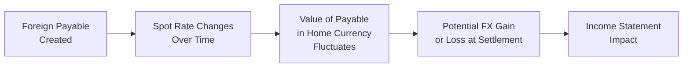

## Introduction  
You know, I still remember the first time I had to deal with a foreign currency transaction. It was way back in the day, and honestly, it felt like I was gambling since the exchange rates seemed to shift every hour. If you’ve ever traveled abroad or purchased something online from a foreign seller, you’ve already dipped your toes into the world of foreign exchange (FX). As a professional—especially one preparing for the CFA Level II exam—you’ll face more complex FX scenarios: deciding how to report and possibly hedge foreign-currency payables, receivables, or other forms of transaction exposure.

In this section, we’ll walk through the essentials of spot and forward exchange rates, discuss the nature of transaction exposure, and explore how IFRS and US GAAP treat gains and losses from these currency movements. We’ll also consider typical hedging strategies (forwards, options, and swaps), including the basic requirements for hedge accounting under IFRS 9 and ASC 815. Let’s jump in.

## The Role of Spot Rates  
The spot rate is basically the exchange rate you’d get if you walked into a bank (or used an online exchange platform) and wanted to convert one currency into another for immediate settlement. In the financial reporting context, “immediate” often means two business days in most major currency markets, but from an accounting standpoint, it’s viewed as the current rate.  

• When preparing financial statements, certain items (such as monetary assets and liabilities) may need remeasurement using the spot rate if they’re denominated in a foreign currency.  
• Transaction gains or losses arise whenever the spot rate changes between the start of a transaction and its settlement.  

### Practical Example of a Spot Rate  
Picture a US-based company that sells goods to a UK distributor for £100,000. On the date of sale, £1 is worth $1.25, so the sale is recorded at $125,000. If the company receives payment 30 days later, and by that time the spot rate has moved to $1.28, the total dollar proceeds will now be $128,000, yielding a $3,000 gain.

## Forward Rates  
Forward rates are rates agreed upon today for an exchange of currencies on a future date. Rather than gamble on how the spot rate might move, a company and a counterparty (often a bank) lock in a forward rate for a set settlement date—say 30, 60, or 90 days in the future.

• Forward contracts are straightforward: you agree to buy or sell a specific amount of currency at a future date at a predetermined rate.  
• They’re commonly used to hedge transaction exposure because the forward premium or discount (relative to the spot rate) can help neutralize the potential impact of exchange rate fluctuations on your payables or receivables.

### Using a Forward Contract to Manage FX Risk  
Suppose you know you must pay €1 million in three months for imported products. You’re worried about the USD/EUR exchange rate hiking between now and then. A forward contract allows you to “fix” the USD/EUR rate today, eliminating your downside risk. Of course, if the euro weakens, you might miss out on a cheaper spot rate. That’s the trade-off.

## Transaction Exposure  
Transaction exposure is the risk your company faces when it has payables, receivables, or other contractual obligations denominated in a foreign currency. If exchange rates change before you settle those liabilities or receive those assets, your firm’s cash flows (in its home currency) could go up or down, thereby creating gains or losses that often flow straight through the income statement.

Some folks casually mix up “transaction exposure” with “economic exposure.” Watch out:  
• Economic exposure is more about long-term competitiveness—changes in exchange rates affecting your prices, cost structure, and general market value.  
• Transaction exposure is short term and tied to specific contractual cash flows.

### Transaction vs. Economic Exposure  
Think of transaction exposure like the short-term chaos of paying for an invoice in 30 days at a currency that’s all over the place. Meanwhile, economic exposure looks at the bigger picture: if you operate in multiple countries, a shift in exchange rates might lower (or raise) your international sales competitiveness, which can seriously influence your revenue and stock price over the long haul.

## Recognizing Gains and Losses Under IFRS and US GAAP  
Under both IFRS and US GAAP:  
• Transaction gains or losses get recognized in the income statement as they occur.  
• If you’ve got a foreign payable, and the foreign currency strengthens relative to your functional currency, you’ll have a loss when you finally settle. Yeah, that stings.  
• Conversely, if the foreign currency weakens, you’ll record a gain.  

This is why many firms choose to hedge. The potential volatility in earnings can be crazy. Or, as some CFOs say, “If the CFO’s job is to manage surprises, FX is definitely one area we’d like to keep predictable.”

## Hedging Strategies: Forwards, Options, and Swaps  
If your company decides that the potential foreign exchange volatility is too risky, it can deploy a variety of hedging instruments:

### Forward Contracts  
• Customizable, allowing you to match maturity dates and notional amounts exactly to your exposure.  
• Gains or losses on forward contracts flow through net income or other comprehensive income (OCI) depending on your hedge accounting treatment. Under IFRS 9 and ASC 815, for a “cash flow hedge,” the effective portion of the gain/loss may go to OCI until the underlying transaction affects earnings.  

### Currency Options  
• These give you the right (but not the obligation) to exchange currency at a specified rate. They cost an upfront premium, but they can guard you against adverse movements while letting you benefit from favorable moves.  
• Options are typically used when you have a more uncertain exposure—say a forecasted but not firmly committed transaction.

### Cross-Currency Swaps  
• If you’ve got debt denominated in, say, Japanese yen, but your revenue is mostly in euros, you could use a cross-currency swap to effectively convert your principal and interest payments into euros.  
• These instruments can be more complex, often used for longer-term exposures—particularly if you have debt or assets in multiple currencies.

Hedge accounting rules under IFRS 9 (Financial Instruments) and US GAAP (ASC 815) can get tricky. You must document your hedge relationship, prove it’s “highly effective,” and monitor this effectiveness regularly. The reward is being able to defer some or all of those hedge-related gains and losses in OCI rather than hit net income immediately.

## Potential Costs and Drawbacks  
Of course, hedging isn’t free. There are transaction costs, potential margin requirements for derivatives, and the risk that your hedge won’t perfectly align with your exposure (basis risk). Some companies intentionally let certain exposures go unhedged if the cost of hedging outweighs the volatility they’re prepared to accept or if they have natural hedges elsewhere (like foreign-currency revenues offsetting foreign-currency costs).

## Visualizing How a Foreign Payable Exposes You to Transaction Risk

1. You enter a contract or purchase goods denominated in a foreign currency (A).  
2. Between contract inception and settlement, the spot rate fluctuates (B).  
3. The recorded value of the payable in your home currency changes accordingly (C).  
4. You realize a gain or loss when you finally settle (D), and that flows to your income statement (E).

## Exam Tip: Calculations & Vignette Style  
On exam day, the item set might present you with a scenario showing a foreign-currency-denominated payable or receivable. You’ll need to:  
• Identify the spot rates on the transaction date and the settlement date.  
• Calculate the difference in your local currency for either a gain or a loss.  
• If a forward contract is mentioned, factor in the contract rate to see if the forward effectively hedged the exposure or if there is some leftover basis risk.  

Expect questions on the following:  
• Journal entries (particularly how gains/losses are recorded at each remeasurement date).  
• The effect of different hedging instruments on net income vs. OCI.  
• Relationship between short-term transaction exposures and the potential strategic positioning of the firm in various markets (economic exposure).

## Real-World Anecdote  
I once chatted with a CFO whose company, based in the US, depended on raw materials from Europe. She joked that her firm “played defense every quarter” because the euro:USD rate soared or dropped unpredictably. They’d initially tried forward contracts to lock in costs, but found that, over a year, those contracts ate into profits if the currency moved favorably. In the end, they used options instead—accepting the premium in exchange for the ability to capture some upside moves. It’s never a simple yes/no. Hedging is an art, too.

## Best Practices & Pitfalls  
• Always confirm your exposures: Are you truly at risk if the foreign currency swings? Sometimes natural hedges exist (e.g., if you have revenues in the same currency).  
• Understand hedge accounting rules before diving into forward contracts. Hedge qualification can make your statements look a lot smoother, but failing to qualify can cause immediate P&L hits.  
• Monitor basis risk closely. Even if the forward exchange rate is locked in, your transaction might not settle exactly as planned, or your forecasted amounts might change.

## A Quick Glossary Refresher  
• Spot Rate: The exchange rate for immediate currency exchange.  
• Forward Contract: A custom agreement to exchange a specific amount of currency at a predetermined rate on a specified future date.  
• Transaction Exposure: The risk of currency movements affecting the settlement value of foreign-currency-denominated transactions.  
• Hedge Accounting (IFRS 9, ASC 815): Accounting rules that let you align gains/losses on hedges to the timing of the hedged item.  
• Economic Exposure: The broader effect of exchange rate changes on a company’s overall market value and competitiveness.  
• Currency Option: The right (but not the obligation) to exchange currency at a specified rate.  
• Cross-Currency Swap: An agreement to exchange principal and interest payments in different currencies.  
• Basis Risk: The risk that your hedge doesn’t perfectly mirror the underlying exposure.

## Conclusion  
Managing foreign exchange risk through spot and forward rates, along with a clear understanding of transaction exposure, is critical for multinational operations. Whether you go with forward contracts, currency options, or cross-currency swaps, the key is a disciplined approach: identify exposures accurately, choose the best hedging tool (if any), and follow the relevant IFRS or US GAAP rules to ensure accurate financial reporting.  

For Level II exam success, get comfortable with the mechanics of calculating gains and losses from changing spot rates. Also, keep an eye out for how hedge accounting modifies the timing and classification of those gains and losses. Ultimately, being able to parse a vignette, identify a currency exposure, and see how it flows through the financial statements will help you excel on exam day—and in real-world corporate finance.

---

## Test Your Knowledge: Spot, Forward, and Transaction Exposure



### A company has a foreign-currency-denominated payable. Spot rates have moved adversely, increasing the settlement amount in the company's home currency. How would this be recorded under IFRS and US GAAP?

- [ ] It can be deferred in OCI until settlement.  
- [ ] It is booked directly to equity.  
- [x] It is recognized as a loss in the income statement.  
- [ ] It is recognized as a credit to retained earnings.  

> **Explanation:** Both IFRS and US GAAP treat adverse movements in foreign-currency-denominated payables as losses in the income statement immediately, not deferred into OCI.

### A US company anticipates paying €300,000 in 60 days. Which instrument would best allow the firm to lock in the conversion rate but still benefit if the euro weakens?

- [ ] Sell a euro forward contract.  
- [x] Purchase a euro call option.  
- [ ] Enter into a cross-currency swap.  
- [ ] It’s impossible to lock in a rate and also benefit from favorable moves.  

> **Explanation:** A call option on euros gives the right (but not the obligation) to buy euros at a set price, allowing gains if the euro weakens below the strike price.

### Which of the following is classified as transaction exposure?

- [ ] A marketing plan to expand in Asia next year.  
- [x] An existing foreign-currency receivable to be collected in 30 days.  
- [ ] A projected overall decline in foreign demand due to a strong home currency.  
- [ ] General brand reputation risk in another market.  

> **Explanation:** Transaction exposure involves specific contractual cash flows, such as a receivable to be collected soon in a foreign currency.

### If a firm designates a forward contract as a cash flow hedge under IFRS 9, what happens to the effective portion of the hedge gain or loss prior to the hedged transaction’s occurrence?

- [x] It is recorded in OCI.  
- [ ] It is recognized immediately in net income.  
- [ ] It is recognized in retained earnings.  
- [ ] It is offset against the forward contract premium.  

> **Explanation:** Under IFRS 9, as long as the hedge is effective and properly documented, the effective portion of the gain or loss is deferred in OCI until the hedged transaction affects net income.

### Which best describes basis risk in the context of FX hedging?

- [x] The risk the hedge does not perfectly offset the underlying exposure.  
- [ ] The risk that the notional principal is calculated incorrectly.  
- [x] The risk that forward points differ from spot movement.  
- [ ] Basis risk is merely another term for settlement risk.  

> **Explanation:** Basis risk occurs when the value of the hedging instrument does not move in perfect correlation with the item being hedged, leading to potential inefficiencies in offsetting gains/losses.

### Which statement is true about economic vs. transaction exposure?

- [x] Economic exposure reflects long-term currency impacts on competitiveness.  
- [ ] Transaction exposure involves brand valuation in a foreign market.  
- [ ] Economic exposure is only relevant for IFRS, not US GAAP.  
- [ ] Transaction exposure cannot be hedged with derivatives.  

> **Explanation:** Economic exposure is broader and more long-term, while transaction exposure arises from specific transactions in the short term.

### A firm hedges an existing foreign payable with a forward contract at a preset rate. Upon settlement, the spot rate is different from the forward rate. The hedge design was fully effective under IFRS 9. Where do you record the effective portion of the hedge gain or loss?

- [x] In OCI until the payable is paid.  
- [ ] Immediately in retained earnings.  
- [x] In intangible assets.  
- [ ] Amortized over the forward contract period.  

> **Explanation:** When hedge accounting is applied and the hedge is effective, the effective portion of gains or losses goes into OCI until the underlying transaction (the payable) affects profit or loss.

### A French firm issues debt in Japanese yen and then enters a cross-currency swap to pay euros but receive yen payments from the swap counterparty. What’s the main purpose?

- [ ] Reducing political risk.  
- [x] Converting debt service from yen to euros.  
- [ ] Speculating on yen appreciation.  
- [ ] Avoiding IFRS 9 disclosures.  

> **Explanation:** A cross-currency swap effectively transforms the firm’s yen-denominated obligations into euro-denominated payments, matching the firm’s functional or home currency.

### A company has forecasted but not committed sales in foreign currency. Which derivative instrument is often used to hedge this uncertain exposure?

- [ ] Short forward contract.  
- [x] Currency option.  
- [ ] Interest rate swap.  
- [ ] There is no instrument for uncertain exposures.  

> **Explanation:** A currency option is commonly used to hedge uncertain or forecasted foreign-currency-denominated sales because it offers flexibility if those sales do not materialize.

### Under IFRS and US GAAP, transaction gains on foreign currency payables should be recognized:

- [x] True  
- [ ] False  

> **Explanation:** Yes, transaction gains (or losses) on remeasurement of foreign-currency payables are recognized on the income statement in the period they occur, under both IFRS and US GAAP.



---

### References and Further Reading  
• IFRS 9 “Financial Instruments” (IFRS Foundation): [https://www.ifrs.org](https://www.ifrs.org)  
• ASC 815 “Derivatives and Hedging” (FASB Codification): [https://asc.fasb.org](https://asc.fasb.org)  
• Journal of Corporate Accounting & Finance for practical articles on FX risk management.  
• CFA Institute’s official curriculum, “Derivatives & FX” (Level II/III) readings.  
