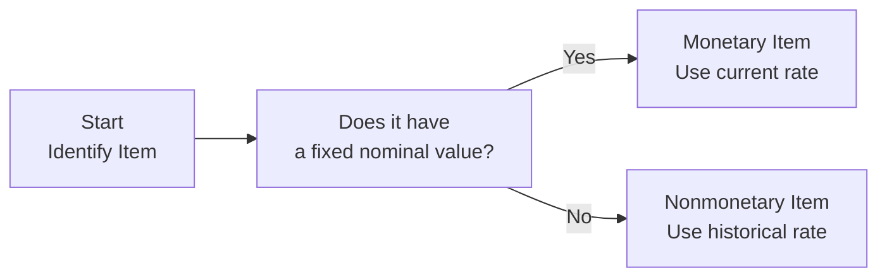

## Introduction

So let’s talk about one of those deceptively tricky topics that can trip up a lot of CFA Level II candidates: monetary vs. nonmonetary items. You might be thinking—"Wait, it’s just a balance-sheet distinction, right?" Well, yeah, but identifying these items and applying the correct exchange rates under various translation methods can actually be super challenging in real-life scenarios (and on the exam). Get it wrong, and you might see big swings in net income, weird illusions in equity, or, in hyperinflationary cases, some bizarre distortions altogether.

Anyway, in this section, we’ll walk through what monetary and nonmonetary items are, why the classification matters so much, and how they link up with IFRS and US GAAP guidance. We’ll also talk about what happens when inflation gets ridiculous, leading to special treatments for nonmonetary items. By the end, you’ll be able to spot potential pitfalls in the exam vignettes (and in your actual financial statement analysis, too).

## Understanding the Concept

In a nutshell, monetary items have a fixed or determinable amount of currency units attached to them. Think cash, accounts receivable, or that nice chunk of long-term debt. Their value in nominal terms doesn’t vary with inflation or other market forces—it’s locked into an amount of currency. For instance, a bond paying $1,000 at maturity is a monetary item because you will receive exactly $1,000, no matter what’s happening with FX rates or inflation.

Nonmonetary items, on the other hand, are tied to underlying real goods or services. A piece of machinery is not simply units of currency. While the machinery might be valued at $100,000 on your books, that figure isn’t locked to exactly $100,000 of currency. Over time, the book value might change due to depreciation, revaluation, or obsolescence. Similarly, intangible assets like patents or goodwill are generally nonmonetary because they don’t have a precise claim to a set number of currency units.

### Quick Tip  
If you can ask “How many dollars/euros/pounds is this guaranteed to yield?” and the answer is a precise count, it’s probably monetary. If the answer is “It depends on market conditions,” or “We’d have to assess fair value,” it’s likely nonmonetary.

## Why It Matters

But why do we care so much about whether something is monetary versus nonmonetary? Well, under the temporal method of currency translation—and in many IFRS or US GAAP treatments—monetary items get remeasured at current exchange rates on the date of reporting. This effectively means that any fluctuation in FX rates hits your income statement in the period it occurs. Nonmonetary items typically remain at historical exchange rates, so their translated values don’t whipsaw around when exchange rates move.

• Monetary Items: Remeasured at current rate.  
• Nonmonetary Items: Remeasured (or measured) at historical rate.

Hence, if you misclassify an item, you could be rolling big foreign exchange gains or losses through your income statement, or incorrectly freezing its value from a time long past. That’s sort of an “Oops!” scenario that can throw off your entire analysis of the company’s performance.

## IFRS vs. US GAAP at a Glance

IFRS (IAS 21) and US GAAP (ASC 830) share pretty similar definitions of monetary vs. nonmonetary items. Both agree that if an item represents a fixed claim to currency, it’s monetary; otherwise, it’s nonmonetary. Of course, IFRS and US GAAP have their nuances—particularly for hyperinflationary economies and certain intangible assets—but for the scope of CFA Level II, consider the definitions close enough that your classification process is largely the same regardless of the standards.

### Special Mention: Hyperinflationary Economies
Under IFRS (IAS 29), if your operations are in a hyperinflationary environment, you have to restate nonmonetary items for inflation before translation. This can be pretty mind-bending, as you might revalue inventory or fixed assets to reflect “current purchasing power” in the local currency, and then translate. That means nonmonetary items can change in local-currency terms, which is rarely the case in normal inflation. US GAAP deals with hyperinflation somewhat differently, often requiring that the functional currency is assumed to be the parent’s currency, effectively pushing you into a method akin to the temporal method from the get-go. Either way, hyperinflation is a special scenario that goes beyond the standard approach.

## The Temporal Method in Practice

Under the temporal method, used when the local currency is not the functional currency, you keep your monetary items at the current exchange rate. Nonmonetary items usually stay at historical exchange rates. If you think about it from the vantage point of an investor analyzing a foreign subsidiary, any obligations to pay cash or amounts receivable in cash must be measured at the current exchange rate (because that’s the real exposure). But any real asset like a factory or intangible property is stuck at the rate that applied when you purchased or recognized it.

A simple example:

• You purchased equipment for ¥100 million back when USD/JPY was 120. So the “historical cost” in USD was roughly $833,333.  
• If the USD/JPY rate moves to 110 at your next reporting date, the value of that equipment in your books remains $833,333 because it’s nonmonetary. You keep the historical rate.  
• However, if you had a ¥10 million payable outstanding at that same date, you must measure it at 110, because it’s a monetary liability. So that portion of your debt is recognized at $90,909 (¥10 million / 110). Any difference from the last period’s recognized amount goes as an exchange gain or loss in your income statement.

## Diagrams: Monetary vs. Nonmonetary Classification

Below is a simple Mermaid flowchart to visualize how you might classify an item:

Sometimes it’s that straightforward. Other times, intangible, nonfinancial items have small embedded monetary claims. If so, parse carefully. Usually, intangible liabilities (like a voucher that commits you to pay a specified currency amount) may be a monetary item, but intangible assets (like patents) aren’t.

## Common Items: Quick Classifications

• Cash and Cash Equivalents: Monetary (obvious—these literally are currency).  
• Accounts Receivable / Payable: Monetary.  
• Long-Term Debt: Monetary (fixed principal).  
• Inventory: Nonmonetary.  
• Property, Plant & Equipment: Nonmonetary (unless there’s some weird arrangement guaranteeing a fixed resale price in currency, which is rare).  
• Goodwill: Nonmonetary.  
• Patents: Nonmonetary.  
• Prepaid Expenses: Nonmonetary (they’re tied to the future receipt of a service or good, not a fixed currency claim).

## A Personal Anecdote

I remember once working with a client who insisted that their large chunk of prepaid insurance was “basically cash.” I guess they figured the insurance premium would one day be refunded if they canceled. But no, not so fast. A partial refund is never a guaranteed fixed amount, and it’s typically subject to contract disclaimers. That meant we had to keep the item as nonmonetary, which changed the way we performed their foreign currency remeasurement. They were a bit surprised by the result when we walked them through the final numbers, but hey, that’s the nuance of IFRS.

## Hyperinflationary Economics—A Closer Look

When inflation hits extreme levels, IFRS (IAS 29) says you restate your nonmonetary items in terms of the current “purchasing power” before translating. So if everything in your local-currency statements has basically been eaten away by triple-digit inflation, you re-inflate those asset values so the balance sheet better reflects a realistic measure of capacity/utility. Then, you translate into the presentation currency. That step can significantly reduce the FX impact because you’re not just taking your year-ago historical cost as the baseline. US GAAP, in extremely high-inflation countries, effectively requires you to treat the parent’s currency as the functional currency (thus applying the temporal method), sidestepping the complexity of restating the nonmonetary items.

## Practical Application and Pitfalls

• If you see a question about new or increasingly volatile exchange rates, think about which items get remeasured. If you’re expecting large exchange gains or losses to show up in the income statement, zero in on the monetary items.  
• Don’t forget that under the current rate method (used when the local currency is the functional currency), you typically translate everything at the current rate—except for equity items at historical rates. That’s different from the temporal method. Make sure you don’t cross wires between these two.  
• Hyperinflation can be a curveball. The exam might throw in a detail about 100% inflation. That’s a clue you might have to restate nonmonetary items if IFRS is in play.

## Putting It All Together: An Extended Example

Let’s say you have a subsidiary in Country X, which has moderate inflation (not hyperinflationary). The functional currency is the parent’s currency (USD), so you use the temporal method:

1. Monetary items (cash, receivables, payables, long-term debt) are remeasured at the current exchange rate each reporting date.  
2. Nonmonetary items (inventory, property, intangible assets) remain at historical exchange rates.  
3. Exchange differences on monetary items go straight to the income statement.  
4. Exchange differences on nonmonetary items? Typically none day-to-day because you’re not changing their measured values from period to period—unless you revalue or sell them, which might bring in different complexities.  

As a result, if the local currency of Country X depreciates significantly, your USD-based accounts for monetary receivables and payables will likely show an exchange loss or gain. Meanwhile, your local factories—nonmonetary—remain at the same base USD figure at which they were originally recorded.

## Conclusion

So yeah, the classification of items as monetary or nonmonetary is crucial for correct FX remeasurement and translation. Mislabeling can produce major distortions in your financial analysis and lead to costly errors in exam or real practice. Keep a close eye on whether an asset or liability involves a fixed or determinable number of currency units. If it does, remeasure at the current rate (temporal method). If it doesn’t, stick with the historical rates.  

In the real world—especially when dealing with hyperinflation—your job gets trickier. IFRS might require you to restate nonmonetary assets for inflation, US GAAP might direct you to different translation methods. But if you can cut through the noise and systematically classify each balance-sheet item, you’ll be in a good position to handle whatever twists come your way. Good luck, and keep practicing those classification exercises.

## References

• IAS 21 and IAS 29 (IFRS Foundation):  
  https://www.ifrs.org  

• FASB ASC 830, Foreign Currency Matters:  
  https://asc.fasb.org  

• Advanced Financial Accounting Textbooks (Foreign Currency Transactions and Translation chapters)  

• Academic journals like Accounting, Organizations and Society for deeper discussions on hyperinflation  

## Test Your Knowledge: Monetary vs. Nonmonetary Items



### Which of the following best describes a monetary item?
- [ ] An item whose value depends on general market conditions and is revalued annually.
- [x] An asset or liability representing a fixed claim to a specified amount of currency.
- [ ] An item that is only recognized through other comprehensive income.
- [ ] An item that fluctuates in value relative to the price of commodities.

> **Explanation:** Monetary items are those that have a fixed or determinable claim to currency, such as accounts receivable or payable, long-term debt, and cash.

### How are nonmonetary items typically measured under the temporal method?
- [ ] At the current exchange rate on the reporting date.
- [ ] At an average exchange rate for the period.
- [x] At historical exchange rates (the rates in effect when the items were recognized).
- [ ] At the exchange rate determined by management’s best estimate.

> **Explanation:** Under the temporal method, nonmonetary items like fixed assets and inventory remain at their historical exchange rate—i.e., the rate that prevailed when they were originally recognized.

### Under IFRS, which of the following items is most likely still considered nonmonetary?
- [ ] A note receivable specifying $500,000 due in two years.
- [ ] A cash deposit contract guaranteeing 5% interest.
- [x] A patent carried at cost on the balance sheet.
- [ ] Preferred stock with a fixed dividend amount.

> **Explanation:** Patents generally don’t represent a fixed currency claim. Notes or contracts guaranteeing a determinable amount are monetary, while intangible assets are typically nonmonetary.

### Why does identifying an item as monetary vs. nonmonetary matter in FX translation?
- [x] Because it determines whether the item is remeasured at the current exchange rate or the historical exchange rate, which affects income statement volatility.
- [ ] Because IFRS forbids one from remeasuring nonmonetary items in the first place.
- [ ] Because it only impacts parent company equity but not income statements.
- [ ] Because US GAAP and IFRS use completely different definitions of monetary vs. nonmonetary items.

> **Explanation:** The classification dictates which exchange rate to use under the temporal method, influencing the timing and recognition of FX gains or losses.

### When operating in a hyperinflationary economy under IFRS, what typically happens to nonmonetary items before translation?
- [x] Nonmonetary items are restated for inflation to reflect current purchasing power.
- [ ] Nonmonetary items are written down completely.
- [x] Nonmonetary items are remeasured using the average rate for the entire period.
- [ ] Nonmonetary items are converted to the parent’s currency immediately upon acquisition.

> **Explanation:** IFRS requires restating nonmonetary items for inflation (per IAS 29) before translating the financial statements, ensuring that their carrying amounts reflect “current purchasing power.”

### Which of the following is an example of a monetary liability?
- [ ] Common stock.
- [ ] Preferred shares with no fixed dividend requirement.
- [ ] Property tax prepayment.
- [x] Long-term bond payable promising a specific principal amount at maturity.

> **Explanation:** A bond payable represents a fixed obligation to pay a certain amount of currency, making it a monetary liability.

### Under the temporal method, which of these line items is remeasured at the current rate?
- [ ] Intangible assets.
- [ ] Finished goods inventory.
- [x] Accounts payable to third-party suppliers.
- [ ] Goodwill.

> **Explanation:** Accounts payable represent a monetary liability settled in a defined amount of currency. Under the temporal method, it’s remeasured at the current exchange rate each reporting period.

### Which of the following statements about US GAAP (ASC 830) and IFRS (IAS 21) is correct?
- [x] Both frameworks have essentially the same concept of monetary vs. nonmonetary, though details differ in hyperinflationary treatments.
- [ ] Under US GAAP, all assets are treated as monetary items.
- [ ] IFRS does not require any distinction between monetary and nonmonetary items.
- [ ] Only IFRS allows the temporal method of translation.

> **Explanation:** Both IFRS and US GAAP follow similar definitions of monetary vs. nonmonetary items, though IFRS includes special hyperinflation guidance under IAS 29, and US GAAP addresses hyperinflation differently.

### A manufacturing company uses the temporal method for FX translation. If the local currency appreciates significantly during the period, how would this generally affect its monetary assets?
- [ ] They remain at historical rates because they’re recorded at the date of acquisition.
- [x] They are remeasured at the new exchange rate, potentially leading to an FX gain.
- [ ] They must always be remeasured at the average rate for the period.
- [ ] They are reported in consolidated other comprehensive income.

> **Explanation:** Monetary assets are remeasured at the current (new) exchange rate under the temporal method, likely resulting in an exchange gain if the local currency strengthens against the reporting currency.

### True or False: Under the temporal method, a company’s nonmonetary items will always cause foreign exchange gains and losses in each reporting period.
- [x] False
- [ ] True

> **Explanation:** Nonmonetary items are typically kept at historical exchange rates, so they do not generally create ongoing FX gains or losses each period unless there’s a revaluation, disposal, or special hyperinflation scenario.


