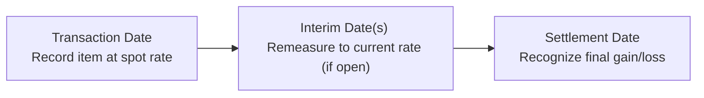

## Overview

Foreign exchange gains and losses can feel a bit intimidating at first—especially when you’re juggling multiple currencies, forward contracts, spot rates, and different transaction dates. But once you break them down step by step, the process actually becomes quite straightforward. In this section, we’ll walk you through a practice vignette that illustrates simple FX gains or losses on a foreign-currency-denominated transaction.

We’ll also touch on how hedge accounting and speculative derivatives play into the overall story. By the end of this article, you’ll see how each piece fits together, and you’ll be well-equipped to handle similar scenarios on the CFA® Level II exam (and in real-world practice).

## Key Concepts

### Foreign-Currency-Denominated Transactions
When a company enters into a transaction—such as the purchase of inventory or sale of goods—in a currency different from its functional currency, the transaction must be recorded initially at the spot rate on the transaction date. Any subsequent gains or losses from changes in exchange rates until settlement go directly to the income statement, unless specific hedge accounting rules apply.

Key terms to remember:
- Functional Currency: The primary currency in which an entity operates and generates cash flows.  
- Local Currency: The currency of the jurisdiction in which the entity operates. Sometimes different from the functional currency.  
- Presentation Currency: The currency in which the consolidated financial statements are presented.

### Remeasurement vs. Translation
It’s common to mix up these two processes:
- Remeasurement: Converting a local currency into the functional currency using the temporal method. This is for preparing the subsidiary’s own financial statements in its functional currency (if the local currency is not the same as functional).  
- Translation: Converting the functional currency into the parent’s presentation currency using the current rate method to present consolidated financial statements.

In our simple FX gains/losses example, we mostly deal with remeasurement aspects for a single entity that has transactions in a foreign currency.

### Hedge Accounting vs. Speculative
- Speculative Derivative (Not Designated as a Hedge): Gains/losses on these derivatives go to the income statement immediately.  
- Designated Hedge Instrument: If the company uses formal hedge accounting for a foreign-currency risk, part of the gains/losses might be deferred in Other Comprehensive Income (OCI), depending on whether it is a cash flow hedge or net investment hedge. However, any ineffective portion hits the income statement.

### Timeline of a Typical Foreign Exchange Transaction
The timeline of events is crucial in calculating FX gains and losses:

1. Transaction Date: You record the foreign currency receivable (asset) or payable (liability) at the spot rate on this date.  
2. Interim Date(s): If you prepare financial statements before settlement, the payable or receivable on the balance sheet is adjusted to the new spot rate. The difference from the previously recorded amount is recognized as a gain or loss.  
3. Settlement Date: The final settlement occurs, and you calculate any remaining difference between the recorded amount and the actual settlement in the functional currency.

## Practice Vignette: Step-by-Step Walkthrough

Imagine you work as a financial analyst at a mid-sized company, ABC Metals, that primarily uses the US dollar (USD) as its functional and presentation currency. ABC Metals purchases raw materials from a European supplier priced in euros (EUR). The CFO is worried about the exchange rate fluctuations between the euro and the dollar.

Let’s walk through the timeline:

### Vignette Setup

• On November 1, Year 1 (Transaction Date), ABC Metals purchases raw materials from a European supplier.  
  – The invoice amount is €100,000.  
  – The spot rate is 1.20 USD/EUR.  
  – ABC Metals records a payable of €100,000, which translates to $120,000 (100,000 × 1.20).  

• On December 31, Year 1 (Interim Reporting Date), the invoice has not yet been settled.  
  – The spot rate is now 1.25 USD/EUR.  
  – ABC Metals must “remeasure” its euro-denominated payable from November 1 to the new spot rate at December 31.  

• On January 15, Year 2 (Settlement Date), ABC Metals pays the supplier the €100,000.  
  – The spot rate on January 15 is 1.22 USD/EUR.  

For simplicity, assume no forward contract has been taken; the company is effectively unhedged (i.e., no derivative positions). Let’s see how you would measure the resulting foreign exchange gains or losses and the corresponding journal entries under IFRS or US GAAP.

### Initial Recognition (November 1, Year 1)
ABC Metals records the payable at the spot rate of 1.20 USD/EUR:

  
(1) Dr. Inventory (Raw Materials)            $120,000   
    Cr. Accounts Payable (€100,000 × $1.20)  $120,000  

The inventory is capitalized at $120,000, and a corresponding liability is established.

### Interim Remeasurement (December 31, Year 1)
Now the spot rate is 1.25 USD/EUR, implying the euro has strengthened relative to the dollar. ABC Metals must update (remeasure) the payable to €100,000 × 1.25 = $125,000.

The liability is increased by $5,000 (from $120,000 to $125,000). This additional $5,000 is recognized as a foreign exchange loss in the Year 1 income statement, because ABC Metals now needs more dollars to pay the same €100,000.

  
(2) Dr. Foreign Exchange Loss                 $5,000  
    Cr. Accounts Payable                      $5,000  

(Accounts Payable is now $125,000 on the balance sheet at year-end.)

### Final Settlement (January 15, Year 2)
On the day of settlement, the spot rate is 1.22 USD/EUR. The total settlement in USD is actually $122,000 (100,000 × 1.22). But at December 31, the liability was on the books at $125,000. So there’s a $3,000 balance that effectively reverses out as a foreign exchange gain, lowering the liability to $122,000 before payment.

  
(3) Dr. Accounts Payable                      $3,000  
    Cr. Foreign Exchange Gain                 $3,000  

Now the Accounts Payable balance is $122,000, matching the actual settlement.  

Finally, ABC Metals pays out the cash:

  
(4) Dr. Accounts Payable ($122,000)  
    Cr. Cash ($122,000)  

### Net Effect on the Income Statement
Overall, from November 1 to January 15, ABC Metals experiences a net FX loss of $2,000:
• $5,000 loss recognized at year-end.  
• $3,000 gain recognized upon settlement.  

Net = $5,000 − $3,000 = $2,000 (a net loss).  

You might notice that from the initial spot of 1.20 to the final settlement rate of 1.22, the EUR has appreciated slightly, resulting in the net loss.

### Remeasurement: IFRS vs. US GAAP
Under both IFRS and US GAAP, for a monetary item (like an accounts payable denominated in a foreign currency), remeasurement gains and losses go to the income statement. Because ABC Metals had no formal hedge, there’s no deferral of these changes in Other Comprehensive Income (OCI).  

Under IFRS 9 or ASC 815 guidelines, if you designate a hedge properly and meet the documentation and effectiveness testing requirements, you might record some of these changes in OCI (especially for cash flow hedges). But for speculative positions (or for purely unhedged items), everything goes straight to profit or loss.

## Adding a Forward Contract (Brief Scenario)

For argument’s sake, suppose ABC Metals had entered a forward contract on November 1 to buy €100,000 on January 15 at a forward rate of 1.21 USD/EUR. If you treat that contract as a speculative derivative, you’d mark it to market each period. Gains in the forward contract might offset some (or all) of the remeasurement losses on the payable. If you designate the derivative as a cash flow hedge (and all conditions are met), you could defer certain gains/losses in OCI and only recognize them in profit or loss when the underlying transaction affects earnings.

## Common Pitfalls and Exam Tips

• Mixing Up Translation vs. Remeasurement: The exam might show a scenario where the parent’s presentation currency is different from the subsidiary’s functional currency. Don’t confuse the final consolidation translation with the local entity’s remeasurement.  
• Forgetting Interim Updates: If the exam question references an interim date or partial-year financial statements, you must revalue the currency positions and record gains/losses at that point.  
• Overcomplicating Hedges: Unless you see explicit mention of a hedge designation and formal documentation, assume there’s no hedge accounting. Gains and losses then go directly to the income statement.  
• Tracking Dates Carefully: Write down the key dates, rates, and currencies. In the heat of the exam, it’s easy to pick a wrong spot rate.  
• Being Aware of the Net Effect: Gains or losses can happen at different stages. The final net is all that ultimately impacts the profit or loss, aside from any hedge-related deferrals in OCI.

## Practical Advice for Managing FX Risks
Just a quick anecdote—years ago, I worked with a CFO who absolutely dreaded a half-cent shift in EUR/USD, worried it would wreck the company’s earnings. But guess what? When they netted out their payables and receivables in the same currency, the total impact turned out pretty small. The moral of the story is: understand your net exposure. Accurate recordkeeping and knowledge of your real risk positions can alleviate a ton of stress.

## Conclusion
FX gains and losses can be made manageable by carefully tracking dates, spot rates, and the net exposure. Whether you’re dealing with IFRS or US GAAP, the general principles for foreign-currency-denominated transactions are quite similar: measure at the transaction date’s spot rate, revalue the monetary item at each relevant reporting date, and book the final gain/loss on settlement. By doing this systematically, you’ll handle the exam item sets (and real-life transactions) with confidence.

If your company has a derivative strategy (i.e., forward contracts or options) and uses hedge accounting, you’ll need to master its specifics too—especially which portions of the gain or loss go to OCI vs. income. But for simple payables or receivables, the net effect goes straight to the income statement.

## References for Further Exploration
• CFA Institute Level II Curriculum: Multinational Operations and Derivatives Readings  
• IFRS 9 for Financial Instruments: https://www.ifrs.org  
• ASC 830 (Foreign Currency Matters) and ASC 815 (Derivatives and Hedging) under US GAAP  
• Kaplan Schweser and Wiley practice examples for in-depth scenarios  
• Journal of International Accounting, Auditing and Taxation for case studies

--------------------------------------------------------------------------------

## Test Your Knowledge: Simple FX Gains and Losses



### A company in the US purchases inventory from a European supplier, denominated in EUR. On which date do they typically record the payable in USD?

- [x] On the date the transaction occurs, using the spot rate.
- [ ] On the date the inventory is paid for, using the forward rate.
- [ ] On the subsequent reporting date, using the historical rate.
- [ ] On the subsequent reporting date, using the all-in forward rate.

> **Explanation:** The initial recognition of a foreign-currency-denominated payable is recorded at the spot rate on the transaction date.

---

### Which concept describes converting local currency balances into the functional currency using the temporal method?

- [ ] Translation
- [x] Remeasurement
- [ ] Consolidation
- [ ] Netting

> **Explanation:** Under the temporal method, local currency balances are remeasured into the entity’s functional currency. “Translation” typically refers to converting from the functional currency to the presentation currency using the current rate method.

---

### If a payable is denominated in euros and the euro appreciates against the US dollar before settlement, which statement is generally true for an unhedged payer?

- [x] The payer incurring the liability will likely recognize a foreign exchange loss.
- [ ] The payer will likely recognize a foreign exchange gain.
- [ ] There is no effect on the income statement.
- [ ] The effect is recorded entirely in OCI.

> **Explanation:** An appreciation of the foreign currency means you need more of your functional currency to settle the same foreign amount, resulting in a loss for an unhedged company.

---

### Under IFRS and US GAAP, an unhedged foreign-currency-denominated payable is revalued at which rate on the balance sheet date?

- [ ] The rate in effect on the payment date.
- [x] The spot rate in effect on the balance sheet date.
- [ ] The average rate over the reporting period.
- [ ] The forward rate at settlement.

> **Explanation:** Both IFRS and US GAAP require monetary items such as payables and receivables to be remeasured or revalued using the spot rate at each balance sheet date.

---

### Which of the following is the net effect on the income statement when a payable is recorded at 1.20 USD/EUR, then remeasured at 1.25, and finally settled at 1.22?

- [ ] A net gain of $3,000
- [ ] A net gain of $5,000
- [x] A net loss of $2,000
- [ ] A net loss of $5,000

> **Explanation:** The loss at the interim date is $5,000, and the gain upon settlement is $3,000, so the net result is a $2,000 loss.

---

### A foreign-currency-denominated payable is considered what type of item for accounting purposes?

- [x] A monetary item
- [ ] A nonmonetary item
- [ ] An intangible asset
- [ ] A contingent liability

> **Explanation:** Payables and receivables in foreign currency are classified as monetary items and must be remeasured with changes going to the income statement.

---

### When a forward contract is not accounted for under hedge accounting, which statement applies?

- [x] All gains or losses on the contract are recognized in the income statement as they arise.
- [ ] Gains are recognized in OCI, while losses go to the income statement.
- [ ] Gains are deferred until settlement.
- [ ] The contract cannot be used to mitigate risk.

> **Explanation:** If the derivative is not officially designated as a hedge but is used speculatively, all gains and losses flow through current earnings.

---

### Which of the following increases the risk of realizing a large FX loss on accounts payable?

- [ ] A decrease in the relevant foreign currency’s spot rate.
- [x] An increase in the relevant foreign currency’s spot rate.
- [ ] A stable foreign currency spot rate.
- [ ] Buying from multiple suppliers in the same currency.

> **Explanation:** If the foreign currency gains strength, the domestic company will need more of its functional currency to settle the payable, thus increasing the risk of a loss.

---

### If a US company classifies a forward contract as a cash flow hedge under IFRS 9 and meets all hedge accounting requirements, how are effective hedge gains or losses recorded?

- [ ] Entirely in the income statement at each reporting date.
- [ ] Entirely deferred on the balance sheet.
- [ ] Recognized as a separate liability or asset but not in earnings.
- [x] Initially recognized in OCI and subsequently released to profit or loss when the hedged item affects profit or loss.

> **Explanation:** Under IFRS 9 (and similarly under US GAAP), for a cash flow hedge the effective portion of the derivative’s gain or loss is recorded in OCI and only reclassified to the income statement when the hedged transaction affects earnings.

---

### A US firm records a foreign-currency transaction with no hedge on January 1. True or False: The gain or loss will always be recognized in OCI.

- [ ] False
- [x] True

> **Explanation:** This is a trick question—strictly speaking, for an unhedged transaction, the gain or loss is recognized in the income statement, not in OCI. Therefore, the statement as written is actually false. (Be careful with double negatives or tricky wording on the exam!)


