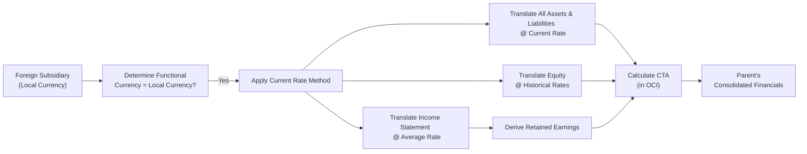

## Introduction

You know that feeling when you’re sifting through a multinational company’s financial statements, and suddenly your head starts spinning—“Wait, how did these foreign operations get reflected back into the parent’s balance sheet?!” Relax, it happens to the best of us. In fact, understanding the current rate method is a pivotal step in taming that complexity. And once you get the hang of it, you’ll see it’s (mostly) straightforward.

The current rate method (often called the closing rate method) is typically used whenever a foreign subsidiary’s local currency is deemed its functional currency. In other words, if the subsidiary primarily uses its local currency for its day-to-day operations and financing, that’s our cue to apply this method. Simply put, the foreign operation is treated much like an independent entity—with its own economic environment that’s distinct from the parent’s—and the parent then translates those results into its presentation currency.

Below, we break down the mechanics in a slightly informal, approachable style—sharing some experiences and practical tips along the way. Let’s dive in.

## Functional Currency and Method Selection

Before we even get into rates and translations, we have to identify the subsidiary’s functional currency. If a foreign subsidiary generates revenues, pays expenses, and finances itself primarily in, say, euros, then the euro is (typically) its functional currency. This triggers the current rate method.

• If the local currency is the functional currency → use the current rate method.  
• If the parent currency is the functional currency → use the temporal method instead.  

I remember early in my career mixing up these rules and applying the wrong method. My manager laughed (kindly) and said: “Always figure out how the subsidiary actually operates on the ground. If everything is in the local currency, you can bet that’s your functional currency.” That’s about as practical a tip as you’ll ever get.

## Translating the Balance Sheet

Under the current rate method, you translate most items on the subsidiary’s balance sheet at the currency exchange rate in effect at the end of the reporting period (the “current rate”).

• Assets → translated at the current (balance sheet date) exchange rate.  
• Liabilities → also translated at the current exchange rate.  

What about equity? That’s where a bit of nuance comes in:

• Common stock, additional paid-in capital → translated at historical exchange rates, meaning the rates in effect on the date when the equity was issued.  
• Retained earnings → this is derived from translated net income (all those income statement items) minus dividends (both in the subsidiary’s local currency, also converted).  

Why do we use historical rates for equity? Because you want to reflect the original capital infusion at the actual rate that prevailed when the transaction occurred, preserving the real “value” of that transaction in the parent’s books.

## Translating the Income Statement

For the income statement, the general rule is to use the average exchange rate for the entire reporting period. Some folks like to get fancy with daily or monthly weights, but in practice for exam purposes—and frankly in many real contexts—companies apply a simple average rate if exchange rates don’t fluctuate wildly.

So:  

• Revenues and expenses → typically translated at the average rate for the period.

This approach is designed to even out the short-term volatility in exchange rates and give a representative reflection of the subsidiary’s performance over the reporting period. By the way, if you have certain transactions that truly took place at very specific points in time (like a large asset sale), you might see the actual rate used for that single event. But in the big picture, average rates keep everything consistent.

## Cumulative Translation Adjustment (CTA)

Now, let’s talk about that line on the parent’s consolidated statement of equity: the **Cumulative Translation Adjustment (CTA)**. This is where all the gains and losses from translation hide out. Under both IFRS and US GAAP, the CTA is parked in other comprehensive income, a separate component of shareholders’ equity rather than going straight to the income statement.

In essence, the CTA picks up the difference between:

• What the translated balances would look like if all assets and liabilities were at the current rate,  
• Versus any historical-rate translations (especially around equity),  
• Plus the effect of using average rates on the income statement while ending the balance sheet rates at the current date.

So you gather up all those differences and book them to a single equity account. For example, if the subsidiary’s local currency appreciates (compared to the parent’s currency), you might see a positive CTA balance, indicating a net translation gain. If the local currency weakens, you might see a negative CTA.

### Mermaid Diagram: Overview of the Current Rate Method

Below is a simple Mermaid diagram that outlines the translation flow under the current rate method. Don’t worry if it looks complicated; it’s just a snapshot of how the pieces connect:

As you can see, everything from the functional currency decision to the final CTA flows into the parent’s consolidated financials.

## A Brief Example

Let’s imagine a foreign subsidiary that operates in euros (EUR), while the parent reports in U.S. dollars (USD). At the start of the period, 1 EUR = 1.10 USD. At the end of the period, 1 EUR = 1.15 USD, and the average rate during the year was 1.12 USD.

• An asset worth EUR 1,000 on the subsidiary’s balance sheet, measured at year-end, becomes 1,000 × 1.15 = USD 1,150.  
• A liability of EUR 500 → 500 × 1.15 = USD 575.  
• Common stock originally issued when the rate was 1.05 → that portion of stock is remeasured at rate 1.05 for that piece of equity.  
• Income statement revenues at EUR 2,000 → 2,000 × 1.12 = USD 2,240 (using average).  

After you do all of that for each line item, you sum up gains or losses that result from the difference in rates, and that sum goes to the CTA.

## Impact on Key Ratios

One subtlety of the current rate method is how it affects your financial ratios. If the local currency appreciates between the beginning and the end of the year:

• Assets and liabilities in the foreign subsidiary’s books might translate to higher USD amounts,  
• Equity (translated at historical rates for common stock) might stay relatively lower,  
• This can inflate or deflate certain ratios like the debt-to-equity ratio or return on assets.  

Companies with big overseas operations can see wild swings in consolidated numbers simply because of changing currency rates, not because of changes in underlying business fundamentals. From a CFA exam perspective, it’s worth paying special attention to exactly how the ratio calculations are impacted by these translation changes.

## Don’t Confuse the Temporal Method

Here’s a quick cautionary tale. If you identify the functional currency incorrectly and use the current rate method when you should have used the temporal method, you’ll end up recognizing monetary vs. non-monetary items incorrectly, you’ll remove things from the CTA, and that in turn sends your net income or consolidated equity into a spin. So be sure to confirm that the subsidiary itself is financially and operationally independent, which typically implies that its local currency is indeed the functional currency.

## Disclosures Under IFRS and US GAAP

Although IFRS (IAS 21) and US GAAP (ASC 830) are largely convergent in the mechanics of translating via the current rate method, the footnote disclosures can differ slightly. Nevertheless, both frameworks insist you:

• Disclose the exchange rates used (e.g., average, spot, range).  
• Highlight the CTA in equity, reconciling beginning and ending balances.  
• Provide detail on how you determined the functional currency, if not obvious.  

If your exam question references the differences between IFRS and US GAAP, pay attention to how footnote disclosures are structured. IFRS has a more “framework-based approach,” while US GAAP might provide more prescriptive guidance. But the fundamental translation mechanics remain the same.

## Best Practices and Common Pitfalls

• Keep impeccable records of historical rates for equity transactions—this can sometimes be tricky if the equity issuance was years ago or if the company had multiple stock issuances at different times.  
• Don’t forget to convert dividends at the rate on the date declared (or paid). Missing that step can misstate retained earnings.  
• Watch out for large fluctuations in currency rates from start to end of the period. This can lead to significant CTA impacts, so mention it in your analysis or footnotes.  
• Resist the urge to “just run everything at the average rate.” That might be simpler, but it’s not correct for balance sheet items under the current rate method.  

## Putting It All Together (One More Example)

If you’ve got a foreign sub in Canada, and the local currency is the Canadian dollar (CAD), but your parent is in the U.S. and reports in USD:

1. Identify functional currency for the Canadian sub: CAD.  
2. Translate the sub’s entire balance sheet at the year-end CAD/USD exchange rate.  
3. Translate the sub’s common stock at the historical CAD/USD rate that existed when those shares were issued.  
4. Translate the sub’s income statement over the reporting period using the average CAD/USD rate.  
5. Compute the difference (CTA) between the newly translated assets, liabilities, and equity.  
6. Record the CTA in other comprehensive income on the parent’s consolidated statement of changes in equity.  

When explaining results to management, you can highlight how the CTA is not realized—meaning it doesn’t affect reported net income (unless there’s a liquidation or repatriation). This can sometimes confuse folks who assume that all foreign exchange gains and losses show up in the income statement.

## Final Exam Tips

1. Know which items are at the current rate versus historical or average rates.  
2. Pay attention to the functional currency question stem in exam vignettes—don’t apply the current rate method if the parent’s currency is the functional currency.  
3. Practice calculating the CTA. Don’t forget that CTA goes to equity (OCI).  
4. Show your ratio computations with and without the currency effect, if relevant.  
5. Watch out for dividends. If dividends are paid, they’re usually recognized at the exchange rate in effect on the payment date.  

It’s also a good idea to do a quick end-of-chapter summary grid: “Balance Sheet Items → Current Rate,” “Income Statement Items → Average Rate,” “Equity Transactions → Historical Rate,” and “CTA → in Equity.”  

Sure, it might seem a bit mechanical at times, but that’s the name of the game. And in real life, trust me, an accurate currency translation can save you from some nasty surprises when you’re analyzing multinational corporations.

## References

• IFRS Standards (www.ifrs.org) – “IAS 21: The Effects of Changes in Foreign Exchange Rates”  
• FASB Accounting Standards Codification (www.fasb.org) – “ASC 830: Foreign Currency Matters”  
• CFA Institute (www.cfainstitute.org) – Various resources and official curriculum updates  
• Doupnik, T. & Perera, H. “International Accounting,” for a deep dive into the complexities of cross-border financial reporting  

---

## Test Your Knowledge: Current Rate Method Essentials



### When applying the current rate method, which currency must normally be identified as the functional currency?

- [ ] The parent's presentation currency.
- [ ] The currency of the country where the parent company is legally domiciled.
- [x] The foreign subsidiary's local currency, if that currency reflects the primary economic environment.
- [ ] The strongest currency among the subsidiary's major trading partners.

> **Explanation:** Under the current rate method, the foreign subsidiary’s local currency must generally be its functional currency (i.e., the currency of the primary economic environment in which it operates).  

### Which rate is typically used to translate all assets and liabilities under the current rate method?

- [ ] The weighted average rate over the reporting period.
- [ ] A historical rate.
- [x] The exchange rate at the balance sheet date (current rate).
- [ ] A forward exchange rate for the coming period.

> **Explanation:** Under the current rate method, both assets and liabilities are translated using the rate in effect at the balance sheet date.  

### How is common stock typically translated under the current rate method?

- [ ] At the average rate for the reporting period.
- [ ] At the same rate as retained earnings.
- [x] At historical rates that were in effect on the date of issuance.
- [ ] At the balance sheet date rate.

> **Explanation:** Common stock and additional paid-in capital are translated at the historical exchange rate(s) in effect when those equity items were initially issued.  

### What happens to the cumulative translation adjustment (CTA) under the current rate method?

- [x] It is recognized as a component of other comprehensive income (OCI) in equity.
- [ ] It is reflected in the income statement for the current period.
- [ ] It always reduces retained earnings directly.
- [ ] It’s capitalized as an intangible asset.

> **Explanation:** The CTA is recorded in other comprehensive income (shareholders’ equity) under both IFRS and US GAAP, not in the income statement.  

### Which of the following best describes the rate used to translate most income statement items under the current rate method?

- [ ] The forward rate for the next quarter.
- [x] The average rate for the reporting period.
- [ ] The historical rate from the beginning of the year.
- [ ] The spot rate at the transaction date for each transaction.

> **Explanation:** Revenues and expenses are generally translated at the average rate for the period, simplifying the process while capturing the representative rate.  

### A subsidiary’s local currency has appreciated significantly over the reporting period. All else equal, how might this affect the parent’s balance sheet under the current rate method?

- [x] The translated asset and liability values in the parent’s currency would both increase, potentially resulting in a higher CTA.
- [ ] The parent’s assets would decrease, while liabilities would increase, leading to a lower CTA.
- [ ] All converted amounts remain constant because the average rate is used.
- [ ] There is no impact on the parent’s balance sheet under the current rate method.

> **Explanation:** If the subsidiary’s local currency appreciates, the translated amount of assets and liabilities will be higher in the parent’s currency, creating or increasing the CTA in equity.  

### Which of the following is a common pitfall when applying the current rate method?

- [x] Misusing historical rates for asset accounts rather than the year-end rate.
- [ ] Translating the income statement at a weighted average rate.
- [ ] Placing the CTA in other comprehensive income.
- [ ] Using the year-end rate to translate liability accounts.

> **Explanation:** The most frequent error is mistakenly using historical or average rates for balance sheet items, rather than the correct year-end/current rate for assets and liabilities.  

### An analyst wants to see the actual impact of exchange rate movements on a subsidiary’s operations. Under the current rate method, which account or line item should they focus on?

- [ ] Operating income in the parent’s consolidated statement.
- [x] The CTA within the equity section.
- [ ] Current liabilities on the translated balance sheet.
- [ ] Deferred tax assets in the footnotes.

> **Explanation:** The CTA is where unrealized gains and losses from exchange rate fluctuations accumulate, making it a key account for measuring the direct impact of translation.  

### Why do IFRS and US GAAP both require disclosure of exchange rates used and CTA amounts in the footnotes?

- [ ] Because it is only required for interim reporting periods.
- [ ] To satisfy tax authorities in each jurisdiction.
- [ ] Because it is optional under the current rate method but helps in comparison.
- [x] To ensure transparency and allow users to assess the effects of translation on the financial statements.

> **Explanation:** Both frameworks aim to maintain transparency, helping investors and analysts understand how foreign currency translation is affecting the consolidated reporting.  

### True or False: Under the current rate method, changes in exchange rates during the period directly flow through the income statement.

- [x] True
- [ ] False

> **Explanation:** Actually, with the current rate method, unrealized remeasurement gains and losses do not generally hit the income statement. Instead, they go into OCI via the CTA. The trick here is that realized currency gains or losses on, say, actual cash repatriation might be recognized in net income. But the main idea is that the standard translation fluctuations go to CTA, not immediate net income.


