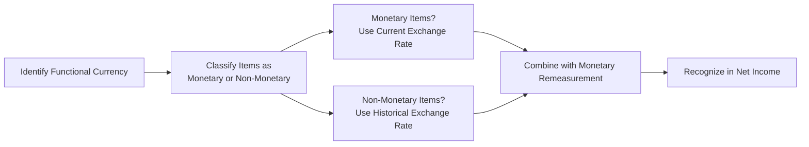

## Understanding the Temporal Method

When we’re dealing with financial statements denominated in foreign currencies, one of the big decisions is which translation method to apply. The temporal method—sometimes called the remeasurement method—comes into the picture when the affiliate or subsidiary’s functional currency is effectively the same as the parent company’s currency, or when we have a hyperinflationary environment under certain US GAAP rules. If you’re scratching your head wondering, “Wait, does ‘hyperinflation’ really matter that much?” trust me—it can change everything about how you handle foreign-currency financials.

The guiding idea behind the temporal method is preserving the original valuation basis of certain items, particularly those non-monetary items that were historically recorded at a specific exchange rate, in the parent’s currency. It’s almost like you’re stepping back in time and saying, “This piece of equipment was bought when the exchange rate was 4 pesos to 1 dollar, so let’s keep that cost intact.” Meanwhile, monetary items (like cash and accounts payable) are remeasured at the current exchange rate.

When I first encountered the temporal method, I remember thinking: “This is so meticulous!” I had a few late nights trying to track down those historical exchange rates for some intangible assets. The net effect is that you can end up with remeasurement gains or losses recognized immediately in net income. So, yeah, that can add quite a bit of volatility to your reported earnings, and it’s a departure from the current rate method, where translation adjustments typically hide out in other comprehensive income (OCI).

## Rationale and Key Principles

Under the temporal method, you want to keep items measured on their original basis—like inventory carried at historical cost—translated at that old exchange rate. Meanwhile, anything considered “monetary” (such as cash, receivables, or payables) gets remeasured at the most recent exchange rate available, generally the rate in effect on your balance sheet date. Let’s break it down:

• Monetary items:
  – Remeasure at the current (or period-end) exchange rate.
  – Examples: Cash, accounts receivable, accounts payable, short-term and long-term debt.

• Non-monetary items:
  – Remeasure using the historical exchange rate that was in effect when you first recognized the transaction.
  – Examples: Inventory carried at cost, property, plant, and equipment (PPE), intangible assets, leasehold improvements.

With income statement items, it’s slightly trickier. If the item relates directly to a non-monetary balance sheet item—like depreciation on a piece of machinery or cost of goods sold on inventory—use that same historical rate. Everything else generally goes at the average rate for the period.

Here’s a quick visual flow diagram that sums up the process:

You can see that monetary items go to the current rate, while non-monetary items preserve their historical rates. Ultimately, the net effect (the difference between remeasured assets and liabilities) flows into net income for the period.

## Why and When to Use It

Typically, you apply the temporal method when:

• The subsidiary’s functional currency is the parent’s currency. This often happens when the parent exerts significant control over the subsidiary’s operations, product pricing, financing, and so forth. The subsidiary is more like an extension of the parent, instead of a stand-alone entity.
• The economic environment is hyperinflationary, particularly under US GAAP. For IFRS, hyperinflation triggers restatement under IAS 29, which requires the local financial statements to first be adjusted for inflation; if the functional currency is still determined to be the parent’s, the temporal method is then used.

Under US GAAP, when it’s deemed that the foreign subsidiary operates in a highly inflationary environment, you remeasure those statements as if the parent’s currency were the functional currency. This can get complicated, because you’ve got to figure out the historical exchange rate for assets that might have been purchased or recognized years prior. Trust me, you do not want to be rummaging through old spreadsheets trying to guess.

## Monetary vs. Non-Monetary: Importance of Classification

The heart of the temporal method is understanding the difference between monetary and non-monetary assets and liabilities:

• Monetary items are those that are settled in a fixed amount of currency, so they are sensitive to changes in exchange rates. Think of a bank loan for $100,000. That’s a fixed sum, even if exchange rates go wild.  
• Non-monetary items are carried on the books at historical cost or some adjusted version of cost (like cost minus depreciation). Because these items might represent tangible assets (like buildings) or intangible IP, they’re not automatically revalued for exchange rate movements day to day.

Mistakes can happen if you incorrectly categorize something as monetary or non-monetary. For instance, an analyst might treat some intangible asset as if it’s monetary. Suddenly, a brand intangible is being remeasured at the current exchange rate, which can create big swings if the local currency has soared or collapsed. That produces noise in net income and doesn’t reflect the real economic value. Always keep an eye on footnotes to see how the company classified tricky items like leases and intangible developments.

## Step-by-Step Remeasurement Example

Let’s walk through a simplified case. Imagine you have a foreign subsidiary that’s effectively controlled by the parent (the parent’s currency is the functional currency). On December 31, your subsidiary’s balance sheet in local currency (LC) looks like this:

• Cash: LC 10,000  
• Inventory (carried at historical cost): LC 15,000  
• Accounts Payable: LC 5,000  
• PPE (net of depreciation): LC 30,000  

Now assume:  
• The historical exchange rate for the inventory and PPE is 1 LC = $0.80.  
• The current exchange rate on December 31 is 1 LC = $0.75.  

First, you identify monetary vs. non-monetary items:
• Monetary: Cash (LC 10,000), Accounts Payable (LC 5,000)  
• Non-Monetary: Inventory (LC 15,000), PPE (LC 30,000)

Then you remeasure as follows:  
• Cash: 10,000 LC × $0.75 = $7,500  
• Accounts Payable: 5,000 LC × $0.75 = $3,750  
• Inventory: 15,000 LC × $0.80 = $12,000  
• PPE: 30,000 LC × $0.80 = $24,000  

Now, if you compare these amounts to last period’s remeasured amounts, you’ll see either a gain or loss. Suppose last period your monetary items were remeasured at 1 LC = $0.78. Over time, that difference flows into net income as a remeasurement gain or loss. The fact that non-monetary items remain locked at $0.80 preserves the original cost basis in parent currency terms.

## Effect on the Income Statement and Volatility

Under the current rate method, the difference between translating assets and liabilities at the current rates and historical rates is recognized in other comprehensive income (OCI), largely bypassing net income. Under the temporal method, however, the difference hits net income directly. In other words, if the local currency depreciates significantly, you might see a big remeasurement loss that drags down net income in that same period.

For example, if you have large net monetary assets (monetary assets > monetary liabilities) and the local currency tumbles, you’ll suffer a “loss” that lowers your net income. If you’re net monetary liability–heavy and the currency depreciates, you’ll see a “gain” recognized in net income. Analysts often watch this carefully because it can distort how we interpret the operating performance of a business, especially if we’re not factoring out those foreign exchange remeasurement effects.

## Income Statement Items Under Temporal Method

• Revenue and expenses not tied to non-monetary items are translated at the average rate for the period.  
• Depreciation, amortization, and cost of goods sold connect with assets or inventory values that were originally denominated at a historical rate, so you should use that same historical exchange rate. Sometimes, if a company purchases inventory in multiple tranches at different rates, you need to get fancy about which historical rate you apply to which batch.  
• The net remeasurement gain or loss is reported as a separate line in the income statement or within a broader “foreign exchange gains and losses” line item.

## IFRS vs. US GAAP for Highly Inflationary Economies

Under IFRS, once a country hits “hyperinflation,” companies are required to restate the local financial statements for inflation (per IAS 29) before applying the normal translation method. Meanwhile, under US GAAP, if an economy is classified as highly inflationary, the local currency effectively stops being the functional currency. The parent’s currency (or some stable currency) becomes the functional currency, and thus you apply the temporal method. The mechanical difference is that IFRS tries to reflect the inflationary adjustments locally first. US GAAP simply says: “We’re not using that hyperinflated currency as functional—remeasure everything into the parent’s currency.”

So remember: IFRS = Restate, then translate. US GAAP = Remeasure under the temporal method.

## Common Pitfalls and Best Practices

• Historical Rate Tracking: Finding the correct historical exchange rate can be challenging. Keep precise records of purchase dates—especially for large depreciable assets or intangible items.  
• Changes in Exchange Rates Between Purchases: For inventory, if you buy it in multiple batches throughout the year, you might have multiple historical rates. This can complicate cost of goods sold.  
• Income Volatility: Because the remeasurement gain or loss hits net income, your periodic earnings may jump wildly based on exchange rate swings. That might mask core operating performance.  
• Disclosures: Publicly traded firms typically isolate the foreign exchange remeasurement effect in their footnotes. Analysts should look there to see how big that effect is.  
• Cross-Examining Ratios: Ratios like net margin, return on assets, or even EBITDA coverage can be skewed if you’re not factoring out that currency noise. If remeasurement gains or losses are large, it pays to dig deeper to see how much is truly operational vs. currency-driven.

## Personal Reflections and Anecdotes

I once worked on a project analyzing a manufacturing subsidiary whose sales were 90% in the parent currency, but all raw material costs were in the local currency—and that local currency was volatile. Let’s call it the “Fluctuando.” As soon as the Fluctuando started to depreciate, the company showed these crazy foreign exchange remeasurement gains in net income, even though operationally, they were just squeaking by. From the outside, investors thought, “Hey, they’re profitable!” But it was all an FX fluke that reversed two quarters later when the Fluctuando rebounded. So always watch out for illusions that might crop up from the temporal method’s immediate impact on net income.

## Multi-Year Considerations and Reversals

Foreign exchange rates can fluctuate year to year. Gains in one period can revert to losses in the next, if the exchange rate swings back the other way. Over multiple years, if you’re reading financial statements, track how these remeasurement entries affected net income. A string of strong remeasurement gains might vanish instantly if macroeconomic or political conditions stabilize or shift.

If the local currency eventually ceases to operate as the subsidiary’s currency altogether (in extreme hyperinflation cases), the parent might convert all operations to the parent currency. The transition can be abrupt and can cause massive adjustments. Make sure to read footnotes describing how management applied US GAAP (ASC 830) or IFRS rules in that scenario.

## Practical Tips for Exam and Real Life

• Spot the Trigger Words: If a vignette says, “Subsidiary is an extension of the parent’s operations,” or that the local economy is “highly inflationary,” that’s your signal to jump to the temporal method.  
• Classification Is Key: Always separate monetary from non-monetary items first. That’s the root of your approach.  
• Keep an Eye on Depreciation and Cost of Goods Sold: The exam loves tossing in questions about using the correct historical rate for these.  
• Check the Gain/Loss Impact: Under the temporal method, remeasurement gains or losses go into net income—unlike with the current rate method, which affects OCI.  
• IFRS vs. US GAAP Nuances: IFRS might require restatement under IAS 29 for hyperinflation. Don’t forget that small but crucial difference.

## Putting It All Together

At a core level, the temporal method is about preserving the measurement basis of non-monetary items in your parent currency. That decision to keep old exchange rates for certain items may sound old-fashioned, but it’s designed to reflect historical cost in the consolidated statements. Nevertheless, it introduces more short-term earnings volatility.

In real-world analysis, approach these statements with caution. Like I said before: watch your net margin, watch your net income line, check the footnotes for potential big currency hits or boosts. Doing so gives you a clearer sense of how the business is really performing—and helps cut through illusions that can arise from short-term currency movements.

## References for Further Exploration

• CFA Institute (www.cfainstitute.org) – Offers exam prep and official readings on foreign currency translation under both IFRS and US GAAP.  
• FASB ASC 830 – Authoritative US GAAP guidance on foreign currency remeasurement, including hyperinflationary contexts.  
• IFRS Foundation (www.ifrs.org) – Explore IAS 21 and IAS 29 for translation and hyperinflationary restatement guidelines.  
• The International Journal of Accounting – Contains case studies evaluating effects of currency translation methods.

## Quiz: Test Your Knowledge of the Temporal Method



### When does the temporal method generally apply?

- [x] When the parent’s currency is deemed the functional currency of the foreign subsidiary
- [ ] When the foreign subsidiary is largely independent of the parent
- [ ] When the current rate method is not allowed
- [ ] When IFRS prohibits other translation methods

> **Explanation:** Under US GAAP, if the functional currency of the foreign operation is the parent’s (or we have a highly inflationary environment), we use the temporal method. Under IFRS, hyperinflation triggers different steps, but a similar concept applies if the parent’s currency is effectively the functional currency.

### Which of the following items is translated at the current exchange rate under the temporal method?

- [ ] Inventories carried at historical cost
- [ ] Property, plant, and equipment
- [x] Long-term debt
- [ ] Intangible assets

> **Explanation:** Monetary items (like debt) are remeasured at the current rate. Non-monetary items like inventory at cost, PPE, and intangible assets use historical rates.

### Under the temporal method, depreciation expense is typically remeasured using:

- [x] The historical exchange rate in effect at the time the asset was acquired
- [ ] The current exchange rate
- [ ] The average rate for the year
- [ ] A blended rate of current and historical rates

> **Explanation:** Depreciation expense links to a specific non-monetary asset, so it follows the historical rate that you used for the asset’s cost or carrying value.

### A foreign subsidiary’s local currency has just significantly depreciated. Under the temporal method, a company with net monetary liabilities is most likely to record:

- [ ] A non-cash holding gain directly to other comprehensive income
- [ ] No effect on net income
- [ ] A translation gain to equity
- [x] A foreign exchange gain in net income

> **Explanation:** When a currency depreciates and you have net monetary liabilities in that currency, you effectively owe less in parent currency terms, so you record a gain in net income.

### Which of these is a key difference between the temporal method and the current rate method?

- [ ] Current rate method translates all items at historical rates
- [x] Temporal method recognizes remeasurement gains/losses in net income rather than OCI
- [ ] Temporal method always uses period-end rates for all assets
- [ ] Current rate method is restricted to hyperinflationary economies

> **Explanation:** A major difference is that under the temporal method, remeasurement gains or losses affect net income. The current rate method typically defers them to OCI.

### In a hyperinflationary environment under US GAAP, the foreign subsidiary’s functional currency is usually:

- [ ] The wholly separate local currency
- [x] The parent’s currency
- [ ] An average of current and historical local currencies
- [ ] Always the US dollar, regardless of the parent corporation’s actual functional currency

> **Explanation:** US GAAP requires that if the economy is highly inflationary, the local currency isn’t used as the functional one, so the parent’s currency becomes the functional currency.

### Which category of items is remeasured using the average exchange rate for the period under the temporal method?

- [ ] Non-monetary expenses such as COGS and depreciation
- [x] Sales and operating expenses not tied to non-monetary items
- [ ] All balance sheet items
- [ ] Neither monetary nor non-monetary items use the average rate

> **Explanation:** Revenues and operating expenses not directly connected to non-monetary items are typically translated at the average rate. Expenses tied to non-monetary items (e.g., depreciation) use historical rates.

### If a company has substantial fixed assets carried at high historical cost, which method can lead to lesser remeasurement volatility for those assets?

- [ ] The current rate method
- [ ] The lower of cost or market method
- [x] The temporal method
- [ ] The partial remeasurement method

> **Explanation:** Using the temporal method, those fixed assets remain at historical exchange rates, so day-to-day currency fluctuations do not directly rewrite their value on the balance sheet.

### What might generate a year-to-year reversal of remeasurement gains when applying the temporal method?

- [ ] Moving from the current rate method to the temporal method
- [x] An exchange rate swing in the opposite direction
- [ ] The lockdown of inventories to a single historical rate
- [ ] Lack of depreciation on non-monetary assets

> **Explanation:** If the exchange rate fluctuates back the other way, a previous gain can turn into a loss (or vice versa) because monetary items are remeasured at the new current rate each period.

### True or False? Under IFRS, financial statements in a hyperinflationary environment must be restated for inflation before applying the standard translation approach.

- [x] True
- [ ] False

> **Explanation:** IFRS (IAS 29) requires restating local financial statements for inflation first when the local economy is hyperinflationary. This is different from US GAAP, which moves straight to the temporal method for highly inflationary environments.


