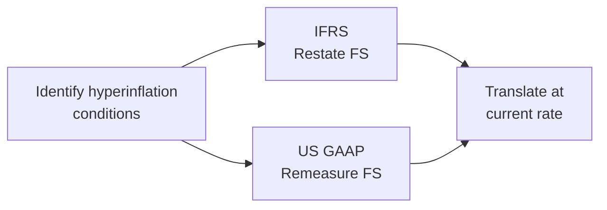

## Understanding Hyperinflation

Let’s be honest: when we talk about hyperinflation, it’s not some casual, everyday situation—like “Oh, the price of coffee went up 10% this year, big deal.” Hyperinflation is more like: “Wait, last week I could buy a loaf of bread with one local currency unit, and this week it costs 10 times that amount.” That’s the kind of environment that can wreak havoc on a company’s financial statements.

In practice, hyperinflation is a total game-changer for both local businesses and any parent organizations trying to consolidate overseas entities. From an accounting perspective, you can’t just keep adding up numbers that are essentially losing purchasing power by the hour (okay, maybe by the month—but it sure feels like the hour sometimes!). So we need special guidance to accurately reflect what’s happening.

The CFA Level II curriculum expects you to understand the distinct approaches for dealing with hyperinflation, particularly under IFRS (using IAS 29) and under US GAAP. While both aim to tackle similar economic catastrophes, the rules sometimes lead to quite different results on the income statement and balance sheet. Imagine being an analyst trying to review an entity’s performance in, say, Venezuela or Zimbabwe without these guidelines… you might just throw your hands up in frustration.

Anyway, let’s dig in a bit more concretely to see how IFRS and US GAAP each respond to hyperinflationary conditions.

## IFRS Approach to Hyperinflation

Under IFRS, once an economy is deemed hyperinflationary (IAS 29 doesn’t specify a strict numerical threshold, but it suggests looking at things like cumulative inflation approaching or exceeding 100% over a three-year period), the foreign entity must restate its financial statements for inflation before performing any FX translation into the parent’s presentation currency.

In other words, IFRS says: “Hey, before we even think about translating these financials into the parent currency, we need to adjust every non-monetary item on the balance sheet to reflect current purchasing power.” The local currency might still be spiraling downward in value, but at least the financial statements become more comparable from one reporting period to the next.

### The Restatement Process: High-Level Overview

• Non-monetary items (like property, plant & equipment, intangible assets, and inventory) are restated based on a general price index. This effectively indexes their historical cost to reflect the current purchasing power.  
• Monetary items (such as cash, accounts receivable, accounts payable) are not restated because, by definition, they are already in nominal currency units that lose or gain purchasing power automatically.  
• The difference from restating non-monetary items typically goes into an equity adjustment or a monetary gain/loss line item.  
• Income statement items get restated by applying the change in the price index from the transaction date (or average rate for the period) to the end of the reporting period.  
• Once everything is adjusted, the entire restated set of statements is translated at the current exchange rate—hopefully giving a more stable depiction of entity performance over time.  
• IFRS also requires restatement of comparative figures. That means if you’re showing last year’s numbers along with this year’s, you have to restate last year’s as well if the economy was hyperinflationary in both periods. This constant recalibration can be quite labor-intensive, but it’s critical for consistent comparisons.

### Why This Matters for Analysts

One of the main selling points of IFRS’s restatement approach is it reduces distortions in real performance metrics. That means if you’re looking at profit margins, return on assets, or other key ratios, those figures more accurately reflect real (inflation-adjusted) performance. Sure, the local currency is still going down the tubes in the hyperinflationary environment, but at least your line items are all measured in something closer to “today’s currency,” so they’re more directly comparable from one period to another.

## US GAAP Approach to Hyperinflation

In contrast, under US GAAP, once an economy is considered hyperinflationary (also typically pegged at around 100% cumulative inflation over a three-year timeframe), the foreign entity is often treated as if its functional currency is the parent’s currency. That triggers the temporal method of remeasurement—rather than IFRS’s restatement process.

### The Temporal Method in Hyperinflation

With the temporal method, you remeasure monetary items using current exchange rates. Non-monetary items are sometimes kept at historical exchange rates (the rate in effect when these items were acquired). This approach can lead to big swings in net income because the remeasurement gains or losses flow through the income statement directly. Instead of adjusting each line item to reflect inflation in local currency, the US GAAP approach effectively says, “We’re going to pretend the entity has been measuring everything in the parent currency all along.” 

That’s conceptually simpler in some ways, but it also means your reported earnings can be all over the place from period to period, since the currency’s meltdown directly affects your net income. Volatility is almost guaranteed. In practice—especially if you’re on the receiving end of those net income results—this can be quite frustrating, because you’re mixing foreign exchange volatility with hyperinflation economics, making it difficult to discern what portion of earnings is “real” operating performance and what portion is purely currency meltdown.  

Below is a quick visual overview of how IFRS and US GAAP diverge when tackling hyperinflation:

## Key Steps in IFRS Restatement

Since the CFA exam might very well throw a multi-step item set at you, especially if you’re dealing with a subsidiary in a hyperinflationary economy, let’s outline the typical IFRS steps:

• Determine if the foreign economy is hyperinflationary. Look for extreme cumulative inflation over three years.  
• Select a general price index. This is crucial—pick an index representing the evolution of general purchasing power.  
• Restate non-monetary items on the balance sheet by applying the ratio of the price index on the balance sheet date to the price index on the acquisition date.  
• Adjust the equity accounts (including retained earnings) accordingly so that your balance sheet balances after the restatements.  
• Restate all income statement items: if you’re using an average inflation index for the year, multiply revenue, costs, and expenses by the ratio of year-end index to average index.  
• Record a “gain or loss on net monetary position” in profit or loss. This recognizes the effect of holding or owing monetary items during inflation.  
• Translate everything at the current exchange rate from the local currency to the parent’s presentation currency.  

By the end of this process, each line item on your statements theoretically reflects the purchasing power of the local currency at the end of the reporting period. This step can be tricky, especially in real-world scenarios, but the exam will typically test your knowledge in a somewhat more structured manner (like giving you a price index and requiring you to restate a few line items).

## Real-World Examples

Hyperinflation is not just a theoretical concept found in textbooks. Sometimes, it’s downright heartbreaking. You can look at the stories from Zimbabwe in the mid-2000s, where inflation soared into the billions of percent, or Venezuela in more recent years, where locals might pay for a cup of coffee one morning and find the price has doubled by the next day. 

Imagine you’re an executive at a parent company that owns a Venezuelan subsidiary. Every time you try to consolidate that subsidiary’s financials, the local currency figures from last quarter may literally be worthless in terms of purchasing power. IFRS requires you to restate all those worthless figures to reflect something closer to real purchasing power—so at least they make sense when consolidated. US GAAP, on the other hand, might say, “Look, treat it as if they’ve been using our parent currency all along,” which can produce different results and significantly alter earnings.

## IFRS vs. US GAAP: Key Distinctions

One question I get from candidates is: “Why does IFRS bother with restatement, while US GAAP is all about remeasurement?” My personal take is IFRS tries to preserve local currency financial statements in a way that still stands on its own economic reality—then it does the translation. US GAAP basically decides the local currency is no longer functional for practical accounting purposes, so it shortcuts by imposing the parent’s currency as the functional currency.

That difference can lead to:

• More stable period-to-period comparability for IFRS, since all items get adjusted to current purchasing power.  
• Potentially larger net income swings under US GAAP, because remeasurement gains/losses run through profit or loss.  
• Differences in equity account balances, especially around items like retained earnings. IFRS adjustments shift more of the inflation effect into equity through restatement, whereas US GAAP lumps more of it into the income statement.  
• Under IFRS, the comparative figures from prior periods must also be restated, which can be a headache in practice but allows year-over-year statements to be on the same inflation footing. Under US GAAP, prior statements might not be recalibrated in the same manner.

## Practical Challenges and Potential Pitfalls

• Inconsistent or Unavailable Price Indices: A huge challenge in hyperinflationary economies is the lack of reliable inflation data. If the government stops releasing official stats—or if those stats are blatantly manipulated—entities can struggle to pick a relevant price index.  
• Frequent Restatement of Comparatives: If hyperinflation persists for a long time, IFRS filers have to keep restating older periods, which can be confusing for users of financial statements.  
• Volatility in Profit or Loss: Under US GAAP remeasurement, you can see wild swings in reported net income from exchange differences. This can obscure performance.  
• Lack of Understandability for Investors: Hyperinflation is, quite frankly, hard for many investors to wrap their heads around. Make sure you check footnotes and disclosures thoroughly to see how companies are applying the relevant rules.  
• Potential Changes by Standard Setters: Hyperinflationary accounting has often been in the spotlight. There may be future tweaks or clarifications as economies evolve and as the IFRS and US GAAP boards learn from past experiences.  

## Conclusion and Key Takeaways

Hyperinflation isn’t just an abstract concept: it signifies an economy in crisis, with massive swings in purchasing power. Under IFRS (IAS 29), firms restate non-monetary assets and liabilities to current purchasing power and then translate the financial statements at current exchange rates. This typically helps maintain more meaningful trend analysis and ratio calculations.

Under US GAAP, companies generally use the temporal method, effectively remeasuring local financials as if the parent currency were the functional currency. This approach throws exchange-related gains and losses directly into net income, which can cause big profit or loss gyrations from period to period.

From an exam standpoint, be prepared to do quick calculation steps—especially restating certain balance sheet or income statement items using an inflation index. Then, look for how net income or equity changes once you retranslate. Also pay close attention to question stems describing footnotes referencing hyperinflation: they might reveal the selection of index, the restatement approach, and the location of gains/losses in the financial statements.

Let’s bring it all together with a quick summary:

• IFRS: Inflation Restatement (IAS 29) → Adjust for inflation in local currency → Translate at current rate → Gains/losses mostly in equity adjustments (plus a net monetary gain/loss).  
• US GAAP: Hyperinflation triggers the temporal method → Remeasure lots of stuff at either current or historical rates → Gains/losses go through net income → Typically more volatility.  

And if you’re analyzing statements from a hyperinflationary subsidiary in real life, my best advice is to read the notes carefully. They can be your lifesaver in understanding how the numbers have been restated—especially if inflation has soared in the triple-digit range (or beyond).

## References and Further Reading

• IAS 29 – International Accounting Standards Board, available at www.ifrs.org  
• ASC 830 – FASB guidance at www.fasb.org  
• “Hyperinflation and Financial Reporting,” various academic papers in Accounting and Business Research  
• CPA Canada guidance on hyperinflation under IFRS and US GAAP, at www.cpacanada.ca  

--------------------------------------------------------------------------------

## Test Your Knowledge: IFRS vs US GAAP Hyperinflationary Accounting



### Which of the following best describes why IFRS requires restatement of financial statements in hyperinflationary environments?

- [ ] To match depreciation with historical inflation levels  
- [x] To adjust non-monetary items to reflect current purchasing power before translation  
- [ ] To use the parent’s currency as the functional currency during depreciation  
- [ ] To prevent any cumulative translation adjustment from appearing in equity  

> **Explanation:** Under IAS 29, IFRS requires restating non-monetary items with an inflation index so that the financial statements reflect current purchasing power before translating to the parent currency.

### Under US GAAP, in a hyperinflationary environment, which currency is typically presumed to be the functional currency when applying the temporal method?

- [ ] The local currency of the hyperinflationary economy  
- [x] The parent’s reporting currency  
- [ ] A theoretical stable currency like the euro or US dollar  
- [ ] No currency; remeasurement is not allowed under hyperinflation  

> **Explanation:** US GAAP generally treats the parent’s currency as the functional currency in hyperinflationary economies, triggering the temporal remeasurement of local statements.

### Under IFRS, after restating financial statements for inflation, how are the restated statements translated to the parent’s currency?

- [ ] At the historical exchange rate  
- [ ] At an average exchange rate that tracks the year’s inflation  
- [x] At the current (year-end) exchange rate  
- [ ] IFRS prohibits translation after restatement  

> **Explanation:** Once IFRS restatement is done, everything is then translated at the current (year-end) exchange rate, which helps ensure consistency across the final statements.

### Which of the following is a likely impact of using the temporal method under US GAAP in a hyperinflationary setting?

- [x] Higher earnings volatility due to exchange gains/losses flowing through net income  
- [ ] Lower volatility because gains/losses bypass the income statement  
- [ ] Minimal changes in the income statement, with adjustment recognized directly in equity  
- [ ] No effect on reported earnings  

> **Explanation:** Under the temporal method, remeasurement gains and losses go straight to net income, amplifying earnings volatility.

### Under IFRS, what is the purpose of adjusting non-monetary items to current purchasing power?

- [ ] To ensure all items are measured at fair value  
- [x] To preserve comparability in real terms despite hyperinflation  
- [ ] To prevent changes in equity  
- [ ] To eliminate currency exchange gains or losses  

> **Explanation:** Adjusting non-monetary items helps maintain consistent real value across periods, enhancing comparability in hyperinflationary environments.

### When selecting a price index for IFRS restatement, which criterion is most important?

- [x] It should represent the overall inflation rate of the local economy  
- [ ] It must be approved by the International Monetary Fund (IMF)  
- [ ] It should be the price index with the highest level of inflation  
- [ ] It must be based on another country’s inflation statistics  

> **Explanation:** Entities must use a general price index reflecting the local economy’s inflation trends for an accurate restatement.

### How does IFRS generally treat comparative figures when an economy is deemed hyperinflationary?

- [ ] Prior-period statements are left unadjusted  
- [ ] Only one prior period is restated  
- [x] All comparative figures are restated for inflation, if material  
- [ ] IFRS does not allow comparative statements in hyperinflationary economies  

> **Explanation:** IFRS mandates restating any comparable prior periods to ensure consistency across all reported periods.

### Under US GAAP, if a foreign subsidiary in a hyperinflationary economy holds large amounts of monetary liabilities, what effect typically appears in the income statement upon remeasurement?

- [ ] A large equity adjustment  
- [ ] No effect, since they are already recognized at historical cost  
- [ ] An asset revaluation gain  
- [x] A net monetary gain or loss, which flows through net income  

> **Explanation:** Remeasurement under the temporal method treats monetary items at current rates, leading to recognized gains or losses in net income.

### Which statement is true regarding IFRS restatement of hyperinflationary financials?

- [ ] IFRS restatement generally leads to increased income statement volatility  
- [x] IFRS restatement aims to standardize all line items to current purchasing power prior to translation  
- [ ] IFRS restatement requires the entity to adopt the temporal method  
- [ ] IFRS does not require adjustment of comparative figures  

> **Explanation:** IFRS restatement standardizes each non-monetary line item to reflect the final period’s purchasing power; it is not the same as the temporal method (that’s US GAAP).

### Hyperinflationary standards under IFRS (IAS 29) and US GAAP (ASC 830) aim primarily to:

- [x] Provide meaningful financial statements under conditions of rapid currency devaluation  
- [ ] Eliminate all exchange rate volatility in consolidated financials  
- [ ] Enable entities to avoid reporting currency losses  
- [ ] Ensure the local currency remains the functional currency indefinitely  

> **Explanation:** The main goal is to yield more meaningful and comparable financial statements despite extreme inflationary environments.  


