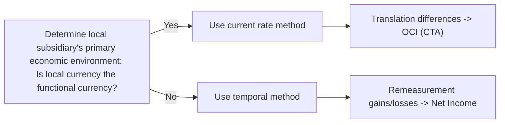
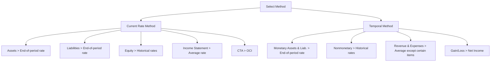

## Introduction
Have you ever taken a look at a multinational corporation’s financial statements and thought, “Um, how on earth do they combine so many currencies into one tidy balance sheet?” You’re not alone. Many of us have felt that initial confusion when dealing with global operations, multiple exchange rates, and shifting inflation conditions in certain locales. But with a structured approach—and a bit of practice—you can quickly figure out which foreign exchange (FX) translation method applies and how the resulting gains or losses flow through the financials.

This section explores a classic item-set (vignette) scenario from the CFA® Level II curriculum, focusing on the process of:
• Identifying the functional currency and relevant method (current rate vs. temporal).  
• Considering hyperinflationary environments under IFRS or US GAAP.  
• Computing and interpreting the cumulative translation adjustment (CTA) or remeasurement gain/loss.  
• Summarizing the overall impacts on consolidated net income, equity, and key ratios.

The big idea is: the correct translation method affects how you handle assets, liabilities, revenues, and expenses—ultimately influencing net income, equity, and those crucial exam-favorite ratios. So let’s jump right in.

## Key Considerations When Choosing a Translation Method

### Functional Currency Clues
Determining the functional currency is step one. If the subsidiary’s business operations are predominantly conducted in the local currency—meaning it finances locally, pays its employees in local currency, and sources raw materials in that same local currency—then the local currency is typically the functional currency. Under both IFRS and US GAAP, that scenario usually triggers the current rate method (also known as the all-current method).

On the other hand, if corporate headquarters basically runs the show and the parent’s currency drives the primary economic environment—like product prices, labor costs, financing, and day-to-day operations—then you’re likely going to use the temporal method. This also becomes relevant when the subsidiary is operating in a hyperinflationary environment under US GAAP.

### Hyperinflationary Environments
What if the subsidiary is located in a country with persistent and severe inflation? Under IFRS, you’re required to restate the subsidiary’s financial statements for inflation before applying the current rate method (unless there’s an IFRS-specific departure for extreme cases). Under US GAAP, once you classify an economy as hyperinflationary (broadly defined as cumulative inflation approximating or exceeding 100% over a three-year period), you must switch to the temporal method for translation. This is a big difference. IFRS effectively says, “inflate the numbers, then use current rate,” while US GAAP says, “okay, now it’s remeasurement time—throw those gains or losses into net income.”

### Remeasurement (Temporal Method) vs. Translation (Current Rate)
This can be a source of confusion. The big difference is where the exchange rate differences end up:

• Current Rate (All-Current) Method:  
  • For assets and liabilities: use the balance sheet date (end-of-period) exchange rate.  
  • For revenues and expenses: use the average rate for the reporting period.  
  • For equity: use historical rates.  
  • CTA (Cumulative Translation Adjustment) is reported in shareholders’ equity (through OCI). It does not hit net income, at least not until disposal of the subsidiary or partial sale.  

• Temporal Method (Remeasurement):  
  • Monetary assets and liabilities: use the current (balance sheet date) rate.  
  • Nonmonetary assets and liabilities (e.g., fixed assets, inventory at cost): use historical rates relevant to their acquisition dates or recognition dates.  
  • Revenues and most expenses: use average rate. Some expenses (related to nonmonetary assets) are measured at historical rates.  
  • The resulting remeasurement gain or loss is posted directly to net income.  

That difference in final placement—OCI vs. net income—can significantly affect how the exam item sets portray the subsidiary’s impact on the parent’s financial statements.

## Decision Process in a Nutshell
The flow below outlines the typical hierarchy for choosing the right method:

1. If local currency is the functional currency, apply the current rate method.  
2. If the parent’s currency or a third currency is functional, or the economy is hyperinflationary under US GAAP, use the temporal method.  

## Looking for Trick Details
When the exam tries to get tricky, they might mention:
• Partial-year acquisitions: If a parent acquires a subsidiary mid-year, you might need to apply a weighted-average or spot rates for the portion of the year you control the subsidiary.  
• Different historical rates for inventory: If the subsidiary purchased batches of inventory at various times (with multiple exchange rates), you might see multiple cost layers, each remeasured at their distinct historical rates under the temporal method.  
• Dividends: If the subsidiary paid dividends, that might create recognized FX gains or losses for the parent’s statements.  
• IFRS vs. US GAAP hyperinflation triggers: If the question states “the local government publicly acknowledges inflation is consistently over 30% for multiple years,” or “hyperinflation has reached a cumulative 100%,” that’s your cue to consider restatement under IFRS or the temporal method under US GAAP.

## Putting It All Together: A Realistic Vignette
Imagine you have a US-based parent company, Redwood Corp., which acquired a foreign subsidiary called SunLeaf Ltd. Based in Argentina (a country known for bouts of high inflation), SunLeaf’s operations are mostly financed in Argentine pesos, and local costs are in pesos. Redwood’s CFO acknowledges that Argentina’s official inflation index soared to an annual rate of 40% for three consecutive years. The question is: which method do you use, and what’s the CTA or remeasurement impact?

Let’s break down the scenario:

1. SunLeaf’s local currency is the peso.  
2. Based strictly on the autonomy test, you’d be inclined to use the current rate method because it obtains local financing and sets its prices in pesos.  
3. However, we see that the average inflation over the last three years has exceeded US GAAP’s informal threshold (100% cumulative inflation over three years is a common guideline for hyperinflation).  
4. Under IFRS, you’d restate financials for inflation and still apply the current rate method.  
5. Under US GAAP, Redwood has to treat SunLeaf’s environment as hyperinflationary and use the temporal method.  

So if Redwood is reporting under US GAAP, it must remeasure SunLeaf’s financial statements into USD using historical rates for nonmonetary items, current rate for monetary items, and post any gains or losses in net income. If Redwood is reporting under IFRS, Redwood first “inflates” the local statements in pesos, then uses the current rate method, plugging the difference into CTA in equity. The exam may ask for the differences in net income or the CTA line item under each standard.

## Step-by-Step Analysis

### Step 1: Identify Functional Currency
• Evaluate operational independence, buyer/supplier contracts, and the currency in which salaries and debt are denominated.  
• If a question references “the subsidiary’s product sales are determined by international markets and denominated in the parent’s currency,” that points to the parent’s currency as functional. You get the drift.  

### Step 2: Examine Hyperinflation Clues
• Under IFRS, restate first, then apply the current rate method.  
• Under US GAAP, switch to the temporal method if it’s considered hyperinflationary.  

### Step 3: Apply the Correct Method
• Current Rate: End-of-period exchange rate for assets and liabilities, average rate for revenues/expenses, historical for equity. Differences accumulate in CTA within OCI.  
• Temporal: Current rate for monetary assets/liabilities, historical rate for nonmonetary assets/liabilities, average rate for non-balance sheet items except those tied to nonmonetary assets. Gains/losses go to net income.  

### Step 4: Determine CTA or Remeasurement Gain/Loss
• Under current rate, the balancing figure is the CTA in equity.  
• Under temporal, the balancing figure is a remeasurement gain or loss in net income.  

### Step 5: Tie It Back to Consolidated Financial Statements
• Check how net income changes if you’re forced to remeasure.  
• Check how total equity changes if your differences end up in OCI.

## Common Pitfalls
• Automatically defaulting to the current rate method without checking if the environment is hyperinflationary.  
• Forgetting that the temporal method’s exchange differences hit net income, not equity.  
• Mixing up IFRS vs. US GAAP hyperinflation approaches.  
• Overlooking partial-year ownership or changes in functional currency mid-year.  

## Example Case Study Walkthrough
Suppose Redwood Corp. owns 100% of OakNation B.V., located in a country with stable inflation. OakNation is completely autonomous, obtains funding locally, and does business in the euro. Redwood reports in U.S. dollars.  
1. OakNation’s functional currency is the euro.  
2. Use the current rate method:  
   • Assets/Liabilities at the period-end spot rate.  
   • Revenue/Expenses at the average rate.  
   • Equity at historical rates.  
   • The CTA is recognized in OCI.  

If Redwood sells partial ownership in OakNation mid-year, only the portion Redwood still owns at the end of the period is consolidated. This partial-year factor might require you to carefully segment the period’s average rates in your translation, especially if the question explicitly states the date Redwood changed its ownership stake.

## Visual Summary of the Methods
Here’s a quick diagram to summarize how each method deals with assets, liabilities, and equity:

Notice how the current rate method lumps most items at the end-of-period rate, while the temporal method splits items into monetary vs. nonmonetary. This difference is crucial for analyzing consolidated results and potential exam question pitfalls.

## Conclusion
This topic might feel a bit mind-bending at first, but once you remember the fundamental distinction—current rate method differences go to the CTA in equity, temporal method differences go directly into net income—then half the battle is won. Keep an eye out for hyperinflation signals (especially in a US GAAP context) and partial-year acquisitions, which often appear in vignettes to test your agility with multiple exchange rates and time frames.

When you see a currency question on the exam, methodically check each of these variables:  
• Are they telling me who truly controls the subsidiary’s operations?  
• Does the text scream hyperinflation?  
• Which rates (historical, average, current) apply to which balance sheet items?  
• Is the difference going into OCI or net income?  

Trust me, with practice, you’ll find it easier to read a scenario, pick the method, compute the CTA or remeasurement gain, and confidently address those multi-part exam questions.

## References and Further Reading
• CFA Institute official curriculum – More in-depth examples on how IFRS and US GAAP differ for hyperinflation.  
• Big Four publications (e.g., Deloitte, PwC) – Real-world commentary on translation methods.  
• Wiley’s CFA Program Study Guides – Extra practice vignettes focusing on foreign currency transactions and translation.  
• IFRS.org – For updates on IFRS requirements on hyperinflation (IAS 29).  
• FASB.org – For details on US GAAP treatment in hyperinflationary economies (ASC 830).  

## Test Your Knowledge: FX Translation Methods and CTA



### Which method is typically used when the subsidiary's local currency is its functional currency?

- [ ] Temporal method
- [x] Current rate method
- [ ] Weighted exchange rate method
- [ ] Remeasurement method

> **Explanation:** When a subsidiary’s local currency is determined to be its functional currency, the current rate (all-current) method is used, translating most assets and liabilities using the balance sheet date rate.

### In a hyperinflationary environment under US GAAP, the parent must:

- [ ] Restate all financial statements using a constant purchasing power approach and then translate
- [ ] Use the current rate method but record all differences in OCI
- [x] Use the temporal method and report any gain/loss in net income
- [ ] Revert to historical cost for consolidated reporting

> **Explanation:** US GAAP specifies that a hyperinflationary subsidiary must be remeasured using the temporal method. The resulting remeasurement gain or loss flows through net income.

### Under IFRS, which step is required when a subsidiary operates in a hyperinflationary economy?

- [ ] Use the temporal method and place gains/losses in net income
- [ ] Immediately switch to the parent’s currency as the functional currency
- [x] Restate financial statements for inflation prior to applying the current rate method
- [ ] Defer all currency conversion until inflation returns to normal

> **Explanation:** IFRS calls for restatement of the subsidiary’s financials to adjust for the effects of inflation, then translate under the current rate method.

### In the current rate method, equity accounts (excluding retained earnings) are generally translated at:

- [x] Historical rates
- [ ] The average rate for the period
- [ ] The end-of-period rate
- [ ] The daily rate

> **Explanation:** Equity items (such as common stock) are tied to the rate at the time these transactions occurred (historical). Retained earnings are adjusted over time as profits are added or removed.

### A subsidiary’s functional currency is different from its local currency. Which exchange rate would be used for inventory carried at cost under the temporal method?

- [ ] End-of-period rate
- [x] Historical rate
- [x] Possibly different historical rates if purchases occurred at multiple times
- [ ] Weighted-average rate for all illustrative purchases

> **Explanation:** Under the temporal method, nonmonetary items (like inventory at cost) are remeasured at the historical rate used when the item was acquired. Separate historical rates apply for different purchase lots if available.

### Where does the gain or loss from remeasurement under the temporal method appear in the consolidated financial statements?

- [ ] OCI within equity
- [x] Net income
- [ ] Footnote disclosures only
- [ ] Deferred tax liability

> **Explanation:** The temporal method’s imbalance from remeasurement flows directly to net income as a foreign exchange gain or loss.

### Which of the following would most likely lead to the subsidiary’s local currency being deemed its functional currency?

- [x] Subsidiary’s labor costs, revenues, and financial obligations are primarily in the local currency
- [ ] Subsidiary’s board of directors meets at parent headquarters
- [x] Subsidiary obtains most of its financing from local banks and repays in local currency
- [ ] Subsidiary’s primary customers all pay in parent currency

> **Explanation:** The decision depends on where the economic substance of the operations lies. If most business inputs and outputs are priced in the subsidiary’s local currency, that currency is functional.

### In partial-year acquisitions, how are income statement items translated under the current rate method?

- [x] Revenues and expenses from the acquisition date to year-end are translated at the average rate of that period
- [ ] All items for the entire year are translated at the yearly average rate
- [ ] Only the year-end rate is used for all income statement items
- [ ] Income statement items are ignored if the acquisition is mid-year

> **Explanation:** For the portion of the year after acquisition, revenues and expenses are translated using an average rate that reflects the time of ownership.

### Under IFRS, after restating for inflation in a hyperinflationary environment, which rate is used for the balance sheet accounts under the current rate method?

- [ ] Historical rate for nonmonetary assets, end-of-period for monetary
- [x] End-of-period for all assets and liabilities before applying any CTA adjustments
- [ ] Weighted-average rate for all assets and liabilities
- [ ] No translation is required after restatement

> **Explanation:** Under IFRS, after restating the local financial statements for inflation, you still apply the current rate method to the restated figures. That means you use the year-end rate for the balance sheet accounts.

### When using the temporal method, the resulting foreign exchange differences are:

- [x] True
- [ ] False

> **Explanation:** Yes, under the temporal method, foreign exchange differences (remeasurement gain or loss) directly affect net income.  


