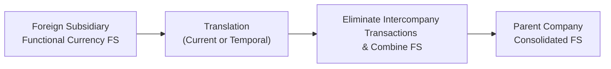

## Overview of Consolidation Requirements

Consolidating subsidiaries with multiple exchange rates can, at first, feel like juggling a bunch of moving pieces—especially if you’re dealing with, say, a Brazilian subsidiary, a European manufacturing plant, and a parent company based in the United States. Back when I first started working on multinational consolidations, I remember realizing just how quickly my coffee breaks disappeared because I had to constantly track each entity’s functional currency and decide which method to use. 

Under IFRS (particularly IFRS 10) and US GAAP (ASC 810), if a parent controls a subsidiary—basically meaning the parent directs the subsidiary’s activities and stands to benefit from its returns—those entities have to be consolidated into a single set of financial statements. This often requires translating the subsidiary’s financials into the parent’s presentation currency.  

Control triggers consolidation, but it doesn’t automatically mean we ignore local realities. The subsidiary’s day-to-day transactions remain in its own functional currency. Translation acts more like a lens, letting the parent see and present the subsidiary’s performance in a common currency.

## Functional Currency vs. Presentation Currency

We have two big currency concepts to distinguish:

• Functional Currency  
• Presentation Currency  

The functional currency is the currency of the primary economic environment in which the subsidiary operates. It’s often (though not always) where it sells goods or services, where its labor costs are denominated, and so on. By contrast, the presentation currency is the currency in which the parent entity presents its consolidated financial statements. It could be the currency of the parent’s home country, or maybe another widely accepted currency (like the US dollar) if that’s what the organization prefers for reporting or investor relations.

Determining a subsidiary’s functional currency requires judgment—particularly if it sells in multiple markets or sources materials globally. Sometimes you’ll see borderline cases that might lead an analyst to question if the subsidiary is truly “integrated” with the parent or if it has a stand-alone economic environment. Getting this call wrong can lead to using the wrong method for translation—and that can create big, big headaches come audit time.

## Using the Appropriate Translation Method

Once you know the subsidiary’s functional currency, ask yourself: does that currency differ from the parent’s presentation currency? If yes, you likely need the current rate method (a.k.a. closing rate method). If no, or if the subsidiary operates in a hyperinflationary environment (under IFRS, check IAS 29), you might instead use the temporal method under US GAAP or apply inflation adjustments under IFRS.

• Current Rate Method (Closing Rate Method)  
  - Translate assets and liabilities at the closing rate on the balance sheet date.  
  - Translate income statement items at the average rate for the reporting period (unless big exchange rate swings mean you should refine the average).  
  - Any resulting translation gains or losses don’t hit net income; instead, they typically go to equity as part of Other Comprehensive Income.  

• Temporal Method (Remeasurement Method)  
  - Differentiate monetary items (cash, receivables, payables) from nonmonetary items (inventory at cost, property, intangible assets).  
  - Monetary items get translated at the closing rate. Nonmonetary items are translated at historical rates (the rates in effect when those items were first recognized).  
  - Remeasurement gains and losses generally go straight to net income.  

If you’re covering multiple subsidiaries, you might be applying different methods across them. A small but important nuance: IFRS and US GAAP both say that if an economy is hyperinflationary, you may need specialized treatments (like restating for inflation or using the temporal method).  

## Practical Steps to Translation

Let’s imagine your subsidiary in Europe reports in euros (EUR), but your group’s presentation currency is US dollars (USD). In the scenario below, the subsidiary’s functional currency is EUR, so we employ the current rate method. We’d do something like:

1. Balance Sheet:  
   • Translate all assets and liabilities at the current USD/EUR exchange rate as of your period-end date.  
   • Equity items (except retained earnings) use historical rates, because that’s when that equity capital was contributed. Retained earnings might be a blend of historical and cumulative translation adjustments.  

2. Income Statement:  
   • Translate revenues and expenses at the average USD/EUR exchange rate for the period (unless you have major swings—then you might break it down further).  
   • The resulting net income plus any non-cash translation adjustments will filter through consolidated retained earnings or Other Comprehensive Income.

3. Translation Adjustment:  
   • Once you produce the subsidiary’s USD figures, you’ll likely see that assets, liabilities, and net income don’t match up exactly in terms of currency. The mismatch? That’s the currency translation adjustment. Under the current rate method, this adjustment goes to a separate component of equity (like Accumulated Other Comprehensive Income, or AOCI).  

4. Hyperinflation or Temporal Method Considerations:  
   • If the subsidiary’s functional currency environment is hyperinflationary per IAS 29, you’d restate nonmonetary items for inflation before translating. In US GAAP, you might default to the temporal method.  

It’s basically a game of making sure each line item on the subsidiary’s financial statements is recognized in a manner consistent with the economic realities. It’s not about second-guessing how the local management values assets or revenues, but about ensuring consistent currency translation into the parent’s currency.

## Consolidation Using Translated Figures

Now that you’ve translated the subsidiary’s financials into the parent’s currency, you can combine them. Typically, you’d add the subsidiary’s (translated) assets and liabilities line by line to the parent’s. Then:

• Eliminate intercompany transactions. For instance, if the parent sold a machine to the subsidiary at $100,000, you’d remove that transaction from both statements so as not to inflate group revenues or assets.  
• Recognize noncontrolling interests if the parent has less than 100% ownership in the subsidiary. That means part of the subsidiary’s equity (and net income) belongs to other owners.  
• Combine the income statements, ensuring all rates used are consistent with the chosen method.  

If there’s a translation adjustment, it flows into equity (for the current rate method) or hits net income (for the temporal method). A big point I learned the hard way is that if you forget to allocate part of that adjustment to the noncontrolling interest, your consolidated statements can become misleading.

## Advanced Intercompany Eliminations

Picture this: your parent company issues a loan to a European subsidiary. The subsidiary’s paying interest in euros, while the parent uses USD in its ledger. Now you have intercompany interest recorded at two different exchange rates, depending on the day the interest was recognized. Eliminating that means:

• You match the intercompany revenue (parent’s interest income) with the intercompany expense (subsidiary’s interest expense).  
• Any foreign exchange gain or loss recognized on that loan might need to be accounted for carefully.  
• The key is consistency—if the parent recognized a certain gain or loss from the euro fluctuating, the subsidiary’s books reflect the other side of that exchange.  

A mismatch in rates can produce artificial gains or losses in consolidated statements, so be absolutely sure you keep a consistent approach to translating and eliminating these transactions.

## Exam Tips

Some crucial reminders for exam day:

• Pick the Right Method. If the subsidiary’s functional currency is not the parent’s currency, default to the current rate method. If the subsidiary is operating in a hyperinflationary economy (and IFRS requires restatement under IAS 29), or if the functional currency is truly the parent’s currency, expect the temporal method.  
• Translation Gains vs. Remeasurement Gains. Under the current rate method, your equity “absorbs” the translation adjustment. Under the temporal method, net income gets impacted. This is a frequent exam question because it directly affects ratios, earnings, and your overall sense of the company’s profitability.  
• Nonmonetary Assets. Pay special attention to how you translate inventories, property, and intangible assets if the question says you’re using the temporal method. These items are typically measured at historical exchange rates.  
• Watch Out for Intercompany. If an exam vignette has the parent and subsidiary transacting in multiple currencies, be on the lookout for tricky elimination steps.  

## Visualizing the Translation and Consolidation Process

Here’s a quick flowchart to illustrate how foreign subsidiary statements get translated and then consolidated into the parent’s financials:

The process is linear in concept, but you’ll keep revisiting these steps as you refine final numbers.

## Glossary

• Functional Currency: The main currency of the primary economic environment where the entity operates.  
• Presentation Currency: The currency in which the consolidated financial statements are reported.  
• Current Rate Method (Closing Rate Method): Assets/liabilities @ closing rate; income statement items @ average rate; translation adjustments flow to equity.  
• Temporal Method (Remeasurement Method): Monetary items @ closing rate; nonmonetary items @ historical rate; remeasurement gains/losses typically appear in net income.  
• Noncontrolling Interest (NCI): The portion of subsidiary equity not owned by the parent.  
• Hyperinflationary Economy: Extremely high inflation requiring restatement under IFRS (IAS 29) or specific treatments under US GAAP.  
• IAS 29: IFRS standard for financial reporting in hyperinflationary economies.  
• ASC 810: US GAAP standard for consolidation.  
• ASC 830: US GAAP standard for foreign currency matters (comparable to IFRS 21/IAS 21).

## References & Further Reading

• IFRS 10: Consolidated Financial Statements  
• IFRS 21 (IAS 21): The Effects of Changes in Foreign Exchange Rates  
• ASC 830: Foreign Currency Matters (US GAAP)  
• ASC 810: Consolidation (US GAAP)  
• IAS 29: Financial Reporting in Hyperinflationary Economies  
• IFRS Foundation, “International Financial Reporting Standards (IFRS) 2023 Red Book”  
• CFA Institute Level II Curriculum 2025, Financial Statement Analysis  

All these sources provide a deeper dive into the conceptual framework, real-world applications, and best practices for your exam prep (and post-exam career!). Balancing real-life complexities with exam knowledge is the key here. Remember, the exam loves to test how well you understand these steps and can apply them under timed, vignette-style conditions.

## Test Your Knowledge: Consolidating Subsidiaries with Multiple Exchange Rates



### A subsidiary operates in a country whose functional currency differs from the parent’s presentation currency. Which method is generally applied?

- [ ] Temporal method, with adjustments flowing to net income.
- [ ] Weighted-average method, reflecting your best guess.
- [x] Current rate method, with translation adjustments in equity.
- [ ] Nonmonetary method, applying historical exchange rates to everything.

> **Explanation:** If the subsidiary’s functional currency differs from the parent’s presentation currency, the parent typically uses the current rate (closing rate) method. Translation adjustments go to equity rather than net income.

### How are nonmonetary assets translated under the temporal method?

- [ ] At the closing exchange rate.
- [ ] At the average rate for the period.
- [x] At historical exchange rates in effect when the asset was acquired.
- [ ] At any rate required to zero out net income.

> **Explanation:** The temporal method calls for nonmonetary assets, such as inventory at cost or property, plant, and equipment, to be translated at historical exchange rates.  

### Under IFRS, what happens to translation adjustments related to a foreign subsidiary’s financial statements using the current rate method?

- [ ] Recognized in net income in the period incurred.
- [ ] Deferred on the balance sheet as a liability.
- [ ] Allocated to minority interest only.
- [x] Reported in other comprehensive income (part of equity).

> **Explanation:** IFRS (and US GAAP) requires translation adjustments arising from the current rate method to be recognized in other comprehensive income, which is later shown in accumulated other comprehensive income (AOCI) in equity.

### A parent has a loan receivable from its foreign subsidiary. When consolidating, what must be done with any intercompany interest income and expenses?

- [ ] Recognize them as foreign exchange gains in the parent’s statements.
- [ ] Recognize them in the subsidiary’s equity account.
- [x] Eliminate them in consolidation, ensuring no double counting.
- [ ] Convert them both into the subsidiary’s local currency.

> **Explanation:** Intercompany transactions, such as interest income (parent) and interest expense (subsidiary), must be eliminated upon consolidation to avoid overstating revenues and expenses.

### In a hyperinflationary economy under IFRS (IAS 29), which approach might be necessary before translation?

- [x] Restate financial statements for inflationary effects.
- [ ] Stop consolidating until inflation subsides.
- [x] Use the temporal method automatically.
- [ ] Recognize all adjustments as net income losses only.

> **Explanation:** Under IAS 29, a hyperinflationary economy requires the restatement of local financial statements to account for the inflation effect before any translation. That said, under US GAAP, you might default to the temporal method.  

### If the local currency of a subsidiary is the same as the parent’s presentation currency, what’s the impact?

- [x] Translation isn’t needed; effectively the subsidiary’s functional currency is already the parent’s currency.
- [ ] The subsidiary must use a synthetic currency to measure inflation.
- [ ] Gains and losses automatically go to net income.
- [ ] The parent must adopt IFRS 29 for hyperinflation.

> **Explanation:** If the subsidiary’s functional currency equals the parent’s presentation currency, no currency translation is needed. 

### Which statement is true regarding translation gains or losses under the temporal method?

- [x] They generally appear on the income statement as remeasurement gains or losses.
- [ ] They remain off the balance sheet entirely.
- [x] They are always treated as part of other comprehensive income.
- [ ] They do not affect any part of shareholders’ equity.

> **Explanation:** Using the temporal method, most translation (remeasurement) gains or losses flow through net income in the period incurred.

### Noncontrolling interests must be recognized when:

- [x] The parent owns less than 100% of the subsidiary.
- [ ] The parent’s functional currency is the same as the subsidiary’s.
- [ ] The subsidiary is profitable for two consecutive years.
- [ ] The parent is only a minority shareholder in another entity.

> **Explanation:** Noncontrolling interest reflects ownership in a consolidated subsidiary that’s not attributable to the parent. If the parent has something like 80% ownership, the remaining 20% belongs to others, recognized as NCI.

### When removing intercompany sales in a consolidation, which exchange rate is used to eliminate the intercompany transaction?

- [x] The one used when the intercompany transaction actually occurred (historical rate).
- [ ] Always the period-end rate, regardless of timing.
- [ ] A rate chosen to minimize net income fluctuations.
- [ ] The average rate for the entire year.

> **Explanation:** You typically use the rate in effect at the transaction date for consistency. That ensures no artificial gains or losses remain in consolidated results.

### A foreign subsidiary’s equity is translated at historical rates, but income statement items are translated at average rates. True or False?

- [x] True
- [ ] False

> **Explanation:** Under the current rate method, assets and liabilities are translated at the closing exchange rate, while equity is typically measured at historical rates (except retained earnings), and income statement items use average rates for the period.


