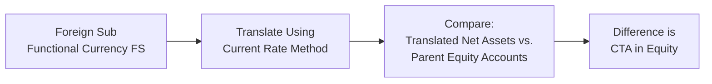

## Introduction
So, let’s say your company has a foreign subsidiary in Europe, and you’re reporting in U.S. dollars. Each quarter, the subsidiary’s assets and liabilities get translated into USD. Voilà, you suddenly see a line item in the equity section called “Cumulative Translation Adjustment” (CTA). If you’ve ever stared at that equity line and thought, “Uh, where did this come from?”—you’re not alone. I chatted with a CFO once who had to reassure the board that the sudden surge in CTA on their consolidated balance sheet wasn’t an actual, spendable gain—it was just an accounting reflection of exchange rate fluctuations. In this section, we’ll dissect exactly how CTA works, how it’s created, and why it matters.

## Definition and Purpose
CTA, at its core, is an equity account to capture unrealized foreign exchange gains or losses that arise when a parent company translates its foreign subsidiary’s financial statements into the parent’s reporting currency. In many sets of financial statements under US GAAP, this line is labeled “Cumulative Translation Adjustments.” IFRS might call it “Exchange Differences on Translation of Foreign Operations.” Regardless of the name, the goal is to keep currency translation effects (which aren’t realized in cash) out of current earnings and safely parked in equity until the parent either sells or substantially liquidates the foreign subsidiary.

In a very informal sense, you can think of CTA as the “parking lot” for translation gains and losses. These gains and losses remain unrealized because they are purely the result of the foreign currency changing in value against the parent’s home currency. If you took a snapshot of your net assets in euro at one exchange rate and then re-measured them a few months later at a new exchange rate, the difference goes to CTA.

## Key Mechanics of CTA Computation
Under the current rate method, we translate most of the subsidiary’s balance sheet at the prevailing period-end exchange rate. The income statement is often translated using an average exchange rate for the period. That leads to a potential mismatch between the net assets (translated at an end-of-period rate) and the equity components (possibly recorded at historical rates or mixed rates). The difference shows up in the CTA account.

Here’s a simplified example:

• Imagine a European subsidiary’s net assets of €1,000,000 at year-end.  
• The year-end EUR/USD exchange rate is 1.10, so we translate net assets to $1,100,000.  
• Maybe last year, we had translated those same net assets at a 1.20 exchange rate, which gave us $1,200,000.  
• The $100,000 difference is an unrealized loss on translation, and it is recorded in the CTA “parking lot,” reducing equity.

From one year to the next, CTA can swing widely if currency exchange rates shift significantly. That can cause equity to fluctuate in large ways that have nothing to do with business operations, purely because of changes in currency valuation.

Just to illustrate in formula form, for a company translating under the current rate method, a simplified CTA might be:


\text{CTA} = \sum_{t} (\text{Net Assets in Functional Currency} \times \text{Change in Exchange Rate})


Though in practice, it’s not always as straightforward—individual balance sheet items may be translated at different rates if you’re under the temporal method, or if IFRS vs. US GAAP has specific guidelines about certain items. For a typical foreign subsidiary that uses the local currency as its functional currency, the current rate method is the norm, and that method is what typically drives the CTA.

## Mermaid Diagram: Translation and CTA Flow
Below is a simple Mermaid diagram showing how CTA flows from the foreign subsidiary’s functional currency financial statements into the parent’s consolidated statements:



This graphical flow might save you from rummaging through footnotes trying to guess how the accountants arrived at that CTA figure.

## Reclassification of CTA
CTA isn’t permanently stuck in equity. It remains there until a triggering event, namely the disposal or liquidation of the foreign entity. When the parent sells all or a portion of its investment in the foreign subsidiary, the associated CTA is typically “recycled”—fancy word for “reclassified”—into the income statement. At that moment, the previously unrealized translation gain or loss becomes realized, because you effectively “close out” your exposure to that foreign subsidiary’s currency.

If the subsidiary is only partially disposed of, IFRS and US GAAP guidelines offer specific instructions on how much CTA to reclassify. The main takeaway: CTA is recognized in earnings only when you fully or partially discontinue your net investment in that foreign operation.

## Impact of Corporate Strategy on CTA
A company with large multinational operations might decide to hedge its foreign exchange risk. For instance, you might see them engage in currency swaps or forward contracts tied to the net investment in the subsidiary. While hedging strategies can mitigate the swings in CTA, they come with their own costs. Accountants and financial analysts often watch these hedges carefully because they influence the total risk-return profile of the parent company.

I once saw a scenario where a parent in the U.S. systematically hedged the net investment in its Japanese subsidiary. The CTA was nearly flat for several years, which looked suspiciously stable. In footnotes, the company disclosed they were implementing a hedge. So, the missing volatility in equity was basically offset by the cost of that hedge, recorded on the income statement or through other comprehensive income, as permitted by the standards. From a shareholder perspective, stable CTA is appealing, but it also means additional hedging expenses and complexity.

## Practical and Exam Considerations
Among the biggest pointers that tend to pop up in exam vignettes:  
• Footnotes are gold. If you see a huge shift in equity not explained by net income or dividends, check the CTA line. Currency movements might be your culprit.  
• CTA calculations typically revolve around final net assets, opening net assets, and the exchange rates used for translation. In an exam setting, you might have to compute beginning and ending equity in the subsidiary’s currency, convert them at different rates, and back into the CTA difference.  
• Watch for partial disposals. The nuance about recycling only a portion of CTA can trip up test-takers if they assume an all-or-nothing approach.

## Quick Python Example: Simplistic CTA Computation
Here’s a little snippet that demonstrates how you might do a simplified CTA calculation if you were automating translations for multiple subsidiaries, each with different net assets and exchange rates:

```python
# net assets reported in their functional currency

subsidiaries = {
    "SubA": {"net_assets_fc": 1000000, "prior_translated_amount": 1200000},
    "SubB": {"net_assets_fc":  800000, "prior_translated_amount":  900000},
}

exchange_rates = {
    "SubA": 1.10,  # e.g., EUR/USD
    "SubB": 0.75,  # e.g., CAD/USD
}

cta_results = {}

for sub, data in subsidiaries.items():
    net_assets_fc = data["net_assets_fc"]
    rate = exchange_rates[sub]
    prior = data["prior_translated_amount"]
    
    # Current translation to parent currency
    current_val = net_assets_fc * rate
    
    # CTA difference
    cta = current_val - prior
    cta_results[sub] = cta

print(cta_results)
```

In a real corporate environment, your CTA calculations will be more layered, because you’ll have multiple line items on the foreign subsidiary’s financial statements, each possibly translated at slightly different rates. But the concept remains: CTA is the difference arising from converting foreign currency net assets over time.

## Glossary
Cumulative Translation Adjustment (CTA)  
: A specialized equity account reflecting unrealized gains or losses from translating a foreign subsidiary’s financial statements into the parent’s reporting currency.

Recycling (of CTA)  
: The reclassification of CTA from equity to the income statement upon the disposal of some or all of a foreign subsidiary.

Net Investment in Foreign Operations  
: The parent’s stake in a foreign subsidiary’s net assets. Exchange rate changes in this net investment create CTA.

Hedging Strategy  
: Methods (like forwards or swaps) used by companies to offset or reduce currency exposure in foreign investments.

## References
• IAS 21: The Effects of Changes in Foreign Exchange Rates  
• ASC 830-30: Foreign Currency Matters—Translation of Financial Statements  
• CFA Program Curriculum Level II, Financial Reporting and Analysis, CFA Institute  
• White, Sondhi, and Fried (Wiley), “The Analysis and Use of Financial Statements”

## Test Your Knowledge: Cumulative Translation Adjustments and Consolidation



### In the context of foreign currency translation, which statement best describes the purpose of CTA?
- [ ] To record realized gains or losses in current earnings
- [ ] To track inventory write-downs due to currency devaluation
- [x] To capture unrealized translation gains or losses in equity
- [ ] To record hedging costs and premiums

> **Explanation:** CTA is an equity account to store the unrealized foreign exchange gains or losses from translating a foreign subsidiary’s financial statements. These do not hit the income statement unless the subsidiary is sold or liquidated.

### When using the current rate method for translation, changes in the CTA primarily result from:
- [ ] Translating fixed assets at their historical exchange rates
- [x] Applying the period-end exchange rate to net assets
- [ ] Amortizing goodwill through the parent’s income statement
- [ ] Using the monetary/nonmonetary classification for assets

> **Explanation:** Under the current rate method, a company translates most balance sheet items at the period-end rate. Equity is often recorded at historical rates, so the difference goes to the CTA account.

### Which event typically triggers the “recycling” of CTA into the income statement?
- [x] Disposal of the foreign subsidiary
- [ ] A large devaluation of the subsidiary’s functional currency
- [ ] Maternal dividend distribution from the subsidiary
- [ ] Recording a provision for credit losses on the subsidiary’s receivables

> **Explanation:** CTA remains in equity unless the parent sells or liquidates the foreign entity. At that point, the CTA is reclassified (recycled) into the income statement.

### In IFRS, where is the CTA generally reported prior to any disposition of the foreign subsidiary?
- [ ] As an adjustment to retained earnings
- [ ] As a contra asset on the balance sheet
- [ ] As part of current liabilities
- [x] As “Exchange Differences on Translation” in the equity section

> **Explanation:** IFRS typically reports CTA as “Exchange Differences on Translation of Foreign Operations” within equity.

### Which method is most commonly used to calculate CTA when the local currency is the subsidiary’s functional currency?
- [x] Current rate method
- [ ] Temporal method
- [ ] Monetary/nonmonetary method
- [ ] Historical exchange rate method

> **Explanation:** If the local currency is deemed the functional currency, IFRS and US GAAP generally require the current rate method, generating a CTA in equity.

### How would a parent company hedge its net investment in a foreign operation?
- [x] Use derivatives such as forward contracts or swaps
- [ ] Stop consolidating the foreign subsidiary
- [ ] Sell a portion of the foreign subsidiary
- [ ] Refuse to report CTA in the financial statements

> **Explanation:** Companies often manage foreign exchange risk by entering into derivatives to offset the impact of currency fluctuations on consolidated equity.

### Which of the following describes a partial reclassification of CTA to the income statement?
- [x] Occurs when a parent disposes of only part of its interest
- [ ] Happens if there is a revaluation of intangible assets
- [x] Requires a proportionate allocation of CTA
- [ ] Violates IFRS and US GAAP reporting standards

> **Explanation:** If a parent disposes of part of its ownership in a foreign subsidiary, a proportional share of CTA is removed from equity and recognized in the income statement.

### A large adjustment to CTA without any corresponding operational events in the subsidiary is most indicative of:
- [x] Significant exchange rate fluctuations
- [ ] Fraudulent revenue recognition
- [ ] Product obsolescence
- [ ] Aggressive channel stuffing

> **Explanation:** CTA often changes significantly simply due to currency movements, even if the subsidiary’s operations remain constant.

### Under the current rate method, where do gains or losses from translating the subsidiary’s income statement generally appear?
- [ ] Retained earnings
- [x] CTA in other comprehensive income (equity)
- [ ] Non-operating income
- [ ] Accumulated depreciation

> **Explanation:** The translation of income statement items at average rates flows into the parent’s consolidated net assets; the mismatch in translating equity items eventually enters CTA, an equity component in other comprehensive income.

### CTA balances on the consolidated balance sheet represent realized foreign exchange gains or losses. True or False?
- [ ] True
- [x] False

> **Explanation:** CTA balances are unrealized translation adjustments until the disposal of the subsidiary. They do not represent gains or losses that have been realized in cash flow or actual transactions.


