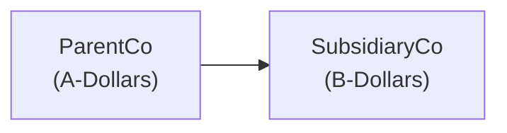

## Overview

It’s one thing to read about exchange rates in the newspaper or financial websites. But it’s a completely different adventure—maybe a bit nerve-wracking at first—when you translate a real subsidiary’s financial statements into your parent company’s reporting currency. Today, we’ll walk through a scenario that covers precisely that: a parent company in Country A using A-Dollars and a subsidiary in Country B using B-Dollars. We’ll go step by step, from the classification of assets and liabilities to tidying up that cumulative translation adjustment (CTA) in the equity section. And yeah, I still remember the first time I had to do this in practice. I kept double-checking my exchange rates, thinking, “Wait, am I missing something? Are these numbers even correct?” So let’s dig in and make sure we’re all set for exam day—and real-world applications.

## Scenario Setup

Imagine a parent company headquartered in Country A that decides to extend its global footprint by acquiring a subsidiary in Country B. We’ll just call them ParentCo (Country A) and SubsidiaryCo (Country B). ParentCo’s functional and reporting currency is the A-Dollar, while SubsidiaryCo’s functional currency is the B-Dollar. During the reporting period, the B-Dollar strengthened by 5% against the A-Dollar. Let’s outline the core exchange rate facts:

• Beginning-of-year rate: 1 B-Dollar = 1.00 A-Dollars  
• End-of-year rate: 1 B-Dollar = 1.05 A-Dollars  
• Average rate for the period: 1 B-Dollar = 1.03 A-Dollars  

We’ll assume SubsidiaryCo has a pretty standard balance sheet: some inventory (a nonmonetary asset), some cash, trade receivables (monetary assets), fixed assets, accounts payable, and so on. On the income statement, we have revenues, cost of goods sold, and operating expenses. Nothing exotic, just garden-variety financial items—except everything’s priced in B-Dollars.

Before we jump in, here’s a little visual to help clarify who owns whom:

I find that a quick diagram like this helps me keep track of the direction of consolidation.

## Approach to Translation

When the subsidiary’s functional currency is different from the parent’s presentation currency (which is exactly what’s happening here), the typical go-to method is the current rate method under IFRS and US GAAP. The temporal method is used if the subsidiary’s functional currency is not the local currency (for instance, if the subsidiary has decided to keep its books in currency X, but all daily operations really revolve around currency Y). That’s a bit more complicated, but we’ll focus mainly on the straightforward scenario where the local currency is indeed the functional currency, thus the current rate method is used.

### Identifying Assets and Liabilities

In any exam-style question or real-life analysis, I like to label balance sheet items as “monetary” or “nonmonetary,” even if I’m applying the current rate method, just to double-check any potential temporal method wrinkles. Monetary assets are those that represent a fixed claim in units of currency (like cash, receivables, and payables), whereas nonmonetary items (like inventory and fixed assets) don’t represent a right to receive a fixed number of currency units.

Under the current rate method, though, we translate all balance sheet items (both monetary and nonmonetary) at the closing (end-of-period) exchange rate. Equity is translated at historical rates, but the balancing piece often goes into CTA if we’re dealing with IFRS or US GAAP. If we used the temporal method (which matters when the local currency is not the functional currency, or in hyperinflationary economies for US GAAP), then monetary assets and liabilities get converted at the closing rate while nonmonetary items might get converted at historical rates. That’s a bit of a twist, but it’s good to keep in your mental toolbox.

### Income Statement Overview

For the income statement, we typically use the average rate for revenues, cost of goods sold, and operating expenses, unless there’s a big exchange rate swing during the period that would require a more precise approach (like weighting or using multiple average rates). If you see something that says “significant rate movements occurred on these particular dates,” that may be a red flag that the exam wants you to slice the income statement translation more finely.

### Putting It All Together

1. Translate SubsidiaryCo’s assets and liabilities at the December 31 (end-of-year) rate, which is 1 B-Dollar = 1.05 A-Dollars.  
2. Translate common stock and retained earnings using various historical rates. For an exam question, you might see:  
   • Common stock issued on the subsidiary’s formation date (use that date’s rate).  
   • Retained earnings generally get a cumulative approach to reflect prior periods, but a simplified exam scenario might just have you apply a certain given average.  
3. Translate revenues and expenses at the average rate, which is 1.03 A-Dollars per B-Dollar.  
4. Recognize CTA in equity if you’re using the current rate method. This CTA is the “balancing item” that reconciles the difference between translating the balance sheet and the income statement (plus historical equity references).

Below is a quick example calculation for translation:

• Let’s say SubsidiaryCo’s year-end inventory (nonmonetary) is B$100. Under the current rate method, that translates to A$105 (B$100 × 1.05).  
• Suppose the same item was worth B$90 at the beginning of the year. If we used the temporal method, we might also consider a historical rate or average for that inventory, but that’s not the case here, so we’re safe with A$105.  

## Consolidation Adjustments

After translating everything from B-Dollars into A-Dollars, the next step is to combine (or “consolidate”) those translated amounts into the parent’s financial statements—line by line. That means you take SubsidiaryCo’s cash and add it to ParentCo’s cash. Then you take SubsidiaryCo’s inventory and add it to ParentCo’s inventory. And so on, right down the list. In the final consolidated statements, it looks like one giant entity’s balance sheet and income statement.

If there are any intercompany transactions—like ParentCo sold some raw materials to SubsidiaryCo at a mark-up—then you have to eliminate that from revenue or cost of goods sold to avoid double-counting within the same consolidated group. You’ll also need to remove any intercompany receivable/payable for that transaction.

If there’s noncontrolling interest (i.e., ParentCo owns less than 100% of SubsidiaryCo), then you must present that portion of SubsidiaryCo’s net assets and net income separately. The steps for establishing noncontrolling interest can be a bit mechanical, but on an exam, they often highlight whether the parent owns 100% or, say, 80%. Keep your eyes open for that detail, because it affects the final consolidated statement presentation.

## Illustrative Numbers in Action

Now let’s see how the 5% currency strength can goose the parent’s results. Let’s take a simplistic but typical example:

• SubsidiaryCo’s year-end total assets in B-Dollars: B$1,000 (all from a variety of items like inventory, fixed assets, etc.)  
• SubsidiaryCo’s total liabilities in B-Dollars: B$400  

### Year-End Translation

At the end-of-year rate of 1.05 A-Dollars per B-Dollar, we get:

• Total assets in A-Dollars: B$1,000 × 1.05 = A$1,050  
• Total liabilities in A-Dollars: B$400 × 1.05 = A$420  

Suppose total equity in B-Dollars is B$600 (since B$1,000 – B$400 = B$600). This equity will be partially at historical rates for the share capital portion, but for simplicity, let’s assume it’s all translated at the historical or average rates, and we handle CTA as the difference. If the resulting equity in consolidated statements doesn’t line up with the mechanical total (A$1,050 – A$420 = A$630), the difference goes to CTA, ensuring the balance sheet is balanced.

### Average Rate for the Income Statement

Let’s say SubsidiaryCo’s net income for the year, in B-Dollars, is B$100. We’re told to use the average rate of 1.03 A-Dollars. That translates to A$103 of net income in the parent’s consolidated statements. Notice that the end-of-year balance sheet might reflect a stronger rate (1.05), so the final equity number might not match up exactly if we used 1.03 for the income statement. That mismatch is exactly why CTA is needed in the equity section.

If, for instance, the subsidiary’s net income flows into retained earnings at the average rate, but the balance sheet is consolidated at the closing rate, we must account for that difference in CTA.  

This difference often shows up in the “Other Comprehensive Income” section under IFRS or in the “Accumulated Other Comprehensive Income (AOCI)” section under US GAAP.

## CTA as the Balancing Item

It might help to see the CTA as the plug figure that keeps the accounting equation intact: Assets minus Liabilities = Equity. Sometimes I think of the CTA as a “paper gain or loss” from re-expressing the subsidiary’s equity into a new currency. In real life, you can’t actually pay your rent with CTA, but it’s super important for fair presentation. Also be mindful that if the B-Dollar were weakening, the CTA might reduce our equity in A-Dollars (leading to a negative adjustment). Because the currency in our story strengthened, we see a positive bump in consolidated equity from that translation difference.

## Interpretation of Results

So what’s the big takeaway? Well, if B-Dollar is getting stronger against A-Dollar, you’ll likely see an upward translation effect on the subsidiary’s assets and liabilities, with a net positive shift reflected in the consolidated equity through CTA. This can also alter some of the parent’s ratios. For example:

• Debt-to-equity (D/E) ratio might shift if assets and liabilities had different currency exposures.  
• Return on Assets (ROA) or Return on Equity (ROE) might look different, because the subsidiary’s net income is translated at an average rate that might not match the closing rate for assets and liabilities.

Exam questions often ask you to compute the CTA or to identify how these rate changes would affect the parent’s financial ratios. Remember, the effect of a stronger subsidiary currency is typically to inflate the parent’s consolidated assets and liabilities, and thus the equity might go up if total assets outpace total liabilities. But the net effect always depends on the structure of the subsidiary’s balance sheet.

## Best Practices and Pitfalls

Sometimes in real life, you’ll see unexpected or large currency swings. You might be tempted to guess about partial average rates, or that the exam question wants you to split the year’s average rate into multiple segments. Don’t overcomplicate unless the question specifically directs you that big movements happened partway through the year. Also, watch out for:

• The difference between the functional currency and the local currency. If they’re the same, use the current rate method. If not, you might break out the temporal method.  
• Gains or losses in the income statement under the temporal method if you remeasure certain nonmonetary items at historical rates.  
• Historical exchange rates for equity accounts—particularly share capital and additional paid-in capital. These can show up as a quick trick in an exam setting.  

Finally, watch for any intercompany transactions. If the parent sold inventory to the subsidiary, the exam might throw in an elimination or an unrealized profit that you have to remove from consolidated net income. Keep an eye out for that, because you don’t want to double-count that kind of stuff.  

## Personal Recap

I’ll never forget the day I had to handle a consolidation when my client’s subsidiary switched from viewing the B-Dollar as purely local to it becoming the functional currency. Let’s just say, “chaos ensued.” But once you break it down—closing rate for the balance sheet, average rate for the income statement, historical rates for equity, and CTA as your friend to reconcile everything—things get more manageable. You can do this, trust me. 

## Glossary

Strengthening Currency  
When a currency’s value rises relative to another currency. As we saw, the B-Dollar rising from 1.00 to 1.05 against the A-Dollar is a “strengthening” of the B-Dollar.

Line-by-Line Consolidation  
The method of adding each corresponding line item of the subsidiary’s financial statements to the parent. For instance, cash plus cash, receivables plus receivables, etc.

Balancing Item  
An account that ensures the basic accounting equation remains balanced. In foreign currency translation, CTA (cumulative translation adjustment) is the typical balancing item.

Nonmonetary Asset  
An asset that is not a claim to a fixed number of currency units. Inventory, property, plant, equipment, and intangible assets fall in this bucket. Their translation method differs if you’re using the temporal versus current rate approach.

## References and Further Reading

• IFRS 10: Consolidated Financial Statements  
• IFRS 3: Business Combinations  
• ASC 805 (US GAAP): Business Combinations  
• Corporate Finance Institute (CFI): Foreign Currency Translation Course (online resource)  
• Publications from Big Four accounting firms: Real-world examples of consolidated financial statements with foreign subsidiaries

Feel free to do some practice problems on your own, or create a mini “fake” set of financials to translate into a new currency—trust me, the repetition cements your understanding. Now let’s test what you’ve learned.

## Test Your Knowledge: Translating and Consolidating



### When translating a subsidiary’s financial statements under the current rate method, which statement is true?

- [ ] All balance sheet items are translated using the historical exchange rate in effect on the date each asset was acquired.  
- [ ] All balance sheet items are translated at the beginning-of-year rate.  
- [x] All balance sheet items are translated at the closing (end-of-period) rate except equity, which uses historical rates.  
- [ ] Nonmonetary items use the closing rate, while monetary items use the historical rate.

> **Explanation:** Under the current rate method, all assets and liabilities are translated at the closing rate. Equity is generally translated at historical rates, with CTA as the balancing item.

### Which of the following is the typical balancing item for foreign currency translation adjustments under IFRS or US GAAP?

- [ ] Acquisitions, net  
- [ ] Intercompany receivables  
- [x] Cumulative translation adjustment (CTA) in equity  
- [ ] Depreciation expense taken to the income statement

> **Explanation:** The CTA is the usual plug account recorded in the equity section under both IFRS and US GAAP to balance the translated financial statements.

### Suppose a subsidiary reports net income of B$200, while the average exchange rate is 1 B-Dollar = 1.02 A-Dollars. What’s the translated net income for consolidation?

- [ ] A$204  
- [ ] A$196  
- [x] A$204 (B$200 × 1.02)  
- [ ] A$400

> **Explanation:** Net income is typically translated at the average rate, which is 1.02. Simply multiply B$200 by 1.02 to get A$204.

### If the subsidiary’s functional currency is the same as its local currency, which currency translation method ordinarily applies?

- [ ] Temporal method  
- [x] Current rate method  
- [ ] Fair value method  
- [ ] Historical method

> **Explanation:** When the local currency is deemed the functional currency, the current rate method generally applies under both IFRS and US GAAP.

### Which of the following is correct regarding consolidation of intercompany transactions?

- [x] Intercompany revenue and expenses are eliminated on consolidation.  
- [ ] Intercompany receivables are added to the subsidiary’s receivables.  
- [x] Intercompany payables are removed from the consolidated statements.  
- [ ] CTA adjustments are recognized in the income statement for intercompany transactions.

> **Explanation:** When consolidating, intercompany transactions (revenue, expenses, payables, receivables) are eliminated to avoid double-counting. CTA adjustments remain in equity, not the income statement, unless there is a liquidation event or disposal.

### Under the temporal method, how are inventories carried at cost translated?

- [x] At historical rates, because inventory is a nonmonetary item.  
- [ ] At the closing rate, because inventory is a liability.  
- [ ] At the average rate for the year.  
- [ ] At the forward rate for the end of the year.

> **Explanation:** Under the temporal method, nonmonetary items (e.g., inventory carried at cost) are translated at the historical rate in effect when those items were acquired.

### Which factor best explains why CTA arises when using the current rate method?

- [x] Assets and liabilities are translated at the closing rate while revenues and expenses are translated at the average rate.  
- [ ] Profit is deferred due to cyclical commodity prices.  
- [x] Equity is partially translated at historical rates, creating a mismatch in the accounting equation.  
- [ ] It arises only if the parent owns less than 100% of the subsidiary.

> **Explanation:** The mismatch between translating balance sheet items (at the closing rate) and income statement accounts (at average rates), along with equity at historical rates, is the primary reason a CTA arises.

### If the subsidiary’s currency weakens, how does that generally affect the CTA balance under the current rate method?

- [x] It typically decreases (CTA may become a negative figure).  
- [ ] It increases equity significantly.  
- [ ] It has no effect at all.  
- [ ] It completely offsets any changes in consolidated net income.

> **Explanation:** A reduction in the subsidiary’s currency value typically lowers the translated values of assets and liabilities, likely producing a negative CTA in equity.

### Which section of the consolidated statements typically includes the cumulative translation adjustment?

- [x] Equity or other comprehensive income  
- [ ] Current liabilities  
- [ ] Operating expenses  
- [ ] Retained earnings (directly as net income)

> **Explanation:** Under both IFRS and US GAAP, CTA is recognized in other comprehensive income (OCI) or accumulated other comprehensive income (AOCI), which is part of the equity section.

### The line-by-line consolidation approach means:

- [x] Each specific line item of the parent and subsidiary is summed together, followed by intercompany eliminations.  
- [ ] Only revenues and net income are consolidated; the rest is aggregated into a summary entry.  
- [ ] The parent’s statements remain separate, and the subsidiary is reported in a single line.  
- [ ] Consolidation is only performed every three years.

> **Explanation:** Line-by-line consolidation involves adding the specific assets, liabilities, revenues, and expenses of the subsidiary to the parent’s, then eliminating intercompany items.  


