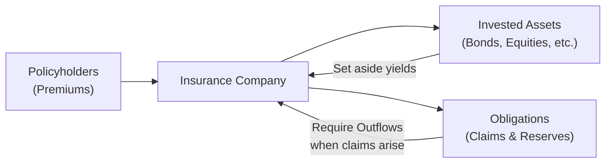

## Introduction

If you've ever wondered why evaluating a commercial bank feels so vastly different from analyzing a typical manufacturing company, you’re not alone. Financial institutions (FIs) operate under intricate regulatory regimes, employ specialized business models, and maintain unique balance sheet structures that require a specialized lens. So, let’s dig in. In this section, we’ll explore the defining characteristics and distinct accounting challenges of banks, insurance companies, and other financial institutions such as broker-dealers and finance companies. I remember the first time I analyzed a small community bank—honestly, I tried to use the same inventory, revenue, and operational metrics I would for, say, a consumer goods firm, and I quickly realized I was barking up the wrong tree.

## Distinct Structures and Business Models

One of the first things you notice when studying a financial institution is that it’s got a vastly different “engine” under the hood compared to a typical industrial or services firm. Instead of focusing on physical goods, production lines, or brand marketing, FIs revolve around financial products, interest rates, and risk management.

### Banks
Banks, especially commercial banks, predominantly generate income from lending—earning interest on loans while simultaneously paying interest (often at a lower rate) on deposits and other borrowed money. This means:
• The balance sheet is heavily skewed toward loans (assets) and deposits (liabilities).  
• Managing net interest margin (NIM) is paramount.  
• Risk management is deeply tied to credit risk, liquidity needs, and interest rate fluctuations.  

Here’s a simplified look at how the flows might operate:

Banks charge borrowers a higher rate on loans than they pay to depositors, capturing the spread as net interest income. But that doesn’t mean it’s smooth sailing. As soon as default rates creep up or market interest rates shift abruptly, profitability takes a hit. Regulatory bodies enforce capital adequacy standards like those in the Basel Accords to ensure banks maintain enough capital buffers against potential losses.

### Insurance Companies
Insurance companies take on a different kind of promise. In exchange for premiums, they commit to covering specific risks—life events, medical costs, natural disasters, or property damage, to name a few. Compared to banks, insurers:
• Accumulate assets mostly from policyholder premiums.  
• Invest in longer-term, often lower-volatility instruments (e.g., bonds, equities, real estate) to match future claim obligations.  
• Face underwriting risk: incorrect assumptions about claim frequency or magnitude can destabilize the entire earnings model.  

A real eye-opener for me was learning how insurance companies invest heavily in government and corporate bonds, aiming for stable returns that match the timeline of likely claims. This is a key example of asset-liability management (ALM). If you botch the ALM and your claims come due while your assets are locked into long-term illiquid instruments, well, you’ve got a problem.

### Other Financial Enterprises
A broad spectrum of other entities falls under “financial institutions,” each with a specialized revenue driver. These might include:
• Broker-dealers: Generating revenue primarily from commissions, trading spreads, and margin interest.  
• Asset management firms: Earning fees based on a percentage of assets under management (AUM), performance fees, and ancillary advisory services.  
• Finance companies (e.g., leasing and consumer finance): Profiting from leasing payments or interest income on consumer loans.

All these firms may not look like your neighborhood bank or insurance giant, but they deal with many of the same big-picture issues: credit risk, interest rate risk, and the ongoing need for compliance with evolving regulations.

## Risk Management at the Core

Risk management is the heartbeat of financial institutions. Let’s be honest: FIs can be a bit more fragile than non-financials because they leverage other people’s money (deposits, premiums, borrowed funds) in ways that can magnify both returns and risks.

### Major Risk Categories

• Credit Risk: For banks, it's primarily the possibility that you won’t get paid back on your loans. For asset managers, it might involve default risk on securities in client portfolios. For insurers, there’s the threat that counterparties in reinsurance contracts could fail.  
• Liquidity Risk: FIs must always ensure they have enough cash-like assets to meet depositor withdrawals or insurance claims. It’s that classic “run on the bank” scenario we’ve all read about.  
• Market Risk: Changes in interest rates, exchange rates, or asset prices. Banks balance their asset and liability maturities to minimize net interest exposure, while insurers focus on matching policy liabilities with appropriate durations in their investment portfolios.  
• Operational Risk: You know, the old “somebody typed in the wrong number,” or internal fraud, or systems meltdown. For big institutions, system or human errors can cause severe reputational harm and financial loss.  
• Underwriting Risk (Insurance): This is specific to insurers who must accurately price policies (e.g., life insurance, property & casualty) to ensure the premiums collected cover future claims plus a margin of profit.

## Regulatory Oversight and Capital Requirements

Financial institutions operate under a complex web of rules and regulations—often for good reason. If a manufacturer fails, it’s generally bad for the local community and employees, but if a major bank or insurer collapses, the ripple effect can destabilize entire economies. That’s why we have:

• Banking Capital Adequacy: Under the Basel Accords (Basel I, II, III, and beyond), banks are required to hold a minimum level of regulatory capital relative to their risk-weighted assets (RWAs). This ensures they can absorb unexpected losses.  
• Insurance Solvency: Insurance regulators (e.g., RBC in the US, Solvency II in the EU) mandate that insurance carriers hold sufficient capital to handle claims under severe scenarios. I remember looking at a regulatory stress test once—it basically asked what would happen if the insurer faced a 1-in-200-year catastrophe. Yikes.  
• Ongoing Supervisory Disclosures: Institutions publish Pillar 3 disclosures (for banks), 10-Ks in the US, and other regulatory filings that detail risk exposures, capital structures, and significant risk management frameworks.

## Key Performance Drivers and Ratio Analysis

Analysts typically rely on ratio analysis to distill volumes of financial data into a manageable set of indicators. Different types of FIs use different ratios, but some universal measures exist—like return on equity (ROE), efficiency ratios, and leverage ratios. However, each sector also has its own “go-to” metrics:

### Banking Ratios
• Net Interest Margin (NIM): (Interest Income – Interest Expense) / Earning Assets  
• Loan Loss Ratio: Loan Loss Provisions / Total Loans  
• Capital Adequacy: Tier 1 Capital Ratio (Tier 1 Capital / RWAs)

### Insurance Ratios
• Combined Ratio: Loss Ratio + Expense Ratio. A number below 100% usually indicates underwriting profitability.  
• Retention Ratio: The percentage of assumed risks not passed on through reinsurance.  
• Solvency Ratio: Regulatory capital as a percentage of some measure (e.g., RBC or Solvency II calculations).

### Broker-Dealers and Asset Management Firms
• Assets Under Management (AUM) Growth: Reflects net new money and market appreciation.  
• Fee Margin: Management fees / AUM or total operating income.  
• Trading Gains and Volatility Measures: For broker-dealers earning revenues from trading spreads.

## Disclosures and Annual Filings

You might find yourself drowned in thick annual reports, but here’s the good news: these can be goldmines of information if you know what to look for. For instance:

• Banks: The notes to the financial statements usually expand on loan quality, segment-wise loan distribution, off-balance-sheet exposures, and credit risk management. Pillar 3 disclosures dig deeper into capital adequacy and risk-weighting methodologies.  
• Insurers: They’ll provide details on underwriting performance by product line, claim reserve adequacy, and embedded assumptions in their reserves discounters.  
• Broker-Dealers and Asset Managers: Will highlight portfolio turnover rates, risk exposures from proprietary trading, fee structures, and custody arrangements.

## Incorporating Macroeconomic Indicators

Predicting a bank’s or insurer’s performance often means tracking broader economic indicators. Interest rates, GDP growth, and inflation matter a lot. If interest rates go up, banks might enjoy higher NIM—unless deposit rates rise faster. And for insurers, inflation can raise the cost of claims, especially in areas like health or casualty insurance.

I once worked with a small insurance firm that primarily wrote homeowners’ policies in an area prone to wildfires. Watching local economic growth was helpful, sure, but we also had to keep an eye on climate patterns, property valuations, and construction costs. That’s how specialized it can get.

## Practical Example: Asset-Liability Management

Let’s consider a miniature ALM scenario for an insurer:

• The insurer collects premiums from policyholders, invests the inflows in a diversified portfolio of bonds, equities, and short-term instruments.  
• Future claims are uncertain in timing and amount (underwriting risk).  
• If interest rates unexpectedly drop, the present value of claims might rise. Meanwhile, bond values typically increase when rates fall, somewhat offsetting the negative effect.  

The aim is to balance durations and cash flows to ensure sufficient liquidity and to minimize the mismatch between asset and liability values. Here’s a simplified diagram:

Effective ALM is crucial for preserving solvency and ensuring the insurer can pay claims without liquidating assets at inopportune times.

## Best Practices and Common Pitfalls

• Don’t ignore regulatory capital. FIs might seem flush with cash or assets, but if they don’t meet capital requirements, they could be forced to curtail growth or even face regulatory intervention.  
• Watch out for large, unusual transactions. Off-balance-sheet items, securitized assets, or reinsurance deals can obscure risk exposure.  
• Remember the cyclical nature of the business. Banks thrive in certain economic cycles, while insurers might get hammered by high claims in catastrophic event years.  
• Evaluate multiple risk categories in tandem. Credit risk can morph into liquidity risk if loan defaults balloon, forcing an institution to scramble for funds.

## Glossary

• Credit Risk: The possibility of a loss from a borrower or counterparty failing to repay.  
• Liquidity Risk: The risk of not being able to meet short-term cash needs without incurring unacceptable losses.  
• Underwriting Risk: For insurers, the danger that actual claims exceed premium income plus reserves.  
• Basel Accords: International banking regulations promoting adequate capital reserves in banks.  
• Solvency II: An EU set of regulations requiring insurers to hold sufficient capital to remain solvent in stress scenarios.  
• Combined Ratio: An insurance measure of underwriting profitability, calculated by adding the loss ratio and expense ratio.  
• Asset-Liability Management (ALM): Synchronizing maturities and cash flows of assets and liabilities to manage interest rate and liquidity risks.  
• Regulatory Capital: The minimum amount of capital banks and insurers must maintain as per regulatory standards (e.g., Basel III, RBC, or Solvency II).

## References and Further Reading

• Bank for International Settlements (BIS) – Basel Committee publications:  
  https://www.bis.org/bcbs/  

• International Association of Insurance Supervisors (IAIS):  
  https://www.iaisweb.org/  

• “Solvency II Directive” (European Commission):  
  https://ec.europa.eu/info/business-economy-euro/banking-and-finance/insurance-and-pensions_en  

• CFA Institute, “Financial Institutions – Analysis,” in the CFA® Program curriculum  

## Final Tips for the CFA Exam

• Focus on the unique nature of assets and liabilities for each FI. A bank’s loan portfolio is quite different from an insurer’s technical reserves.  
• Practice ratio calculations specific to the sector—particularly the combined ratio for insurers and capital adequacy ratios for banks.  
• Pay attention to the interplay between macro indicators and FI performance.  
• In exam vignettes, read footnotes thoroughly. For FIs, footnotes often clarify how the firm manages (or mismanages) risk.  

## Test Your Knowledge: Unique Aspects of Banks, Insurance, and Other FIs



### Which factor most distinctly differentiates a bank’s balance sheet from that of a traditional non-financial corporation?

- [ ] Presence of equity capital
- [ ] Involvement of intangible assets
- [x] Significant proportion of interest-bearing assets and liabilities
- [ ] Heavy reliance on intangible brand valuations

> **Explanation:** Banks operate primarily on loans, deposits, and other interest-bearing instruments. Their balance sheets are weighted toward interest-generating and interest-paying items.

### Which of the following best illustrates underwriting risk for insurance companies?

- [x] The possibility that actual claims significantly exceed premiums collected
- [ ] Changes in risk-free interest rates impacting bond valuations
- [ ] A borrower’s likelihood of default on loan payments
- [ ] Fluctuations in foreign exchange rates affecting asset values

> **Explanation:** Underwriting risk refers to the chance that insurers underprice policies or experience unexpectedly large claims, thereby incurring losses.

### What is a primary motivation behind the Basel Accords for banks?

- [x] Ensuring banks maintain sufficient capital to absorb unexpected losses
- [ ] Encouraging banks to take on more leverage for growth
- [ ] Reducing the competition in the banking sector
- [ ] Eliminating all forms of credit risk through state interventions

> **Explanation:** The Basel Accords set minimum capital requirements and other standards to promote stability and reduce the chance of systemic banking crises.

### Which ratio is commonly used to assess the underwriting profitability of a property & casualty insurer?

- [ ] Net Interest Margin
- [x] Combined Ratio
- [ ] Quick Ratio
- [ ] Return on Assets (ROA)

> **Explanation:** The combined ratio measures the sum of the loss ratio and expense ratio, indicating underwriting profitability or lack thereof.

### In analyzing broker-dealers, which of the following revenue components is likely most relevant?

- [x] Commissions and trading spreads
- [ ] Premium income from risk coverage
- [x] Asset management fees tied to AUM
- [ ] Rental income from investment properties

> **Explanation:** Broker-dealers typically earn revenue from commissions, margin interest, and trading spreads. Asset managers, on the other hand, center on percentage-based management fees.  

### A bank’s balance sheet is significantly exposed to interest rate risk. Which practice helps mitigate this exposure?

- [ ] Extending maturity mismatches between assets and liabilities
- [x] Aligning asset maturities with liability obligations (ALM)
- [ ] Relying solely on short-term interbank borrowing
- [ ] Eliminating all loans in favor of holding only cash

> **Explanation:** Asset-liability management (ALM) entails balancing the timeline and sensitivity of assets and liabilities to minimize interest rate risk.

### What do insurer disclosures often reveal that helps analysts evaluate reserve adequacy?

- [x] Loss reserve assumptions and methods
- [ ] Retail distribution networks
- [x] Expected loan default rates
- [ ] Management’s personal investment strategies

> **Explanation:** In insurance financial statements, disclosures detail how reserves for future claims are estimated, including assumptions about claim frequency and severity.

### When interest rates rise quickly, how might a commercial bank's net interest margin (NIM) be affected?

- [x] It could narrow if deposit rates increase faster than loan rates
- [ ] It will remain unaffected due to hedging
- [ ] It typically rises with no exceptions
- [ ] It becomes irrelevant for analysis

> **Explanation:** If banks hurry to raise deposit rates to remain competitive, their cost of funding may climb faster than they can reprice loans, narrowing the net interest margin.

### Which of the following typically characterizes insurance companies’ investment strategies?

- [x] Holding longer-duration, relatively stable instruments to match policy obligations
- [ ] Preferring only short-term treasury bills
- [ ] Emphasizing extremely high-risk speculative assets
- [ ] Keeping zero invested assets

> **Explanation:** Insurers generally invest in longer-duration bonds, equities, and other instruments to match the duration of their policy liabilities, minimizing mismatching risks.

### True or False: Asset management firms primarily generate revenue from underwriting premiums.

- [ ] True
- [x] False

> **Explanation:** Asset managers mainly earn fees based on assets under management or performance, not from underwriting insurance premiums.


