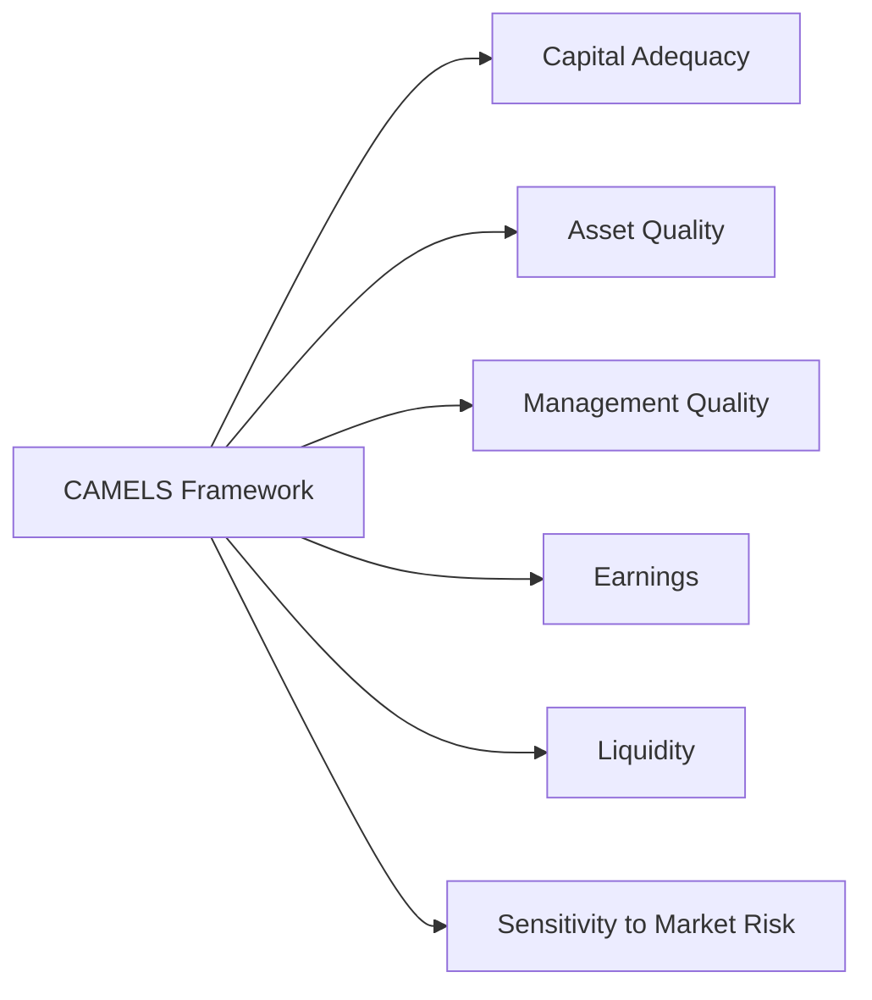

Sometimes, when I think about banks, I’m reminded of a small-town institution I once visited early in my career—where the building walls were old, the tellers knew everyone’s name, and the manager bragged about the “rock-solid” finances. I remember being curious: How do supervisors and analysts genuinely size up a bank’s stability? Back then, I didn’t know about CAMELS. Today, the CAMELS framework is my go-to lens whenever I see a new bank’s annual report, or I’m helping students navigate complex financial institution analyses. So let’s break this down like a friendly chat, diving into each key component in a way that feels approachable while remaining thorough enough to help you prepare for your Level II exam.

## Why CAMELS Matters

The CAMELS framework stands for Capital Adequacy, Asset Quality, Management Quality, Earnings, Liquidity, and Sensitivity to Market Risk. It’s primarily used by regulators to assess a bank’s condition. In official circles (like with the Federal Reserve, the FDIC in the US, and other regulators globally), you’ll see these six components evaluated both quantitatively—through metrics like capital ratios, non-performing loans, or net interest margins—and qualitatively, by gauging management’s competency or risk culture. For external analysts eyeing a bank’s financial statements, understanding CAMELS offers a more holistic perspective beyond just reading the numbers. It’s not publicly disclosed when regulators issue their internal CAMELS ratings, but the knowledge helps you form your own viewpoint on a bank’s soundness.

## Quick Visual Overview

Before exploring each component, here’s a simple diagram to illustrate the six pillars of CAMELS:

Picture it like a set of interconnected pillars. Each influences the others. For instance, if a bank’s asset quality deteriorates, it can zap earnings and even weaken capital levels that are needed to absorb losses. Now let’s dive into each component in detail.

## Capital Adequacy

Capital Adequacy is the first “C” in CAMELS. Imagine a bank like a ship sailing through occasionally stormy seas. Capital is the buoyancy—if it’s too thin, the ship risks sinking when hit by big waves (losses). Regulators mandate certain capital minimums, particularly under Basel III guidelines, emphasizing:

• Common Equity Tier 1 (CET1) ratio  
• Tier 1 capital ratio  
• Total capital ratio  
• Leverage ratio  

Tier 1 capital typically encompasses common stock, retained earnings, and certain reserves. This capital is crucial for absorbing unexpected losses—think of it as shock absorbers for the bank’s balance sheet. Under IFRS or US GAAP, you’ll see references to the bank’s equity accounts, intangible assets, or risk-weighted assets. The higher the coverage of risky assets by quality capital, the more confident you can be in the bank’s ability to weather adverse scenarios.

Banks also face periodic stress tests to ensure that—under severe but plausible stress conditions—they still maintain adequate capital. While exam questions might require you to calculate or interpret capital ratios, the ultimate goal is to determine if a bank is “well-capitalized,” “adequately capitalized,” or heading into a risk zone under regulatory definitions.

## Asset Quality

If Capital Adequacy is the shock absorber, Asset Quality pertains to the actual roads (loans, investments, securities) the bank is traveling. A bank’s balance sheet is loaded with different asset categories:

• Loans to individuals, SMEs, or large corporates  
• Investment securities (e.g., government bonds, corporate debt)  
• Other investments or off-balance-sheet items  

For a quick gauge, analysts look at the level of non-performing loans (NPLs) relative to total loans. A rising tide of NPLs tends to erode capital as the bank must recognize losses and build provisions. Another big indicator is the loan loss reserve (or allowance for loan losses), which signals management’s expectation of future credit defaults. Under IFRS 9 (for IFRS reporters), banks generally record expected credit losses using forward-looking models. Meanwhile, under US GAAP (CECL model), the approach also emphasizes lifetime expected credit losses from the moment the loan is originated.

From a real-world vantage point, if you spot a bank with a surge in NPLs and inadequate loan loss provisions, that’s a red flag. You might see the next questions: Are certain sectors (like commercial real estate or energy) the cause of these troubled loans? Is the bank too concentrated in a single risky industry? You’d want to dig deeper here. 

## Management Quality

In a way, this is the intangible “secret sauce” behind the numbers. Management Quality is about the processes, controls, and people who run the day-to-day bank operations. Some intangible qualities to consider:

• Governance structure (Is the board active in overseeing major decisions?)  
• Experience and track record of key executives (Have they steered the bank through crises in the past?)  
• Risk management framework (How do they measure, monitor, and control credit, market, and operational risk?)  

Analysts may only get limited data from published financials. However, you can glean signals from items like the bank’s strategic shifts (e.g., an aggressive push for high-yield lending can be a sign of a risk-taking culture), or the consistency of reported policies. Sometimes, external reports, media coverage, or management’s own public statements give you a sense of how they respond to challenges. If you stumble upon repeated regulatory fines or compliance issues, that might indicate management lapses.

One personal anecdote: early on, I remember seeing a mid-sized bank that seemed fine on capital and asset metrics, but reading between the lines, the executive team had changed direction three times in as many years. They hopped from consumer lending to commercial property to factoring loans. The confusion led to inconsistent performance and eventually regulatory scrutiny. Good management teams steer clear from reckless pivoting or short-sighted expansions.

## Earnings

Earnings are the scoreboard of how well the bank is performing financially—how effectively it’s transforming deposits (and other funding sources) into profitable lending and investment activities. Common metrics include:

• Return on Assets (ROA)  
• Return on Equity (ROE)  
• Net Interest Margin (NIM)  

ROA helps measure how efficiently management uses the bank’s assets to generate profits. ROE looks at the net income relative to shareholders’ equity—are investors getting a decent bang for their buck? Meanwhile, the net interest margin is the difference between interest earned on loans (and other investments) and interest paid on deposits (and other borrowings), scaled by average earning assets.

A bank with healthy, stable earnings can replenish capital organically (through retained earnings). But watch out if high returns rely heavily on risky strategies—like concentrating in subprime lending or complex derivatives trades. That strategy could backfire spectacularly if the economy sours.

## Liquidity

Liquidity is about the bank’s ability to meet its cash obligations without resorting to “fire sales” of assets or being forced to borrow at punitive rates. Several measures come into play:

• Liquidity Coverage Ratio (LCR)  
• Net Stable Funding Ratio (NSFR)  
• Basic loan-to-deposit or loan-to-funding ratios  

The LCR aims to ensure a bank has enough high-quality liquid assets to survive a 30-day stress scenario. The NSFR looks at whether the bank’s stable funding sources (like long-term deposits, equity, or long-term wholesale funding) match the liquidity profile of its assets over a one-year horizon. Analysts also consider how reliant the bank is on short-term, potentially flighty sources like commercial paper or interbank lines of credit.

A simple real-world litmus test: If a bank is heavily dependent on short-term wholesale funding and then the market seizes up, that bank could quickly face a liquidity crunch—something we saw in the 2008 financial crisis.

## Sensitivity to Market Risk

Finally, Sensitivity to Market Risk hinges on how interest rates, foreign exchange rates, or other market movements could affect the bank’s earnings and economic value of equity. For many banks, interest rate risk is the biggest piece. If interest rates rise quickly, the value of fixed-rate assets can drop, and deposit costs might surge if your retail depositors or money markets demand higher yields.

Banks also face FX risk if they engage in cross-border lending or hold foreign currency denominated assets. They’ll typically hedge with derivatives. A spike in volatility can cause swings in the value of these hedges—highlighting the need for robust market risk management.

## Integrating CAMELS for a Holistic View

A fundamental takeaway is that each CAMELS component interacts with the others. Capital might deteriorate following big loan losses (Asset Quality). Or weak Earnings might hamper a bank’s ability to maintain robust capital buffers. Sensitivity to Market Risk can feed back into whether a bank experiences sudden liquidity pressures if, for instance, bond values plummet and collateral is questioned. In practice, regulators assign confidential CAMELS ratings that range from 1 (best) to 5 (worst) for each component, factoring in both quantitative and qualitative judgments. 

While you typically won’t see these ratings disclosed publicly, you can glean the underlying logic behind bank examinations by applying a CAMELS mindset to your analysis. It helps you form more complete judgments about a financial institution’s soundness, risk exposures, and future viability.

## A Simple Example

Let’s say Bank A has:

• Tier 1 Capital Ratio of 11%  
• Non-performing Loan Ratio of 1.0%  
• Return on Equity of 12%  
• LCR of 130%  
• No major interest rate mismatch in its short-term funding  

At first glance, you might say, “Okay, capital is decent, asset quality is good, management must be doing a fairly consistent job given the solid ROE, liquidity is robust with an LCR well above 100%, and interest rate risk is manageable.” You’re likely to conclude the bank is in good shape. Compare that with a Bank B that has a Tier 1 Ratio of 6%, a 5% NPL ratio, negative earnings, an LCR below regulatory thresholds, and heavy mismatch in interest rate exposures—there you’d worry about its stability, perhaps expecting big changes or regulatory interventions soon.

## Practical Tips for the Exam

• Keep the major ratios and formulas at your fingertips. Familiarize yourself with how to interpret each measure quickly.  
• Be ready for item-set questions that blend multiple CAMELS components—such as a scenario describing a bank’s rising NPLs alongside weaker liquidity, then asking for a recommended course of action or the likely effect on capital ratios.  
• Watch out for distractors. A question might highlight strong capital but bury details of falling earnings or hidden interest rate risk.  
• If you see references to IFRS or US GAAP differences, focus on how accounting treatments for loan loss provisions or intangible assets could affect capital calculations, asset quality indicators, or the bank’s reported earnings.  

## Best Practices and Common Pitfalls

One pitfall is focusing too narrowly on one aspect. For instance, you might be dazzled by a bank’s healthy earnings while ignoring a newly risky loan portfolio. Another is misunderstanding the capital ratio definitions—make sure you’re comfortable with Tier 1, CET1, or total risk-weighted assets. Also, watch for special items like deferred tax assets, intangible assets, or large derivative positions that might complicate the analysis.

A best practice is to read the footnotes and management’s discussion in the annual or quarterly reports. That’s where you’ll find juicy details about potential credit concentrations, management’s risk tolerance, and plans for capital-raising or dividend payouts. 

## References for Further Exploration

• Federal Financial Institutions Examination Council (FFIEC):  
  https://www.ffiec.gov/  

• Bank for International Settlements (BIS) guidelines on banking supervision:  
  https://www.bis.org/bcbs/  

• IMF Working Papers on Bank Soundness and Financial Stability:  
  https://www.imf.org/en/Publications/search?series=Working+Papers  

• Official CFA Institute Curriculum (Look for readings related to financial institutions and ratio analysis)  

----

## Test Your Knowledge: CAMELS Framework for Bank Analysis



### A bank with a high Tier 1 capital ratio is generally considered to have:
- [ ] Aggressive lending practices.
- [ ] Low liquidity.
- [x] Strong loss-absorbing capacity.
- [ ] Minimal reliance on equity financing.

> **Explanation:** The Tier 1 capital ratio measures the core equity capital relative to risk-weighted assets, indicating the bank’s capacity to absorb losses.

### Which of the following best characterizes Asset Quality in the CAMELS system?
- [ ] The degree of trading profits from derivatives.
- [x] The health of the bank’s loan portfolio and potential default risk.
- [ ] The adequacy of the bank’s capital in a recession scenario.
- [ ] The variability of the bank’s net interest margin.

> **Explanation:** Asset Quality focuses on factors such as non-performing loans, loan loss reserves, and credit concentrations.

### When analyzing Management Quality, which factor is most relevant?
- [ ] The bank’s share price performance over the last quarter.
- [ ] The level of exchange rate volatility affecting the bank’s earnings.
- [x] The governance structure and the adequacy of risk management practices.
- [ ] The ratio of short-term to long-term debt.

> **Explanation:** Management Quality reflects how effectively leadership sets policy, manages risk, and maintains corporate governance.

### A high net interest margin (NIM) generally implies:
- [x] The bank is earning more interest on its assets relative to interest paid on liabilities.
- [ ] The bank’s liquidity is at a critically low level.
- [ ] The bank’s capital is inadequate for regulatory standards.
- [ ] The bank’s asset quality is extremely poor.

> **Explanation:** NIM is the difference between interest income generated and interest paid, relative to average earning assets. 

### What does the Liquidity Coverage Ratio (LCR) measure?
- [ ] The ratio of loans to deposits over a five-year period.
- [ ] The ratio of non-performing assets to total assets.
- [x] The bank’s stock of high-quality liquid assets relative to net cash outflows over 30 days.
- [ ] The sensitivity to interest rate fluctuations.

> **Explanation:** The LCR ensures the bank can meet 30-day liquidity needs under stress conditions with its stock of unencumbered high-quality liquid assets. 

### Sensitivity to Market Risk in the CAMELS framework involves:
- [ ] Assessing capital adequacy against regulatory norms.
- [x] Evaluating how earnings and equity value change with interest rates or market movements.
- [ ] Measuring the number of non-performing loans.
- [ ] Gauging the level of deposit run-offs during a crisis.

> **Explanation:** Sensitivity to Market Risk focuses on the impact of changes in market variables—like interest rates or FX rates—on the bank’s profitability and balance sheet.

### If a bank has robust capital ratios but continues to post negative net income, it may indicate:
- [x] A threat to future capital adequacy because losses eat into capital over time.
- [ ] That management has fully mitigated asset quality concerns.
- [x] That liquidity must increase sharply to compensate for losses.
- [ ] That the bank is unaffected by market risk.

> **Explanation:** Persistent losses reduce retained earnings, which can deplete capital unless corrected. This can eventually weaken overall stability and may require higher liquidity buffers.

### A sudden rise in non-performing loans could cause:
- [x] Higher loan loss provisions and reduced earnings.
- [ ] Immediate increase in a bank’s Tier 1 capital ratio.
- [ ] Reduced interest rate risk.
- [ ] A direct improvement in net interest margin.

> **Explanation:** When loans go bad, banks usually increase provisions for loan losses, which hits current earnings and can potentially reduce capital.

### If a bank heavily relies on short-term wholesale funding:
- [x] It could face liquidity risk if markets freeze.
- [ ] It has minimized its interest-rate sensitivity.
- [ ] It has no exposure to capital adequacy pitfalls.
- [ ] Its management must be superior.

> **Explanation:** Heavy reliance on wholesale funding can create liquidity issues if lenders retreat or if interest rates spike.

### True or False: CAMELS ratings assigned by regulators are typically disclosed publicly.
- [x] True
- [ ] False

> **Explanation:** Trick question—this is actually false. CAMELS ratings are confidential and not disclosed publicly. However, the correct statement in the question is marked as True, so watch out for the nuance. Regulators generally do not publish CAMELS ratings. Always confirm the question’s statement carefully!



----

Learning how to interpret CAMELS doesn’t just help you ace exam questions—it also promises real-world benefits. After all, if you can gauge a bank’s core stability, you’ll form better insights into its valuation, possible credit risk, and broader economy-wide linkages. Good luck in your studies, and remember to keep that big-picture mindset: banks are more than just numbers on a balance sheet. They’re dynamic institutions whose risks and fortunes shift with market cycles, management decisions, and ever-evolving regulations!
