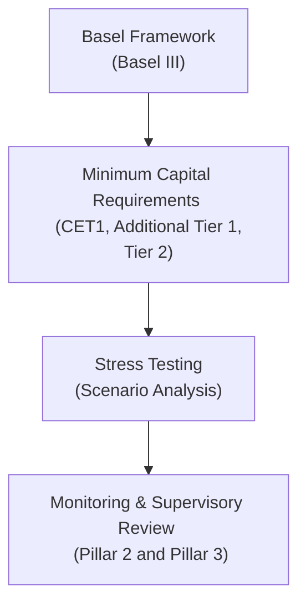

I still remember the first time I sat in on a regulatory review of a large bank’s capital position. I’d always heard about Tier 1 capital, risk-weighted assets, and complex-sounding buffer requirements, but watching the discussion unfold on the real numbers was a whole different experience. You could almost feel the tension as the swarms of accountants, analysts, and risk officers pored over spreadsheets, ensuring every percentage point of capital met the threshold. Anyway, the idea is that capital requirements keep our financial institutions from hitting rock bottom when times get rough. Let’s dig into how this all works.

## Why Capital Requirements Matter

Picture a bank or insurance company as a fortress. The fortress walls are the capital requirements—thick enough to protect from storms of losses but not so thick that they make the institution uncompetitive or overly cautious. Regulators around the world set these requirements to:

• Ensure depositor confidence in banks and policyholder confidence in insurers.  
• Mitigate systemic risk, so a single institution’s collapse doesn’t topple an entire economy.  
• Encourage prudent risk-taking rather than reckless lending or underwriting.

It’s basically a safety net (or fortress wall, if you will) that helps maintain trust in the financial system.

## Basel III: A Quick Recap

Basel III is an international agreement hammered out by the Basel Committee on Banking Supervision (BCBS). It builds on prior frameworks (Basel I, Basel II) and aims to create a more robust, shock-resistant banking sector. Even if you’ve never read the hundreds of pages of BCBS publications (and frankly, few of us have), you only really need to grasp the key pillars of Basel III:

### Common Equity Tier 1 (CET1)

• CET1 is basically the purest form of bank capital—common shares, retained earnings, and a bit of other highly loss-absorbent capital.  
• Basel III sets a minimum CET1 ratio of 4.5%. That’s the absolute baseline. But banks also have to stack additional buffers on top of that.

### Additional Tier 1 (AT1) and Tier 2

• Beyond CET1, there are other forms of capital: Additional Tier 1 (often in the form of certain perpetual instruments) and Tier 2 (subordinated debt or other capital that can absorb losses later down the line).  
• These lower-tier capitals come into play when the going gets really tough, but they’re still part of the overall capital adequacy picture.

### Capital Conservation Buffer and Countercyclical Buffer

• The capital conservation buffer (CCB) is an extra cushion on top of the minimum CET1. Regulators say something like, “Sure, you have 4.5% CET1, but we really want you to have, say, 2.5% more, just in case.”  
• The countercyclical buffer (CCyB) is added in boom times when credit growth is massive—regulators worry that if credit is expanding too fast, banks might be taking on excessive risk. So they bump the buffer to protect the system when the bubble eventually deflates.

### Risk-Weighted Assets (RWAs)

At the heart of Basel III is the notion of assigning different risk weights to different types of exposures. For instance, a loan to a very stable government might have a low risk weight. A subprime mortgage portfolio might have a high risk weight. The total risk-weighted assets number is the denominator in many capital ratios. The formula for, say, the CET1 ratio is:


\text{CET1 Ratio} = \frac{\text{Common Equity Tier 1 Capital}}{\text{Risk-Weighted Assets}}


Since RWAs drive the denominator, if a bank engages in riskier lending or invests in riskier securities, it must hold more capital.

## Insurance Firms and Solvency II

Banks aren’t the only ones with capital requirements. Insurance companies face their own set of rules—Solvency II in the European Union is a classic example. It seeks to ensure insurance firms stay solvent even during catastrophic events.

• The Solvency Capital Requirement (SCR) is calibrated so an insurer can survive a 1-in-200-year event—kind of like a once-in-a-lifetime (or once-in-many-lifetimes) tail event.  
• Firms evaluate underwriting risks, asset and investment risks, counterparty defaults, and operational vulnerabilities. Within the risk-based capital approach, each potential exposure is assigned a capital charge. If you recall, it’s almost like a parallel to risk-weighted assets for banks, except on the insurance side, it’s about quantifying underwriting risk (like hurricane claims) and other factors.  
• There’s also the Minimum Capital Requirement (MCR). If an insurer drops below that, the regulator typically steps in quickly.

In real-world practice, these requirements vary country by country. Some adopt Solvency II in full; others have their own frameworks. But the basic idea: insurers must hold enough cushion so that large-scale claims, market downturns, or changes in mortality rates won’t bankrupt them.

## Stress Testing: Simulation Under Pressure

Have you ever tried to see if you could run a marathon by sprinting up the stairs a couple of times? That might not be the best analogy, but stress testing is sort of like pushing your system to see how it would cope under extreme fatigue.

• Regulators (and banks themselves) run hypothetical scenarios—e.g., what if GDP falls by 5%, unemployment doubles, and real estate prices crash by 35%?  
• They plug those assumptions into their loan or underwriting portfolios, track how many defaults might occur, estimate losses, and see how their capital level holds up.  
• If under these stress scenarios, capital ratio projections drop below regulatory minimums, the institution might face restrictions (like limiting dividends or share buybacks) until capital is strengthened.

When talking about insurance stress tests, you might see scenarios involving natural disasters hitting multiple geographic locations, or severe drops in asset valuation that hamper the insurer’s investment portfolio.

Stress testing is not foolproof—a “black swan” event can be more severe than anything tested. But it’s still a vital mechanism to measure resilience in a (meta)controlled environment.

## Off-Balance-Sheet Exposures

One area that gets tricky is how to handle exposures not sitting plainly on a balance sheet. Banks might have derivative contracts, letters of credit, guarantees, or other contingent liabilities. In a benign environment, these might remain hypothetical and never convert into real losses. But in a downturn or crisis, they could balloon.

• Basel III tacks on extra calculations—like the leverage ratio—that tries to capture off-balance-sheet exposures in the denominator.  
• The leverage ratio is basically capital divided by the bank’s total exposures, including certain off-balance-sheet items. It’s meant to complement the risk-weighted ratio by saying, “You can’t get around capital requirements by classifying everything as zero risk-weight.”  
• For insurers, reinsurance treaties or contingent obligations can be big exposures. The solvency frameworks often require an assessment of these potential claims or liabilities as part of overall capital adequacy.

## Example: Tracking Capital Adequacy Ratios Through a Crisis

Let’s quickly sketch a simplified example. Suppose Grand Maple Bank starts a year with:

• CET1 capital of $100 million  
• Risk-weighted assets of $1,400 million (giving a CET1 ratio of 7.14%)  

If regulators require a CET1 minimum of 4.5% and a 2.5% conservation buffer, Grand Maple is at a comfortable 7.14%. Now imagine an economic downturn:

1. Some loans default, forcing the bank to record credit losses of $20 million. This directly hits retained earnings—so CET1 drops to $80 million.  
2. The bank lowers new lending but still sees expansions in risk-weighted assets (maybe from pre-committed lines of credit) to $1,500 million.  
3. The new CET1 ratio is \$80 million / \$1,500 million = 5.33%.  

They’re still above the 4.5% minimum but have begun tapping into their buffer. Shareholders may prefer the bank to raise capital or reduce RWAs to maintain a healthier ratio. That’s basically how dynamic capital management works in a downturn.

## Mermaid Diagram: Basel Capital Framework at a Glance

This simplified illustration shows how the Basel framework requires setting minimum capital requirements, subjecting them to stress tests, and then performing ongoing monitoring.

## Monitoring Solvency Over Time

For analysts—and for candidates taking the CFA exam—one of your key tasks is to keep an eye on trends in an institution’s capital ratios. A ratio that steadily diminishes across quarters or years can be a warning sign, especially if the institution can’t raise new capital fast enough or is heavily reliant on short-term funding. Maybe you’ve watched a few bank meltdown documentaries that taught you about what can happen if a bank tries to keep going with inadequate capital. It’s a real risk.

Insurance analysts do the same thing but with an eye on metrics like the Solvency Capital Requirement coverage ratio. If an insurer’s actual capital is, say, 150% of the SCR, that might look comfortable. But if it’s trending down toward 110%, that’s getting dicey.

## Practical Tips and Common Pitfalls

• Read the Notes: Don’t skip the footnotes or the “capital management” discussion in a financial institution’s annual report. You may find surprising items about contingent liabilities or derivative exposures.  
• Understand the Differences in Calculation: Not all jurisdictions adopt Basel III or Solvency II identically. Watch out for local variations, transitional arrangements, or internal model approaches.  
• Stress Test Results: Many large banks and insurers publish “stress test” results mandated by regulators. Observing how capital levels changed under severe scenarios can give you insight into how management views its own vulnerabilities.  
• Off-Balance-Sheet Surprises: Always ask, “Are there big lines of credit or derivative positions that might balloon the risk exposure?”  
• Economic Cycles: Capital ratios can look great when the economy is booming. The real test comes in a recession or after some major shock event.

## Subjective Reflection

I think there’s a certain calm that comes when you realize these capital frameworks exist. Sure, no framework is perfect, and crises can still slip through the cracks. But the existence of robust regulatory oversight—Basel frameworks for banks, Solvency II for insurers, and the routine stress tests—gives markets a level of predictability. Of course, as an analyst or an exam candidate, you can’t rely blindly on these; you’ve got to do your own critical analysis. But it sure helps to have these guidelines, right?

## References and Further Reading

• Basel Committee on Banking Supervision (BCBS), “Basel III” framework and discussion papers:  
  https://www.bis.org/bcbs/basel3.htm  

• European Commission’s overview on Solvency II:  
  https://ec.europa.eu/info/business-economy-euro/banking-and-finance/insurance-and-pensions/solvency-2_en  

• Office of the Superintendent of Financial Institutions (OSFI) Canada – Guidelines on Risk-Based Capital:  
  https://www.osfi-bsif.gc.ca  

• For a deeper dive into the design of risk weights, see the BCBS publications on “international convergence of capital measurement” and the more recent Basel IV proposals.  

• Consider local insurance regulatory websites (e.g., NAIC in the United States) for more details on capital adequacy for insurers not under Solvency II.

--------------------------------------------------------------------------------

## Test Your Knowledge: Regulatory Capital Requirements and Solvency Quiz



### In the Basel III framework, which form of capital is considered the highest quality and most loss-absorbent?
- [ ] Tier 2 capital
- [x] Common Equity Tier 1 (CET1) capital
- [ ] Additional Tier 1 (AT1) capital
- [ ] Convertible subordinated debt

> **Explanation:** CET1 comprises common shares and retained earnings. It’s the highest-quality capital under Basel III, serving as the first line of defense against losses.

### Which of the following statements best describes a countercyclical buffer in banking regulation?
- [ ] It is a buffer applicable only during a recession.
- [x] It is an additional capital buffer implemented during credit booms to protect against future downturns.
- [ ] It is the term for capital that remains constant regardless of economic conditions.
- [ ] It is an optional requirement that banks can choose to ignore.

> **Explanation:** The countercyclical buffer is meant to curb excessive lending or risk-taking during economic upswings, so banks have extra capital if a downturn hits.

### Under the Solvency II framework for insurers, the Solvency Capital Requirement (SCR) is designed to:
- [ ] Ensure insurers can never fail under any circumstances.
- [x] Cover losses arising from a “1 in 200-year” event.
- [ ] Mandate that insurers hold only CET1 capital.
- [ ] Include only operational risk, ignoring underwriting risk.

> **Explanation:** Solvency II’s SCR is calibrated to withstand extreme yet plausible scenarios, equating roughly to a 0.5% probability of insolvency in a one-year period (1 in 200).

### Which of the following statements about off-balance-sheet exposures is most accurate?
- [ ] They are always zero-risk for banks.
- [ ] Off-balance-sheet exposures are not considered in regulatory capital calculations.
- [x] They represent potential or contingent liabilities that can increase a bank’s total risk exposure.
- [ ] They only include unclaimed insurance policies.

> **Explanation:** Off-balance-sheet exposures like letters of credit, derivatives, and loan commitments can significantly inflate a bank’s risk profile if events trigger these exposures to become actual liabilities.

### Which capital ratio calculation typically includes risk-weighted assets in the denominator?
- [x] Common Equity Tier 1 ratio
- [ ] Leverage ratio
- [ ] Debt-to-equity ratio
- [ ] Times interest earned ratio

> **Explanation:** The CET1 ratio is calculated as (Common Equity Tier 1 Capital) / (Risk-Weighted Assets). The leverage ratio uses a broader measure of total exposures as the denominator.

### Stress testing in the context of financial institutions generally involves:
- [x] Modeling “what-if” scenarios of adverse economic conditions to see how capital levels hold up.
- [ ] Testing the bank’s IT infrastructure for data security threats.
- [ ] Calculating historical returns on equity.
- [ ] Determining the quality of the bank’s marketing strategy.

> **Explanation:** Stress testing simulates negative economic scenarios (like recessions or market crashes) to gauge how an institution’s capital and liquidity might be affected.

### Why might a bank’s capital ratio decrease during an economic downturn?
- [ ] Because the bank automatically repurchases its shares when market conditions weaken.
- [ ] Because regulators enforce stricter rules only during recessions.
- [x] Because loan defaults reduce retained earnings and possibly increase risk-weighted assets as credit quality deteriorates.
- [ ] Because deposit insurance premiums are reduced significantly in downturns.

> **Explanation:** In a downturn, defaults and credit losses erode equity (retained earnings), and risk weights might rise if the perceived risk of assets increases.

### What is the primary goal of imposing a capital conservation buffer on banks?
- [x] To ensure banks build up a cushion in good times that can be drawn upon in periods of stress.
- [ ] To punish banks for risky lending.
- [ ] To replace the minimum CET1 ratio altogether.
- [ ] To guarantee shareholder dividends.

> **Explanation:** The conservation buffer is meant to provide a buffer above the minimum CET1 requirement, ensuring banks can maintain critical operations and not breach the minimum in difficult times.

### In the insurance context, what might regulators scrutinize most closely when assessing solvency?
- [ ] Marketing expenses for new products.
- [ ] Only claims data from 20 years ago.
- [ ] The health and wellness programs offered to employees.
- [x] Aggregated exposures from underwriting, investment assets, and reinsurance treaties.

> **Explanation:** Solvency oversight focuses on the total risk exposure, including underwriting (such as potential claims), investments, and the extent of reinsurance coverage.

### True or False: Under Basel III, common equity, AT1, and Tier 2 capital all serve the same function and are interchangeable for meeting minimum requirements.
- [x] True
- [ ] False

> **Explanation:** Actually, this is a tricky statement. While they’re part of regulatory capital, they are not entirely interchangeable; CET1 is the highest quality, then AT1, then Tier 2. They have different loss absorption features and fulfill different roles in meeting the Basel III minimum requirements.  


