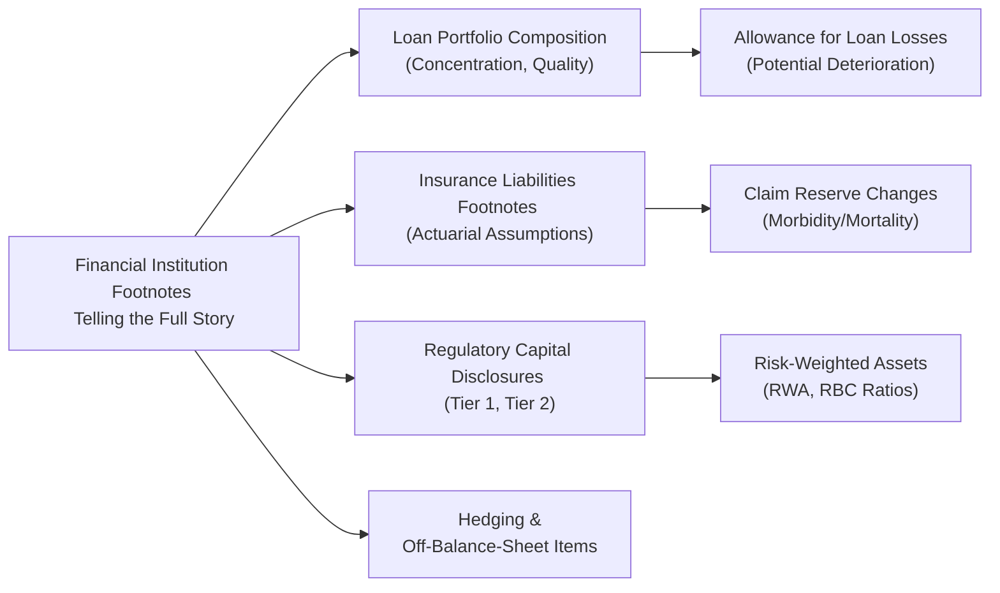

## Introduction
Reading footnotes for financial institutions (FIs) can sometimes feel like rummaging through that big, dusty attic—where you end up sneezing a lot but often stumble upon priceless family heirlooms. Um, okay, maybe not exactly like an attic. But in my opinion, footnotes are seriously where the real story is. If we take banks, insurance companies, or any specialized financial entity, the footnotes often contain crucial details that don’t appear in the main financial statements. They highlight changes in loan-loss allowances, reinsurance arrangements, solvency ratio adjustments, and so forth. And these details can make the difference between an “okay” analysis and a top-tier, exam-friendly, deep-dive analysis.

In the exam context, especially at Level II (and it will be similar at Level III, just saying), item-set or vignette-style questions frequently embed subtle, footnotes-based details that can alter your interpretation of an FI’s performance. This section delves into how you can systematically dissect footnotes from banks and insurance firms to identify hidden exposures, evaluate risk-based capital metrics, and link crucial details to those all-important ratios.

## Why Footnotes Matter for FIs
Financial institutions, whether we’re talking about commercial banks, insurance companies, or diversified financial conglomerates, face unique accounting challenges. Their bread and butter often revolve around intangible products like loans, policies, and risk transfers, so you’re less likely to see straightforward inventory or manufacturing cost footnotes. Instead, the real game is in areas like:

• Loan portfolio composition  
• Insurance liabilities and claim reserves  
• Off-balance-sheet exposures and derivatives  
• Regulatory capital measures and solvency requirements  
• Managerial assessments of macro risks  

A footnote might reveal that a bank is heavily exposed to subprime mortgages in a region experiencing an economic slump. Or you might find that an insurer has significantly revised its mortality rate assumptions, quietly increasing its liabilities in the next reporting period. Exam questions, in turn, will probe how these disclosures change your ratio analysis or risk assessment.

## Major Aspects to Watch in Footnotes

### Loan Portfolio Concentration and Quality
Banks often detail the mix of their loan portfolio in the notes, citing:
• Commercial real estate  
• Consumer credit  
• Subprime or near-prime loans  
• Industry-specific exposures  

A footnote might mention an increase in loan defaults in a particular segment. This data directly connects to the Allowance for Loan Losses (ALL). For instance, IFRS 9 requires banks to use expected credit loss (ECL) models—shifting from an incurred-loss approach under older GAAP. Any spike in ECL leads to higher provisions, thus reducing reported earnings and altering key capital ratios (like Tier 1 capital). If you see that these changes are material, that red flag might signal potential risk or forward-looking trouble.

### Insurance Liabilities and Policy Reserves
Insurance footnotes can be dense—trust me, I’ve spent hours trying to untangle them. But they’re so important because they explain:
• How reserves are calculated  
• Changes in actuarial assumptions around mortality (for life insurers) or morbidity (for health insurers)  
• Reinsurance arrangements  

If the footnotes mention an uptick in mortality rates based on new studies, the insurer’s claim liabilities might suddenly jump. That will shift RBC (Risk-Based Capital) ratios or even the combined ratio, if we’re talking property and casualty. So if you see a higher RBC ratio, it could mean more cushion, but that cushion might be based on assumptions that are about to be updated—footnotes can be your early warning sign.

### Off-Balance-Sheet Items, Derivatives, and Hedging
Oh, derivatives. The disclaimers in the footnotes can read like a legal novel. Footnotes generally describe the nature of these instruments, not just notional amounts but also net exposures, collateral requirements, and potential triggers. In a test scenario, they might say, “Bank XYZ employs interest rate swaps to hedge its mortgage portfolio.” But if you read deeper into the footnotes, you discover that some of those swaps are actually out of the money by a significant amount, or that the hedge is partial. That’s crucial for understanding liquidity and market risk.

### Regulatory Capital Disclosures
Banks follow Basel requirements (like Basel III or beyond), while insurers follow RBC frameworks in the US and Solvency II in the EU (with IFRS 17 for insurance contracts internationally). The footnotes will show you:
• Tier 1 vs. Tier 2 capital composition  
• Risk-Weighted Assets (RWAs)  
• Capital adequacy ratios (Tier 1, CAR, soon “Basel 4” changes, etc.)  
• For insurers, RBC ratio or Solvency II coverage ratio  

If new regulatory changes force an institution to hold more capital for specific risk exposures, you’ll see it in these disclosures. The exam might ask: “How does the shift in RWA for commercial real estate exposures affect the bank’s Tier 1 ratio?” Answering means referencing the footnotes.

### Management Commentary and Risk Factors
Some folks skip the “Management Discussion & Analysis (MD&A)”—big mistake. This section highlights strategic responses to changing regulations, market conditions, or ongoing lawsuits. The footnotes might reveal how those management concerns or future expansions into new product lines are recognized on the balance sheet, or not. This commentary is also a goldmine for forward-looking insights—helpful not just for the exam, but also for real-world analysis.

## Linking Footnotes to Ratios and Risk Metrics
A typical item-set might show a bank’s summary balance sheet, a short income statement, and then a couple of footnotes on loan composition or new off-balance-sheet exposures. The question might say: “Which ratio is most affected by the disclosures in Note 2?” Common ratios to watch include:

• Tier 1 capital ratio:  
  KaTeX snippet example:  
  
    \text{Tier 1 Ratio} = \frac{\text{Tier 1 Capital}}{\text{Risk-Weighted Assets}}
  

• Combined ratio for insurers:  
  
    \text{Combined Ratio} = \frac{\text{Claims Incurred} + \text{Expenses Incurred}}{\text{Net Premiums Earned}}
  

• RBC ratio for insurers:  
  
    \text{RBC Ratio} = \frac{\text{Total Adjusted Capital}}{\text{Authorized Control Level RBC}}
  

• Coverage ratios (e.g., interest coverage, claims coverage, short-term liquidity coverage for banks)  

Footnotes might say the bank reclassified some hold-to-maturity securities as available-for-sale. Under IFRS 9 or ASC 320 (US GAAP), that can shift how gains/losses flow through OCI or net income, changing measures of profitability or equity. In short, footnotes shape the context in which you interpret every ratio.

Below is a simple diagram illustrating how footnotes connect to major FI disclosures:

## A Banking Footnote Example
Imagine a mid-sized bank in Europe with a large commercial real estate portfolio. The footnotes reveal that 40% of its loans are centered in an overheated real estate market, with rising vacancy rates. Meanwhile, the allowance for loan losses has only inched up slightly from 1.2% to 1.3%. You see a note that the bank is using older appraisals for collateral. That’s a big heads up—maybe the bank is behind on adjusting property valuations, so future losses could be higher.

In an exam setting, you might get a question: “Based on the footnote disclosures, what is the most likely short-term effect on the bank’s capital ratios?” You’d reason that if the bank revalues collateral downward, it’ll need a bigger allowance for loan losses. That hits retained earnings, reducing Tier 1 capital. Bingo—that’s how footnotes feed into ratio changes.

## An Insurance Footnote Example
Now let’s turn to an insurance company focusing on life products. A footnote reveals new mortality tables or a spike in claims from certain policy cohorts. The RBC ratio—previously healthy—dips from 350% to 300% because the company revised its liabilities upward. Meanwhile, the MD&A indicates management is considering reinsurance treaties to mitigate further volatility. In an exam scenario, you might be asked which approach the insurer could adopt to reduce RBC volatility, or how reinsurance might improve short-term solvency measures. The correct answer is typically found by connecting the RBC ratio changes in the footnotes to the company’s stated management strategy.

## Pitfalls and Common Mistakes
• Ignoring Qualitative Disclosures: People often look only for numeric changes. But disclaimers about “further potential charges” or “increased regulatory scrutiny” are just as critical.  
• Misreading Changes in Estimates: If footnotes say the estimate for incurred-but-not-reported (IBNR) claims rose drastically, that’s a big sign of trouble.  
• Overreliance on Historical Data: Sometimes we’re lulled into continuity. A footnote about a new derivative position can drastically alter exposure, even if the historical data looks stable.  
• Confusing IFRS and US GAAP: Some footnotes might mention IFRS 9 and US GAAP ASC 326 (CECL approach) side-by-side. Watch those subtle differences.  

## Best Practices
1. Skim the whole footnote first, then circle back to the items that mention ratio effects (like changes in RBC or Tier 1).  
2. Identify any references to changes in accounting policy (like IFRS 9 reclassifications or updated US GAAP criteria). That’s often the source of exam questions.  
3. Check references to subsequent events: A footnote might say a large default occurred after year-end, giving you clues about the next period.  
4. Compare footnotes across periods: If last year’s footnotes said the bank was well-capitalized, but this year it lost a regulatory appeal, that could mean constraints on future lending capacity.  

## Conclusion
Getting comfortable with footnotes is a non-negotiable skill for analyzing financial institutions. Sure, it can be a bit tedious, but if you skip this part, you miss out on the mosaic of an FI’s real risk profile. Remember to connect these details to the financial statements and your ratio analysis. In an exam environment, you’ll likely find that the biggest “aha!” moments—like discovering why the Tier 1 ratio changed or why RBC dipped—are buried in the footnotes. So roll up your sleeves, get those reading glasses, and dive in.

## Mastering FI Footnote Analysis: 10 Practice Questions



### Which ratio is most commonly impacted by a significant increase in a bank’s Allowance for Loan Losses (ALL)?
- [x] Tier 1 capital ratio
- [ ] Combined ratio
- [ ] Policyholder surplus ratio
- [ ] Retention ratio

> **Explanation:** A bigger ALL reduces retained earnings (and thus equity), which lowers Tier 1 capital under Basel guidelines, directly impacting the Tier 1 ratio.

### In analyzing an insurance company’s footnotes, you see that management has changed the mortality assumptions to reflect a higher life expectancy. How might this change affect the insurer's financials?
- [x] Increase in policy reserves and a potential decrease in reported earnings
- [ ] Decrease in policy reserves and a potential increase in reported earnings
- [ ] No impact because mortality changes do not affect policy reserves
- [ ] Increase in underwriting losses but no change in RBC ratio

> **Explanation:** Higher life expectancy usually means the insurer must carry a larger reserve for future payments, squeezing short-term profits.

### A bank’s footnotes disclose it has entered a large notional amount of interest rate swaps as hedges against deposit rate risk. The swaps, however, are “out of the money” by a sizable margin. What should an analyst watch?
- [ ] A decrease in Tier 2 capital
- [x] Potential liquidity strains if collateral calls are triggered
- [ ] Reduced need for loan-loss provisions
- [ ] Lower consumer credit risk

> **Explanation:** When hedges go out of the money, the bank may need to post collateral or cash to cover margin calls, creating potential liquidity issues.

### In the exam context, if a vignette footnote reveals a correction of an insurance reserve estimation error from prior periods, which of the following is most likely to happen?
- [ ] Immediate increase in RBC ratio
- [x] Retroactive adjustment to retained earnings or equity
- [ ] Higher Tier 1 ratio
- [ ] Lower risk-weighted assets

> **Explanation:** A correction of a prior error generally flows through retained earnings in the current period, often reducing the opening balance and highlighting a more conservative financial position.

### When an FI’s management discussion and analysis section indicates a shift toward subprime auto loans, what additional footnote detail is most crucial to examine?
- [ ] Dividend policy changes
- [ ] Board compensation disclosures
- [ ] Marketing budgets
- [x] Loan loss provisioning practices

> **Explanation:** Subprime lending carries greater default risk, so footnotes on provisioning methods give insight into potential future losses.

### An insurer’s footnotes disclose a new reinsurance treaty transferring a large block of life policies. How could this deal affect reported solvency margins in the short term?
- [x] Likely increase solvency margins by reducing liabilities
- [ ] No impact on solvency margins
- [ ] Decrease in Tier 2 capital
- [ ] Trigger a need for more RBC

> **Explanation:** Reinsurance transfers risk to another entity, which often lowers the ceding company’s liabilities and can bolster solvency margins.

### The footnotes reveal that the bank recently switched from an “incurred loss” model to an “expected loss” model in line with IFRS 9. Which outcome is most probable?
- [x] Earlier and potentially higher recognition of credit losses
- [ ] Reduced volatility in reported earnings
- [ ] Delayed recognition of impairments
- [ ] Elimination of loan-loss reserves altogether

> **Explanation:** IFRS 9’s expected loss model requires earlier recognition of potential credit losses, often leading to higher provisioning compared to an incurred-loss approach.

### A property and casualty insurer lowered its combined ratio from 102% to 98% in the latest quarter. A footnote indicates the improvement was primarily due to favorable reserve development on prior-year claims. What’s a key risk to watch?
- [x] Potential for reserve releases to reverse if claims revert to normal
- [ ] Permanent increase in RBC ratio
- [ ] Immediate improvements in Tier 1 capital ratio
- [ ] Guaranteed future underwriting profitability

> **Explanation:** Reserve releases can be short-lived. If claims revert or old claims get reopened, the insurer may need to reestablish those reserves.

### Which element in footnotes best explains why a bank’s Tier 1 ratio suddenly declined from 14% to 11%?
- [ ] Decrease in net interest margin
- [ ] Higher customer deposits
- [x] Material increase in risk-weighted assets or a reduction in equity
- [ ] Merger with a smaller bank

> **Explanation:** The Tier 1 ratio can shrink if equity falls (e.g., from losses) or if RWAs surge, both typically disclosed in footnotes.

### True or False: Footnotes often disclose management’s forward-looking risk factors, which analysts can use to anticipate future capital or earnings volatility.
- [x] True
- [ ] False

> **Explanation:** Many footnotes include discussions about macroeconomic risks, regulatory changes, or strategic pivots that can significantly shape future performance.



## References and Further Reading
• NAIC, “Statutory Accounting Principles,” available at: https://content.naic.org/  
• Bank for International Settlements, “Basel III: The Liquidity Coverage Ratio and liquidity risk monitoring tools,” https://www.bis.org/  
• CFA Institute, “Guidance on Financial Statement Analysis for Financial Institutions,” official CFA® Program curriculum.  
• IFRS Foundation, “IFRS 9 Financial Instruments” and “IFRS 17 Insurance Contracts,” https://www.ifrs.org/  

Reading footnotes with a discerning eye can unlock hidden truths in an FI’s financials—both for exam success and for better-informed real-world investing and advisory decisions.
