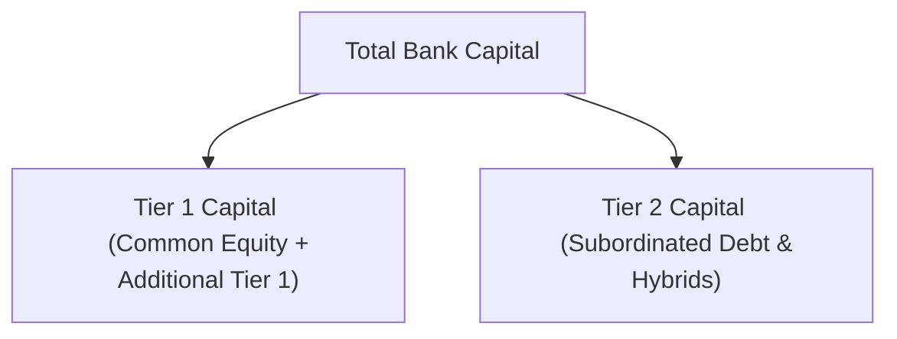

## Introduction
Have you ever looked at a bank’s financial statements and wondered: “How do regulators ensure these banks remain strong enough to withstand crises?” It’s kinda like checking that a friend, who always lends out money, actually has enough in their own wallet to manage rainy-day emergencies. The Basel Accords address exactly that by making sure banks hold enough high-quality capital to survive losses and remain solvent when the going gets tough.

But let’s take a step back: the Basel Accords aren’t just some bureaucratic rules. They’re comprehensive frameworks—Basel I, II, and III—that define how banks worldwide calculate their capital needs relative to risks they take on, such as lending to borrowers with different risk ratings or operating in volatile markets.

## The Basel Accords: A Quick Look Back
Before we get into the thicker details, let’s clarify: the Basel Committee on Banking Supervision (BCBS), housed at the Bank for International Settlements (BIS), created these accords. Their main mission? Standardize regulatory frameworks so banks around the globe operate on something near a level playing field—like an international code of conduct for capital adequacy.

• Basel I (1988): Established the concept of risk-weighted assets (RWA). Assets on the balance sheet received risk weights (0%, 20%, 50%, 100%, etc.) based on their perceived risk levels. Banks had to hold minimum total capital equal to 8% of their RWAs.  
• Basel II (2004): Introduced three pillars: Pillar 1 (minimum capital requirements), Pillar 2 (supervisory review), and Pillar 3 (market discipline through disclosures). Its risk weighting became more sophisticated, incorporating internal ratings-based (IRB) approaches.  
• Basel III (Post-2008 Crisis): After the financial crisis, regulators realized banks needed a bigger cushion of high-quality capital and better liquidity. Basel III raised the bar for what counts as top-tier capital, introduced leverage ratios, and established new liquidity measures like the Liquidity Coverage Ratio (LCR) and Net Stable Funding Ratio (NSFR).

In essence, Basel’s evolution has been about proactively spotting where banks might be vulnerable and installing guardrails to keep them safe.

## Tiered Capital: The Core of Capital Adequacy
At the heart of the Basel Accords lies the idea of “tiered capital.” Think of it like layers of protective gear on a medieval knight: you’ve got sturdy chain mail on the inside (Tier 1 Capital) and heavier, more rigid pieces on the outside (Tier 2 Capital). Each tier provides a different level of security for the bank and its depositors.

### Tier 1 Capital
Tier 1 Capital is the knight’s chain mail—the stuff that’s best at absorbing and withstanding hits. Formally, Tier 1 Capital is subdivided into:
• Common Equity Tier 1 (CET1): The absolute highest-quality capital that consists primarily of common stock, retained earnings, and sometimes other comprehensive income. Regulators want banks to maintain a solid chunk of CET1 because it can easily absorb losses without forcing the bank to stop operating.  
• Additional Tier 1 (AT1): Capital instruments like perpetual preferred shares or high-trigger convertible bonds. They’re still loss-absorbing, but not quite as pristine as CET1.  

Under Basel III, the minimum CET1 ratio is 4.5% of risk-weighted assets, and that might sound manageable until you realize there are also capital buffers on top, like the capital conservation buffer (2.5% of RWAs). This means, in practice, banks need to hold more than just 4.5% to be considered well-capitalized.

### Tier 2 Capital
Tier 2 Capital is sometimes referred to as “supplementary capital.” This layer can include subordinated debt, certain hybrid securities, and allowances for loan losses. Although Tier 2 instruments provide a cushion, they lack the same immediate loss-absorbing power that Tier 1 offers. Often, these instruments carry maturity dates or conditions that make them less readily available to absorb unexpected losses.

A practical example might be a subordinated bond that a bank issues. Because it’s subordinated, holders of the bond get paid only after senior creditors if the bank fails. This setup doesn’t provide the same protective “shock absorber” function that common equity does, which is why Tier 2 is placed one step behind Tier 1 in the capital hierarchy.

Below is a simple diagram to visualize how Tier 1 and Tier 2 sit within total capital:

## Basel III and New Emphasis on CET1
If you recall the global financial crisis of 2008, banks around the world faced dramatic losses, forcing governments to bail out many large institutions. Regulators realized the capital definitions in Basel II weren’t strict enough—banks were calling all sorts of stuff “capital,” but it wasn’t always quick to absorb losses.

Basel III aimed to fix this by:
• Requiring a larger portion of capital to be CET1, which has the highest loss-absorption capability.  
• Setting capital buffers: The Capital Conservation Buffer (CCB) is an extra 2.5% of RWAs on top of the CET1 minimum, intended to keep banks solvent during smaller downturns. The Countercyclical Buffer (CCyB) can be dialed up or down by regulators in response to macroeconomic conditions, ensuring banks hold more capital when systemic risk increases.  
• Introducing a Leverage Ratio as a simpler, non-risk-based measure to curb excessive leverage.  

So in practice, a bank must hold 4.5% CET1 as a baseline, plus a 2.5% capital conservation buffer, plus any countercyclical buffer that might apply in certain jurisdictions or economic expansions. The total can go beyond 7% (plus the CCyB if activated). Some banks, due to their systemic importance, face even higher surcharges.

## Risk-Weighted Assets (RWA): Where It All Comes Together
RWA is a fancy way of saying: not all assets carry the same risk, so let’s weight them to figure out how much capital is needed. A loan to a customer with impeccable credit might carry a lower risk weight than a loan to a highly speculative startup. Under the standardized approach (commonly used when banks don’t have advanced internal risk models or are smaller in size), these weights are set by regulators.

Under the internal ratings-based (IRB) approach, large banks can develop their own models—within regulatory guidelines—to determine risk weights for credit, market, and operational risk. This can get quite technical. For instance, a bank’s IRB model might say a portfolio of high-grade corporate loans has a risk weight of 20%, while lower-grade corporate loans might carry a risk weight of 100% or more.

Once the bank sums up all these risk-weighted assets, it multiplies the total by the required capital ratios to figure out how much Tier 1 and Tier 2 it needs to hold. For instance, if a bank’s total RWAs are $500 billion, and the required total capital ratio is 8%, the bank must hold at least $40 billion in total regulatory capital.

## Capital Buffers: Building Resilience in Good Times
One of the big lessons from past recessions was that banks should build capital buffers during profitable (good) times. This is like saving your bonus money so that if you lose your job, you don’t end up on the street next month. The Capital Conservation Buffer (CCB) requires banks to hold a 2.5% buffer of CET1 on top of their minimum ratio. If a bank doesn’t meet this buffer, it might face restrictions on dividends, share buybacks, and certain bonus payments.

The Countercyclical Buffer (CCyB) is a bit more flexible—it can range from 0% to 2.5% (and sometimes higher in certain jurisdictions). Regulators might activate (or raise) the CCyB during credit booms when systemic risk is high, ensuring banks accumulate extra capital. When the economy starts stagnating, or credit conditions tighten, regulators can shrink or switch off the buffer to maintain normal lending flow.

## Leverage Ratios: A Backstop to Risk-Weighting
While risk-weighting is well-intended, it can become complicated and sometimes less reliable if a bank’s internal models are too optimistic. Enter the Leverage Ratio: a simpler check that ensures banks can’t become overextended. The idea is to measure how much Tier 1 Capital the bank holds against its total leverage exposure (which includes on-balance-sheet assets and some off-balance-sheet exposures).

A higher leverage ratio means a bank is less reliant on borrowed funds. Basel III introduced a minimum leverage ratio (around 3%) for globally systemic banks, though national authorities can set higher thresholds.

## Liquidity Measures: LCR and NSFR
Capital adequacy won’t help if a bank can’t meet short-term cash calls. That’s why Basel III introduced two liquidity standards:

• Liquidity Coverage Ratio (LCR): Requires banks to hold a sufficient stock of high-quality liquid assets (HQLA)—like government bonds—to survive a 30-day stress event. The LCR is basically (HQLA)/(net cash outflows over 30 days) >= 100%.  
• Net Stable Funding Ratio (NSFR): Promotes more stable, long-term funding structures. It compares the bank’s available stable funding (ASF)—like long-term deposits—to its required stable funding (RSF)—the portion of assets that are longer term and less liquid.

If you think of the LCR as your short-term savings, the NSFR is your plan for ensuring you can cover longer-term obligations without constantly tapping unreliable or flighty funds.

## Pillar 3: Disclosures and Market Discipline
The best-laid regulatory ratios mean little if no one knows what’s actually happening behind the scenes. That’s where Pillar 3 kicks in. Banks must provide detailed disclosures about how they calculate their capital ratios, RWAs, and how they manage risks. Analysts can dig into these disclosures (often found in the bank’s regulatory filings or annual reports) to see how robust the bank’s capital base is.

In many exam scenarios, you’ll be given partial Pillar 3 disclosures—like a breakdown of the bank’s Tier 1 and Tier 2 instruments—and asked to compute capital ratios or interpret these findings under stress. Pay close attention to disclaimers or footnotes about retained earnings or intangible assets that might be deducted from CET1.

## Real-World Anecdotes and Practical Examples
I remember chatting with a friend at a major bank who said, “We were so proud of our capital ratio improvements. Then the new Basel rules came in and forced us to rethink our entire capital structure.” The bank had to issue more common stock and redeem certain Tier 2 instruments that no longer counted under Basel III. This is a classic example of how changes in these frameworks can impact a bank’s strategy, from equity issuance to dividend policies and share buybacks.

As soon as the new buffer requirements came online, management realized it wasn’t just about meeting yesterday’s rules but anticipating tomorrow’s. Indeed, the next wave of changes, sometimes called “Basel IV” informally, may tighten credit risk calculations and standardize them further, even under the IRB approaches.

## Exam Tips and Best Practices
• Read the Fine Print: In a vignette, watch for details on how the bank calculates RWAs or how it classifies capital instruments. A small footnote can drastically change the final capital ratio calculation.  
• Understand CET1 vs. Tier 1 vs. Tier 2: They’re not interchangeable. CET1 is the best measure of core strength. Tier 2 is supplementary.  
• Buffers: Don’t forget to add buffer requirements on top of the minimum ratio. A question might ask, “How much capital does Bank A need in total to be unrestricted in dividends?” If you only consider the minimum ratio, you might get it wrong.  
• Leverage Ratio as a Check: If you calculate a robust risk-weighted capital ratio, but the bank fails the leverage ratio test, it’s still in trouble.  
• Liquidity Matters: Don’t confuse capital adequacy with liquidity adequacy. They’re related but address different problems (long-term solvency vs. short-term obligations).  
• Pillar 3: Don’t skip disclosures. They often reveal crucial adjustments or upcoming changes that can affect your final calculations.

If you’re combining these analyses with ratio reviews (discussed in other sections of this chapter), keep in mind how capital adequacy might influence loan growth, profitability, and overall risk posture.

## References
- Bank for International Settlements: Basel III Documents – https://www.bis.org/bcbs/basel3.htm  
- “Basel IV: The Next Generation of Risk Weighted Assets” by KPMG  
- CFA Institute publications on capital adequacy and stress testing  
- Local Central Bank and Regulator Guidance on Basel Implementation  

## Test Your Knowledge: Basel Accords and Tiered Capital



### A bank calculates a Common Equity Tier 1 ratio of 5%. Which of the following is the most accurate conclusion under Basel III guidelines?
- [ ] The bank meets the standard for all Basel III capital requirements.
- [x] The bank meets its minimum CET1 requirement but may not satisfy buffers.
- [ ] The bank has insufficient capital to operate.
- [ ] The bank’s Tier 1 capital is automatically non-compliant due to Tier 2 shortfalls.

> **Explanation:** A 4.5% CET1 ratio meets the minimum regulatory requirement, but the bank also needs additional buffers, such as the 2.5% capital conservation buffer, to fully comply.

### Which of the following types of capital is classified as Tier 1 under Basel III?
- [x] Common equity and retained earnings
- [ ] Long-term subordinated debt
- [ ] Certain hybrid instruments with a set maturity
- [ ] Convertible senior notes maturing within one year

> **Explanation:** Tier 1 capital focuses on high-quality, loss-absorbing equity components such as common stock and retained earnings, plus certain Additional Tier 1 securities with no fixed maturity.

### How does the Leverage Ratio act as a backstop to risk-weighted asset calculations?
- [x] It measures Tier 1 Capital against total exposures, regardless of risk weights.
- [ ] It allows banks to apply their internal risk models freely.
- [ ] It excludes derivatives and off-balance-sheet exposures.
- [ ] It relies on subjective credit ratings without supervisory oversight.

> **Explanation:** The Leverage Ratio is a simple, non-risk-based measure ensuring banks don’t excessively leverage by comparing Tier 1 Capital to total exposures (on- and off-balance sheet).

### Under the standardized approach, how are risk weightings primarily determined?
- [ ] Through the bank’s internal risk modeling
- [ ] By using real-time market price fluctuations
- [x] Based on categories set by regulators
- [ ] Through the bank’s historical default data

> **Explanation:** The standardized approach uses regulator-defined buckets and risk weights rather than bank-specific internal data models.

### A bank must maintain an additional Countercyclical Buffer (CCyB) of 1.0%. If its RWAs total $300 billion, how much extra capital does it need specifically for the CCyB?
- [x] $3 billion
- [ ] $300 million
- [ ] $30 billion
- [ ] $60 million

> **Explanation:** The countercyclical buffer is calculated as 1.0% of RWAs. Therefore, 1.0% of $300 billion = $3 billion.

### Which statement best describes the purpose of liquidity coverage ratio (LCR)?
- [x] Ensuring banks have adequate high-quality liquid assets to cover 30-day net cash outflows
- [ ] Measuring the stability of employee retention rates during crises
- [ ] Capturing all credit and operational risks in one ratio
- [ ] Allocating capital across various departments in a bank

> **Explanation:** The LCR focuses on short-term liquidity adequacy, requiring banks to hold enough liquid assets to survive a 30-day stressed scenario.

### If a bank’s CET1 ratio is 6.5% and its total capital ratio is 9%, which statement is most likely true?
- [x] The bank meets the minimum CET1 requirement but may still be below the total buffer requirements.
- [ ] The bank fully meets all Basel III requirements without any additional capital needed.
- [x] The bank’s Tier 1 ratio is automatically above 6.5%.
- [ ] All Tier 2 capital counts toward CET1.

> **Explanation:** The 6.5% CET1 ratio is above the 4.5% minimum but may still not satisfy combined buffer requirements. Also, because CET1 is a part of Tier 1, the Tier 1 ratio cannot be below the CET1 figure, so the Tier 1 ratio must be at least 6.5%. Meanwhile, Tier 2 capital does not count toward CET1.

### Which of the following capital buffers is designed to encourage banks to build capital reserves during economic expansions?
- [ ] Capital Adequacy Ratio (CAR)
- [ ] Leverage Ratio
- [x] Countercyclical Buffer (CCyB)
- [ ] Minimum Tier 2 requirement

> **Explanation:** The CCyB is increased during economic upswings, requiring banks to build up more capital when credit growth is strong, so they can release it in downturns.

### A bank’s Additional Tier 1 (AT1) capital instruments generally have which characteristic?
- [x] They can convert to common equity or be written down in times of stress.
- [ ] They must be repaid before depositors in liquidation.
- [ ] They have a specified maturity date within five years.
- [ ] They are collateralized by the bank’s commercial loan portfolio.

> **Explanation:** AT1 instruments typically include perpetual bonds that can be converted to equity or written down when a bank’s capital falls below a certain threshold, providing loss-absorbing features.

### Under Basel III, the minimum total capital ratio to be maintained by a bank is:
- [x] 8% of risk-weighted assets, excluding capital buffers
- [ ] 5% of total assets
- [ ] 15% of level assets
- [ ] 12.5% on a leveraged basis only

> **Explanation:** The Basel III framework maintains an 8% total minimum capital requirement on risk-weighted assets (the same as in Basel I and II), upon which separate buffers apply.


