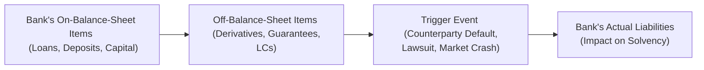

## Introduction

Sometimes when we think about a bank’s balance sheet, we see loans, deposits, and capital neatly laid out in black and white. However, banks often carry a host of potential obligations and exposures that don’t appear directly on that statement. These items can be just as significant—sometimes more so—than the on-balance-sheet figures. We call them off-balance-sheet (OBS) items.

For CFA Level II candidates, understanding OBS items is crucial for a fair assessment of a bank’s true risk profile. We’re talking about what happens when certain events occur—like a lawsuit settlement going against the bank or a counterparty defaulting on a transaction. “Contingent liabilities” can suddenly transform from a footnote to a direct and rather large expense on the bank’s primary financial statements. So, if you’ve ever wondered why a footnote about futures or a little blurb about credit guarantees might affect bank valuation, read on.

## What Are Off-Balance-Sheet Items?

Off-balance-sheet items remain outside the immediate columns of a bank’s balance sheet because they don’t meet the recognition criteria under accounting standards—yet they can still carry real economic risk. Examples include:

• Letters of credit: The bank might guarantee payment for a client under certain conditions.  
• Securitized assets: Certain asset-transfer structures (e.g., mortgages) might be designed to remove these loans from a bank’s balance sheet—unless they fail to meet derecognition criteria under IFRS or US GAAP.  
• Derivative contracts: Swaps, futures, and options can stay off the balance sheet in terms of nominal carrying amounts, but the associated gains, losses, and credit exposures are very real.  
• Guarantees: A bank might backstop a subsidiary or even a third party’s obligation, which can create an unexpected liability if triggered.

OBS items have historically been used by banks to shift risk or optimize regulatory capital. Whether that optimization is a wise move or a hidden hazard can be open to debate. In times of financial stress, these “hidden” exposures can come roaring into the limelight.

## Understanding Contingent Liabilities

Contingent liabilities fall under a broader umbrella: they’re potential liabilities that only materialize if a particular future event—often uncertain—actually happens. For instance, imagine a customer sues a bank over alleged contract violations, and the lawsuit demands a sizeable settlement. If the court rules against the bank, that liability becomes very real; if the bank wins the case, the liability disappears entirely. In the meantime, it’s a “maybe,” and so it often appears in the notes to the financial statements rather than in the statement of financial position itself.

### Disclosure vs. Recognition

Both IFRS and US GAAP require disclosure of material contingencies. However, recognition on the balance sheet often depends on the likelihood of the event’s occurrence:

• Probable and Estimable: If the event is both probable and the liability’s amount can be reliably estimated, you recognize it on the balance sheet.  
• Reasonably Possible: If it’s less than probable but still a reasonable possibility, you disclose it in the notes without recognition.  
• Remote: If the likelihood is remote, you typically need no recognition or disclosure (unless the amount is extraordinarily large).

As a CFA candidate, keep these distinctions in mind. Vignette-style questions often test your ability to spot a shifting probability of a contingency becoming a real liability, especially if new facts come to light.

## Key Examples of Off-Balance-Sheet Items

### Letters of Credit

A letter of credit (LC) is a bank’s guarantee to pay a seller on behalf of a buyer, contingent upon the fulfillment of certain criteria in a contract (often in international trade). The bank stands behind the buyer’s payment obligation. If the buyer fails to pay, the bank steps in. That means the bank has effectively taken on credit risk—exposure that sits in the footnotes until triggered. LCs can significantly impact a bank’s liquidity if a wave of them get called.

### Guarantees

Banks issue guarantees to customers, sometimes for project financing or other credit commitments. Although many of these guarantees never convert into actual liabilities, if circumstances force the bank to make good on them, the sums can be massive. 

### Derivative Contracts

Derivatives (futures, options, swaps) can be accounted for off-balance-sheet in terms of their notional amounts. Yet the fair values (gains/losses) or collateral pledges may be recognized depending on IFRS 9 or ASC 815 (in US GAAP). When these derivatives move into positive or negative territory, the bank might need to recognize associated receivables or payables—and that’s how you’ll see them show up on the balance sheet.

#### Credit Risk Equivalent (CRE)

A helpful concept for analyzing derivative exposures is the credit risk equivalent, which attempts to put derivative exposures on par with standard on-balance-sheet credit exposures. The idea is to multiply the notional amount by a credit conversion factor to arrive at the on-balance-sheet equivalent. In formula form:


\text{CRE} = \text{Notional Amount} \times \text{Conversion Factor}


The exact conversion factor depends on the type of derivative (interest rate swap, FX future, etc.) and the regulatory guidelines in place (e.g., Basel standards).

### Securitization

When a bank packs loans (such as mortgages) into a pool and sells them as securities, it may remove those loans from its balance sheet—assuming it meets stringent derecognition criteria found in IFRS 9 (or IFRS 7 for disclosures) and ASC 860 under US GAAP. If these criteria aren’t met (for instance, the bank still retains significant risk or control), the assets remain on the balance sheet. Whether an asset is truly off or still on can drastically affect the bank’s leverage ratios.

## Regulatory and Accounting Disclosures

As you might guess, regulators don’t like surprises—especially big ones lurking outside the official columns of the balance sheet. Over the years, Basel Accords (particularly Basel II and Basel III) have tightened capital rules and demanded more transparent reporting of these items. IFRS 7 and ASC 860 also mandate risk disclosures that outline the nature and extent of off-balance-sheet exposures.

### IFRS vs. US GAAP

Under IFRS, a bank must consider whether risks and rewards of ownership have effectively transferred to qualify for derecognition. Under US GAAP, transfer accounting has slightly different tests, focusing on whether a “true sale” has occurred and whether the transferor has given up control. Sometimes, what’s considered an off-balance-sheet item under one framework might still be recognized under the other.

### The Role of Fair Value Measurements

For derivatives specifically, IFRS 9 and ASC 815 require (mostly) fair value measurement, with changes in fair value recognized in profit or loss (or OCI, depending on hedge accounting designations). So, while a large swap portfolio might appear “off-balance-sheet” at a notional level, the actual fair value recognized in the financial statements can reveal significant exposures if that portfolio moves against the bank.

## How Off-Balance-Sheet Items Affect Ratios

Because off-balance-sheet commitments and contingencies do not initially appear on the face of the financial statements, they can cause:

• Understated Leverage: If assets or liabilities aren’t recognized, leverage and debt-to-equity ratios may look deceptively healthy.  
• Skewed Capital Adequacy: Minimum capital ratios might look fine until those off-balance-sheet items transform into actual liabilities.  
• Masked Liquidity Risk: A bank might appear flush, but unrecognized commitments could be triggered in a crisis, forcing the bank to put up cash or collateral.

Let’s look at a simple diagram to visualize how OBS items remain outside traditional statements yet can still affect the bank’s profile under stress:



In normal conditions, the bank’s primary exposure is reflected in its recognized assets and liabilities (A). However, if an external “trigger event” (C) occurs, the off-balance-sheet items (B) can quickly become recognized liabilities (D), altering the bank’s solvency picture.

## Practical Examples and Anecdotes

I recall working with a mid-sized bank just after the 2008 financial crisis. They had arranged credit guarantees for multiple corporate clients, none of which were expected to default—until a regional downturn hit. Suddenly, a few big-name clients drew on these guarantees, turning the bank’s quiet off-balance-sheet footnotes into a major recognized liability. Their reported capital ratio sank, and the bank had to scramble for additional funding. This shift taught me (and them) that carefully reading the footnotes isn’t just an academic exercise.

Off-balance-sheet items were also famously debated during the Enron scandal, where special purpose entities (SPEs) were used to keep certain liabilities hidden. Later revelations forced these items onto the balance sheet, crippling the company and shaking public trust.

## Strategies for Identifying Risks

• Scrutinize the Notes: Always look for expansions, disclaimers, or vague language describing letters of credit, third-party guarantees, or big lumps of derivatives.  
• Evaluate Notional vs. Real Exposure: Just because the notional value of a derivative is massive doesn’t necessarily mean the net fair value exposure is the same. Conversely, a small notional can still be loaded with risk if it’s a high-leverage derivative structure.  
• Monitor Regulatory Filings: Basel Pillar 3 disclosures, for instance, require banks to disclose more detail about capital adequacy and risk exposures, including off-balance-sheet items.  
• Consider Stress Scenarios: Think “what if” a large chunk of off-balance-sheet items were triggered simultaneously? Could the bank handle it without a government bailout?

## Common Pitfalls

• Overlooking Securitization: Failing to check if the bank truly transferred the assets under IFRS/US GAAP rules. Some “sales” might be little more than illusions if the bank still controls the assets.  
• Underestimating Derivatives: Not inspecting margin requirements and netting agreements can lead to a false sense of security about the bank’s net positions.  
• Confusing Probability Thresholds: A “reasonably possible” contingent liability might be ignored, but new developments could push it into “probable,” demanding recognition.  
• Misreading Capital Ratios: If you see a robust Tier 1 ratio, confirm whether it factors in off-balance-sheet exposures or only recognized items.

## Brief Python Snippet for Exposure Calculation

If you’re feeling like a coding whiz, you might (in a real-world scenario) load your bank’s OBS data into a quick Python script:

```python
derivatives = {
    'interest_rate_swap': {'notional': 1000000, 'conv_factor': 0.01},
    'fx_forward': {'notional': 500000, 'conv_factor': 0.03},
    'equity_option': {'notional': 250000, 'conv_factor': 0.08},
}

total_cre = 0

for derivative, info in derivatives.items():
    cre = info['notional'] * info['conv_factor']
    total_cre += cre
    print(f"{derivative} Exposure: {cre}")

print(f"Total Credit Risk Equivalent = {total_cre}")
```

Although extremely simplistic, it illustrates how you might combine the notional amount with a credit conversion factor. In real-life bank management, you would incorporate netting, correlation assumptions, and risk weightings set by regulatory guidance.

## Working Through a Vignette

Imagine an exam question describing a bank with:

• US$2 billion in letters of credit.  
• A pending lawsuit with an estimated US$50 million settlement probable, though not yet recognized.  
• Securitized mortgage assets worth US$500 million where the bank retains a residual interest, raising doubts about derecognition.

The question might ask you to assess how these off-balance-sheet items change the leverage ratio if they were to be recognized. You’d have to parse the disclosures, determine that the lawsuit is probable and estimate the recognized amount, and see if the securitization meets the relevant IFRS/US GAAP tests. Then you’d recast the financial statements or do a ratio analysis. This is precisely the type of scenario you’ll see in Level II item sets—where footnote reading is a critical skill.

## Conclusion

Off-balance-sheet items, especially contingent liabilities, can make or break a bank in tough times. From letters of credit to massive derivative books, these exposures demand careful scrutiny. The big takeaway: never assume a bank’s risk is limited to its main balance sheet. As a future financial analyst—or as a conscientious investor—you want to examine the footnotes, check the regulatory disclosures, and keep a watchful eye on how these items might spring to life under adverse conditions.

---

## References and Suggested Readings

• IFRS 7 – Financial Instruments: Disclosures:  
  https://www.ifrs.org

• FASB ASC 860 – Transfers and Servicing (US GAAP):  
  https://asc.fasb.org/

• Bank for International Settlements (BIS) – “Supervisory Framework for Measuring and Controlling Large Exposures.”  
  https://www.bis.org

• CFA Institute Level II Curriculum Readings on Financial Reporting and Analysis  
  https://www.cfainstitute.org

---

## Test Your Knowledge: Off-Balance-Sheet Exposures and Contingent Liabilities Quiz



### Which of the following best describes an off-balance-sheet item for a bank?

- [ ] A liability already recognized on the statement of financial position.
- [x] A potential obligation or exposure that does not currently appear on the balance sheet.
- [ ] A cash-equivalent item disclosed as part of shareholders’ equity.
- [ ] An intangible asset routinely capitalized on the balance sheet.

> **Explanation:** Off-balance-sheet items are exposures or commitments not reported as recognized assets or liabilities, such as certain guarantees or letters of credit.

### Under IFRS, which criterion generally must be met before a financial asset can be derecognized?

- [ ] The transferring bank must still retain full control of the asset.
- [ ] The asset must only be partially funded.
- [x] The risks and rewards of ownership have substantially transferred from the bank.
- [ ] The asset must be pledged as collateral.

> **Explanation:** IFRS derecognition rules focus on whether the bank has transferred substantially all the risks and rewards of ownership. If the bank retains significant risk, the asset remains on the balance sheet.

### A bank’s letter of credit is best described as which of the following?

- [x] A guarantee of payment to a third party on behalf of a bank customer.
- [ ] A short-term investment in an insurance contract.
- [ ] A derivative that offsets the bank’s foreign currency risk.
- [ ] A negotiable instrument for immediate settlement.

> **Explanation:** A letter of credit is a contingent obligation where the bank promises payment if its customer fails to fulfill a specified transaction.

### Which of the following statements about contingent liabilities is correct?

- [x] They are recognized on the balance sheet only if the event is probable and the amount can be measured reliably.
- [ ] They are always recognized on the balance sheet, regardless of likelihood.
- [ ] They do not need to be disclosed if the event is considered possible.
- [ ] They are only recognized once the uncertain event has occurred.

> **Explanation:** Both IFRS and US GAAP generally require recognition of a contingent liability when it is probable and the amount can be estimated reliably.

### Under standard Basel regulatory guidance, the Credit Risk Equivalent (CRE) of a derivative is computed by:

- [x] Multiplying the notional amount by a conversion factor.
- [ ] Adding up all future cash flows that the derivative could generate.
- [x] Offsetting the notional amount against recognized liabilities.
- [ ] Only including the derivative’s fair value in the calculation.

> **Explanation:** Regulators often use a conversion factor to translate notional amounts into credit risk equivalents. Netting or collateral might reduce this amount in practice.

### What is the main reason off-balance-sheet items can skew leverage ratios?

- [ ] They tend to be small and thus of minimal concern.
- [x] They represent hidden exposures that do not appear in the formal leverage calculations until triggered.
- [ ] They cannot be reclassified to on-balance-sheet items under any circumstances.
- [ ] They only change asset quality ratios but never capital ratios.

> **Explanation:** Off-balance-sheet exposures can inflate a bank’s real risk profile, making their leverage ratio appear more favorable than it truly is until the items become recognized liabilities.

### Which of the following is a common pitfall when analyzing off-balance-sheet items?

- [ ] Confirming the bank has transferred risks and rewards.
- [x] Ignoring or underestimating the probability of contingent liabilities.
- [x] Reviewing all derivatives on the balance sheet.
- [ ] Reconciling the notional amounts of derivatives to conversion factors.

> **Explanation:** A frequent mistake is to disregard contingent liabilities because they seem far-fetched. In stressful situations, these contingencies can quickly become actual liabilities.

### In the event a significant off-balance-sheet guarantee is triggered by a default:

- [x] The bank’s liabilities can suddenly increase, affecting capital and solvency.
- [ ] The bank’s leverage ratio remains unchanged because it’s an off-balance-sheet item.
- [ ] The guarantee is automatically renewed by the regulator.
- [ ] The bank only records an intangible asset for the future claim.

> **Explanation:** When a guarantee is enforced, the bank must pay the exposure amount, increasing its recognized liabilities and potentially straining its capital.

### Which of the following best describes the role of IFRS 7 for banks with off-balance-sheet items?

- [ ] It deals solely with revenue recognition from off-balance-sheet transactions.
- [ ] It only addresses intangible asset disclosures.
- [ ] It requires the immediate recognition of all off-balance-sheet items.
- [x] It mandates disclosure of the nature and extent of risks arising from financial instruments.

> **Explanation:** IFRS 7 focuses on disclosures, requiring entities to inform users of the nature and extent of risks (credit, liquidity, market) from financial instruments, including those off-balance-sheet.

### A contingent liability is considered probable if:

- [x] The future event is likely to occur based on available evidence.
- [ ] No reliable estimate can be made of the liability’s amount.
- [ ] The event cannot occur within the next year.
- [ ] It is part of an asset revaluation.

> **Explanation:** “Probable” typically means more likely than not (often interpreted as at least 50% likely), and it is a key threshold for recognition decisions.


