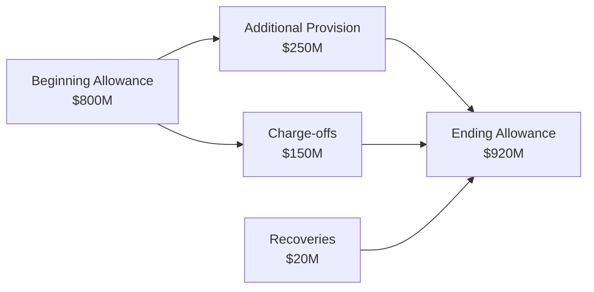

## Introduction

So, you’ve probably spent countless hours crunching numbers for nonbank institutions. Then suddenly you come across a bank’s financial statements, and, let’s be honest, it feels like stepping into a slightly different universe. The key metrics, the footnotes, the off-balance-sheet items—everything can be a bit intimidating. I remember the first time I saw the intricacies of a Tier 1 capital ratio. I was like, “Um, what? Where exactly do I plug these numbers in?” That confusion is normal, and that’s why we’re here.

This section presents a practice vignette designed to help you apply essential bank analysis concepts. We’ll walk through a hypothetical bank’s partial statements, focusing on interest income, loan loss provisioning, regulatory capital adequacy, and off-balance-sheet commitments. And we’ll add a dash of informality to lighten up the mood—because rigor doesn’t have to be boring, right?

## The Redwood Bank Vignette

Imagine Redwood Bank, a mid-sized institution operating in multiple regions. Over the past year, Redwood Bank has undergone substantial growth in its loan portfolios, especially in commercial lending. Recent developments include higher than usual non-performing assets (NPAs) in small business loans, prompting additional provisioning under IFRS 9 or Current Expected Credit Loss (CECL) methodology—depending on the local requirements, Redwood must comply with one or the other. This difference in provisioning frameworks can affect the bank’s reported earnings and capital ratios.

Below is a simplified snapshot of Redwood Bank’s disclosures (all figures in millions of dollars unless stated otherwise):

• Interest Income (per year):  
  – Loans to Customers: $2,100  
  – Investment Securities: $300  
  – Other Interest-Earning Assets: $100  

• Interest Expense (per year):  
  – Deposits: $800  
  – Other Borrowings: $200  

• Non-Interest Income: $600  

• Total Loans and Advances (gross): $60,000  
• Allowance for Loan Losses (beginning period): $800  
• Charge-offs during the period: $150  
• Recoveries: $20  
• Additional Provisions: $250  

• Risk-Weighted Assets (RWA): $45,000  

• Common Equity Tier 1 (CET1) Capital: $4,100  
• Tier 1 Capital (includes CET1 + Additional Tier 1 instruments): $5,000  
• Total Capital (Tier 1 + Tier 2 instruments): $6,000  

• Non-Performing Assets (NPA): $1,200  

• Off-Balance-Sheet (OBS) items—Notional amounts:  
  – Standby Letters of Credit: $700  
  – Interest Rate Swaps (notional): $2,000  
  – Foreign Exchange Forwards (notional): $1,000  

In the footnotes, Redwood Bank explains that they’ve updated their provisioning approach due to economic uncertainty. They also hint that a “worst-case scenario” might require an additional $100 million in provisions if economic conditions deteriorate. This scenario is Redwood’s attempt at a stress test, anticipating possible future losses (particularly in commercial real estate).

## Footnotes and Provisioning Details

### IFRS 9 vs. CECL in Brief
Under IFRS 9, Redwood Bank calculates Expected Credit Losses (ECL) based on a three-stage approach—Stage 1 being performing loans, Stage 2 being underperforming but not credit-impaired, and Stage 3 being credit-impaired (default). In each stage, the bank measures ECL differently (12-month ECL for Stage 1, lifetime ECL for Stages 2 and 3).

Under CECL (applicable in the United States), Redwood Bank would report a lifetime expected credit loss from the moment the loan is originated. This can result in larger initial provisions if the portfolio is substantial or particularly high-risk. The footnotes reveal Redwood Bank’s approximate ECL is in line with IFRS 9 requirements in its primary jurisdiction, but it also discloses how the CECL measure might compare—often a bit higher if the portfolio is trending riskier.

### Calculating Loan Loss Provision
Suppose Redwood Bank started the year with a $800 million allowance for loan losses. During the year, they charged off $150 million in uncollectible loans and recovered $20 million from loans previously written off. If Redwood Bank recognized additional provisions of $250 million, we can piece together the closing allowance:

Allowance for Loan Losses (end of year)  
= Beginning Allowance + Additional Provision – Charge-offs + Recoveries  
= $800 + $250 – $150 + $20  
= $920 million  

The bank expects that this amount might increase if macroeconomic conditions worsen, particularly in commercial real estate. Under IFRS 9, Redwood Bank might move larger chunks of the loan portfolio from Stage 1 to Stage 2, driving a jump in lifetime ECL rather quickly. Under CECL, Redwood might have already taken a more front-loaded approach, meaning the immediate jump would be less dramatic—but still material if the worst-case scenario unfolds.

### Visualizing Provision Movement

## Capital Adequacy Ratios: CET1, Tier 1, and Total

It’s quite common for exam vignettes to show you the capital values and risk-weighted assets (RWA) separately, so you can compute or confirm the capital ratios yourself. Redwood Bank’s situation:

• CET1 Capital: $4,100  
• Tier 1 Capital: $5,000  
• Total Capital: $6,000  
• RWA: $45,000  

### CET1 Ratio
Common Equity Tier 1 Ratio = CET1 / RWA = $4,100 / $45,000 = 9.1%  

### Tier 1 Ratio
Tier 1 Ratio = Tier 1 Capital / RWA = $5,000 / $45,000 = 11.1%  

### Total Capital Ratio
Total Capital Ratio = Total Capital / RWA = $6,000 / $45,000 = 13.3%  

In many jurisdictions, minimum regulatory requirements for CET1 ratio hover around 4.5% to 7% plus various buffers, while the total capital ratio might need to exceed around 10.5% once buffers (like capital conservation buffers) are included. Redwood’s 9.1% CET1 suggests it’s above minimum requirements but not necessarily by a huge margin if the environment is volatile. This is where the stress scenario matters. If Redwood’s capital were to be eroded by, say, higher loan losses, it might push these ratios close to or below recommended thresholds.

## Off-Balance-Sheet (OBS) Exposures

Banks typically have instruments that don’t show up directly on the balance sheet—think letters of credit, guarantees, or derivative transactions. Redwood Bank discloses:

• Standby Letters of Credit, notional: $700 million  
• Interest Rate Swaps, notional: $2,000 million  
• FX Forwards, notional: $1,000 million  

For Redwood Bank, the first question is: how do these OBS items affect risk? Under Basel III, certain OBS exposures are converted to credit equivalent amounts via “credit conversion factors.” For instance, standby letters of credit might have a 50% or 100% conversion factor, depending on the terms. Derivatives are more complicated: Redwood would consider the replacement cost plus an add-on factor for potential future exposure. Ultimately, these values could increase Redwood’s RWA and thus decrease Redwood’s capital ratios if the exposures are meaningful enough.

Some candidates ask, “Why do I even care? These are just notional amounts, so no real money changes hands at inception.” Well, that’s exactly how I felt early in my career—until I realized those notional exposures can suddenly become quite real when the reference entity defaults or when a derivative contract shifts massively out of the money. It’s a classic example of risk that’s easy to overlook if you focus solely on the on-balance-sheet assets and liabilities.

## Net Interest Margin and Loan Loss Coverage Ratio

### Net Interest Margin (NIM)
Net Interest Margin is a bread-and-butter ratio for analyzing a bank’s core profitability. It’s essentially (Net Interest Income) / (Average Interest-Earning Assets). Redwood Bank’s net interest income is:

Net Interest Income = (Interest Income) – (Interest Expense)  
= ($2,100 + $300 + $100) – ($800 + $200)  
= $2,500 – $1,000 = $1,500  

Let’s say Redwood Bank’s average interest-earning assets during the period were $75,000 million. Then:

NIM = $1,500 / $75,000 = 2.0%  

Even a tiny shift in NIM can have a big impact on a bank’s bottom line. If Redwood Bank’s cost of funds increases faster than the yield on its loans—like in a rapidly rising interest rate environment—NIM could shrink and hamper profitability.

### Loan Loss Coverage Ratio
We often measure how well a bank’s allowance for loan losses covers its non-performing assets. A simple coverage ratio is:

Coverage Ratio = Allowance for Loan Losses / Non-Performing Assets  
= $920 / $1,200 = ~76.7%  

A coverage below 100% might indicate the bank does not have enough reserves to cover problem assets if things go south. On the other hand, coverage doesn’t need to be 200% or more to be considered “safe.” It all depends on the composition of those NPAs, the collateral, and local regulatory norms.

## Analyzing Redwood Bank’s Stress Scenario

Now, Redwood Bank’s footnotes mention a hypothetical adverse economic scenario requiring an additional $100 million in provisions. So we ask ourselves: how does that affect Redwood’s capital position?

• Additional $100 million in provisions would reduce Redwood Bank’s pre-tax income.  
• That might reduce Tier 1 capital if it flows through retained earnings.  

If Redwood’s Tier 1 Capital decreases by $100 million, from $5,000 million to $4,900 million, and RWA remains $45,000 million, the new Tier 1 ratio is about 10.9% (4,900 / 45,000). Similarly, CET1 may shrink, though the exact amount depends on how the shortfall is recognized (CET1 might drop from $4,100 to $4,000, or some variation thereof).

It may not sound like a gigantic change, but bank capital requirements can be tight. If Redwood Bank’s CET1 ratio creeps closer to a regulatory minimum, that means less buffer for further surprises. And exam questions love to see if you’ll pick up on that subtlety. This might also prompt Redwood Bank to slow lending in higher-risk sectors to preserve capital.

## Putting It All Together: Risk and Profitability

When analyzing Redwood Bank:

1. Start with Net Interest Margin: Redwood’s 2.0% NIM suggests moderate profitability from core lending.  
2. Look at Provisions and Coverage: Redwood’s coverage ratio of ~76.7% might be adequate but could pose concern if NPA levels escalate quickly.  
3. Capital Ratios: Redwood’s CET1 ratio is 9.1%, comfortably above some minimum thresholds but still vulnerable to a noticeable downturn.  
4. Off-Balance-Sheet Exposures: The $3.7 billion notional might significantly increase Redwood’s RWA once conversion factors are applied. This includes derivatives that can become a real liability if market conditions move adversely.  

Ultimately, Redwood’s management might have to weigh new lending opportunities against preserving capital buffers—especially with the threat of rising charge-offs in a weak economic environment.

## Approaching CFA Item-Set Questions

When you see a bank-related vignette on the CFA exam, remember to:  
• Skim the financial statements quickly, highlighting interest income, interest expense, and net interest margin.  
• Check footnotes for IFRS 9 or CECL details, especially how provisions are recognized.  
• Look for capital adequacy data—CET1, Tier 1, and total capital—and watch out for the dreaded stress scenario that can reduce these ratios.  
• Scan for references to off-balance-sheet items like letters of credit, derivatives, or operating leases. These may become relevant for RWA adjustments.  
• Identify non-performing assets and any coverage ratio. A mismatch between high NPAs and low coverage is a red flag.  

And keep your eyes peeled for how everything interconnects: an increase in provisions affects the allowance, which reduces net income, which lowers retained earnings, which can ding your CET1 capital, which can bring your ratio below regulatory requirements if you’re already tight. It’s all one big puzzle.

## Common Pitfalls and Best Practices

• Ignoring Off-Balance-Sheet: Don’t forget that OBS exposures could severely alter the RWA and capital ratios.  
• Underestimating Provision Impact: The timing and magnitude of loan losses can swiftly drag down net income and capital.  
• Failing to Distinguish IFRS 9 vs. CECL: In real practice, you’ll need to know which approach the bank uses; exam day might test your ability to interpret differences.  
• Misreading Ratio Requirements: A healthy CET1 ratio in normal times could become borderline if stress losses surge.  

A personal story: I once analyzed a bank that looked perfectly fine on the surface—plenty of CET1, robust profitability. Then I dug into their derivative footnotes and realized they’d sold credit protection on a handful of risky corporate bonds. Under a severe downturn, those notional exposures could’ve hammered them. Always read the footnotes.

## References and Further Reading

• “Analyzing and Understanding Banks: A Review of Concepts and Methodologies” by BIS.  
• “Handbook of Basel III Capital” for a deeper look into calculation of RWAs and capital instruments.  
• Any official practice materials focusing on advanced bank analysis from your CFA Program curriculum or other reputable training providers.

## Test Your Knowledge: Bank Performance Vignette Quiz



### Redwood Bank’s Net Interest Margin
Redwood Bank reports $2,500 million in total interest income and $1,000 million in total interest expense, and its average interest-earning assets are $70,000 million. What is Redwood’s approximate Net Interest Margin (NIM)?

- [ ] 1.4%
- [ ] 1.8%
- [ ] 2.0%
- [x] 2.1%

> **Explanation:** Net Interest Income = $2,500 – $1,000 = $1,500. NIM = $1,500 / $70,000 ≈ 2.1%.

### Coverage Ratio Concerns
If Redwood Bank’s Allowance for Loan Losses is $920 million and its Non-Performing Assets (NPA) total $1,200 million, which statement is most accurate regarding the coverage ratio?

- [ ] The coverage ratio is about 120%.
- [x] The coverage ratio is about 77%.
- [ ] The coverage ratio is below 50%.
- [ ] The coverage ratio is above 100%.

> **Explanation:** Coverage ratio = $920 / $1,200 ≈ 76.7%.

### CET1 Ratio Calculation
Given CET1 Capital of $4,100 million and RWAs of $45,000 million, Redwood Bank’s CET1 ratio is closest to:

- [x] 9.1%
- [ ] 10.0%
- [ ] 7.5%
- [ ] 8.2%

> **Explanation:** $4,100 / $45,000 = 9.1%.

### Effect of Additional Provisions on Capital Ratios
If Redwood Bank must take an additional $100 million provision, which of the following is the most direct expected impact on the bank’s capital ratios?

- [x] They will decline because retained earnings will drop.
- [ ] They will increase because provisions raise the allowance for loan losses.
- [ ] They will remain unchanged as provisions are a non-cash expense.
- [ ] They will remain unchanged if the provisions are in Stage 1 under IFRS 9.

> **Explanation:** Higher provisions reduce net income and thus retained earnings, lowering equity-based capital (e.g., CET1).

### Off-Balance-Sheet Risks
Which item best describes why off-balance-sheet (OBS) instruments can pose significant risk?

- [x] They can result in real cash outflows or losses under adverse conditions.
- [ ] Their notional amounts are always excluded from regulatory capital ratios.
- [ ] They do not require any regulatory capital.
- [ ] They typically represent guaranteed profit from fee income.

> **Explanation:** While notional amounts may not immediately affect the balance sheet, under adverse scenarios banks can face significant real losses from OBS exposures.

### IFRS 9 vs. CECL
Which statement best distinguishes IFRS 9 impairment from CECL?

- [ ] CECL only recognizes 12-month expected losses.
- [x] IFRS 9 uses a three-stage model, whereas CECL generally recognizes lifetime losses at origination.
- [ ] Both IFRS 9 and CECL are identical in every respect.
- [ ] CECL is used only for trading securities.

> **Explanation:** IFRS 9 uses a staged approach and CECL typically encompasses lifetime expected credit losses from the get-go.

### Loan Loss Allowance Rollforward
Which of the following is not typically part of the loan loss allowance rollforward?

- [ ] Beginning allowance balance
- [x] Unrealized gains on available-for-sale securities
- [ ] Charge-offs
- [ ] Recoveries

> **Explanation:** Unrealized gains on AFS securities are not part of the loan loss allowance calculation.

### Significance of Net Interest Margin
Net Interest Margin is often referred to as:

- [ ] A measure of the bank’s compliance with regulatory capital standards.
- [ ] A key measure of operational efficiency in the bank’s non-interest activities.
- [ ] A metric showing how new equity offering affects capital structure.
- [x] A core ratio reflecting the bank’s profitability from lending and borrowing operations.

> **Explanation:** NIM is the fundamental indicator of a bank’s core lending/borrowing profitability.

### Standby Letters of Credit
In Redwood Bank’s footnotes, $700 million in Standby Letters of Credit is disclosed. Why might this be important for analyzing the bank’s potential risk?

- [ ] They do not pose risk because no funds are disbursed at inception.
- [x] They represent contingent liabilities that may be drawn upon if customers default, increasing bank exposure.
- [ ] They are purely an accounting entry with no real effect on risk.
- [ ] They are recognized as equity on the balance sheet.

> **Explanation:** Contingent liabilities can be triggered, which raises the bank’s exposure.

### True or False: Stress Scenarios
Stress scenarios primarily test a bank’s resilience by estimating how worse-than-expected economic conditions might reduce capital and profits.

- [x] True
- [ ] False

> **Explanation:** That is the main point of a stress scenario—to see how a bank’s balance sheet and capital would hold up under extreme (but plausible) conditions.


