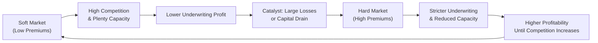

## Overview

Have you ever wondered why insurance premiums sometimes jump up all of a sudden, then—almost mysteriously—settle back down a couple of years later? This seemingly erratic behavior ties neatly into what we call the underwriting cycle. The cycle can feel a bit dizzying—like riding a carnival ride that swoops up and then drops you down without much warning. But for insurance companies and analysts alike, understanding these peaks and valleys is critical. So let's explore the underwriting cycle and, right alongside it, the essential concept of policy liabilities. We’ll see how both shape how insurers record profits, measure solvency, and stay one step ahead of new regulatory frameworks like IFRS 17.

## The Underwriting Cycle

### Nature and Phases of the Cycle
The underwriting cycle refers to the cyclical pattern of premium pricing, profitability, and underwriting availability that insurance companies typically experience. One moment, insurers are charging higher rates and restricting coverage (the so-called “hard market”)—and the next, they're slashing prices and relaxing their underwriting standards (the “soft market”). If you’re analyzing an insurer’s financial statements, a big part of your job is to figure out just where they stand in this cycle.

It might feel reminiscent of a rollercoaster. During a hard market, insurance companies become more reluctant to take on risky policies. Premiums spike, competition tapers off, and underwriting guidelines become stricter. Contrast that with what happens in a soft market: you’ll see more insurers clamoring to underwrite business. Premiums drop, underwriting becomes looser, and the competition can be downright fierce.

### A Visual Overview

To see how the cycle progresses from soft to hard markets and then comes back around, here's a simple flowchart:

In many cases, you can trace these shifts to external factors, such as the broader economic climate or significant catastrophic events (like hurricanes). After a major catastrophe, for instance, insurers who face large claim payouts often tighten up coverage, and premiums shoot upward to replenish capital. Over time, that profitability draws in fresh competition, eventually fueling a shift back to softer conditions.

## Key Drivers of the Underwriting Cycle

• Catastrophic Events: Nothing resets the cycle like a major disaster. In the aftermath of large payouts, capacity shrinks, and insurers become more defensive, leading to a harder market.  
• Regulation: Regulatory bodies sometimes impose changes on capital requirements or solvency standards—these moves can reduce the supply of insurance if carriers struggle to meet stricter capital rules, thereby prompting higher premiums.  
• Investment Returns: Making money on the investment side can help insurers absorb underwriting losses, so in times of high investment returns, insurers may be more willing to compete aggressively on price. When investment yields plummet, they need to rely on underwriting profit to survive.  
• General Economic Conditions: For instance, in an economic boom, more assets need coverage, and more customers can afford insurance—driving competition. Conversely, in a downturn, insurers might price more conservatively.

## Policy Liabilities: The Other Side of the Equation

An insurer’s job doesn’t end once policies are sold and premiums are booked. You might hear it said: “Insurance is the business of paying claims.” And let’s face it, nobody loves nasty surprises when it comes to claims. That’s where policy liabilities come in. They represent the amounts an insurer sets aside (reserves) to handle future claims—even if those claims haven’t yet surfaced on the insurer’s radar.

### Breaking Down Policy Liabilities
1. Claims Already Reported: These reflect losses or claims that have been officially submitted by policyholders but have not yet been fully settled.  
2. Incurred But Not Reported (IBNR): The dreaded black box. This is where insurance companies rely heavily on actuarial methods to estimate how many incidents have happened but haven’t been reported yet.  
3. Future Policy Liabilities: For products like life insurance or annuities, some portion of future benefits is recognized as a current liability.

### Best Estimate vs. Risk Adjustment
When actuaries crunch the numbers, they often split the final liability into two key components:
• Best Estimate: The expected, probabilistic view of future payouts.  
• Risk Adjustment (or Risk Margin): A margin to cover the uncertainty or adverse deviations from that best estimate.

### IFRS 17: A Paradigm Shift
If you’re reading modern insurance financial statements, you’ll probably see references to “IFRS 17” for international companies. IFRS 17 sets out a more uniform framework for measuring these liabilities:

• Current Estimates of Future Cash Flows: Assessing expected claims, expenses, and premium inflows using up-to-date assumptions.  
• Risk Adjustment: Reflecting uncertainty around those future cash flows.  
• Contractual Service Margin (CSM): This is a portion of what you might think of as unearned profit. Insurers recognize the CSM over the coverage period so that revenue more closely matches the period in which insurance services are provided.

It’s a bit like deferring some portion of your profits until you’ve truly “earned” them by offering coverage throughout the contract term. That helps spread profit recognition in a more systematic way—rather than booking big lumps at inception.

### US GAAP (FASB ASC 944)
Meanwhile, in the US GAAP realm, insurers primarily follow FASB ASC 944. The general principle remains that you need to set up adequate reserves to cover insured events. However, under ASC 944, the measurement approaches can sometimes differ from IFRS 17—particularly the inclusion and explicit visibility of items like the “risk adjustment” or the “CSM.”

In some respects, US GAAP still leans on more legacy methodologies for certain product lines—like the grouping of policies and the discount rates used—where IFRS 17 tries to unify the treatment under a more principles-based standard.

## Actuarial Estimation Methods: Reserving for the Unknown

When it comes to calculating policy liabilities, actuaries use various methods. You might see chain ladder techniques that rely on historical patterns of claim development or more sophisticated approaches that incorporate statistical modeling. The gist is to analyze how claims have matured over time—sometimes called “loss development factors”—and to project how recent claims might follow that same pattern.

Naturally, assumptions matter a ton. If management is overly optimistic (i.e., each year they say, “we had fewer claims than usual; that’s probably a new normal”), they might underreserve, which can inflate near-term profits but hurt them longer-term. Conversely, management might be intentionally conservative, hoping to keep a nice cushion and smooth out future volatility. From an analytical viewpoint, you want to see stable, consistent methods applied year after year—except where there’s good reason for a change in assumptions.

## Impact on Financial Statements and Ratios

### Earnings
Understated policy liabilities can overstate earnings in the short run. It looks great—for a while. Eventually, reality bites, and the company may have to top up reserves in a later period, causing an earnings hit at an inconvenient time. Overstating liabilities (reserves), on the other hand, compresses current earnings but may create a buffer for the future.

### Solvency and Capital
Insurers must meet certain capital and solvency requirements, which vary by jurisdiction. The more liabilities recognized on the balance sheet, the more capital the insurer needs to prove solvency. Regulators stay on high alert for insurers who might be playing games with reserve estimates to appear more robust than they really are.

### Profitability Metrics
Metrics like the combined ratio—(incurred losses + expenses) / earned premiums—reveal how profitable the underwriting side is. If liability estimates are off, the combined ratio may appear artificially low (suggesting profitability) or high (suggesting not-so-great underwriting).

## Regulatory Considerations

Regardless of whether a firm adheres to IFRS 17 or US GAAP, local regulations can impose additional reserving and capital requirements. In the U.S., insurance is regulated at the state level, with risk-based capital (RBC) formulas dictating the minimum capital needed. In Europe, Solvency II sets out a robust risk-based approach with dynamic capital charges. Understanding how the insurer navigates these frameworks is central to any robust financial analysis.

## Common Pitfalls and Challenges

1. Overreliance on Historical Data: Actuarial models assume the future will unfold similarly to the past. But new product lines, emerging risks, or changes in legal frameworks can disrupt these patterns.  
2. Underreserving to Boost Profits: This is a classic problem. Management—pressured by short-term earnings goals—might keep reserve estimates on the low side, only to have problems down the road.  
3. Volatile Investment Environments: If an insurer relies on investment returns to cover underwriting losses, a sudden drop in asset values (or yields) can inflate solvency concerns.  
4. Not Adapting to Regulatory Shifts: Transitioning from older frameworks to IFRS 17 or meeting new solvency rules can be tricky. Analysts need to pay attention to how the insurer discloses these changes.

## Practical Example: A Quick Scenario

Imagine an insurer, InsureAll, that mostly writes property and casualty (P&C) coverage in a hurricane-prone region. For three consecutive years, the region experiences mild weather, and InsureAll sees historically low claims. They assume that’s the new baseline for future periods. They reduce their reserves for catastrophes accordingly, which temporarily pushes up earnings and makes them look super profitable. More companies see the profit in that region. Premium competition increases, and we shift to a soft market.

Suddenly, a big storm season hits, and the actual claims exceed InsureAll’s reduced reserves. InsureAll scrambles to strengthen reserves, causing a big dip in net income. Because of the heavy losses, capacity takes a hit across the industry. Insurers soon raise prices, restraining underwriting, and guess what? The cycle flips to a hard market.

## Strategies for Analysis

• Compare loss development triangles and reserve adequacy across peers.  
• Check around major catastrophes for unexpected shifts in reserving.  
• Watch the insurer’s narrative in their financial statements—especially footnotes discussing changes in reserve calculation methods.  
• Pay attention to the interplay between underwriting results and investment returns.

## Further Reading

- International Accounting Standards Board (IASB). “IFRS 17 – Insurance Contracts.” (https://www.ifrs.org)  
- FASB ASC 944: “Financial Services—Insurance.” (https://www.fasb.org)  
- Society of Actuaries: Publications on Reserve Estimation.  
- CFA Institute: “Insurance and Risk Management” for conceptual underpinnings of insurance operations.

---

## Test Your Knowledge: Underwriting Cycle and Policy Liabilities Quiz



### Which of the following best describes a “hard market” in the insurance underwriting cycle?
- [ ] Low premium levels and high competition among insurers.
- [x] High premium levels and stricter underwriting standards.
- [ ] Rapid expansion of new insurance products with lenient pricing.
- [ ] Minimal regulatory oversight leading to more capacity.
> **Explanation:** A hard market is characterized by higher premiums and tighter underwriting practices, often following large catastrophic losses or periods of poor underwriting results.

### Which of the following factors is most likely to trigger a shift from a soft to a hard market?
- [ ] Excess reinsurance capacity.
- [ ] Decline in regulatory requirements.
- [x] Significant catastrophic losses impacting insurer capital.
- [ ] Decrease in investment returns on insurer portfolios.
> **Explanation:** Large catastrophic losses often deplete capacity and prompt insurers to raise premiums and tighten underwriting standards, thus shifting the market from soft to hard.

### Under IFRS 17, which component defers the profit from an insurance contract and recognizes it over the coverage period?
- [ ] Risk Adjustment.
- [ ] Best Estimate Liability.
- [x] Contractual Service Margin (CSM).
- [ ] Unearned Premium Reserve.
> **Explanation:** The CSM under IFRS 17 represents the unearned profit of an insurance contract. It’s spread out over the life of the contract to match the timing of services provided.

### If an insurance company underestimates its policy liabilities, which of the following is likely in the short run?
- [x] Overstated current earnings.
- [ ] Understated combined ratio.
- [ ] Negative impact on profitability metrics.
- [ ] Lower risk of regulatory scrutiny.
> **Explanation:** Understating policy liabilities means the insurer is reporting fewer liabilities, which inflates earnings. However, this practice could lead to reserve strengthening and a subsequent earnings hit in later periods.

### Under FASB ASC 944, how do insurers typically address risk margins in their liability calculations?
- [x] They may not explicitly report a separate risk adjustment margin as under IFRS 17.
- [ ] They must include an explicit contractual service margin.
- [ ] They are prohibited from adding any margins above the best estimate.
- [ ] They combine it with the contractual service margin in all cases.
> **Explanation:** While IFRS 17 explicitly separates the risk adjustment and the CSM, US GAAP rules do not always require a distinct margin presentation. Instead, margins may be embedded within overall assumptions.

### What is the primary goal of maintaining adequate policy liabilities (reserves)?
- [ ] Minimizing tax liabilities for insurance companies.
- [x] Ensuring the insurer can meet future claim payments.
- [ ] Lowering the insurer’s debt-to-equity ratio.
- [ ] Eliminating the need for reinsurance contracts.
> **Explanation:** Policy liabilities or reserves exist to ensure that insurers have enough funds to cover future claim obligations.

### A chain ladder method in actuarial reserving is used primarily to:
- [ ] Smooth out underwriting profit.
- [x] Estimate ultimate losses based on historical patterns of claims development.
- [ ] Determine how much reinsurance coverage is necessary.
- [ ] Price brand-new lines of business with no historical data.
> **Explanation:** The chain ladder method relies on historical data to project future claims development, helping actuaries estimate ultimate losses and set appropriate reserves.

### An insurer operating in a soft market environment is most likely to:
- [ ] Impose strict underwriting guidelines.
- [ ] Charge relatively high premium rates.
- [ ] Have very limited coverage options.
- [x] Offer lower premiums and more relaxed underwriting.
> **Explanation:** Soft markets are characterized by increased competition, which leads to reduced premiums and more lenient underwriting criteria.

### If an insurer detects it has under-reserved in a prior period, it might:
- [ ] Switch from IFRS 17 to legacy local GAAP standards.
- [ ] Issue a qualified opinion on its financial statements.
- [x] Strengthen reserves in the current period, reducing current earnings.
- [ ] Write off the shortfall against shareholder equity without affecting revenue.
> **Explanation:** Strengthening reserves in the current period would correct the past underestimation, leading to a negative impact on current income.

### True or False: Under IFRS 17, catastrophic losses are always excluded from the current estimate of future cash flows because they are considered unpredictable and thus immaterial.
- [ ] True
- [x] False
> **Explanation:** Even though catastrophic losses are unpredictable, IFRS 17 requires that the best estimate of future cash flows reflect all expected claim obligations, including extreme events where relevant.


