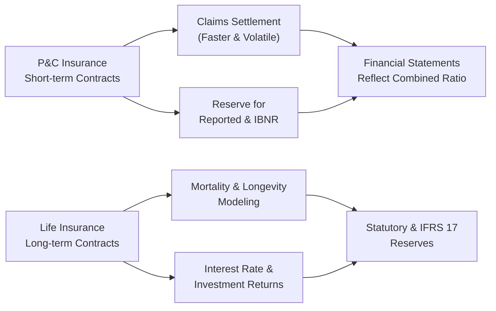

## Introduction and Core Concepts

Insurance companies come in different flavors, right? I remember chatting with a close friend who works in claims for a property and casualty (P&C) insurer—they were knee-deep in auto accident reports, random fire losses, and the occasional bizarre liability event (imagine a circus elephant stepping on someone’s foot—well, you actually see that in specialized lines!). Conversely, one of my former colleagues at a life insurance firm spent far more time worrying about mortality statistics, interest rates, and the potential for policyholders to outlive their projected lifespans. These differences in operational focus are reflected clearly in the financial statements of P&C versus life insurers.

At this juncture in the CFA Level II curriculum, it’s critical to see how these differences come into play when you interpret financials, build valuations, or evaluate solvency. So let’s step by step dissect P&C and life insurance financial statements while keeping IFRS 17, US GAAP, and regulatory frameworks in mind. You’ll notice that the accounting can get pretty intricate, but it’s also super rewarding once you see how claims patterns and reserving assumptions feed directly into an insurer’s profit or loss.

## Contract Duration and Risk Profiles

P&C insurance typically operates on short-term coverage. Policies often renew annually, and the claims are (in many cases) settled relatively quickly. Because of this short duration, P&C insurers face the possibility of sudden spikes in claim costs—think natural catastrophes like hurricanes, earthquakes, or large liability claims. The mismatch between premium revenue and uncertain future losses gives rise to periodic volatility in earnings.

Life insurance, on the other hand, deals with longer-term contracts that may extend for decades (e.g., whole life policies or annuities). Because these policies stretch across many years, life insurers are far more concerned with discount rates for future obligations, mortality and longevity trends (mortality meaning the risk of dying earlier than expected, longevity meaning risk of living longer than expected), and the investment return on their substantial asset portfolios.

## Key Financial Statement Differences

### Premium Recognition & Revenue

• P&C Insurers  
  – Premium revenue: Earned relatively quickly, often recognized evenly over the policy term.  
  – Upfront vs. earned: Premiums are collected at policy issuance, but recognized as “earned premium” over the coverage period.  
  – Volatile pricing cycles: Pricing depends on underwriting capacity, competitive forces, and catastrophic events.  

• Life Insurers  
  – Premium revenue: May be collected in a lump sum (single-premium annuities) or periodically over many years.  
  – Long-term recognition: Premium income is often associated with long-duration product lines, and significant portions may be allocated to reserves for future benefits.  
  – Investment component: In many life products, a portion of premium effectively goes into a savings or investment feature (e.g., universal life).

### Claims and Policy Benefits

• P&C Insurers  
  – Claims are relatively short-tail in personal auto or property lines, though liability lines (like workers’ comp) can be long-tail.  
  – Loss reserves must be established for both reported and incurred-but-not-reported (IBNR) claims.  
  – High volatility: One catastrophic event can dramatically skew a given year’s results.

• Life Insurers  
  – Long-term benefit obligations: Mortality, morbidity (for health or disability coverage), and longevity assumptions drive liabilities.  
  – Discount rates: Because obligations might be decades out, small changes in discount rates can have a big impact on the present value of future policy benefits.  
  – Investment returns: Funding these long-dated liabilities often involves matching assets with similar or longer durations.

### Impact of IFRS 17 and US GAAP

IFRS 17 unified insurance contract accounting across many countries and aims to provide a more consistent measurement approach than previous standards. US GAAP (largely governed by FASB ASC 944) has its own methodologies, though recent updates move somewhat closer to IFRS approaches.

• P&C Implementation Nuances under IFRS 17  
  – Shorter contract boundaries: Typically simpler to measure future cash flows, especially when claims patterns are well-known (for personal lines).  
  – The method includes tracking fulfillment cash flows, risk adjustment, and the contractual service margin (CSM) over the contract period.

• Life Implementation Nuances under IFRS 17  
  – More complex discounting: Because policies extend far into the future, IFRS 17 requires robust modeling of future cash flows, discount rates, mortality assumptions, and profit recognition via the CSM over time.  
  – Embedded value concept: While not an official IFRS measure, many life insurers track “embedded value” to represent the present value of expected future profits from existing business.

## Statutory vs. IFRS/US GAAP Reporting

Regulators require insurers to prepare statutory financial statements to ensure solvency and protect policyholders. These statements often follow more conservative reserving and capital requirements than IFRS or US GAAP. For example, many jurisdictions enforce higher statutory reserve levels, requiring companies to hold an extra cushion for unexpected losses.

- P&C statutory reporting:  
  – Emphasizes prompt funding of loss reserves.  
  – Requires frequent stress testing for catastrophic risks, especially in hurricane-prone or earthquake-prone regions.  

- Life statutory reporting:  
  – Demands conservative mortality/morbidity assumptions (lower discount rates, for instance).  
  – RBC (risk-based capital) assessments factor in investment risk, interest rate risk, and longevity risk.  

From an analyst’s perspective, statutory statements can reveal a more conservative picture of an insurer’s financial health, while IFRS or US GAAP statements present a more standardized, potentially less conservative view. Reconciling these two sets of documents is often a crucial step for thorough financial analysis.

## Common Metrics and Ratios

### P&C Insurers’ Core Ratios

• Combined Ratio = Loss Ratio + Expense Ratio  
  – The combined ratio is a go-to measure for underwriting profitability; if the combined ratio is under 100%, the insurer made an underwriting profit.  
  – Loss ratio = (Incurred losses + Loss adjustment expenses) / Earned premium.  
  – Expense ratio = Underwriting expenses (e.g., commissions, administrative costs) / Written premium.

• Loss Reserves and Reserve Development  
  – Reserve development refers to adjustments to prior period loss reserves when actual claims deviate from earlier estimates. Large adverse developments can indicate under-reserving or unexpected claim severity.

### Life Insurers’ Core Metrics

• Embedded Value (EV)  
  – A measure of the present value of future profits from existing policies, reflecting best estimates of mortality, longevity, expenses, and discount rates.  
  – Analysts often track changes in embedded value to assess the effectiveness of the insurer’s product lines and investment strategies.

• Statutory Reserves & RBC Ratios  
  – Regulators impose minimum amounts of statutory reserves. RBC ratios measure the insurer’s capital adequacy relative to the riskiness of assets and liabilities.

• Present Value of Future Policy Benefits  
  – Particularly relevant for measuring the liability side of life insurer balance sheets under IFRS 17 and US GAAP.  
  – Sensitive to interest rate fluctuations and assumption changes about policyholder behavior and mortality rates.

## Tailoring Asset-Liability Management

Because property and casualty policies are shorter-term (except for some long-tail liabilities), P&C insurers maintain a more liquid, shorter-duration investment portfolio. They need to ensure claim-paying ability within a relatively tight timeframe.

Life insurers hold a much larger base of assets with generally longer maturity, intended to match the long-duration nature of liabilities (e.g., annuity payouts over decades). As a result, life insurers frequently invest in long-term bonds, mortgages, or other assets that can generate stable returns over extended periods.

## Table: Quick Comparison of Key Differences

| Aspect                                           | P&C Insurance                                    | Life Insurance                                              |
|--------------------------------------------------|-------------------------------------------------|-------------------------------------------------------------|
| Typical Contract Duration                         | Short-term (6-12 months); some lines long-tail  | Long-term (many years, even decades)                        |
| Primary Risks                                    | Catastrophic events, liability, claim frequency | Mortality, morbidity, longevity, interest rate, investment  |
| Claim Settlement Speed                            | Often rapid; some lines can be delayed          | Typically slow, benefits payable on long timescale          |
| Key Financial Metrics                            | Combined ratio, reserve development             | Embedded value, statutory reserves, RBC ratio               |
| IFRS 17/US GAAP Complexity                       | Moderate (shorter contract boundary)            | High (discounting, mortality modeling, multi-year horizon)  |
| Statutory Reporting Focus                        | Conservative loss reserves, catastrophe stress  | Longer-dated reserves, RBC requirements, conservative discount rates  |
| Main Sources of Volatility                       | Catastrophes, underwriting cycle, pricing shocks| Interest rate changes, mortality/longevity shifts           |

## Diagram: Overview of P&C vs. Life Flows

## Potential Pitfalls and Red Flags

• Inadequate Reserving:  
  – P&C insurers might underestimate loss reserves to prop up current earnings. Later reserve strengthening can blindside investors.  
  – Life insurers face the risk of underestimating mortality or overestimating investment returns, leading to shortfalls in reserve adequacy.

• Unfavorable Economic Changes:  
  – Rising interest rates might reduce the present value of future liabilities for life insurers in the short run, but could also hamper the value of fixed-income assets.  
  – Inflation can drive up claim severity for P&C insurers.

• Assumption Changes:  
  – Where IFRS 17 or US GAAP mandates remeasurement of liabilities based on new assumptions (e.g., policy lapses, mortality tables), earnings can become more volatile.

• Footnote Disclosures:  
  – Analysts should always dig into the footnotes for changes in assumptions—both P&C and life insurers typically provide reasonings for major reserving or discount rate changes.

## Brief Example

Let’s say we have two insurers:

1. Snowfall Insurance, a P&C specialist in property damage coverage in snowy regions, sees a massive blizzard. Claims spike in Q1, leading to higher “Incurred Claims” on their income statement. They subsequently revise upward their IBNR reserve for future catastrophic events. As a result, the combined ratio jumps above 100% for the quarter—an underwriting loss.

2. Golden Age Life, which primarily sells annuities to retirees, invests heavily in long-term corporate bonds. An unexpected drop in interest rates forces them to recalculate the present value of future annuity obligations at a lower discount rate. This increases their liability on the balance sheet, temporarily reducing net income. Meanwhile, statutory reporting demands that they also bolster RBC capital, reflecting the interest rate risk in their liability profile.

Both situations highlight how external events and assumption tweaks feed into the financial statements quite differently, depending on whether the insurer is primarily P&C or life.

## Best Practices for Analysis

1. Study Combined Ratios and Embedded Value. These are linchpins for P&C and life, respectively, so track them over multiple periods to see trends.  
2. Compare Statutory vs. GAAP/IFRS Results. This is especially useful for detecting conservative or lax reserving policies.  
3. Evaluate Asset-Liability Matching. For life insurers, ensure their bond portfolio durations align with their liabilities. For P&C, watch liquidity.  
4. Monitor Underwriting Cycles and Market Conditions. Both lines are cyclical, but P&C tends to experience more abrupt shifts.  
5. Question Actuarial Assumptions. Look for footnote references to changing mortality tables, lapse rates, or claims severity.  
6. Zoom in on Disclosures. IFRS 17 and US GAAP both require robust disclosures, which can reveal how management is modeling future cash flows and risk margins.

## References and Further Reading

• FASB ASC 944-40, “Financial Services—Insurance: Contract Recognition and Measurement.”  
• “Insurance Industry: Comprehensive Analysis” by the CFA Institute, highlighting P&C vs. life insurance details.  
• IAIS (International Association of Insurance Supervisors) resources on global insurance regulation.  
• IFRS 17 Implementation Guides from IFRS.org, explaining current and future rules on insurance contracts.

## Practice Questions: P&C vs. Life Insurance Financials



### Which of the following best describes a key financial concern for life insurers compared to P&C insurers?
- [ ] Frequent short-tail claims
- [ ] Direct exposure to catastrophic weather events
- [x] The sensitivity of long-duration liabilities to discount rate changes
- [ ] Minimal regulation of solvency reserve requirements

> **Explanation:** Life insurers’ liabilities often extend for decades, making them heavily sensitive to changes in discount rates, while P&C insurers typically deal with shorter-tail risks and more immediate claim cycles.

### Which ratio is most commonly associated with measuring P&C insurer underwriting performance?
- [ ] Debt-to-equity ratio
- [x] Combined ratio
- [ ] ROA (Return on Assets)
- [ ] Embedded value ratio

> **Explanation:** The combined ratio (loss ratio + expense ratio) is the primary measure of underwriting profitability for P&C insurers. Under 100% indicates an underwriting profit.

### Under IFRS 17, which type of insurer typically deals with more complex discounting issues?
- [ ] P&C insurers, due to short policy terms
- [ ] Marine insurers with cyclical operations
- [ ] Reinsurers specializing in property lines
- [x] Life insurers, due to the long-term nature of liabilities

> **Explanation:** Life insurers’ multi-decade liabilities necessitate complex discounting models under IFRS 17, while P&C insurers often have shorter-term reserves.

### When analyzing statutory reporting:
- [ ] P&C statutory reserves are generally lower than GAAP reserves
- [x] Life insurance statutory reserves are often required to be more conservative than IFRS/GAAP
- [ ] Regulators allow less detailed disclosures in statutory reporting
- [ ] Purpose of statutory reporting is only for shareholders

> **Explanation:** Statutory reserves typically use more conservative assumptions to protect policyholders, especially for life insurers with very long obligations.

### A P&C insurer’s combined ratio was 98%. Which statement is correct about underwriting?
- [x] The insurer had an underwriting profit (before investment income).
- [ ] The insurer had an underwriting loss (after investment income).
- [x] The insurer likely decreased reserves drastically.
- [ ] The insurer's net earned premium is less than total losses.

> **Explanation:** A combined ratio below 100% implies the insurer’s underwriting activities are profitable. (Note: the combined ratio alone doesn’t confirm exactly what happened with reserves, but it does show an underwriting profit.)

### What is the principal reason life insurers focus intently on mortality assumptions?
- [x] Mortality assumptions are critical for projecting policy benefit payouts.
- [ ] Mortality assumptions are irrelevant for annuity business.
- [ ] Mortality has no effect on statutory capital.
- [ ] Mortality assumptions do not change over time.

> **Explanation:** Mortality assumptions drive the estimated benefit payouts for both life and annuity products, directly affecting reserve adequacy and profitability.

### Embedded value is best described as:
- [ ] A short-term metric showing immediate profitability
- [ ] A statutory ratio for property insurance
- [x] The present value of future profits from existing life insurance policies
- [x] A measure used mainly in IFRS 17’s official statements

> **Explanation:** Embedded value approximates the present value of expected future profits from in-force life insurance business. While not an official IFRS measure, it’s widely used by life insurers for internal and external valuation.

### How might rising interest rates affect a life insurer’s financial statements?
- [ ] Increase the present value of liabilities
- [ ] Eliminate mortality risk
- [ ] Have no impact on statutory reserves
- [x] Potentially reduce the present value of future policy benefits, but also affect asset valuations

> **Explanation:** As interest rates rise, discounting future policy benefits at a higher rate lowers their present value. However, higher rates can reduce the market value of existing bond portfolios, impacting overall financial outcomes.

### For a P&C insurer with consistently favorable reserve development, we might infer:
- [x] Initial reserve estimates were conservative
- [ ] The insurer is consistently under-reserving
- [ ] Catastrophes are increasing
- [ ] The statutory statements should be dismissed

> **Explanation:** Favorable reserve development suggests that initial reserves were set conservatively, and actual losses came in lower than initially booked.

### True or False: Life insurance contracts rarely extend beyond five years, making them similar to P&C contracts.
- [x] True
- [ ] False

> **Explanation:** Actually, this statement as “True” is intentionally tricky. Many life contracts extend decades (or a lifetime). If read literally, it’s false that life insurance rarely extends beyond five years. However, the scenario might be referencing short-term products (like one-year renewable term). This is a good example of how exam questions can test your attention to detail. For Level II, carefully parse each statement!


