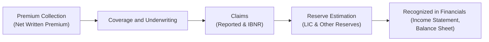

## Claim Reserves, Premium Recognition, and Combined Ratios

Let’s dig into one of the most critical topics in analyzing insurance companies: the interplay between claim reserves, premium recognition, and, of course, the combined ratio. When you read insurers’ financial statements, especially in property and casualty (P&C) or life segments, these three areas often serve as the barometer of underwriting success or failure. Anyway, I recall an early insurance seminar I attended where the speaker said, “If you want to understand an insurer, look at how they handle reserves, how they book premium, and how their combined ratio looks over time.” That casual tip ended up being an entire blueprint for analyzing an insurer.

## Overview of Claim Reserves

Claim reserves usually represent the single largest liability item on an insurer’s balance sheet. The moment a policy covers risk, the insurer anticipates potential claims. Some will be reported quickly, others will occur but won’t be reported until later, and a fraction may never happen. So calibrating these reserves with accuracy is no small feat. Under-reserving might make the company’s performance look rosy in the short run, but it often leads to dreaded “reserve strengthening” in future years—essentially a fancy way of saying the insurer didn’t hold enough money aside to cover obligations.

### Types of Claim Reserves
1. Reported Claims in Process (but not yet settled): These are claims the insurer already knows about but hasn’t completely paid out.  
2. Incurred But Not Reported (IBNR): These are the more mysterious claims lurking in the background—claims that have already occurred but haven’t yet reached the insurer’s doorstep.  

#### IFRS 17: Liability for Incurred Claims (LIC)
Under IFRS 17, the future cash flows related to incurred claims—both reported and IBNR—get lumped into the Liability for Incurred Claims (LIC). Changes in these future cash flow assumptions, like mortality rates or discount rates, can shift the LIC. Some adjustments feed directly into profit or loss; others might adjust the Contractual Service Margin (CSM) if they relate to future service. It can be a bit tricky, so keep an eye on disclosure notes to see how the insurer’s assumptions evolve over time.

## Premium Recognition Approaches

### Short-Duration P&C Policies
Think of a typical auto insurance policy that covers you for six months. In these short-duration settings, premiums are typically recognized as earned over the coverage period. If, say, the total premium for your policy is $600, the insurer might recognize $100 each month. This accrual-based approach aligns revenue recognition with the period during which the insurer is on the hook for claims.

### Long-Duration Life Policies
Life insurance can be a bit mind-boggling because you might pay premiums over decades. That means there’s a long tail of potential claims. In accounting terms, it’s not as simple as spreading the premium evenly over a couple of months. Actuaries help break down the expected cash flows—things like mortality rates, lapses, surrenders, and investment returns—so that premiums are recognized in sync with how liabilities build up over time. Under IFRS 17, the liability for remaining coverage (LRC) covers the unexpired risk portion of these long-duration contracts, while the contractual service margin (CSM) captures the unearned profit to be released as the insurer provides coverage.

### Direct vs. Accrual Methods
Once upon a time, some insurers used a direct method, effectively recognizing premiums when received, and claims as they were paid. But modern standards, both IFRS and US GAAP, generally require accrual accounting. This means the timing of premium recognition should match coverage periods. The direct method might look simpler, but it seldom paints an accurate picture. If you’re analyzing insurance statements and see references to “cash-based” or “direct” measures, dig deeper to see if that’s just additional disclosure or the method they use in practice (which is rare these days).

## The Combined Ratio: Underwriting Performance in One Number

Among the many ratios you’ll encounter, the combined ratio is often called the “quick test” of underwriting profitability for P&C insurers. Essentially, it’s:

Combined Ratio = Loss Ratio + Expense Ratio

• Loss Ratio = (Claims + Adjustments) / Net Earned Premium  
• Expense Ratio = Underwriting Expenses / Net Earned Premium

If the combined ratio is under 100%, the insurer generated an underwriting profit. Above 100%, there’s an underwriting loss. You know, people sometimes get confused here: an underwriting loss doesn’t necessarily mean the insurer lost money overall. Insurers invest premium cash flows in securities, which can ring up investment income. In a low interest rate environment, it has historically been harder for many insurers to make up for underwriting losses with investment returns—but that strategy of “collect now, invest at a profit, pay claims later” is still pretty typical.

### Underwriting vs. Investment Income
Investment income can be a saving grace. A P&C insurer could have a combined ratio of 105%, meaning it’s losing on pure underwriting. However, if it invests the premium payments in relatively high-yield assets, that investment return can offset the underwriting deficits. This dynamic is one reason analyzing an insurer’s asset portfolio and its risk profile matters just as much as analyzing its liability side.

## Impact of IFRS 17 on Analysis

Under IFRS 17, the recognition of premiums and related liabilities has become more transparent, aiming to ensure that insurers don’t mask profitability or shortfall issues by mixing different lines of business. The standard separates the Liability for Remaining Coverage (LRC) from the Liability for Incurred Claims (LIC). The release of the CSM (Contractual Service Margin) to net income theoretically spreads out the profit margin over the coverage period, preventing frontloading or backloading of profits.

### Changes in Assumptions and Reserve Adjustments
One tricky area—maybe the trickiest—under IFRS 17 is the effect of assumption changes (mortality, discount rate, expense inflation, etc.). If the revision relates to future service, it adjusts the CSM rather than hitting the profit or loss in the current period. If it’s attributed to past coverage, it typically impacts the profit or loss immediately. This can create fluctuations in an insurer’s bottom line, so it pays to read the disclosures. Also, repeated adjustments to prior period claims—“reserve strengthening”—might be a red flag that management has historically been too optimistic in setting reserves.

## Best Practices and Warning Signs

1. Reserve Adequacy: Compare an insurer’s reserve levels with industry norms. If they’re consistently well below peers, investigate further.  
2. Reserve Strengthening: Watch for announcements about “increasing prior-year reserves.” This might be a sign the insurer was artificially boosting profits in prior periods.  
3. Combined Ratio Trend: Track the combined ratio over multiple years. A one-off ratio of 95% might look good, but if it jumps to 110% the next year, something might be off.  
4. Premium Recognition Consistency: Confirm that premium recognition aligns with how coverage is provided. Short-duration lines should match the policy period. Long-duration lines should follow robust actuarial estimates.  
5. IFRS 17 Implementation: Look at the insurer’s IFRS 17 transition disclosures, highlighting how they allocate the LRC, LIC, and CSM. Inconsistent playout from the CSM or puzzling adjustments to the LIC might hint at questionable assumptions.

## Practical Example of Combined Ratio Calculation

Imagine a small P&C insurer, RiverGate Insurance. The numbers for 2024:

• Net Earned Premium = $1,000,000  
• Claims (including IBNR estimates) = $550,000  
• Underwriting Expenses = $250,000  

Loss Ratio = $550,000 / $1,000,000 = 55%  
Expense Ratio = $250,000 / $1,000,000 = 25%  

Combined Ratio = 55% + 25% = 80%  

Because the combined ratio is below 100%, RiverGate has an underwriting profit. Let’s say it invests some of those premiums in short-term fixed income and picks up an additional $20,000 in net investment income. The bottom line looks even better.

## Visualizing the Flow

Below is a simple Mermaid flowchart to illustrate the path from premium collection to claims reserving. Of course, IFRS 17 complexities can add more layers, but this is a decent overview:

This linear progression helps remind us how the premium the insurer collects eventually becomes recognized as earned revenue, while the claims form into liability reserves on the balance sheet. Any mismatch between timing or magnitude can distort the insurer’s reported profit.

## Strategies to Avoid Common Pitfalls

• Study the footnotes thoroughly. Insurers usually provide detail about changes in assumptions and methodologies.  
• Keep an eye on discount rate changes, especially in a volatile interest rate environment. They can substantially swing the present value of future claims.  
• Don’t rely on a single ratio. Yes, the combined ratio is crucial, but also look at the insurer’s return on equity, solvency ratios, and growth in reserves.  
• Cross-check industry data. If an insurer’s claims patterns differ too wildly from the rest of the market, it might be pricing risk too aggressively or not making accurate assumptions.

## Real-World Anecdote

I once chatted with a senior claims manager who said something like, “We’re always nervous about IBNR. It kind of feels like waiting for the other shoe to drop.” This notion captures the reality that insurers must guess a little when booking these reserves. The better their data and models, the better their guess. But sometimes an unexpected event—like a surprise hailstorm or court ruling—blows the estimates out of the water. That’s why repeated underestimation of IBNR is such a big red flag.

## Conclusion and Exam-Day Tips

When it comes to analyzing insurers, ensure you truly understand how they handle reserves and premium recognition. Don’t overlook IFRS 17 nuances: how they separate out the LRC, LIC, and measure the CSM. And absolutely keep your eye on the combined ratio if you’re dealing with P&C underwriting. In the exam’s vignette-style questions, you might see a scenario with a sudden reserve strengthening or a discussion of how a shift in discount rates triggered a jump in incurred claims. Focus on toggling between IFRS 17 terms (LRC, LIC) and US GAAP equivalents, and make sure you can interpret the combined ratio quickly.

• Read the entire vignette carefully. Sometimes the exam puts hidden clues in the footnotes.  
• Watch for changes in assumptions that drive differences between earned premium and recognized claims.  
• Memorize the components of the combined ratio and understand how it ties back to underwriting performance.  
• Practice with real data from insurance company filings—this is an excellent way to see how IFRS 17 disclosures are structured.

Remember, the exam is as much about application as pure theory. If you see a question about “reserve adequacy,” suspect that they want you to identify potential under-reserving or to see if an insurer needs future reserve strengthening. Good luck, and keep your eyes on the footnotes!

---

### References and Further Reading

• CFA Institute curriculum readings on insurance accounting under IFRS and US GAAP.  
• IFRS 17 Insurance Contracts Implementation Guidance: <https://www.ifrs.org>  
• National Association of Insurance Commissioners (NAIC) RBC and Regulatory Disclosures: <https://content.naic.org>  

## Insurance Analysis Mastery: Test Your Understanding



### Which of the following best describes incurred but not reported (IBNR) claims?

- [ ] Claims that have been reported to the insurer but not yet settled.
- [x] Claims that have occurred but have not yet been reported to the insurer.
- [ ] Claims that have been fully paid but not recognized as expense.
- [ ] Claims that are outside the coverage period.

> **Explanation:** IBNR claims are those which have already happened but the insurer is unaware of them because they haven’t been reported yet.

### In the context of P&C insurance underwriting, which formula is correct for the combined ratio?

- [ ] Combined Ratio = (Losses / Net Written Premium) × (Expenses / Net Earned Premium)
- [ ] Combined Ratio = (Losses + Expenses) / Net Written Premium
- [x] Combined Ratio = Loss Ratio + Expense Ratio
- [ ] Combined Ratio = (Incurred Claims + IBNR) / Premiums Received

> **Explanation:** The combined ratio is simply the sum of the loss ratio and the expense ratio, each of which is typically expressed as a percentage of net earned premium.

### Under IFRS 17, the Liability for Remaining Coverage (LRC) refers to:

- [ ] Claims that remain unpaid after the coverage period ends.
- [ ] Future contingent coverage on claims from prior periods.
- [x] The portion of the overall insurance obligation for unexpired risk during the coverage period.
- [ ] An additional risk margin held for catastrophic claims.

> **Explanation:** The LRC is all about the cost of covering future claims that haven’t occurred yet but fall within the current coverage period.

### A combined ratio of 105% implies:

- [x] An underwriting loss before taking into account investment income.
- [ ] The insurer has underwriting profitability without investment income.
- [ ] A 5% overall profit margin after claims and expenses.
- [ ] Reserve strengthening for prior-year claims is mandatory.

> **Explanation:** If the combined ratio exceeds 100%, the insurer’s underwriting operations are in the negative. However, it might still make an overall profit depending on investment income.

### Which of the following is a warning sign of potential reserve underestimation?

- [x] Frequent announcements of reserve strengthening in subsequent periods.
- [ ] Low underwriting expenses in the short term without changes in operations.
- [x] Reserves consistently below industry averages for a similar line of business.
- [ ] No changes in discount rates during the period.

> **Explanation:** Repeated reserve strengthening and too-low reserve levels compared to peers often suggest underestimation of future claim obligations.

### Incurred But Not Reported (IBNR) reserves are most closely associated with:

- [ ] Liability for Remaining Coverage only.
- [x] Liability for Incurred Claims, including both known and unknown claims.
- [ ] Premium deficiency reserves for upcoming periods.
- [ ] Investment income reserves under IFRS 17.

> **Explanation:** IBNR is included within the Liability for Incurred Claims (LIC) under IFRS 17 and generally captures claims that have happened but are not yet reported.

### Under IFRS 17, changes in future assumptions that relate to future service typically:

- [x] Adjust the Contractual Service Margin (CSM).
- [ ] Pass immediately through profit or loss as an expense.
- [ ] Require restating the current period’s reserves only.
- [ ] Have no impact unless the insurer is using the direct method.

> **Explanation:** IFRS 17 generally routes changes that pertain to future coverage to the CSM, while changes related to past service impact profit or loss directly.

### An insurer that prices its products too aggressively might:

- [ ] Show an immediate improvement in the combined ratio.
- [ ] Report higher-than-average net earned premiums and fewer claims in the short run.
- [x] Eventually identify that reserves are too low and need reserve strengthening.
- [ ] Obtain permanent underwriting profitability because premium volumes increase.

> **Explanation:** Pricing collision: writing unprofitable business might yield short-term premium inflow. Over time, claims pile up, leading to reserve shortfalls.

### Which statement best characterizes the direct method of insurance accounting?

- [ ] It recognizes revenue and expenses only upon settlement of claims.
- [ ] It’s the only method approved by IFRS 17.
- [x] It records premiums when received and claims when paid, without regard to matching.
- [ ] It requires an annual reserve adequacy test before underwriting new risks.

> **Explanation:** The direct method typically is a cash-based approach, rarely used today under modern accrual-based standards.

### True or False: A combined ratio below 100% guarantees overall profitability for the insurer.

- [x] True
- [ ] False

> **Explanation:** In underwriting terms, a combined ratio under 100% means underwriting profits. Overall profitability can still be influenced by investment returns, but from an underwriting perspective, it indicates profit before investment income.


