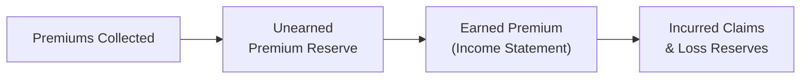

## Introduction

So, you’re staring at an insurer’s financial statements, and you’re probably thinking: “Wow, these reserves, underwriting results, and notes on catastrophic event exposures can be tough to unravel.” Yep, I’ve been there too, flipping through pages of footnotes, trying to figure out just how solid that insurer’s profitability is—or if it’s teetering on the brink of disaster. In this vignette-focused section, let’s walk through the key areas you’ll want to assess, the red flags you can’t ignore (like those sudden changes in reserve methodologies), and some best practices to keep in mind when picking through premium and claims data.

Being able to interpret insurance financial statements is a valuable skill not just for your CFA® exam, but also in the real world. In fact, I remember an instance where an insurer’s footnotes showed drastically reduced combined ratios right after a major re-reserving event—talk about an eyebrow-raiser! Whether you’re reading annual reports or hypothetical vignettes on the exam, you’ll see that small details like that can shine a bright light on both risk exposures and the potential for manipulations. 

## Underwriting and Reserve Basics

Insurance companies have their own language. Terms like “combined ratio,” “loss reserves,” and “earned premium” can swirl around in your head. But don’t fret—these concepts piece together once you see how underwriting results flow through the financials.

Underwriting starts with premium collection. The insurer then estimates the cost of claims (loss reserves), administrative costs, and tries to generate a margin. If we look specifically at the combined ratio, it represents:

Combined Ratio = (Incurred Losses + Underwriting Expenses) / Earned Premium

• A ratio below 100% suggests underwriting profitability (premiums exceed losses plus expenses).  
• A ratio above 100% indicates underwriting loss.

Meanwhile, the income statement also includes investment income. Insurers often invest the float from premiums before claims become due. So, a company might post underwriting losses yet remain profitable if investment income is strong.

The big question is: how do you figure out if those underwriting numbers are stable or artificially sweetened? Typically, you’ll assess any abrupt changes in the insurer’s approach to calculating reserves. For instance, a sudden drop in loss reserves can artificially boost current income—until claims eventually trickle in and the insurer’s profitability collapses. Watch for large re-reserving events or disclaimers that the insurer changed its actuarial assumptions. 

### Reserve Methodologies and Potential Red Flags

• Abrupt changes in assumptions: Does the footnote mention a shift in discount rates for long-tail liabilities or new mortality/morbidity assumptions for life insurers?  
• Large re-reserving: A big re-reserving charge might indicate prior underestimation of liabilities.  
• Reserve release near year-end: Sudden releases can inflate profitability.  

I once saw an insurer claim they had “favorable reserve development” in six out of seven quarters—coincidence? Possibly. But it can also be a sign that prior conservative assumptions are now reversed to juice up earnings. Practice your detective skills with vignettes: read the footnotes carefully, note how reinsurance recoverables factor in (since they reduce net liabilities), and keep an eye on the company’s capital positions.

## Reinsurance and Solvency Considerations

Reinsurance helps insurers transfer a portion of their risk to other companies, which is typically a good thing—until it’s not. The credit risk from reinsurers is a significant area for concern, especially if the ceding insurer depends on a single reinsurer that could default at the worst time. Financial statements will often feature a “reinsurance recoverable” line item that indicates how much the ceding company expects to collect from reinsurers for claims paid (or to be paid).

Remember these pointers:

• Credit Risk of Reinsurer: A large recoverable from a reinsurer with shaky credit or uncertain regulatory environment might require careful scrutiny.  
• Catastrophe Covers: After major catastrophes (like hurricanes), reinsurance treaties might come into play. If the insurer’s footnotes mention big reinsurance recoverables after a cat event, that’s good—assuming the reinsurer can pay.  
• Solvency Ratios: In the U.S., the Risk-Based Capital (RBC) ratio is a key metric. In the EU, Solvency II frameworks require a similar check on capital adequacy (SCR coverage ratio).

### RBC, Solvency II, and Other Regulatory Measures

Unless you’re itching to do a deep dive into RBC formula derivations, the gist is that RBC measures the required capital based on the company’s risk profile: underwriting risk, asset risk, and so forth. You’ll often see RBC or Solvency II coverage ratios expressed like:

RBC Ratio = Total Adjusted Capital / Authorized Control Level RBC

Or, under Solvency II:

Solvency II Ratio = Eligible Own Funds / Solvency Capital Requirement (SCR)

A ratio over 100% means the insurer meets the regulatory capital requirement, but regulators like to see significantly higher buffers, particularly in lines of business prone to large fluctuations (e.g., catastrophic coverage).

## IFRS 17 and the CSM (Contractual Service Margin)

For those who want to geek out on the new IFRS 17 standard, the Contractual Service Margin (CSM) is essentially the unearned profit portion embedded in the insurance contract. As an insurer provides coverage (i.e., time elapses, and claims are serviced), that margin is released into revenue. This means that changes in estimates (assumptions about claim frequency, severity, discount rates) can remeasure liabilities and thus adjust the CSM:

• If future cash flow estimates worsen (e.g., claims might be higher than previously assumed), the CSM can be squeezed, reducing future profits.  
• If the insurer’s discount rates rise, the present value of future liabilities decreases, potentially lifting the CSM.  

When analyzing footnotes under IFRS 17, watch for remeasurement of the liability for remaining coverage. Big or unexpected CSM adjustments can mask or highlight shifts in underwriting profitability. The exam might present a scenario where interest rates fluctuate, and you’ll have to figure out how that changes remeasured liabilities in the income statement or other comprehensive income (OCI).

## Tracking Premium Timelines and Deficiencies

Life is complicated for insurers because premiums are often collected upfront, but claims might be paid years—or even decades—later (looking at you, life insurance or workers’ comp). On the exam (and in real life), keep these timeline-related tidbits in mind:

• Unearned Premium Reserve (UPR) sits on the balance sheet, ready to be recognized as earned premium each period.  
• If the UPR is not sufficient to cover expected future claims, the insurer must establish a Premium Deficiency Reserve (PDR). That’s typically a sign that pricing might have been too aggressive or that claim trends took a bad turn.  

By the way, sudden expansions in underwriting portfolios (like entering new markets) can distort these cycles. For instance, an insurer might show a big surge in written premium, leading to a similarly large unearned premium reserve. Yet, the claims portion may not materialize until later. Meanwhile, the combined ratio might look rosy for a period—until those claims catch up.

Below is a quick schematic of how premium flows through an insurer’s statements:

When analyzing vignettes, keep this timeline in mind. If you spot any references to catastrophic events that aren’t accounted for in the reserves or reinsurance treaties, that’s your cue to ask questions.

## Sample Vignette and Analysis

You might see something like this in the exam:

“ABC Insurance Co. reported a combined ratio of 98% in the prior year but announced a significant methodology change in calculating worker’s compensation reserves this year. Despite higher claim frequency, ABC’s combined ratio improved to 95%. Management states that they reevaluated mortality assumptions and recognized a net $20 million reserve release. The reinsurance recoverable soared to $100 million, up from $40 million last year, primarily due to new arrangements with an unrated reinsurer. ABC’s RBC ratio stands at 215% compared to 225% the prior year.”

How should you react?

1. Underwriting Ratio Shift: They improved from 98% to 95%. Does that make sense if claim frequency is actually going up? Possibly not. Notice the offsetting effect from “reevaluated mortality assumptions.” That’s a sign the improvement could be ephemeral.  
2. Reserve Release: A net $20 million release boosted short-term net income. However, such releases can obscure true profitability if they are reversing a previously conservative estimate.  
3. Reinsurance Recoverable Jump: The reinsurer is unrated—what if a downturn hits and that reinsurer can’t pay? A big chunk of ABC’s solvency might hinge on that $100 million.  
4. RBC Ratio Slight Decline: RBC ratio is still above 200%, which is usually comfortable, but the trend is downward—it’s a clue that the company might be taking on more risk or has capital strain.

## Common Pitfalls

• Blindly trusting a low combined ratio without checking footnote disclaimers.  
• Overlooking reinsurance credit risk; reinsurance might reduce net claims, but what if the reinsurer is financially weak?  
• Forgetting to check year-to-year changes in reserves. A big jump or drop should always prompt questions.  
• Ignoring IFRS 17 remeasurement detail. Changes in discount rates can have big implications for insurer liabilities.  

Sometimes, you’ll notice the exam questions are less about the raw numbers and more about whether you can piece together the story. So, read every footnote carefully, connect the dots, and watch for those subtle shifts in assumptions.

## Exam-Day Tips

• Keep an eye on disclaimers about reserve movements. By the time you reach the question, record any mention of changed actuarial assumptions.  
• Reinsurance footnotes might be hidden in the back. Flip there promptly to see if big changes occurred.  
• When you see IFRS 17 references, quickly identify how the CSM is recognized and whether interest rate changes are updated through OCI or profit/loss.  
• Always recast or recompute the combined ratio and RBC ratio if the data is straightforward enough. Quick math can reveal big clues about solvency.  
• Time management: Vignette questions can be wordy. Skim for key numbers (reserves, RBC, reinsurance recoverables, combined ratio) and then read the notes carefully to see how they fit together.

## References

• CFA Institute Practice Problems on Insurance Company Footnotes and Ratio Interpretation  
• “Solvency II and IFRS 17: Key Interactions,” EIOPA  
• NAIC “Annual Statement Instructions,” RBC Ratio Calculations and Guidance  

## Test Your Knowledge: Interpreting Insurer Financial Statements



### A hypothetical insurer shows a sudden decrease in its combined ratio from 104% to 96%, even though claim frequency has not changed materially. Which of the following might best explain this?
- [ ] Premium Deficiency Reserve recognition.
- [x] Reserve releases from prior underwriting years.
- [ ] A surge in catastrophic events fully covered by existing reinsurance.
- [ ] A large deferred acquisition cost write-down.

> **Explanation:** A sudden drop in the combined ratio with stable claim frequency often indicates that prior reserves have been released to lower incurred losses. Premium deficiency reserves and catastrophic events would typically increase the ratio, unless the events were entirely covered by reinsurance, but we have no direct evidence of that.

### When analyzing reinsurance recoverables in an insurer’s balance sheet, what key concern should an analyst keep in mind?
- [ ] Reinsurance recoverables always reduce solvency capital.
- [ ] Reinsurance recoverables are typically recognized after claims are settled.
- [x] Credit risk of the reinsurer can materially affect the insurer's balance sheet strength.
- [ ] Reinsurance recoverables are excluded from RBC calculations.

> **Explanation:** The main risk with reinsurance recoverables is that the reinsurer might fail to pay. This exposure to credit risk can negatively impact the ceding company's solvency if the reinsurer faces financial difficulties.

### Under IFRS 17, a significant increase in discount rates for long-duration contracts can lead to which of the following?
- [ ] An increase in the incurred loss ratio.
- [x] A decrease in the present value of future liabilities, potentially increasing the CSM.
- [ ] Immediate recognition of all future claim costs in the current period's income.
- [ ] Elimination of the need to establish a reinsurance recoverable.

> **Explanation:** A higher discount rate lowers the present value of future insurance liabilities, which can increase the unearned profit portion—i.e., the CSM. The effect is not a one-time immediate recognition of costs but rather an ongoing remeasurement of liabilities.

### Which of the following is most likely to inflate short-term profits but could be detrimental in the long run?
- [ ] Introducing a Premium Deficiency Reserve.
- [ ] Understating reinsurance recoverables.
- [ ] Strengthening the unearned premium reserve.
- [x] Releasing previously established claim reserves.

> **Explanation:** Reserve releases boost current profits but risk understating liabilities. If claims materialize later, the insurer may need to book large losses in the future.

### An insurer’s RBC ratio falls from 300% to 225% year over year. Which interpretation is most appropriate?
- [x] The insurer still meets regulatory requirements, but it has reduced excess capital.
- [ ] The insurer is below the mandatory control level and in regulatory violation.
- [ ] The insurer’s underwriting profitability automatically improved.
- [ ] The RBC calculation is unaffected by changes in reserves or risk profile.

> **Explanation:** An RBC ratio above 100% generally meets regulatory requirements, but a drop from 300% to 225% suggests the insurer has less of a capital cushion. It’s not a violation but could be a warning sign if the trend continues.

### A major insurer discloses a new reinsurance arrangement with a single unrated reinsurer. The reinsurance recoverable swells fivefold. What is the primary concern for an analyst?
- [ ] The insurer’s underwriting profitability has significantly improved.
- [ ] The insurer avoids IFRS 17 disclosures on the combined ratio.
- [x] Heightened exposure to counterparty (credit) risk from the reinsurer.
- [ ] The RBC ratio disappears because reinsurance eliminates risk.

> **Explanation:** Rapid expansion of reinsurance with an unrated counterparty elevates worry about collectibility. If the reinsurer defaults, the ceding insurer faces significant losses.

### Which of the following statements best defines a Premium Deficiency Reserve (PDR)?
- [ ] It’s the portion of the insurer’s own funds that offset catastrophic events.
- [x] It’s an additional reserve if unearned premium is insufficient to cover future claim obligations.
- [ ] It’s the difference between expected losses and reinsurance recoverables.
- [ ] It’s a required reserve for property and casualty companies only under Solvency II.

> **Explanation:** PDR is established when the existing unearned premium is not enough to meet expected claims and other costs for the remainder of the policy term.

### The combined ratio does not include which of the following components?
- [ ] Incurred losses and loss adjustment expenses.
- [ ] Underwriting expenses.
- [ ] Earned premium in the denominator.
- [x] Investment income from the insurer’s portfolio.

> **Explanation:** The combined ratio focuses only on underwriting (losses plus expenses versus premium). Investment income is typically excluded from that calculation.

### In an insurance footnote, a mention of "significant re-reserving activity" generally implies:
- [ ] Future RBC ratios will automatically improve.
- [ ] The company is booking an immediate premium deficiency.
- [ ] The unearned premium reserve is overstated.
- [x] A prior under- or over-estimation of claim liabilities that is now being corrected.

> **Explanation:** Re-reserving means the insurer is adjusting previously established loss reserves, indicating that original underwriting assumptions or estimates may have been inaccurate.

### True or False: Under IFRS 17, changes in assumptions about future cash flows can immediately impact the income statement if there is no Contractual Service Margin (CSM) left to absorb the variance.
- [x] True
- [ ] False

> **Explanation:** If the CSM is exhausted (already at zero), further adverse changes in estimated cash flows flow directly through the income statement rather than being absorbed into the CSM.


