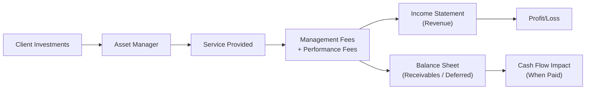

## Introduction

Asset management firms play a unique role in the financial ecosystem, helping individuals, institutions, and sometimes even entire governments manage their investments. They can range from small boutique practices to massive international organizations overseeing billions (or even trillions!) in assets. Regardless of size, most asset managers rely on two main sources of revenue: management fees and performance-related (incentive) fees. These fee structures can get pretty complicated, and, honestly, sometimes it feels like you need a translator to understand all the nuances. In this section, we’ll break down how these fees work, discuss the accounting implications under IFRS and US GAAP, and explore best practices (and potential pitfalls) that analysts should watch out for.

## Understanding Management Fees

Management fees are often the bread and butter for most asset managers. The standard structure (and you might see this in mutual funds, hedge funds, private equity, or even ETFs) is that the firm charges a regular fee—say, annually or quarterly—based on the total assets under management (AUM).

• Commonly expressed as a percentage (e.g., 1% or 2% of AUM per year).  
• Typically recognized on a pro rata basis over the period for which the management services are provided.  
• Provide a stable income stream for the asset manager, though obviously subject to changes in AUM (inflows, outflows, and market value fluctuations all play a role).

### Accounting Implications of Management Fees  
From an accounting standpoint, management fees are recognized as revenue in the income statement when services are rendered. Under IFRS (IFRS 15) and US GAAP (ASC Topic 606), revenue recognition hinges on the concepts of “performance obligations” and “control.” Because these fees are earned over time, the asset manager typically recognizes them proportionally across the fee period. Fee receivables (the portion of fees earned but not received) appear on the balance sheet as assets. Deferred revenue appears when the investor pays in advance for services that haven’t been fully rendered yet.

## Performance (Incentive) Fees

Now, let’s talk about the more interesting (and sometimes controversial) side of the fee equation: performance or incentive fees. If you’ve ever seen a hedge fund’s marketing materials, you’ll notice emphasis on how they only make money if their clients make money. That’s the performance fee in action.

• Calculated as a percentage of investment returns exceeding a predefined hurdle rate or benchmark.  
• In private equity or venture capital, incentive fees might also manifest as “carried interest.”  
• Often subject to a “high-water mark,” ensuring that clients don’t pay performance fees repeatedly for the same gains.  

### Hurdle Rates  
A hurdle rate is the minimum annual return the asset manager must achieve before performance fees kick in. For example, if the hurdle rate is 5% and the fund returns 8%, the manager’s performance fee might apply only to the 3% excess.

### High-Water Mark  
The high-water mark ensures clients aren’t charged a performance fee multiple times on the same increment of profits. If the fund’s net asset value (NAV) falls after a period of poor performance, the manager only begins to earn performance fees again once the NAV surpasses the previous peak.

### Carried Interest  
Carried interest is common in private equity or hedge funds. Here, the manager receives a share of the fund’s profits (often 20%) after reaching a certain return threshold. Under IFRS and US GAAP, carried interest is typically recognized when it’s probable and reasonably estimable—crucially, it can create significant volatility in reported earnings because it depends on realized gains. Clawback provisions can further complicate the timing of revenue recognition (we’ll get to that in just a moment).

### Clawback Provisions  
A clawback provision may require the manager to return previously earned incentives if future returns underperform. This can be especially important in private equity structures where gains and losses might occur in different periods. An investor-friendly clawback means analysts should carefully review footnotes: one period might show strong profits (and big performance fees), but a subsequent downturn might trigger a give-back. It’s crucial to factor that into your analysis of the firm’s sustainable revenue.

## Accounting Nuances for Performance Fees

Under IFRS 15, an entity recognizes performance fees only when it’s highly probable that a significant reversal in revenue will not occur. For performance fees dependent on future market values or realized investment performance, timing can be key. US GAAP has similar principles, but the specific guidance for investment companies is found in ASC Topic 946, which adds unique nuances for funds with complex incentive arrangements.

In practice, this means a hedge fund manager might defer recognizing a performance fee—even if it’s technically “earned” for the reporting period—until the return is more certain. If the prospect of future losses or clawbacks is significant, the manager may not be able to book the fee immediately. This leads to potential differences between reported net income and actual economic benefits.

## Impact on the Firm’s Financial Statements

Let’s walk through the primary statements and see how these fees show up:

### Income Statement

• Management fees: Usually recognized evenly across the reporting period, providing a relatively steady revenue line.  
• Performance fees: May cause lumpiness or spikes in income when market conditions are particularly good (or a big exit event occurs in private equity).  
• Carried interest: Impact can be quite large if the fund has become highly profitable, but remember the caveat on clawbacks—some or all of this might be reversed in later periods.

### Balance Sheet

• Fee receivables: The recognized but unpaid portion of management or performance fees. This can fluctuate with market conditions and billing cycles.  
• Deferred revenue: If the firm receives payments for fees in advance, that unearned portion is recorded as a liability.  
• Contingent liabilities: If there’s a clawback provision that implies a future payment, it must be disclosed as a potential liability or recognized if it meets probability thresholds.

### Cash Flow Statement

Fees might be recognized at one point in time but collected at another. Performance fees might be realized only after a specific date (e.g., after a year-end NAV is calculated). This timing gap can be seen in the operating activities section of the cash flow statement.

## Influence of Market Conditions

It might sound obvious, but it’s worth emphasizing: strong markets (or bull markets) help AUM grow and often generate higher performance fees. Conversely, bear markets or abrupt downturns can slash performance fees to zero and might cause declines in AUM (investors pulling money out or simply losing value). As a result, revenue from asset management can be highly procyclical. Analysts should pay close attention to how robust the firm’s client base is in different market environments and whether fee structures might mitigate or exacerbate volatility.

## Transparency and Disclosures

Regulators worldwide—like the SEC in the U.S. and ESMA in the EU—put a lot of emphasis on clear fee disclosure. From an analyst’s perspective, you want to see:

• Precise explanations of how fees are calculated (especially performance fees).  
• The presence (or absence) of high-water marks, hurdle rates, and clawback provisions.  
• How fees are recognized on the income statement, including any ongoing contingent liabilities.  
• The manager’s track record of fee arrangement changes: have they tinkered with the high-water mark or changed incentive fee rates often?  

## Red Flags to Watch Out For

• Unusually high performance fees vs. peers: Could indicate aggressive fee structures that might not be sustainable (or might deter future investors).  
• Opaque or overly complicated fee calculations: Are they burying something? Hidden disclaimers can obscure how fees are really derived.  
• Frequent changes to fee terms without justification: Might hint at attempts to boost short-term revenue or hide poor performance.  
• Large swings in performance fees quarter-to-quarter with minimal explanation: Could signal timing manipulations or questionable valuations of illiquid assets.

## Gross vs. Net-of-Fee Performance Reporting

Many asset managers tout their performance track record in marketing materials. It’s crucial—both ethically and for compliance—that they distinguish between gross of fees (before deducting management/performance fees) and net of fees (after all fees). From an investor’s perspective, net-of-fee returns are the real bottom line. An analyst should carefully check how performance is reported in the financial statements and any official marketing disclosures.

## Evaluating Fund Manager Track Records

When analyzing a fund manager over the long term, consider these key points:

• Consistency in applying fee structures.  
• The presence of any structural advantage (like a stable client base that won’t rapidly exit during market dips).  
• Historical performance relative to both market benchmarks and peer funds, net of all fees.  
• Clarity around how fees might change once the fund grows to a certain size (some funds reduce the management fee if AUM crosses a threshold).

## Case Studies and Legal/Regulatory Challenges

We’ve seen real-world examples—some quite dramatic—of managers facing lawsuits or regulatory sanctions for misrepresenting fees. For instance, a hedge fund might claim they charge a “2 and 20” (2% management fee, 20% incentives) but then add “supplementary fees” that push the total take much higher. Investors and regulators alike are paying more attention to these details. Whenever you see big differences between stated fees and actual net returns, it’s time to ask tough questions.

## Practice Tips for Exam Settings

• Read the footnotes carefully. Fee structures can hide in the details, and the exam might present a vignette that includes subtle mentions of “deferred management fee” or “clawback exposure.”  
• Be ready to calculate net returns after fees. If you’re given performance data, always confirm whether the figures include or exclude management/performance fees.  
• Watch for timing differences in the recognition of performance fees—maybe the question is testing your understanding of IFRS vs. US GAAP on revenue recognition.

## A Quick Diagram: Fee Recognition Flow

Below is a simplified Mermaid diagram illustrating how management fees and performance fees flow through to the financial statements. The firm (Asset Manager) provides investment services, which generate fees that show up as revenue in the income statement after certain recognition rules, while some portion may sit temporarily on the balance sheet as receivables or deferred revenue.



## Simple Python Example

Just for fun, let’s illustrate a quick Python snippet to calculate a hypothetical performance fee. Let’s assume we have a fund with a hurdle rate of 5%, and the actual return in a given period is 10%. The manager charges 20% of the excess return above the hurdle.

```python
def performance_fee_calculator(aum, actual_return, hurdle_rate, perf_fee_rate):
    # Convert percentages to decimal
    act_ret_decimal = actual_return / 100
    hurdle_decimal = hurdle_rate / 100
    perf_rate_decimal = perf_fee_rate / 100
    
    # Evaluate if the actual return exceeds the hurdle
    if act_ret_decimal > hurdle_decimal:
        excess_return = act_ret_decimal - hurdle_decimal
        fee_amount = aum * excess_return * perf_rate_decimal
    else:
        fee_amount = 0
    
    return fee_amount

case_fee = performance_fee_calculator(aum=100_000_000, actual_return=10, hurdle_rate=5, perf_fee_rate=20)
print(f"Performance Fee for the period: ${case_fee:,.2f}")
```

This snippet sums up how a performance fee might be computed at a high level. In practice, you’d layer on additional complexities like high-water marks or multi-year carry measures.

## Conclusions and Best Practices

In short, analyzing asset management fee structures demands attention to detail. Be mindful of how revenue recognition rules differ between IFRS and US GAAP, especially around performance fees and carried interest. Don’t overlook the effect of clawbacks, hurdle rates, and high-water marks on the timing and magnitude of revenues. When performing ratio analysis or forecasting future revenues, incorporate potential swings in fee income due to market volatility. Always remember: transparency in disclosures is crucial, and analysts must be vigilant about reading the fine print.

• Stability vs. Volatility: Management fees offer recurring revenue but scale with AUM, whereas performance fees can fluctuate wildly with market returns.  
• Disclosure is Everything: Fee structures, their calculations, and potential clawbacks should be clearly stated in financial statements and footnotes.  
• Investor Protections in Focus: High-water marks, hurdle rates, and clawbacks are designed to protect investors, but also influence the manager’s income profile and risk.  
• IFRS vs. US GAAP: Subtle differences exist in how performance fees are recognized, so keep your eyes peeled for the specifics.

Stay curious, and don’t be shy about asking managers tough questions. The more you dig, the better you’ll grasp the sustainability and fairness of these fee arrangements. Oh, and if you ever feel overwhelmed, remind yourself that even many seasoned analysts spend plenty of time parsing these details carefully—so you’re not alone!

## Glossary

• Management Fee: A periodic fee charged by the asset manager based on the total assets under management (AUM).  
• Performance Fee (Incentive Fee): A fee earned if the fund’s returns exceed a specified benchmark or hurdle.  
• High-Water Mark: The highest peak in value that a fund has reached, ensuring clients don’t pay performance fees twice on the same gains.  
• Hurdle Rate: A minimum return that the fund manager must achieve before collecting performance fees.  
• Carried Interest: A share of the profits from an investment fund paid to the fund manager, typically in private equity or hedge funds.  
• Clawback Provision: A contractual agreement that allows investors to reclaim previously paid performance fees if overall returns fall below expectations.  
• Deferred Revenue: Revenue that has been billed or collected but not yet recognized in the income statement.  
• Receivables (Fee Receivables): The amount of earned fees that has not yet been received in cash.

## References & Further Reading

• CFA Institute Program Curriculum, 2025 Edition – Readings on Alternative Investments.  
• IFRS.org – Publications on revenue recognition for investment management.  
• FASB Accounting Standards Codification (ASC) Topic 946 for U.S. GAAP guidance on investment companies.

## Exam Practice: Asset Management Fee Structures

Below are 10 practice questions to help you test your knowledge. Take your time to read the scenarios carefully and think about how these fee concepts apply.



### Which of the following best describes a management fee for an asset management firm?

- [ ] A fee charged only if returns exceed a predetermined benchmark.  
- [x] A fee, often as a percentage of AUM, charged periodically for investment services.  
- [ ] A one-time performance bonus for exceeding a high-water mark.  
- [ ] A fee reversed in a clawback provision after losses surpass expectations.  

> **Explanation:** A management fee is typically a periodic charge (e.g., annually or quarterly) based on the total assets under management. It is not contingent on performance.

### Assume a hedge fund uses a 5% hurdle rate and charges 20% on returns above that hurdle. If the fund achieves a 10% return on a portfolio worth $100 million, how much is the performance fee?

- [ ] $2 million.  
- [ ] $3 million.  
- [x] $1 million.  
- [ ] $5 million.  

> **Explanation:** The excess return is (10% – 5%) = 5%. Applied to $100 million, that’s $5 million. Then multiplying by 20% yields $1 million in performance fees.

### Under IFRS 15, when can performance fees be recognized by an asset management firm?

- [x] Only when it is highly probable that a significant reversal in revenue will not occur.  
- [ ] As soon as the fiscal year begins.  
- [ ] When the client signs the management contract.  
- [ ] Exactly in proportion to the management fee schedule.  

> **Explanation:** IFRS 15 requires that revenue is recognized only to the extent it is highly probable there will be no significant reversal in future periods, which is crucial for performance fees in volatile markets.

### Which concept is intended to prevent paying multiple performance fees on the same gains?

- [ ] Hurdle rate.  
- [x] High-water mark.  
- [ ] Deferred revenue.  
- [ ] Clawback provision.  

> **Explanation:** A high-water mark is the fund’s highest historical value, ensuring that if the value drops, no additional performance fees are taken until the prior peak is surpassed again.

### What is a key accounting consideration for carried interest under US GAAP?

- [ ] It is always recognized immediately upon earning.  
- [ ] It is recognized when the management contract is renewed.  
- [x] It is typically recognized when it is both realized and reasonably estimable under ASC Topic 946.  
- [ ] It is never subject to reversal.  

> **Explanation:** Carried interest under ASC 946 for investment companies is recognized when it’s realized and reasonably estimable. Future clawbacks can trigger reversals if conditions change.

### A hurdle rate is defined as:

- [x] The minimum return an asset manager must achieve before charging a performance fee.  
- [ ] A guaranteed rate of return offered to hedged investors.  
- [ ] A measure of the highest NAV achieved to date by the fund.  
- [ ] The set interest rate that replaces floating coupons in structured notes.  

> **Explanation:** The hurdle rate is a specific threshold return. If the fund does not exceed this rate, no performance fee is charged.

### Which of the following might you expect to find in the notes to the financial statements of an asset management firm with performance-based fees?

- [ ] Detailed daily calculations of NAV changes.  
- [x] Clawback provisions describing conditions under which previously recognized fees might be returned.  
- [ ] Guaranteed interest rate structures for bond investments.  
- [ ] Research reports detailing market outlook for the next quarter.  

> **Explanation:** Clawback provisions, if applicable, must be disclosed so investors can understand the conditions under which fees may be refunded to clients.

### Why might performance fees cause revenue volatility for an asset management firm?

- [ ] Because management fees are too predictable and overshadow them.  
- [x] Because performance fees depend on market conditions, which can produce swings in returns and the resulting fees.  
- [ ] Because fees are recognized pro rata over the entire fund life, reducing volatility.  
- [ ] Because performance fees are always negative.  

> **Explanation:** Performance fees can soar in strong markets or drop to zero during downturns, leading to fluctuation in an asset manager’s top line.

### Which statement about deferred revenue in asset management is correct?

- [ ] Deferred revenue is recognized once the performance fees are earned.  
- [ ] Deferred revenue is never disclosed because it’s not a liability.  
- [x] Deferred revenue arises when fees are collected in advance of services rendered.  
- [ ] Deferred revenue is only recorded in the event of a clawback.  

> **Explanation:** Deferred revenue represents amounts already billed or collected but not yet earned, typically recognized as a liability until the service period passes.

### True or False: A high-water mark ensures an asset management firm always receives performance fees, regardless of losses.

- [ ] True  
- [x] False  

> **Explanation:** If the fund experiences a loss after a previous gain, the asset manager does not earn a new performance fee until the fund’s value passes the prior high-water mark.


