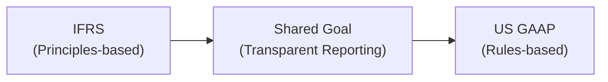

## Overview of the Regulatory Landscape

Have you ever tried juggling two sets of accounting standards all at once—like IFRS and U.S. GAAP? Let’s just say it’s a bit like learning two different dance styles simultaneously. One might be more principles-based (IFRS), and the other more rules-based (U.S. GAAP). They have plenty in common—ensuring transparent financial reporting, investor protection, etc.—but the subtle differences can get you spinning in circles if you’re not careful. This is especially important for specialized financial entities, like asset managers or consumer finance firms, which often hold unique investment vehicles or structure deals through special purpose entities.

Under IFRS, the International Accounting Standards Board (IASB) sets the tone through standards including IFRS 9 (Financial Instruments), IFRS 10 (Consolidated Financial Statements), and IFRS 15 (Revenue from Contracts with Customers). In the U.S., the Financial Accounting Standards Board (FASB) is the corresponding authority with its Accounting Standards Codification (ASC)—most notably topics like ASC 606 (Revenue from Contracts with Customers) and CECL requirements for financial instruments.

Anyway, let's walk through the main points you need to know for the CFA exam. This section focuses on how IFRS and U.S. GAAP overlap, yet differ, in regulating specialized financial entities. Whether you’re looking at variable interest entities (VIEs) in the U.S. or analyzing IFRS 10’s consolidation rules, understanding these crossovers will help you unravel the footnotes in those lengthy vignettes.

## Key Differences and Convergence Efforts

While IFRS and U.S. GAAP used to stand further apart—kind of like two distant cousins—over the last couple of decades they've started to harmonize. There have been big joint projects aimed at standardizing definitions and measurement criteria, particularly around revenue (IFRS 15 and ASC 606) and financial instruments (IFRS 9 and the U.S. GAAP CECL model). The frameworks are not yet identical, and specialized financial entities still face divergences in areas such as:

• Consolidation requirements (IFRS 10 vs. VIE model under ASC 810).  
• Revenue recognition subtleties (IFRS 15 vs. ASC 606).  
• Classification of financial liabilities vs. equity instruments.  
• Detailed disclosure requirements for off-balance-sheet exposures.  

Sometimes a particular loan or a structured finance product will be accounted for differently depending on whether IFRS 9’s expected credit loss (ECL) model or the CECL model under U.S. GAAP is used. On the exam, you may see item-set questions that test your ability to reconcile these differences and compute the resulting changes in net income, equity, or key solvency ratios.

## Consolidation Nuances: IFRS 10 vs. VIE Requirements

In IFRS, consolidation is governed by IFRS 10, which focuses on the concept of control. Control is determined by whether an investor has:

• Power over the investee (i.e., the rights to direct relevant activities).  
• Exposure or rights to variable returns.  
• The ability to use its power to affect those returns.  

Under U.S. GAAP, specialized financial entities often fall under the Variable Interest Entity (VIE) model in ASC 810. A VIE requires consolidation when an entity holds a variable interest and has a controlling financial interest—meaning it either absorbs the majority of the VIE’s expected losses or receives the majority of its residual returns.

At first glance, IFRS 10 and ASC 810 seem to share “control” as the magic word. But the technical definitions can diverge. Under IFRS 10, you look at power and exposure to variable returns as a more principles-oriented approach. Under U.S. GAAP, you might get stuck applying the VIE rules, which rely on bright-line thresholds like “primary beneficiary” status. In practice, that might mean an SPE consolidated under IFRS 10 could remain off-balance-sheet under VIE rules, or vice versa.

## Expected Credit Loss Models: IFRS 9 vs. CECL

IFRS 9 brought a big shift to the IFRS world with its 3-stage expected credit loss (ECL) model for impairing financial instruments:

• Stage 1: 12-month ECL from initial recognition.  
• Stage 2: Lifetime ECL if there is a significant increase in credit risk.  
• Stage 3: Credit-impaired assets with a recognition of lifetime ECL plus interest on net carrying amount.  

Meanwhile, U.S. GAAP’s CECL (Current Expected Credit Loss) model requires that entities recognize lifetime expected losses from day one, not just when they detect a rise in credit risk. This difference can lead to timing mismatches in recognized losses. For instance, a specialized entity with a portfolio of consumer loans might show bigger initial impairments under CECL compared to IFRS 9’s Stage 1.

I recall a conversation with a colleague who was analyzing an asset-backed security under dual reporting. He was startled by how quickly losses accumulated under CECL because they had to estimate lifetime losses up front. In IFRS 9, the early-stage impairment might have been smaller until certain credit triggers were met. It’s not that one model is necessarily more conservative across the board; it’s more about how and when you recognize the same underlying risk.

## Revenue Recognition Differences: IFRS 15 vs. ASC 606

Both IFRS 15 and ASC 606 use the infamous five-step approach to revenue recognition:

1) Identify the contract with the customer.  
2) Identify the performance obligations.  
3) Determine the transaction price.  
4) Allocate the transaction price to the performance obligations.  
5) Recognize revenue when (or as) the entity satisfies the performance obligations.  

In most simple scenarios, these frameworks yield very similar outcomes. But specialized financial entities that earn performance-based fees, variable considerations, or interest income on complex financial instruments may face subtle timing variations. IFRS 15 sometimes provides more interpretation leeway on variable consideration constraints, leading to slightly different recognition patterns compared to ASC 606.

## Classification of Financial Liabilities and Equity

When specialized entities issue preferred shares or convertible instruments, IFRS and U.S. GAAP can disagree on whether those instruments are debt or equity. Often, IFRS has more emphasis on the substance of the contractual arrangement—whether the issuer is “unconditionally obligated” to deliver cash or another asset. U.S. GAAP can rely on specific rules (ASC 480 or derivatives guidance) that might classify a convertible preferred share differently if certain triggers exist. Watch out for these classification mismatches because they can swing leverage ratios significantly.

## Disclosure Requirements and Off-Balance-Sheet Exposures

One of the biggest ways IFRS 10 vs. ASC 810 can trip you up is in how you disclose off-balance-sheet exposures. For example, if an SPE or VIE isn’t consolidated, IFRS might still demand robust footnote disclosures about the nature of your involvement, the maximum loss exposure, and additional support provided. The same is true under U.S. GAAP, but the detail can differ. Specialty finance companies—particularly those that do a lot of securitizations—will often highlight residual interests in off-balance-sheet securitizations. Keep an eye on the footnotes and MD&A sections; exam questions often prompt you to interpret them to see whether an entity might have hidden obligations or exposures.

## Practical Reconciliation Exercises

In exam item sets, you may be confronted with something like: “Company X prepares its statements under IFRS. Adjust the below items to reflect U.S. GAAP.” Then you’ll see differences in how:

• Impairments on certain securities are measured (IFRS 9 vs. CECL).  
• Certain structured entities are consolidated (IFRS 10 vs. VIE).  
• Revenue from performance fees is recognized.  

I personally think these reconciliation exercises are magical ways to see the underlying logic of each standard. You’ll quickly note how some IFRS-based lines might be reclassified or recalculated under U.S. GAAP. For instance, you might change net income because IFRS 9 recognized fewer impairments in an early period. Or you might restate equity if a convertible bond is parted into separate equity and liability components. Doing these conversions in practice vignettes is a highly effective study approach.

## Monitoring Ongoing Updates

The IFRS Foundation and FASB keep evolving those standards, especially around disclosures, consolidation, and financial instrument classification. So if you’re analyzing specialized financial entities, staying updated is key. If your exam question references “the new IFRS 9 or CECL rules,” you’ll be ready. And in real life, you’ll see the additional wrinkles that regulatory bodies (like the SEC in the U.S.) can add, particularly regarding asset managers’ valuations of complex instruments.

## Impact on Key Ratios

Shifting a financial instrument from IFRS 9 classification or measurement to the U.S. GAAP approach can have ripple effects on:

• Leverage Ratios (Debt vs. Equity classification).  
• Interest Coverage (due to different revenue or interest expense treatment).  
• Return on Equity (due to impairment differences).  
• Liquidity Metrics (especially if something is consolidated in IFRS but not under VIE rules).  

That’s why an item-set question might prompt you to recalculate the debt-to-equity ratio under U.S. GAAP, or recast interest coverage. The outcome? Perhaps a higher or lower coverage ratio, all because IFRS lumps certain financing obligations into a different bucket than U.S. GAAP, or vice versa.

## Quick Mermaid Diagram: IFRS vs. US GAAP Goals

Below is a simplified visualization to show how IFRS and U.S. GAAP aim for common objectives but sometimes diverge:

Even though they converge on greater transparency and investor protection, the path they take can differ in application details, especially for specialized entities.

## Best Practices and Pitfalls

• Always check footnotes and MD&A for disclosures about unconsolidated structured entities or contingent liabilities.  
• Look carefully at how revenues are recognized for specialized fee structures—especially performance-based or usage-based fees.  
• Be cautious with convertible instruments: IFRS might record a debt and equity component separately, while U.S. GAAP might see it as purely a liability.  
• Monitor any changes in IFRS 9 and CECL. The smallest detail in how expected credit losses are measured can shift your net income.  

## Exam-Day Tips

• Practice adjusting IFRS-based financial statements to U.S. GAAP (and vice versa).  
• Pay attention to question prompts about “primary beneficiary” or “significant increase in credit risk”—buzzwords for consolidation or impairment triggers.  
• Know your IFRS 15 vs. ASC 606 revenue recognition steps intimately, but don’t forget that subtle differences in variable consideration can appear in item sets.  
• Skim the footnotes in vignettes for special purpose entities, off-balance-sheet items, or intangible but material exposures.  

## References and Further Reading

• FASB Accounting Standards Codification Topic 810 (Consolidation) – VIE rules.  
• IFRS.org for the latest publications on IFRS 9 (Financial Instruments), IFRS 10 (Consolidated Financial Statements), and IFRS 15 (Revenue from Contracts with Customers).  
• PCAOB and SEC guidelines for asset managers on fair value measurement, especially around specialized products.  

If you keep these points in mind, you won’t trip over the IFRS/GAAP differences in specialized financial entities. And trust me, if you can handle two dance styles, you can master IFRS vs. U.S. GAAP in time for your exam!

## Practice Questions: IFRS vs. US GAAP Regulatory Overlaps



### When consolidating specialized financial entities, IFRS 10 requires an entity to demonstrate:
- [ ] A majority voting interest plus board representation.
- [ ] Transfer of risks and rewards to a third party.
- [x] Power over the investee and exposure to variable returns.
- [ ] Equity ownership exceeding 50% of total capital.

> **Explanation:** IFRS 10 focuses on the principle of control, which involves power over the investee and exposure to variable returns, plus the ability to use that power to affect the returns.

### Under U.S. GAAP, a primary beneficiary of a Variable Interest Entity (VIE) must:
- [x] Absorb the majority of the entity’s expected losses or receive a majority of its benefits.
- [ ] Have more than 50% equity ownership in the entity.
- [ ] Possess only decision-making rights without risk exposure.
- [ ] Consolidate only if the SPE is headquartered domestically.

> **Explanation:** ASC 810 requires consolidation if the reporting entity is the primary beneficiary, meaning it absorbs most of the VIE’s expected losses or receives a majority of its residual returns.

### Under IFRS 9’s impairment model, what triggers moving from Stage 1 to Stage 2?
- [ ] The asset has been fully written off.
- [x] A significant increase in credit risk has occurred.
- [ ] The collateral value exceeds the loan principal.
- [ ] The borrower has made an early repayment of principal.

> **Explanation:** IFRS 9’s three-stage approach moves instruments to Stage 2 for lifetime expected credit losses only after a significant increase in credit risk is identified, even if actual default has not occurred.

### In the U.S. GAAP Current Expected Credit Loss (CECL) model:
- [ ] Lifetime expected losses are recognized only after default occurs.
- [ ] Impairments are exclusively recognized using a discounted cash flow approach.
- [x] Lifetime expected losses are recognized immediately upon origination or purchase.
- [ ] No forward-looking information is considered in impairment estimates.

> **Explanation:** CECL mandates that lifetime expected credit losses be recorded at the initial recognition of the financial asset, incorporating forward-looking assessments of credit risk.

### A performance fee under IFRS 15 might differ from ASC 606 in timing primarily because:
- [x] Different constraints on recognizing variable consideration can alter the timing.
- [ ] Only IFRS recognizes revenue in multiple steps.
- [x] IFRS prohibits recognizing any variable consideration.
- [ ] U.S. GAAP explicitly requires revenue recognition on a cash basis for performance fees.

> **Explanation:** Although IFRS 15 and ASC 606 share a five-step model, the details of variable consideration constraints can vary, thus affecting the exact timing of revenue recognition for performance-based fees.

### Which of the following disclosures are typically required when unconsolidated SPEs exist under IFRS 10?
- [ ] No disclosures needed if the entity does not own more than 50% equity.
- [x] The nature of the entity’s relationships, risks, and maximum exposure to loss.
- [ ] Only a statement confirming no significant ongoing involvement.
- [ ] Mandatory reconciliation of IFRS to local GAAP statements.

> **Explanation:** IFRS 12 requires disclosures of the nature, risks, and maximum exposure to loss for unconsolidated SPEs or structured entities, even if they are not consolidated.

### A convertible bond that meets IFRS equity criteria might be classified differently under U.S. GAAP because:
- [x] ASC 480 requires specific liability classification for certain convertible instruments.
- [ ] IFRS automatically treats all convertible bonds as equity.
- [x] CECL forbids classifying convertible bonds as equity.
- [ ] IFRS does not allow split accounting for convertible bonds.

> **Explanation:** IFRS could treat part of the convertible bond as equity if it meets certain conditions, whereas U.S. GAAP often has more prescriptive liability classification requirements for these instruments under ASC 480.

### Which statement about IFRS 15 vs. ASC 606 is correct?
- [x] Both share a five-step revenue model with mostly similar principles.
- [ ] ASC 606 applies only to manufacturing companies.
- [ ] IFRS 15 includes explicit guidance only for performance-based fees.
- [ ] IFRS 15 is about financial instruments, not revenue contracts.

> **Explanation:** Both IFRS 15 and ASC 606 are closely aligned five-step frameworks for revenue recognition across various industries, though minor differences can lead to different timing in special situations.

### In an exam scenario, a reconciliation between IFRS and U.S. GAAP often focuses on:
- [ ] Identical recognition of credit losses and intangible assets.
- [ ] Converting financial statements to local statutory reporting.
- [x] Potential changes in net income or equity due to classification or impairment rules.
- [ ] Adjusting fair values to the lower of cost or market.

> **Explanation:** A common reconciliation challenge involves recognizing how IFRS 9 vs. CECL or IFRS 10 vs. VIE guidance changes net income and equity. Many exam item sets test candidates’ ability to perform these adjustments.

### True or False: U.S. regulatory agencies, such as the SEC, may introduce additional reporting requirements beyond FASB standards for specialized financial entities.
- [x] True
- [ ] False

> **Explanation:** Regulatory bodies like the SEC can impose extra disclosures and oversight measures on top of FASB standards, particularly relevant to asset managers, consumer finance companies, and other specialized entities.


