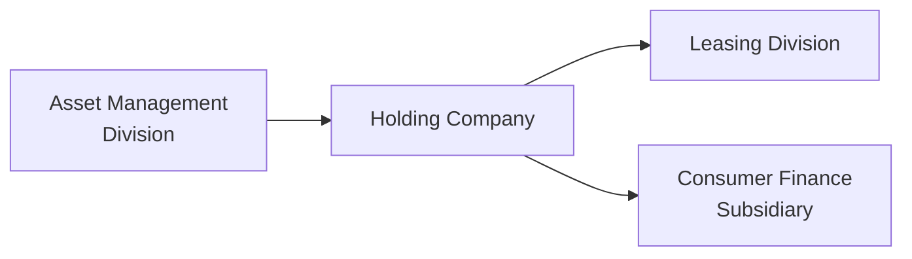

## Introduction and Context

Have you ever come across those footnotes in a financial statement that reference multiple lines of business—like an entity that provides consumer loans, manages a handful of investment funds, and also leases out specialized equipment? You know, the kind of company that makes you go, “Wait, are they a bank, an asset manager, or a leasing firm?” In these scenarios, I always remember the first time I tried to consolidate one of these beasts during my internship years—my Excel spreadsheet looked like a jigsaw puzzle waiting to be solved.

Well, that’s exactly what we explore here: a practice section focusing on item-set style questions for “Mixed Financial Entities.” This is a big part of preparing for the Level II CFA® exam because the examiners love to craft vignettes that weave together asset management fees, leasing revenues, consumer lending interest, and more. Exam day can then throw you a curveball: “Under IFRS, how would the lease income be recognized? Under U.S. GAAP, how do you classify leased assets? And what about intangible assets that you might capitalize under IFRS but not under GAAP?” Oh boy. This can be dizzying.

Below, we’ll untangle these complexities with an integrated approach. We’ll also highlight crucial IFRS references (IFRS 9, IFRS 15, IFRS 16) and their U.S. GAAP counterparts (ASC 606, 842, 810), so you don’t make the mistake of mixing up your leases and your performance fees. Let’s get started.

## Multiple Angles: IFRS vs. U.S. GAAP at a Glance

Mixed financial entities typically operate in more than one segment. One segment might earn fee income from asset management. Another segment might hold a lease portfolio. Still another might hold consumer loans. We need to be aware of the different revenue recognition rules that apply to each stream, and how they might differ across IFRS and U.S. GAAP.

• Leasing:  
  – IFRS 16 requires almost all leases to be on the balance sheet, with a right-of-use (ROU) asset and a corresponding lease liability.  
  – ASC 842 (U.S. GAAP) follows a broadly similar framework but watch out for subtle differences in identifying finance versus operating leases.  

• Asset Management Fees:  
  – IFRS 15 deals with performance obligations and the timing of fee recognition. Typically, these fees are recognized over time, unless you have “performance-based” or “success-based” fees that get recognized at specific contractual milestones.  
  – ASC 606 (U.S. GAAP) is conceptually aligned but the steps and disclosures can differ slightly.  

• Consumer Finance (Loan-Related Interests):  
  – IFRS 9 (Financial Instruments) deals with recognition, classification, and impairment of financial assets (like consumer loans).  
  – Under U.S. GAAP, loan classification and impairment revolve around different ASC topics (e.g., 310, 326), often focusing on expected credit losses.  

When an entity is multinational, foreign exchange fluctuations can amplify these differences. For example, a consumer loan issued in Brazilian reals but recognized in a parent entity using U.S. GAAP requires consistent translation and reevaluation for currency changes.

## Step-by-Step Approach to Mixed-Entity Vignettes

One common pitfall is reading a complicated item set in a linear, or “one-and-done,” manner. You want to circle back to the footnotes, disclaimers, and entity details repeatedly. The exam is timed, so you also need to be mindful of efficiency. Here’s a quick stepwise method:

(1) Identify the Entity and Its Segments  
   • What exactly does each segment do? Are you looking at an asset manager segment with performance-based fees, or is there also a leasing unit or a consumer finance arm?  
   • Notice if disclosures indicate a separate or consolidated entity—maybe a variable interest entity (VIE) that is consolidated for financial reporting.

(2) Note IFRS or GAAP Details  
   • Look for explicit references in the vignette: “Under IFRS 16” or “Per FASB ASC 842.”  
   • If none is stated, watch for subtle clues such as classification of right-of-use assets or how performance fees are recognized.  

(3) Examine Key Footnote Disclosures  
   • Watch for intangible assets from an acquired asset manager. Are they indefinite-lived or finite-lived?  
   • Check how the company determines fair values for consumer loans. Do they use expected credit loss?  
   • Spot any disclaimers—like “Revenues are recognized based on management’s best estimate,” which might hint at possible revenue inflation or aggressive accounting.  

(4) Compute Targeted Metrics Carefully  
   • If you’re asked for net interest margin, don’t forget interest income on consumer loans minus interest expense, then compare it with average earning assets.  
   • Operating margin might require segment-level data, especially if asset management fees are recognized differently under IFRS vs. GAAP.  
   • Return on equity can sometimes require adjustments if intangible assets or ROU asset valuations differ.  

(5) Interpret Results in Light of the Framework  
   • IFRS might require more immediate recognition of derivatives-related gains and losses, while U.S. GAAP might differ in presentation.  
   • Make sure you connect the final answer to the conceptual framework. If the restitution is about intangible assets, you want to mention IFRS guidelines for intangible recognition, or ASC 350 in U.S. GAAP.  

## Common Trick Spots and Pitfalls

• Mixing Up Operating vs. Finance Leases: I once had a meltdown on a practice exam because I incorrectly categorized an operating lease as a finance lease and ended up messing up all the subsequent calculations. Keep IFRS 16 (single treatment) vs. ASC 842 (possible dual classification) clear.  
• Performance Fees: The biggest confusion arises when success-based fees are recognized either too early or too late. IFRS 15 and ASC 606 focus on whether performance obligations have been met or if a probable threshold has been crossed.  
• Securitized Pools: If part of the consumer finance portfolio is securitized, does the entity still have “control” under IFRS 10 or VIE guidance under ASC 810? That changes everything about consolidation.  
• Foreign Exchange Gains/Losses: The parent entity’s exposure might be partially hedged or not at all. If you see “CTA” (Cumulative Translation Adjustment), that’s your IFRS vs. GAAP red flag about potential differences in remeasurement vs. translation.  

## Integrated Example with a Mermaid Diagram

Before we jump to the formal vignette drills, let’s chart a quick visual of how these lines of business might intersect within a single holding company:

• Asset Management Division: Earns base management fees and performance fees.  
• Leasing Division: Operates a fleet of specialized equipment on long-term leases, recognized under IFRS 16/ASC 842.  
• Consumer Finance Subsidiary: Issues credit cards and personal loans, subject to IFRS 9 or CECL (Current Expected Credit Loss) under U.S. GAAP.  

From B’s perspective, you have to consolidate A, C, and D if you hold controlling interests—and possibly some variable interest entity if the ownership structure is intangible. It all flows up into B’s consolidated statements, each item recognized per IFRS or U.S. GAAP.

## A Quick Ratio Refresher Using KaTeX

When analyzing a single entity with multiple segments, you might have to recast certain lines of the income statement or balance sheet. Suppose they give you:

• Net interest income (NII) from consumer lending: \\( \text{NII} = \text{Interest Income} - \text{Interest Expense} \\)  
• Lease revenue: \\( \text{Lease Rev} \\)  
• Management fees: \\( \text{Mgmt Fee} \\)  

An adjusted operating margin could be:


\text{Operating Margin} = \frac{\text{NII} + \text{Lease Rev} + \text{Mgmt Fee} - \text{Operating Expenses}}{\text{Total Revenue}}


It’s easy to forget that under IFRS 16, some expenses may shift between line items. That tiny reclassification can cause big differences in margin calculations.

## Practice Tips for the Exam

• Time Management: Budget a few minutes to thoroughly read the vignette and highlight key footnotes. But do not get stuck on one detail—perhaps 2-3 minutes reading, then 1 minute per question.  
• Always Check Disclosures: The exam may embed disclaimers like “Management recognized certain intangible assets for software licenses that might normally be expensed.” That’s your clue to question the validity of intangible asset recognition.  
• Ethical Considerations: If the footnotes mention changes in accounting policies that increase revenue suspiciously, consider how that might violate the CFA Institute Code and Standards on fair presentation.  

## Sample Vignette: The International Funding Group

Imagine we have a company called International Funding Group (IFG). It has three segments:

• Segment A: Asset Management, primarily invests in emerging market equities.  
• Segment B: Leasing, focusing on heavy machinery in Asia-Pacific.  
• Segment C: Consumer Finance, offering personal loans in Europe.  

According to the footnotes:  
• IFRS 16 is used by Segment B for lease accounting. The lease portfolio is recognized as finance leases.  
• ASC 606 is applied by Segment A for management fees (the IFRS statements are also provided—both sets of financials are reported to show compliance in multiple jurisdictions).  
• IFRS 9 is used by Segment C for measuring expected credit losses. They use a forward-looking model for loan impairment.  

You read further and see disclaimers about intangible assets recognized for “proprietary leasing software.” The intangible is capitalized in IFRS statements but expensed faster in the U.S. GAAP statements. Another footnote indicates that a securitization trust might or might not be consolidated, depending on whether IFG is considered the primary beneficiary under ASC 810.

From your vantage point as the analyst, you need to figure out:  
• Do you adjust the intangible asset out of the IFRS-based statements to make them comparable to the U.S. GAAP-based statements?  
• How do you treat the securitization trust? If the trust is consolidated, net interest margin might look different.  
• Are changes in foreign exchange properly recognized in other comprehensive income (OCI), or are they hitting the income statement?

## Layered Questions

Within one item set, you might see:  
1) A question on how the IFRS vs. GAAP approach changes lease income recognition in the B segment.  
2) Another question focusing on intangible asset recognition for that leasing software in A’s segment.  
3) A question about impairment testing for consumer loans in C’s segment (IFRS 9 vs. U.S. GAAP CECL).  
4) Possibly a question testing your knowledge of how performance fees are recognized if the asset manager is close to a performance threshold.  

All in 700 words or fewer. This is why practice is crucial. Not only are you applying discrete rules, but you’re integrating them.

## Potential Conflicts and Ethical Red Flags

Let’s not forget the ethical dimension. If you notice that management has changed the method of revenue recognition right before a major bonus payout tied to segment results, that’s a big red flag. Under the CFA Institute Code and Standards, you have a responsibility to investigate and ensure that your analysis fairly represents the economic reality—i.e., no cooking the books to meet performance thresholds.

## Final Thoughts

Anyway, we can talk about these complexities all day, but the real learning happens when you roll up your sleeves and practice. In the following quiz, you’ll see a microcosm of everything we discussed:

• IFRS vs. U.S. GAAP discrepancies in lease classification  
• Asset management performance fees with intangible assets  
• Consumer loan impairments  
• Disclosures that might raise eyebrows for an ethics question  

As a final note, if you want to take an extra deep dive, read through IFRS 9 or FASB ASC 310 examples of impairment for consumer loans, IFRS 16 or ASC 842 for lease intricacies, and IFRS 15 or ASC 606 for performance obligations. And, if this kind of juggling act still fills you with dread, take comfort: thorough practice will smooth over the rough edges, and you’ll be calmly decoding these vignettes on exam day.

## Test Your Knowledge: Mixed Financial Entities Vignette-Style Quiz



### The Interwoven Entities Scenario

A company, Gila Partners, consolidates three major segments: an asset management arm, a leasing business, and a consumer finance segment. Under IFRS reporting, management capitalizes internally developed software for the leasing unit. Under U.S. GAAP, software costs are recognized as an expense when incurred. Gila Partners also relies on performance-based fees for a newly launched hedge fund. The consumer finance segment issues personal loans which are accounted for under IFRS 9 guidelines.

(1) In reviewing the IFRS statements, you notice intangible assets related to the leasing software have increased significantly this period. The footnotes mention a “capitalization policy.” Under U.S. GAAP, these same costs were expensed in the period of occurrence. Based on this disclosure, which impact is most likely when reconciling IFRS to U.S. GAAP?

- [ ] Under IFRS, expenses are higher in the current period compared to U.S. GAAP.  
- [x] Under IFRS, net income is likely higher in the current period compared to U.S. GAAP.  
- [ ] Under IFRS, intangible assets would be lower than U.S. GAAP intangible assets.  
- [ ] U.S. GAAP and IFRS normally treat all software costs identically.  

> **Explanation:** When software development costs are capitalized under IFRS but expensed under U.S. GAAP, the IFRS net income will be higher because fewer expenses are recognized in the current period.  

### (2) Lease Revenue Classification

Assume the leasing segment reports under IFRS 16. The machinery leases meet the classification for finance leases. Under IFRS 16, where is the lease revenue typically presented?

- [ ] Combined with revenue from asset management fees  
- [x] As interest income over the lease term, plus a reduction of the lease receivable  
- [ ] Recognized as operating lease income on a straight-line basis  
- [ ] Deferred until the end of the lease term  

> **Explanation:** For a finance lease under IFRS 16, the lessor (Gila) recognizes a net investment in the lease. Lease receipts are treated partly as a repayment of principal and partly as interest income over the lease term.  

### (3) Performance Fee Recognition

The asset management arm charges a performance fee only if the fund exceeds a 10% return hurdle. In the current period, the fund posted an 11% annual return, but a relevant industry index posted 15%. The footnotes say the manager’s “performance fee is recognized upon confirmation that the hurdle has been met.” Per IFRS 15 (and similarly under ASC 606), how should this performance fee be recognized?

- [ ] Recognize the entire fee at the start of the period when the hurdle was anticipated to be met  
- [x] Recognize the fee once the performance obligation is satisfied, i.e., after the actual return is confirmed  
- [ ] Defer recognition until the client withdraws funds  
- [ ] Allocate the fee equally over the next 12 months  

> **Explanation:** Under IFRS 15 and ASC 606, performance fees linked to a threshold are recognized once it becomes highly probable that a significant reversal will not occur. Here, the obligation is satisfied after the fund’s year-end return is confirmed.  

### (4) Consumer Loan Impairments

Under IFRS 9, Gila’s consumer finance segment uses an expected credit loss model. The segment life expects a 2% default rate for normal loans. However, the segment’s new expansion includes higher-risk loans with an expected default rate of 6%. Management lumps them all together, applying a single 2% rate. How might this affect the financials?

- [ ] This practice understates net income by overstating provisions  
- [ ] This practice accurately reflects IFRS 9 guidelines  
- [ ] This practice is irrelevant as IFRS 9 does not require separate models  
- [x] This practice may understate loan loss provisions and overstate net income  

> **Explanation:** IFRS 9 expects segmentation by risk profile. Grouping higher-risk loans with normal loans results in insufficient expected credit loss recognition, thus overstating net income.  

### (5) IFRS vs. U.S. GAAP Consolidation

The company sponsors a financing trust for securitized personal loans. Under IFRS, it is consolidated because Gila has power over the trust’s activities. Under U.S. GAAP, the trust is not consolidated. Which statement best describes the difference in the consolidated statements?

- [ ] IFRS is stricter in requiring unconsolidated trusts  
- [ ] U.S. GAAP typically consolidates more trusts  
- [x] The IFRS statements would show the trust’s assets and liabilities; the U.S. GAAP statements would exclude them  
- [ ] The difference would not affect net interest margin nor total assets  

> **Explanation:** VIE guidance under U.S. GAAP (ASC 810) can sometimes differ from IFRS 10’s control criteria. IFRS typically consolidates if the investor has power over and is exposed to variable returns, while U.S. GAAP has specific VIE tests. This difference affects the presence of trust assets and liabilities on the consolidated statements.  

### (6) Impact of Foreign Exchange on the Asset Management Division

Gila invests heavily in emerging market equities. If the functional currency of the asset management segment differs from the presentation currency of Gila, how are translation adjustments typically handled?

- [ ] Charged directly to net income  
- [ ] Settled via direct offset to retained earnings  
- [ ] Always recognized as a separate intangible asset  
- [x] Recorded in other comprehensive income as a CTA (cumulative translation adjustment)  

> **Explanation:** Under IFRS and U.S. GAAP, foreign currency translation differences for a subsidiary with a functional currency distinct from the parent’s are recognized in other comprehensive income as CTA.  

### (7) Ratio Pitfalls

Management reports that Gila’s operating margin improved this year. On closer examination, intangible capitalization for the leasing software accelerated, and some overhead costs were shifted to intangible development. What is the likely effect on operating margin?

- [x] Operating margin could be artificially inflated by lowering recognized operating expenses  
- [ ] Little to no effect on operating margin  
- [ ] Operating margin could be understated  
- [ ] Operating margin is not affected by intangible capitalization  

> **Explanation:** By capitalizing development costs, the firm removes these costs from current operating expenses, boosting operating margin.  

### (8) Ethics: Changes in Accounting Policies

Right before calculating bonus payouts, the asset management segment changes its policy on performance fee recognition from “critical threshold approach” to “pro rata monthly recognition.” This yields a higher recognized fee. Which is the primary concern?

- [x] Potential violation of CFA Institute Codes and Standards for fair representation  
- [ ] Misapplication of IFRS 16  
- [ ] Decreased intangible asset values  
- [ ] Improper classification of leases  

> **Explanation:** Changing the policy to accelerate revenue recognition right before bonuses could be an ethical violation. Analysts must question the integrity of such changes under the Code and Standards.  

### (9) Before and After IFRS 16

In transitioning from leasing under old IAS 17 to IFRS 16, the leasing segment reclassified most operating leases as finance leases. How does this impact the statement of financial position?

- [x] A right-of-use asset and lease liability are created, increasing both assets and liabilities  
- [ ] A single intangible asset arises  
- [ ] Operating expenses remain unchanged  
- [ ] Net interest margin is unaffected  

> **Explanation:** IFRS 16 requires almost all leases to appear on balance sheet, creating a corresponding ROU asset and liability.  

### (10) True or False: Performance Fee Reversal Risk

True or False: Under IFRS 15, firms must reassess the likelihood of a significant reversal of variable consideration (such as performance fees) throughout the measurement period.

- [x] True  
- [ ] False  

> **Explanation:** IFRS 15 requires continuous assessment of the probability of a significant reversal in variable consideration, ensuring fees are only recognized once it’s highly probable they won’t be reversed.  



## Concluding Remarks

Mixed financial entities demand intense scrutiny: the layering of different lines of business can easily hide subtle restatement risks, especially when IFRS and U.S. GAAP converge but still differ at the edges. Always remember to double-check footnotes, intangible asset policies, VIE disclosures, and foreign exchange translation details. With consistent practice and a systematic approach, you’ll unearth hidden nuances in these item sets, answer confidently under exam pressure, and keep your ethics lens sharp.

Finally, for additional practice, you might want to explore published analyst reports on global asset managers or read through IFRS.org’s case studies on IFRS 9, IFRS 15, IFRS 16. On the U.S. GAAP side, FASB ASC 606, 842, and 810 have plenty of examples that parallel what we discussed. The CFA Institute Program Curriculum’s practice set for Financial Statement Analysis also includes multi-entity scenarios that can help train your eye to spot patterns—and pitfalls—quickly.

References & Further Reading:  
• CFA Institute Program Curriculum, 2025 Edition – Practice Problems for FSA  
• IFRS.org – Case studies for IFRS 9, IFRS 15, IFRS 16  
• FASB ASC Topics 606, 842, 810 – Example-based explanations  
