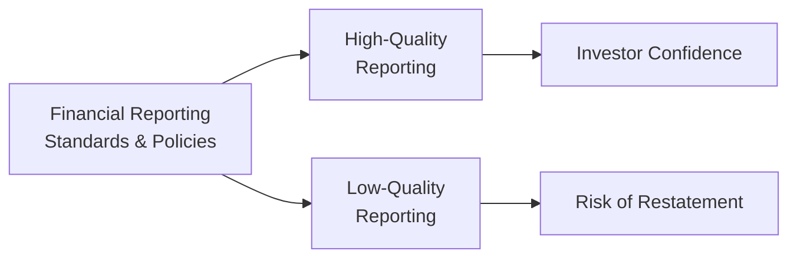
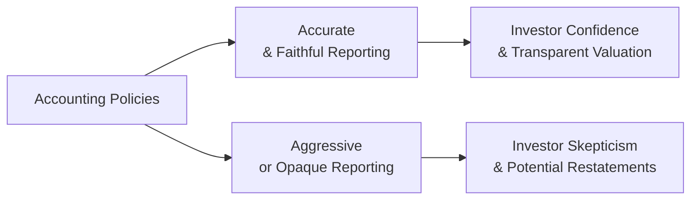

High-quality financial reporting is more than a buzzword—it's the backbone of credible valuation, transparent governance, and effective investor engagement. But hey, I’ve been there too: early in my career, I remember analyzing an annual report that showed beautiful growth rates and stellar margins. Everything looked pristine, like the numbers jumped straight out of an accounting textbook. Then, down in the footnotes, I spotted some “creative” assumptions about revenue timing and expense deferrals. It certainly taught me the difference between reporting that faithfully represents reality and reporting that glosses over crucial details. Let’s walk through the essentials, exploring the nature, implications, and best practices of high- vs. low-quality reporting in a way that feels like we’re chatting over coffee.

## Why Reporting Quality Matters

One reason reporting quality matters so much is that financial statements are the primary window into a firm's performance and stability. When reporting adheres to faithful representation and transparency, investors and analysts can forecast with more confidence. Suddenly, the risk of nasty surprises or restatements drops dramatically, which leads to more stable valuations and narrower risk spreads.

On the other hand, when a firm’s reports are loaded with aggressive estimates and questionable reclassifications, that sense of certainty disappears. Investors get skittish; analysts start questioning the sustainability of the results. So in the short term, low-quality reporting might artificially boost a company’s numbers, but in the long run, it usually ends badly. Think steep stock price declines, regulatory probes, or earnings restatements that knock investor trust down to zero.

## Key Elements of Reporting Quality

Quality financial reporting, often described in terms of “reporting quality,” is about providing a faithful representation of a company’s performance. Faithful representation, as defined by the IFRS Conceptual Framework, requires completeness, neutrality, and freedom from error. US GAAP similarly emphasizes reliability and consistency, aligning closely with IFRS’s principles, despite differences in specific accounting rules.

It’s tempting to get lost in the jargon, but the idea is simple: can external readers rely on these financial statements for an accurate story of the company’s economics? If yes, we’re talking high-quality reporting. If no, it’s low-quality—and that discrepancy can shake your comfort level as an analyst or investor.

### A Quick Visual Overview

Here’s a simple flowchart of how accounting policies and corporate governance influence reporting quality:

The flow from standards and policies can guide a company to either a place of transparency or one of dubious reporting, with corresponding impacts on market perception.

## Distinctions Between High-Quality and Low-Quality Reporting

Let’s lay out some concrete differences:

| Aspect                          | High-Quality Reporting                                                 | Low-Quality Reporting                                        |
|---------------------------------|-----------------------------------------------------------------------|--------------------------------------------------------------|
| Faithful Representation         | Neutral, consistent application of rules                              | Biased estimates to skew performance                        |
| Economic Reality                | Appropriately matched with actual business conditions                 | Mismatch between actual conditions and disclosures          |
| Transparency                    | Clear, thorough disclosures                                            | Opaque or incomplete footnotes                              |
| Corporate Governance Involvement | Strong oversight by board and committees, effective internal controls | Weak governance with minimal checks and balances            |
| Long-Term Consequences          | Improved investor confidence, stable valuations                       | Potential restatements, regulatory actions                  |

## Short-Term vs. Long-Term Implications

• Short-Term: Low-quality reporting can temporarily inflate earnings or smooth out volatility. Management might do this to meet market expectations, secure bonuses, or quell concerns about a downturn.  
• Long-Term: To borrow a phrase—you can run, but you sure can’t hide. Low-quality practices eventually surface, often through inconsistent disclosures, whistleblower statements, or external audits. Restatements can damage a company’s credibility, and sometimes, that damage is irreversible.  

From a valuation perspective, those short-term “benefits” of artificially boosting earnings are overshadowed by the cost of lost confidence. No wonder rating agencies and experienced analysts give heavy weight to a management team’s track record of honest (or not-so-honest) reporting.

## Frameworks and Guidelines: IFRS and US GAAP

The IFRS Conceptual Framework spells out characteristics of good reporting:  
• Relevance, meaning the information must be capable of influencing user decisions.  
• Faithful representation (complete, neutral, error-free).  
• Comparability, so you can line up financial statements across periods and across companies.  
• Understandability, ensuring that even complex data is meaningfully presented.

Meanwhile, US GAAP underscores reliability, consistency, and comparability. While IFRS can be more principles-based and GAAP more rules-based, both share the aim of producing information that’s trustworthy and useful. When you see a company consistently applying these concepts—it's a sign of high-quality reporting.

## The Role of Corporate Governance

Corporate governance encompasses the rules, processes, and controls by which organizations are directed. Key elements include:
• Board Oversight: An engaged board that challenges management’s assumptions fosters higher reporting quality.  
• Audit Committee: Audit committees that ask tough questions and collaborate effectively with external auditors keep the financial statements honest.  
• Internal Controls: Mechanisms such as segregation of duties, system checks, and cross-department reconciliations prevent mistakes or fraud.  

Weak governance often goes hand in hand with low-quality reporting. Maybe the board is too lenient with management, or the internal controls are superficial. Either way, it’s a red flag when corporate governance is an afterthought.

## Real-World Cases

There’s no shortage of examples:  
• Enron used complex special purpose entities to hide liabilities. Investors later realized how far the reported statements deviated from the company’s true economic position.  
• WorldCom capitalized operating expenses to inflate profitability, eventually leading to one of the largest bankruptcies in history.  
• Certain financial institutions during the mortgage crisis used off-balance-sheet vehicles to obscure risky exposures, leaving investors and regulators in the dark until it was too late.

Each time, low-quality reporting initially helped to sustain higher valuations or manipulate key performance indicators. In the end, though, the revelations were so damaging that markets punished both the firms and their stakeholders.

## How Rating Agencies and Analysts Incorporate Reporting Quality

Major rating agencies often include an assessment of a firm’s financial reporting practices in their rating methodology. If a company regularly restates earnings, shows inconsistent footnotes, or takes advantage of “loophole-driven” accounting, agencies factor that into their credit rating.

Similarly, analysts watch for:
• Management’s record of transparency: Have they downplayed losses or quietly revised statements in the past?  
• Footnote complexity: Are disclosures excessively long but oddly uninformative?  
• Segment reporting: Are segments detailed enough to glean how different parts of the business truly perform?

When the answers to these questions signal strong, transparent practices, the analyst’s confidence rises. When they flag aggressive or unclear reporting approaches, watch out for downward adjustments in valuations or stealthy changes in forward estimates.

## Linking Reporting Quality to Exam Success

From a CFA Level II exam perspective, you’ll often get item sets presenting a company scenario with footnote snippets. One typical question might ask you to identify signs of manipulated revenues or suspicious expense recognition. Understanding the fundamentals of high- vs. low-quality reporting helps you quickly see through the “numbers façade.” Yes, the exam loves to test subtle hints in the text that might indicate low-quality statements—like changes in depreciation estimates or repeated use of special transactions near quarter-end. The best way to prepare: practice dissecting real or mock footnotes, so you can instantly spot the red flags.

## Best Practices for Ensuring High-Quality Reporting

Analysts looking to assess reporting quality should:
• Compare consistent application of accounting methods across reporting periods.  
• Track changes in estimates and assumptions, such as depreciation rates or warranty reserves.  
• Examine footnotes for thorough disclosures—especially for revenue recognition, variable interest entities, and intangible assets like goodwill.  
• Evaluate the corporate governance environment: Are the board and audit committee robustly engaged?

For managers aiming to maintain or improve reporting quality:
• Encourage a top-down culture that prioritizes accurate reporting.  
• Strengthen internal control systems.  
• Provide transparent disclosures.  

## A Note About Practical Case Studies

Let’s say we have a manufacturing firm that reclassifies operating expenses as capital expenditures. In the short term, the firm reports lower operating costs and higher net income. Investors might initially celebrate, but once the reclassification is exposed or reversed, the firm faces a downward revision of earnings, plus a possible restatement. Lenders become nervous. The lesson? If you see a pattern of “magically improving” numbers without corresponding operational changes, you should question the underlying accounting assumptions.

## Encouraging a Culture of High-Quality Reporting

At the end of the day, high-quality reporting is not just a set of mechanical tasks; it’s a mindset embedded in corporate culture—where each department, from the CFO’s office to the staff accountants, recognizes the responsibility of presenting a consistent economic story. The board, the review committees, and external auditors all contribute to this goal, ensuring quality remains front and center rather than an afterthought.

And so, after analyzing countless financial statements in my life, it becomes clear that honest, high-quality reporting is a strategic advantage. Markets reward clarity and consistency. Low-quality reporting is like a house of cards; it can look stable for a while, but any gust of regulatory or market scrutiny can send it tumbling. 

## Mermaid Diagram Highlighting Reporting Quality Flow

## Glossary Highlights

• Reporting Quality: The extent to which financial statements faithfully represent a firm’s performance and position.  
• Economic Reality: The actual economic events and conditions underlying the reported data, untainted by manipulative practices.  
• Faithful Representation: A fundamental IFRS qualitative characteristic ensuring info is complete, neutral, and free from error.  
• Aggressive Reporting: Using overly optimistic estimates or methods that inflate results.  
• Conservative Reporting: Using cautious assumptions to avoid inflating performance.  
• Corporate Governance: The set of systems, principles, and processes guiding a firm’s direction and control.  
• Internal Controls: Processes that ensure the reliability of the firm’s financial statements and safeguard assets.  
• Restatement: Revising previously issued financial statements to correct material errors or misapplications of accounting standards.

## Self-Test: High-Quality vs. Low-Quality Reporting



### Which of the following characteristics distinguishes high-quality reporting under both IFRS and US GAAP?  
- [ ] Use of a principles-based approach  
- [ ] Avoidance of footnotes to simplify disclosure  
- [x] Consistent application of accounting methods  
- [ ] Reporting conservatively in every situation  

> **Explanation:** High-quality reporting is characterized by consistent methods applied over time, ensuring comparability. Both IFRS and US GAAP emphasize this continuity, rather than the complete avoidance of footnotes or an approach that is “always conservative” in every scenario.

### A company aggressively increases its estimates for bad debt to build a big reserve this quarter. Which of the following best describes how this might affect the perception of its reporting quality?  
- [x] Investors may see it as aggressive if the estimated reserves do not align with actual credit trends.  
- [ ] It will automatically be considered high-quality as bad debt estimates are prudent.  
- [ ] No effect on reporting quality since reserves are an allowed estimate.  
- [ ] Rating agencies will disregard this since it is part of normal operations.  

> **Explanation:** While creating reserves can be prudent, a significant increase that lacks clear justification or alignment with actual trends can indicate aggressive tactics. Analysts and investors may view this as a sign of managing earnings, thus reducing confidence in the firm’s reporting.

### Which real-world example is most commonly cited to illustrate how low-quality reporting can mask liabilities using off-balance-sheet structures?  
- [ ] WorldCom  
- [x] Enron  
- [ ] Berkshire Hathaway  
- [ ] Procter & Gamble  

> **Explanation:** Enron is famously known for using off-balance-sheet special purpose entities to hide liabilities and inflate performance, providing a classic study of low-quality reporting.

### In the short term, low-quality reporting that capitalizes operating expenses might lead to:  
- [x] Overstated net income  
- [ ] Understated net income  
- [ ] Reduced EBIT and EBITDA  
- [ ] Immediately detected fraud charges  

> **Explanation:** Capitalizing operating expenses reduces immediate expense recognition, inflating net income in the short term. Over time, depreciation and scrutiny might reveal the manipulation.

### According to IFRS, which characteristic ensures information is presented in a manner that decision-makers can comprehend and use effectively?  
- [ ] Consistency  
- [ ] Reliability  
- [ ] Faithful Representation  
- [x] Understandability  

> **Explanation:** While consistency, reliability, and faithful representation are essential qualitative characteristics, “understandability” directly addresses how the information is presented so non-technical stakeholders can interpret it.

### Rating agencies typically lower their credit outlook for companies that:  
- [ ] Pay dividends regularly.  
- [x] Have a history of restatements or questionable accounting treatments.  
- [ ] Operate in overseas emerging markets.  
- [ ] Exceed analysts’ earnings forecasts consistently.  

> **Explanation:** A firm’s history of restatements or questionable accounting is a major signal of low-quality reporting and raises red flags regarding its credit risk, prompting rating agencies to revise the firm’s outlook downward.

### Which of the following is true about corporate governance and reporting quality?  
- [x] An active board and strong internal controls support high-quality reporting.  
- [ ] Corporate governance has little impact on a firm’s disclosures.  
- [ ] Governance codes are optional and do not influence financial statements.  
- [x] An ineffective audit committee often correlates with low-quality reporting.  

> **Explanation:** Strong governance mechanisms (board oversight, tough audit committees, solid internal controls) generally foster higher-quality reporting. Conversely, ineffective governance often coexists with low-quality disclosures.

### Selecting overly optimistic revenue recognition assumptions to boost reported sales is an example of:  
- [ ] Complying with IFRS/GAAP guidelines fully.  
- [ ] Conservatively recording income.  
- [x] Aggressive reporting.  
- [ ] Enhancing comparability.  

> **Explanation:** Using inflated assumptions on revenue recognition is a textbook illustration of aggressive reporting, which can undermine the faithful representation of the firm’s financials.

### Which of the following best describes an impact of high-quality reporting on valuation models?  
- [x] It reduces uncertainties and enhances the reliability of the forecasts.  
- [ ] It makes valuation models irrelevant.  
- [ ] It guarantees higher share prices.  
- [ ] It obviates the need for footnote analysis.  

> **Explanation:** High-quality reporting lessens the uncertainty analysts face when forecasting cash flows, risk measures, and growth—leading to more dependable valuation outcomes. However, it does not guarantee a specific share price or eliminate the need for deeper analysis.

### True or False? Low-quality reporting can be sustained indefinitely as long as a company’s external audits are conducted annually.  
- [x] True  
- [ ] False  

> **Explanation:** Though it might seem counterintuitive, certain companies do manage to sustain low-quality reporting for a while—even with regular audits—if their practices are sophisticated or if auditors fail to catch the issues. Eventually, however, such practices often unravel.



## Further Exploration

• “International Financial Statement Analysis” by Thomas R. Robinson et al. (CFA Institute Investment Series)  
• “Financial Shenanigans” by Howard M. Schilit and Jeremy Perler  
• IFRS Foundation Website:  
  – https://www.ifrs.org  
• FASB (Financial Accounting Standards Board) Website:  
  – https://www.fasb.org  

These resources offer a deeper exploration into how the details of accounting choices, transparency, and governance can fortify or weaken the reliability of financial statements. By understanding the nuances of high-quality vs. low-quality reporting, you’ll not only sharpen your exam edge but also develop a skill set that distinguishes top-tier analysts from those who accept the numbers at face value.
