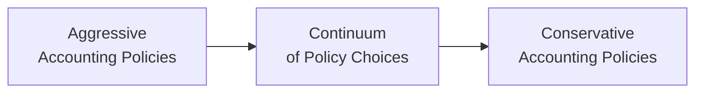

## The Continuum of Accounting Policies

When companies prepare their financial statements, managers choose from a range of acceptable accounting methods and estimates. The result can either lean toward what we often call “aggressive” accounting—where revenues and assets tend to be higher and expenses and liabilities tend to be lower—or more “conservative” accounting—where the opposite balance occurs. This isn’t just about pushing the envelope for the sake of looking good or bad. Sometimes, these choices come from genuine beliefs about the firm’s situation or reaction to market pressures. But be aware: over time, consistently aggressive or conservative accounting can distort the true economic picture of a company.

I once chatted with a former colleague who worked in a fast-growing tech firm. He said, “We used to recognize revenue basically as soon as the ink on the contract dried—maybe even a little before that!” That might be an exaggeration, but it underscores how, under pressure to show strong sales, a business might lean aggressively in its policy selection. Before we dive in, just keep in mind that pushing too far in either direction can raise serious doubts about a company’s reporting quality. 

Below is a simplified visualization of the continuum:

• Aggressive: Early recognition of revenue, lower provisioning for bad debt, slow recognition of asset impairment, usage of longer asset lives for depreciation, etc.  
• Conservative: Delayed revenue recognition, higher provisioning for bad debt, frequent asset write-downs, faster depreciation methods, etc.

Though each choice might be acceptable under accounting standards, the “spirit” or intent behind the selection will often set apart a fair presentation from one that’s gaming the numbers.

## Common Areas Where Policy Choices Matter

Certain areas in financial reporting are more susceptible to management’s judgment. In the sections below, we’ll highlight a few of the big ones—some of which you’ve likely come across in Level I but will see in deeper detail at Level II.

### Revenue Recognition

Revenue recognition timing is among the most widely watched areas. Under IFRS (IFRS 15) and US GAAP (ASC 606), there’s a five-step model to identify contract terms, performance obligations, transaction price, and so on. However, management has wiggle room around:

• Deciding when a performance obligation is satisfied.  
• Estimating variable consideration (e.g., for returns or rebates).  
• Allocating the transaction price among multiple deliverables.

• Aggressive twist: Recognize revenue before the actual completion of the obligations, or rely on optimistic assumptions. Sales that belong to a future period might get pulled into the current period to meet earnings targets.  
• Conservative twist: Be extra cautious about timing. You might see revenue recognized after all risk is fully transferred and any possibility of return is essentially nonexistent.

### Provision for Doubtful Accounts

The provision for doubtful accounts (or allowance for credit losses) reflects the estimated uncollectible portion of receivables. It’s a big guess about the future, so it can be manipulated.

• Aggressive twist: Underestimate the allowance, which keeps receivables and net income higher because you are showing that you expect most (if not all) of what you invoice to come back as cash.  
• Conservative twist: Overestimate the allowance so you’re taking a bigger expense now, effectively understating current earnings. Sometimes, companies do this to create “cookie jar reserves.” Then, in future periods, you might reduce the allowance, boosting profit at a time that’s more convenient.

### Inventory Valuation

Inventory is another place to watch carefully:

• FIFO vs. LIFO: Under US GAAP, LIFO (Last-In, First-Out) is allowed, while IFRS does not permit it. In times of rising prices, LIFO cost of goods sold (COGS) is higher, which lowers reported income (conservative effect) but also lowers ending inventory on the balance sheet. By contrast, FIFO (First-In, First-Out) tends to produce lower COGS in a rising-price environment, leading to higher taxable income—often considered more aggressive if the goal is to report higher profit.  
• Write-downs or net realizable value adjustments: IFRS requires inventory to be recorded at the lower of cost or net realizable value (NRV). US GAAP is similar in principle, though certain details differ. Companies have some leeway in deciding whether or not to write down slow-moving or obsolete inventory. Prompt recognition of obsolescence is more conservative, while delaying or minimizing write-downs can be aggressive.

### Depreciation and Amortization Methods

Choosing between straight-line and accelerated depreciation methods, or applying a very long useful life to major plant and equipment, can significantly impact reported earnings.

• Aggressive twist: Use straight-line depreciation over a longer-than-realistic useful life. Early periods in an asset’s life will see lower depreciation expenses, which inflates earnings. This difference can add up quite a bit in capital-intensive industries.  
• Conservative twist: Use an accelerated depreciation approach—or simply shorten the asset’s useful life assumption. This yields higher expenses. Sometimes, managers do this to “clean up” or reset the balance sheet and reduce the burden of future write-offs.

### Impairment Testing

Under IFRS, management must test for impairment whenever indicators suggest the carrying value of assets may not be recoverable. US GAAP has more specific “trigger events.” This can lead to:

• Aggressive twist: Postponing the recognition of an impairment to keep asset values high on the balance sheet, artificially boosting the ratio of assets to liabilities.  
• Conservative twist: Recognizing impairments early or perhaps adopting a “worst-case scenario” approach that quickly writes down assets if their fair value is questionable, which dampens current profit or reduces carrying values.

## Large Impacts from Small Changes

Seemingly tiny changes in assumptions about bad debt percentages, scrap values, interest rates, or revenue milestones can lead to material differences in net income, return on equity, and even debt covenants. Think about it this way: if you’re dealing with a large pool of receivables—say $1 billion in trade receivables—bumping the allowance for doubtful accounts from 1% to 2% results in an extra $10 million expense. That’s big enough to affect your bottom line, especially when your net income margin is tight.

One way to see how changes can cascade is to model a simple difference in depreciation expense:

Let:
• Old depreciation expense = D_old  
• New depreciation expense = D_new  

The resulting shift in net income, assuming no tax effect for simplicity, would be:


\text{New Net Income} = \text{Old Net Income} + (D_{\text{old}} - D_{\text{new}})


If D_new is smaller, net income is automatically higher. This might not seem like rocket science, but in a tight earnings quarter, that difference in depreciation can make or break a company’s ability to hit a performance benchmark. 

## Motivations Behind Aggressive Policies

Let’s face it: many CFOs and CEOs are under the gun to deliver short-term results. Analysts might ask about their guidance, board members might be expecting consistent quarter-over-quarter improvements, and the capital markets can punish any large earnings miss. Some large motivators include:

• Meeting or beating earnings targets.  
• Boosting short-term stock prices (especially if management holds stock options).  
• Achieving bonus thresholds tied to reported net income.  
• Masking deeper operational problems by painting a healthier short-term picture.  

However, companies can pay a steep price if these strategies eventually come undone. Extensive use of aggressive tactics can trigger suspicion, shakes investor confidence, and—if taken too far—invite regulatory scrutiny.

## Red Flags for Overly Conservative Accounting

Although more talk generally focuses on aggressive behavior, there is a real possibility that managers might lean too conservative. Why? They might want to:

• Build up reserves when earnings are high to smooth future performance.  
• Manage external perceptions of risk.  
• Lower current tax liabilities in certain jurisdictions (under some accounting frameworks).  

Consistent under-reporting of earnings, channeling them into “cookie jar reserves,” also disrupts the true performance trajectory. Shareholders might not get the best picture of how well the company’s core business is faring from quarter to quarter. If management repeatedly overshoots provisions, eventually they release those reserves and produce a surprising earnings spike, raising questions about the company’s accounting judgments.

## Exam Item Set Considerations

For the Level II CFA exam, watch out for vignettes that present multiple years of financial data with subtle changes in accounting assumptions. You might see:

• Fluctuating allowance for doubtful accounts that doesn’t match changes in macroeconomic or company-specific credit environment.  
• Sudden changes in depreciation methods right when the company needs an earnings boost.  
• Differences in how IFRS vs. US GAAP treat an impairment scenario—maybe IFRS-based companies have more immediate downward adjustments, while US GAAP ones have a multi-step approach.  

Expect to be asked to identify what’s happening, how it affects reported earnings or book values, and whether these changes suggest an overly aggressive, balanced, or conservative approach.

## IFRS vs. US GAAP Perspectives

While both IFRS and US GAAP aim to convey an accurate economic picture of a business, there are differences:

• Under IFRS, impairment testing can be more frequent or triggered by conditions that require more judgment. Under US GAAP, impairment often follows a specific checklist in terms of undiscounted cash flow recoverability, which some argue can delay or understate impairments compared to IFRS.  
• IFRS does not permit LIFO, so a company switching from US GAAP LIFO to IFRS would effectively lose that option of potentially higher COGS in an inflationary environment.  
• IFRS is more principles-based, meaning managers often rely on more professional judgment. US GAAP can be more rules-based, giving managers narrower but still significant options to tweak assumptions within the rules’ boundaries.

## Practical Application: Peer Comparison

As an analyst, adjusting for differences in policy selection is essential when comparing peer companies. If one firm’s net income is consistently elevated because of minimal bad debt allowances or a flexible revenue recognition approach, you might need to restate their figures to get an “apples to apples” comparison, especially if you’re planning to do a relative valuation or if you’re analyzing their credit risk.

In practice, you’ll also want to look across a company’s statements for consistency. If management is extremely bullish in revenue recognition while, at the same time, building large reserves for returns, that’s contradictory. By dissecting each piece, you get a sense of whether the total picture is coherent or if there’s a suspicion of account manipulation.

## Case Example: Overstated Receivables

Imagine an electronics distributor that sells consumer technology gadgets. Over the last three years, the firm’s management has consistently recognized large sales to new retail customers with extended credit terms. However, the company’s allowance for doubtful accounts has barely budged. Meanwhile, the industry has begun reporting increased retail bankruptcies. If you see:

• Receivables ballooning on the balance sheet.  
• The ratio of the allowance to gross receivables decreasing each year.  
• Minimal write-offs even though industry peers are writing off a higher percentage of sales.

That’s a big sign of an overly aggressive approach—or at best, extremely optimistic expectations about collectability. Many times, an exam vignette might give you these data points and ask you to interpret whether the company’s policy is aggressive or conservative. Don’t be fooled by net income that looks strong; it may be built on an artificially inflated foundation.

## Best Practices and Pitfalls

• Investigate year-over-year changes in accounting assumptions. Even a small assumption shift can have a huge effect on the final reported numbers.  
• Cross-check estimates with external data. If economic conditions suggest higher default rates, but the firm’s allowance doesn’t move, that’s a red flag.  
• Watch management’s explanations. If you see frequent changes in depreciation methods or revenue recognition policies—especially around the same time major earnings targets are set—ask whether it’s truly a response to underlying business changes or something more strategic.  
• Be mindful that IFRS vs. US GAAP differences might mislead you if you compare two companies without adjusting. A firm using IFRS for inventory (with no LIFO) can’t be directly compared on the same terms to a US GAAP competitor employing LIFO unless adjustments are made.  

## Encouraging Critical Thinking

When you see a set of financial statements, don’t just accept the reported numbers—learn to ask: “What if the estimates were changed slightly? What if the depreciation method was switched? Are there signals that management is shifting policy choices?” That’s how you dig beyond the surface and figure out if the story is as management has stated or if it’s an artistic rendering.

One more personal story: when I first began analyzing companies, I’d basically read the footnotes at a very high level—just scanning for big headlines or changes. Then I discovered how often the best insights are hidden in the details, especially in multi-year footnote comparisons. It’s like detective work, and once you see a pattern (like a sudden drop in the allowance for returns coinciding with a major push to meet sales targets), you realize how powerful it can be to piece it all together.

## Glossary

• Accounting Policies: Specific principles and methods adopted by a company to prepare its financial statements.  
• Reserves (Cookie Jar Reserves): Excessive provisions created in good years to smooth out financial performance in future (worse) years.  
• Write-down: Reducing the carrying amount of an asset to reflect its lower fair value or utility.  
• Revenue Recognition: Recording revenue in a firm’s financials following guidelines that specify when obligations are deemed fulfilled.  
• Earnings Management: Strategic use of accounting methods and timing to produce a desired earnings outcome.  
• Depreciation Method: The systematic allocation of the cost of a tangible asset over its useful life (straight-line, accelerated, etc.).  
• Impairment Testing: Analyzing whether an asset’s carrying amount might not be fully recoverable and needs to be adjusted.  
• Provision for Doubtful Accounts: A contra-asset that estimates receivables that are expected to be uncollectible.

## Further References

• “Creative Cash Flow Reporting” by Charles W. Mulford and Eugene E. Comiskey – A detailed guide on how managers might manipulate operating cash flow and how to detect warning signs.  
• Deloitte Accounting Research Tool (DART): https://dart.deloitte.com – Comprehensive resource offering guidance on various accounting policy decisions.  
• IASB Staff Papers on IFRS Judgments and Estimates: https://www.ifrs.org/projects/work-plan/accounting-judgements/ – Insight into how IFRS bodies discuss and interpret accounting judgments in practice.

## Final Thoughts and Exam Tips

• Keep your eyes peeled for large “unusual” changes in estimates or accounting methods from year to year. That’s usually prime territory for exam questions.  
• Review how IFRS vs. US GAAP differences in policy choices affect net income, assets, and liabilities. Bear in mind that the principles-based IFRS approach can open up more room for interpretation.  
• Practice with item sets that highlight how small adjustments in assumptions about depreciation, revenue recognition, or allowances can generate big swings in reported results.  
• On exam day, time is critical—so focus on the data changes over multiple periods. The footnotes and any changes in accounting methods or assumptions will typically hold the key clues to answering the questions correctly.

Anyway, don’t be afraid if you find these policies a bit intimidating at first. Over time, as you see more examples, you’ll develop a sharper nose for sniffing out where management might be pulling the strings. Good luck, and remember to keep asking questions!

---

## Aggressive vs. Conservative Policies Practice Quiz



### Which of the following best describes aggressive accounting policies?

- [x] Methods that accelerate revenue recognition or defer expenses, leading to higher short-term earnings.  
- [ ] Methods that slow revenue recognition and accelerate expenses.  
- [ ] Methods that always comply strictly with IFRS.  
- [ ] Methods that always comply strictly with US GAAP.  

> **Explanation:** Aggressive accounting policies push revenue and profits higher by accelerating revenue recognition or deferring expenses. While compliance with IFRS or US GAAP is required, both frameworks allow for varying degrees of professional judgment.

### In the context of revenue recognition, which approach is most clearly conservative?

- [ ] Recognizing revenue when an order is placed, despite unfulfilled obligations.  
- [ ] Estimating minimal returns in a highly unpredictable market.  
- [x] Booking revenue only after the customer’s right of return period has expired.  
- [ ] Allocating a higher portion of the transaction price to earlier deliverables.  

> **Explanation:** Delaying recognition until all major uncertainties are resolved—such as allowing the right of return period to pass—reflects a conservative approach. It understates current revenue, ensuring that only the most certain amounts are recorded.

### A company’s allowance for doubtful accounts decreases significantly year over year, while the ratio of overdue receivables grows. What might this suggest?

- [ ] A shift toward more conservative accounting policies.  
- [x] Increasingly aggressive accounting, artificially lifting net income.  
- [ ] No accounting policy implications, as allowance can freely fluctuate.  
- [ ] Improved credit quality of customers.  

> **Explanation:** A significant drop in the allowance for doubtful accounts amid growing overdue receivables indicates that the company may not be adequately providing for expected defaults, which pushes up net income aggressively.

### Under IFRS, which of the following is often considered a sign of conservative accounting?

- [x] Writing down impaired assets sooner based on management’s prudent assessment.  
- [ ] Waiting to recognize impairment until an undiscounted cash flow test fails.  
- [ ] Applying LIFO for inventory valuation.  
- [ ] Maximizing the residual values of assets.  

> **Explanation:** IFRS’s principles-based approach can lead to earlier impairment recognition, especially if management is being cautious. Meanwhile, LIFO is not permitted under IFRS, and maximizing residual values is more aggressive.

### A company switches from accelerated depreciation to straight-line depreciation, citing revised asset usage estimates. How might this affect current earnings?

- [ ] Likely decrease current earnings.  
- [x] Likely increase current earnings.  
- [ ] Have no impact on earnings.  
- [ ] Substantially eliminate the need for an impairment test.  

> **Explanation:** Straight-line depreciation typically results in lower depreciation expense early in an asset’s life than an accelerated method, so switching from accelerated to straight-line often increases current earnings.

### Which of the following motivations commonly drive managers to adopt aggressive policies?

- [x] Desire to meet short-term performance benchmarks or bonus thresholds.  
- [ ] Preference to understate revenue for taxation purposes.  
- [ ] Reducing perceived volatility of earnings over time.  
- [ ] Aligning with IFRS principles by default.  

> **Explanation:** Managers often turn to aggressive accounting to present stronger short-term results and align with performance benchmarks or bonus incentives.

### When might a consistently understated set of financials (i.e., overly conservative) be a red flag?

- [ ] Never; conservative reporting is always legally and ethically desirable.  
- [ ] Only when IFRS specifically mandates an increase in reported earnings.  
- [x] When “cookie jar reserves” are built to smooth potential future earnings.  
- [ ] When management is awarding stock options.  

> **Explanation:** Overly conservative approaches can create hidden reserves that can be released strategically, distorting future earnings and making performance less transparent.

### How can an analyst best compare two companies that have different inventory valuation methods (e.g., LIFO vs. FIFO)?

- [ ] Only compare their COGS for the same fiscal year.  
- [ ] Assert that one method is always more accurate than the other.  
- [x] Adjust one company’s financial statements to a consistent basis using publicly available data.  
- [ ] Ignore inventory valuation differences as immaterial.  

> **Explanation:** The best method for ensuring meaningful comparison is to restate one company’s results to a consistent valuation approach, usually using disclosures in the notes, to provide an “apples to apples” analysis.

### What is a key sign in an exam vignette that a company’s impairment test application might be aggressive?

- [ ] Frequent annual testing of assets for impairment.  
- [ ] Lowering the discount rate used in cash flow projections to reflect economic improvements.  
- [x] Delaying recognition of asset impairments despite clear indications of reduced recoverable value.  
- [ ] Recording an impairment in a period of robust earnings growth.  

> **Explanation:** Aggressive accounting is often spotted where impairment losses are unreasonably delayed, keeping asset values artificially high.

### True or False: Under IFRS, a company can reverse previously recognized impairment losses on certain assets if their fair value recovers.

- [x] True  
- [ ] False  

> **Explanation:** Unlike US GAAP, IFRS does allow the reversal of certain impairment losses on assets other than goodwill if their fair values subsequently increase. This is relevant when considering the continuum between aggressive and conservative reporting.


