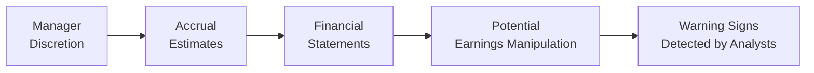

## Introduction
So, you’ve probably heard the phrase, “Numbers don’t lie”—but let’s be real, sometimes the way those numbers get reported can be a little…um…creative. In corporate financial statements, managers have a few areas where they can exercise judgment, and that’s where discretionary accruals come into play. For some companies—particularly the ones aiming to meet earnings targets—a bit of creative accounting can occur. As future CFA charterholders, your job is to spot these red flags before they become big, costly surprises.

Earnings manipulation might not always be outright fraud. Often, it lurks under seemingly legitimate estimates for things like allowances for doubtful accounts or inventory write-downs. Our mission here is to help you understand how to detect these subtle signals, both for the exam and for your real-world financial statement analysis. Let’s settle in, shall we?

## The Role of Discretionary Accruals in Earnings Manipulation
Discretionary accruals refer to those accounting estimates that managers have the discretion to influence. You might see managers adjust revenue recognition timing, tweak bad debt provisions, or even shift expenses across periods. While many of these estimates are necessary and benign—after all, you can’t always predict a bad debt with 100% accuracy—some managers push the boundaries to meet short-term earnings forecasts or smooth out earnings volatility.

Under both IFRS and US GAAP, a certain degree of professional judgment is allowed. The big question is, “How far is too far?” The line often gets stepped on or crossed when managers begin to aggressively manipulate these estimates, turning them into tools for earnings management. As an analyst, it’s your role to examine the reasoning behind key accruals and decide whether they align with the underlying business realities.

### Quick Mermaid Diagram of Discretionary Accrual Flows

In short, watch out for large changes in accruals from one period to the next, especially if there’s no equally large shift in the company’s underlying business performance. Those changes could represent managers nudging the numbers closer to desired targets.

## Early Warning Signs of Potential Manipulation
Identifying discretionary accruals is tricky because, on the surface, everything might look normal. But there are a few telltale signs that can raise your eyebrows:

• Unusual Spikes in Revenue Near Quarter/Year-End: If a company’s sales suddenly jump in the final days (or hours) of the reporting period, it might be pushing extra product into the distribution channel (known as channel stuffing) or booking revenue prematurely.

• Large Fluctuations in Accruals Relative to Cash Flows: One big clue is a mismatch between net income and cash flow from operations (CFO). If net income grows steadily while CFO languishes or declines, that’s a signal to dig deeper.

• Frequent Changes in Accounting Policies or Estimates: Changing depreciation methods every other year? Revising the estimate for bad debt expense in inconsistent ways? Those are prime opportunities to manipulate earnings.

• Abnormal Growth in Intangible Assets Without Economic Rationale: If intangible assets keep ballooning without a clear link to known IP, R&D, or brand expansions, you might wonder if certain expenses are being improperly capitalized.

• Positive Net Income, Negative Operating Cash Flow: A classic sign of potential accounting irregularities. At some point, a profitable company must collect real cash.

These red flags are far from exhaustive, but they’re a decent place to start. As part of your CFA Level II studies, you’ll see that the exam loves to throw in small details in a vignette (like footnotes about changes in estimates) and expect you to connect them to possible earnings management.

## Common Manipulative Tactics Involving Accruals
There are various ways a company might use discretionary accruals to prettify its numbers. Here are the usual suspects:

### 1. Channel Stuffing or Accelerating Revenue Recognition
Channel stuffing occurs when a company ships more goods downstream (to wholesalers or retailers) than the market actually demands. Managers may record this as current revenue even though the final customer may not actually purchase the product in that period. In an exam vignette, you might see references to unsold inventory piling up at distributors or mention that returns spike in the next quarter.

### 2. Improper Capitalization of Expenses
Some expenses, such as research and development costs or certain marketing expenditures, might be inappropriately capitalized rather than expensed. Capitalizing these costs moves them onto the balance sheet as assets, reducing current expenses and boosting earnings in the short run. However, eventually those inflated asset balances must be written down, and that can lead to big hits to net income later.

### 3. Creating or Reversing Reserves at Opportune Times
Managers may create large reserves when times are good (like a “cookie jar”), then reverse them into income during lean quarters. Examples include overstating allowances for bad debts or warranties in one period, only to recapture them as income in another. This can smooth earnings, making management appear more skillful and stable.

## Emphasizing the Significance of Cash Flow Analysis
Now, you might be wondering, “So how do I confirm my suspicions?” The short answer: analyze the company’s cash flow statements, especially CFO. Because it’s harder to fudge cash inflows and outflows without leaving footprints, CFO tends to be a more reliable performance metric than net income. Some practical tips:

• Compare CFO to Net Income: If net income is consistently outpacing CFO, ask why. Is it a structural issue (like a high proportion of credit sales) or something fishy?

• Scrutinize Cash Flow Classifications: Certain manipulations involve misclassifying operating outflows as investing. IFRS and US GAAP differ slightly in classification rules, so watch for footnotes that reclassify certain outflows away from CFO.

• Look for Negative CFO Paired with Positive Earnings: This scenario can arise in growth companies, but if the gap is too large, it deserves special attention. 

A classic real-life example happened years back with some high-growth tech darlings. They would show big net incomes but never seemed to convert them into cold, hard cash. Eventually, some crashed hard, revealing that their revenues were, let’s say, “overly optimistic.”

## The Art of Reading Footnotes and Disclosures
I remember early in my career (ah, the good old days), I stumbled on a footnote that completely changed my view of a company’s rosy prospects. The note hinted at a drastic change in how the firm capitalized software development costs. They’d gone from expensing them fully to spreading them over multiple years. That single footnote explained the sudden surge in net income, but the real economics hadn’t changed much at all.

Footnotes are gold mines of information:
• Pay close attention to changes in estimates or accounting methods.  
• Look out for references to special-purpose entities (SPEs) or off-balance-sheet arrangements.  
• Inspect the commentary around intangible assets, goodwill, or reserves.  

Disclosures about significant assumptions (like discount rates for pension liabilities or expected default rates) might hide the seeds of your next exam question. Also, check the external auditor’s opinion. Even a somewhat vague statement about “material weaknesses” in internal controls should raise your antenna.

## Link to the CFA Exam
At Level II, you’ll be dealing with item-set (vignette) style questions that integrate multiple aspects of financial statement analysis. The exam might:
• Offer partial financial statements with suspicious patterns in accruals or intangible growth.  
• Give footnote excerpts discussing changes in how the firm recognizes revenue or capitalizes certain costs.  
• Provide conflicting signals between CFO and net income.  

Your job is to quickly spot how these changes distort earnings. You’ll also need to connect the dots to broader topics—like how these manipulations affect valuation, ratio analysis, or even credit risk assessment. Practice reading questions carefully, look for the subtle hints, and—most importantly—evaluate whether the numbers align with sound economic reality.

## Integrating Knowledge for Broader Risk Assessment
Remember, detecting discretionary accruals is just one piece of the puzzle. No matter how vigilant you are, you also want to consider:
• Management’s Track Record: Has the CEO or CFO been associated with prior restatements or controversies?  
• Audit Opinions: A clean audit opinion isn’t a 100% guarantee of perfect numbers, but a qualified or adverse opinion is a major red flag.  
• External Events and Market Conditions: In downward economic cycles, watch for big “kitchen sink” write-offs. When times improve, those charges might be reversed to boost earnings.  

By merging your analysis of the firm’s fundamentals, industry outlook, and the quality of its reporting, you can form a more holistic investment or credit opinion.

## Glossary of Key Terms
• Discretionary Accruals: Accrual estimates subject to managerial judgment, potentially used to manipulate reported earnings.  
• Channel Stuffing: A form of early revenue recognition by pushing excessive goods into the distribution channel.  
• Footnotes Disclosure: Crucial qualitative and quantitative explanations that accompany the main financial statements.  
• Operating Cash Flow (CFO): Cash generated from the company’s core operations; a potential reality check against net income manipulations.  
• Expense Capitalization: Recording expenses as assets, thereby inflating current income by deferring costs to future periods.  
• Revenue Accrual: Recognizing revenue in the period it is earned, susceptible to misuse if done prematurely or in inflated amounts.  
• Off-Balance-Sheet Financing: Keeping certain liabilities out of sight. Look for references to leasing, special-purpose entities, and other vehicles.  
• Audit Opinion: The external auditor’s statement on whether a company’s financials fairly represent its position.

## References for Further Exploration
• “Quality of Earnings” by Thornton L. O’glove. A classic resource on how companies can tweak their earnings and how analysts can spot it.  
• PwC’s “IFRS and US GAAP: similarities and differences.” This guide is great for understanding how rules-based vs. principles-based approaches can affect discretionary accruals.  
• “The Intelligent Investor” by Benjamin Graham (particularly the chapters on analyzing reported figures). Timeless lessons on looking beyond the headline numbers to the reality of the business.

## Test Your Knowledge: Key Warning Signs and Discretionary Accruals Quiz



### Which of the following best describes discretionary accruals?
- [ ] Accruals that are fixed by accounting standards with no management judgment.  
- [x] Accruals that involve management judgment and can be used to manipulate earnings.  
- [ ] Accruals related only to revenue recognition.  
- [ ] Accruals related to IFRS standards but not US GAAP.  

> **Explanation:** Discretionary accruals require management’s estimates or judgments, often providing opportunities for earnings manipulation.

### What might be an early warning sign of potential earnings manipulation?
- [ ] Consistent growth of net income in line with increasing cash flow from operations.  
- [ ] A newly launched product resulting in moderate revenue growth.  
- [x] Significant divergence between net income and operating cash flow without a clear business rationale.  
- [ ] A higher level of short-term debt.  

> **Explanation:** A large mismatch between net income and CFO can indicate that net income might be inflated through accruals or other manipulations.

### A firm reports a sudden surge in revenue in the last week of the reporting period, potentially indicating:
- [x] Channel stuffing.  
- [ ] A normal seasonal demand spike.  
- [ ] Inventory write-downs.  
- [ ] Lower capital expenditures.  

> **Explanation:** Channel stuffing occurs when a company pushes excess goods to distributors at the end of a period to boost reported revenue.

### One possible sign of creative expense capitalization is:
- [x] An increase in intangible assets without corresponding product or service development.  
- [ ] An increase in the cost of goods sold matching higher sales volumes.  
- [ ] Dividends paid to shareholders increasing.  
- [ ] A higher tax provision due to new regulations.  

> **Explanation:** If intangible assets grow for no apparent reason, the firm could be capitalizing costs that should be expensed.

### When companies use “cookie jar” reserves, they:
- [x] Overstate expenses or provisions in good times and reverse them later.  
- [ ] Always violate IFRS standards but comply with US GAAP.  
- [ ] Recognize intangible assets far below their fair value.  
- [ ] Reclassify cash flow from operations to investing.  

> **Explanation:** Cookie jar reserving involves creating excessive reserves in profitable periods that can be reversed in future periods to boost income.

### An analyst should focus on footnotes and disclosures primarily because:
- [ ] They are usually irrelevant to earnings quality.  
- [x] They provide crucial details on accounting policies, estimates, and potential manipulations.  
- [ ] They replace the need to examine financial statements.  
- [ ] They are only required by IFRS.  

> **Explanation:** Footnotes often contain insight into management judgments, changes in estimates, and off-balance-sheet items that can affect earnings quality.

### Which action typically raises a concern about discretionary accrual usage?
- [ ] Stable growth in working capital.  
- [x] Large and unexplained shifts in allowances or provisions.  
- [ ] Stable correlation between revenue and CFO.  
- [ ] Small rounding discrepancies in financial statements.  

> **Explanation:** Sudden changes in reserves or provisions may signal that management is adjusting accruals to manipulate earnings.

### A negative CFO while net income remains positive for several consecutive periods may indicate:
- [ ] Healthy cash deployment for future growth.  
- [ ] A long history of stable revenue recognition.  
- [x] Potential overstatement of earnings through accrual manipulation.  
- [ ] Non-cash depreciation expense is too high.  

> **Explanation:** If a company consistently shows negative operating cash flows while reporting positive net income, it suggests the possibility that earnings are inflated through non-cash accounting judgments.

### Management’s track record is important to consider because:
- [ ] It is irrelevant when analyzing current financial statements.  
- [x] Past restatements or controversies might indicate a pattern of aggressive accounting.  
- [ ] Only the external audit opinion truly matters.  
- [ ] Regulators do not check for repeated infractions.  

> **Explanation:** A history of restatements or accounting irregularities can signal how likely managers are to push boundaries again.

### True or False: A clean audit opinion guarantees that there are no material discretionary accrual manipulations.
- [x] True  
- [ ] False  

> **Explanation:** While an unqualified (clean) audit opinion does indicate no major discovered issues, it’s not an absolute guarantee that earnings are free from manipulation. Analysts must still perform their own due diligence.


