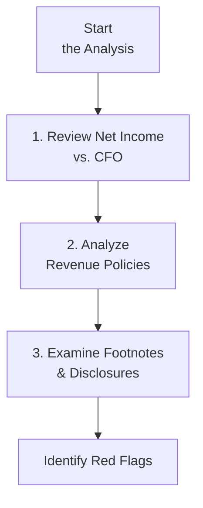

## Overview and Scenario

Let’s get right into it. Imagine you’re reviewing a company—let’s call it Apollo Tech—that historically reported stable earnings growth aligned with its operating cash flows (CFO). All of a sudden, their latest financial statements show a big leap in net income while cash from operations remains flat. Kinda suspicious, right?

It gets more interesting. In the footnotes, the company discloses that it changed how it recognizes revenue this year. Plus, there’s a material bump in deferred revenue (which almost sounds contradictory—why would deferred revenue jump if they’re also boosting recognized revenue?). And the icing on the cake? There’s a new intangible asset on the balance sheet, but the notes about it are… well… pretty skimpy.

As a charterholder (or soon-to-be, fingers crossed), we need to sift through the data and figure out if something’s fishy. This is classic “vignette” territory for the CFA exam—a scenario with partial information prompting integrated, multi-step reasoning. Below, we’ll walk through how you might handle exactly this situation under exam conditions, highlighting key warning signs, IFRS/US GAAP considerations, and essential time-saving tips. 

## Step-by-Step: Analyzing the Situation

### Compare Net Income Trend vs. Operating Cash Flow
First step, always. A significant divergence between net income and CFO is one of the biggest red flags. In Apollo Tech’s case, net income skyrocketed by 30%, but CFO stayed the same or even dipped slightly. That’s a gap you want to investigate immediately. 

• Net Income: Typically accumulative of sales revenue, expenses, and various accounting adjustments.  
• CFO: Actual cash inflows/outflows from core operations.  

When net income rises faster than CFO, it might indicate:  
• Aggressive revenue recognition (e.g., recording revenue earlier).  
• Understated expenses (or capitalizing costs that should be expensed).  
• Changes in working capital that reduce CFO (e.g., ballooning receivables).  

Exam Tip: In a real CFA Level II item set, data tables might show partial statements with “revenue,” “accounts receivable,” and “operating cash flows” for multiple years. You’d track changes and question any mismatch.

### Check Consistency of Accounting Policies
Next, we find that the company tinkered with its revenue recognition policy. This can be legit—some transitions from older rules to revised IFRS or US GAAP guidelines are required. However, policy shifts that lack transparent rationale often serve to inflate reported earnings artificially.

Specific points to note:  
• Did the company shift from a conservative “point-in-time” revenue policy to a more “aggressive” approach, such as percentage-of-completion or “over time” recognition, without explaining the justification?  
• Did they abruptly adjust residual inputs or assumptions, causing big lumps of revenue to appear out of nowhere?  
• Are these changes consistent with standard adoption deadlines (e.g., IFRS 15 or ASC 606) or is the company forging its own path?  

Exam Tip: The item set might highlight footnote excerpts about accounting changes. Look for disclaimers like “Management believes this better reflects underlying economic reality.” That’s not necessarily untrue—but probe deeper.  

### Analyze Footnotes for Policy Shifts and Intangible Assets
This is the stage where you dissect the annual report’s footnotes, searching for disclaimers or conflicting statements. Let’s focus on two hot spots:

1. Deferred Revenue Increase  
   • Deferred revenue (a liability) grows when the firm collects cash but hasn’t fully recognized the revenue. Yet the company is also reporting higher recognized revenue. This might mean some portion of revenue has accelerated recognition, while other portions remain deferred. Possibly legitimate—like subscription models—but definitely worth investigating for “double-dipping.”  
   • On an exam, you might see a question about how this impacts the balance sheet liability and what it implies about future revenue growth. If deferred revenue is piling up, then we expect some future revenue realization. But if recognized revenue is also spiking this period, the question is: Are they bridging different policy changes to boost net income in the short term?

2. New Intangible Asset  
   • A brand-new intangible asset “just appeared” on Apollo Tech’s balance sheet. IFRS and US GAAP both have fairly strict rules for intangible recognition: the future economic benefit must be probable, and costs must be reliably measurable.  
   • Did the firm internally generate an intangible (like a brand or trademark)? Under IFRS, typically you can’t just capitalize brand-building expenses out of the blue. US GAAP similarly restricts intangible recognition unless acquired (like via a business combination).  
   • If the notes lack a clear acquisition explanation or fails to detail the intangible’s nature, that’s a suspicious sign. Could they be capitalizing R&D incorrectly or revaluing something intangible to inflate assets?

### IFRS vs. US GAAP: Potential Implications
While both IFRS and US GAAP require that intangible assets satisfy specific recognition criteria, IFRS can allow revaluations of previously recognized intangible assets if an active market exists (though it’s quite rare in practice). US GAAP generally prohibits revaluation. If Apollo Tech is under IFRS, a revaluation policy might be a legitimate path, but we’d demand a thorough explanation. Under US GAAP, intangible revaluation is typically barred, unless fresh intangible assets were purchased or recognized in a merger.

Revenue recognition also has IFRS 15 vs. ASC 606 alignment, focusing on the “transfer of control” principle. Yet some subtle differences might exist. If an exam question points to IFRS 15 segments in the footnotes, keep an eye out for multiple performance obligations or segment-based revenue lumps. 

### Identifying Red Flags: Focus on Key Patterns

Below is a quick visual flow of how to approach detecting potential manipulation under time pressure:

Let’s be honest, in an exam setting you don’t have all day to read every footnote. You’ll probably have a few paragraphs at most. Prioritize these:

• Rapid ratio checks (like the difference between net income and CFO growth rates).  
• Searching for explicit statements about policy changes (especially revenue or capitalization policies).  
• Checking intangible assets for compliance with IFRS/US GAAP.  

When you sense something off—like intangible recognition without an acquisition transaction or a big shift in revenue recognition timing—flag it as a potential earnings management tactic.

### Cross-Topic Analysis
To interpret these items properly, recall concepts from earlier chapters:

- Ratio Analysis:  
  From Chapter 25, you have tools like days sales outstanding (DSO), which can reveal a ballooning of receivables. You can also track changes in interest coverage, return on assets (ROA), or any discrepancy that might hint at timing manipulation.  

- Intercorporate Investments:  
  If intangible assets arise due to an acquisition (Chapter 3 or 4 references), you’d check the purchase price allocation. Overstating intangible assets is sometimes an attempt to reduce immediate expense charges.  

- Cash Flow Statement Analysis:  
  Combining knowledge from Chapters 20 and 21, watch for classification shifts—maybe costs that used to appear in operating cash flows are now being pushed into investing activities, artificially boosting CFO.  

### Practical Exam Strategies

• Skim and Mark: Early on, mark any mention of policy changes in the text. They’re typically key to the question.  
• Watch the Time: Vignette questions often require jumping between footnotes, the question prompt, and partial financial data. Practice doing this quickly.  
• Keep an Eye Out for “Consistent Terminology”: If the footnotes use new terms or euphemisms, that’s sometimes a clue that something was changed or re-labeled.  

Personally, I remember getting tripped up once by a footnote that read, “Revenue recognized earlier is net of expected returns.” It took me a moment to realize the company was booking full revenue but only adjusting with an “expected returns” estimate. That’s not necessarily incorrect, but it’s a prime place for manipulation if the estimate is unrealistically optimistic.

## Putting It All Together

When you stack up a big disconnect between net income and CFO, major policy shifts that boost revenue, and intangible assets that appear out of nowhere, you have the makings of potential earnings inflation. To confirm or refute that suspicion, you’d want to:

• Press for clarity on the intangible asset’s origin.  
• Recompute adjusted net income or “cash-based income” by removing unusual additions.  
• Compare historical footnotes to see if this policy shift is truly new or an extension of prior changes.  
• Delve into IFRS/US GAAP compliance around intangible recognition—if it’s not externally acquired or clearly capitalizable, big question mark.  

Ultimately, you don’t want to jump to conclusions that something shady is going on—but the exam will test your skill at identifying these “red flags,” evaluating them, and concluding logically.

## Best Practices for Exam Preparation

• Practice Multiple Vignettes: Don’t just rely on one style of question. Some vignettes emphasize intangible assets, others highlight IFRS vs. US GAAP, and still others revolve around adjusting CFO.  
• Develop Time-Bound Efficiency: Give yourself a realistic time window (usually ~15 minutes for each item set) and see if you can parse the critical details quickly.  
• Cross-Reference: Link knowledge from the chapters on ratio analysis, cash flow mechanics, and intercorporate investments. Real reporting questions rarely stick to one neat pigeonhole.  
• Check for Ethical Context: In Chapter 27, we discuss how these manipulations can spill over into ethical concerns. Keep that in mind if the exam offers a twist about management misstatements or conflicts of interest.  

## Glossary of Key Terms

• Vignette-Style Question: A multifaceted item set used by the CFA exam. Presents a scenario with integrated data, footnotes, or commentary requiring multiple analyses or calculations.  
• Deferred Revenue (Unearned Revenue): Liability created when a firm receives cash upfront but hasn’t fully delivered on the obligations that generate revenue.  
• Intangible Asset Recognition: The process of recording non-physical assets on the balance sheet, permissible under specific conditions that ensure probable future economic benefit and reliable measurement.  
• Cross-Topic Analysis: Combining knowledge from multiple FSA areas (for instance, intangible recognition, CFO analysis, and segment disclosures) to solve complex scenarios.  
• Red Flags: Indicators or signals suggesting possible misstatement or manipulation in financial statements. Often includes abrupt policy shifts or significant divergences in financial metrics.  
• Policy Shift: A change in accounting methods (e.g., from completed-contract to percentage-of-completion) that can drastically affect reported results.  
• Ratio Analysis: Techniques that measure relationships among financial statement items, used to assess a company’s performance, liquidity, profitability, or valuation.  
• Mock Exams: Practice exams simulating actual CFA-level tasks and time constraints, critical for honing your reading, interpretation, and calculation skills.

## Further Reading and References

• “Wiley’s Level II CFA Program Study Guide for Financial Reporting and Analysis” — Great for additional end-of-chapter item sets.  
• Harvard Business Review case studies on earnings management — Many real-life examples to help sharpen your sense of what’s plausible vs. manipulative.  
• Online practice item sets from Kaplan Schweser, Bloomberg Exam Prep, and others — Always beneficial for practicing under timed conditions and seeing a variety of question styles.  

And that’s it. Hope you found this discussion helpful in shining a light on how to spot signs of potential manipulation. Let’s wrap up with some quiz questions to put your knowledge to the test. Good luck, and keep practicing for that big day!

## Test Your Knowledge: Identifying Reporting Manipulation



### Which of the following is a strong indication of possible earnings manipulation in Apollo Tech's scenario?
- [ ] A slight increase in net income that aligns with increases in CFO.
- [x] A large increase in net income with stagnant or declining CFO.
- [ ] A reduction in deferred revenue.
- [ ] An intangible asset clearly acquired from a third party.
> **Explanation:** When earnings grow significantly and operating cash flows do not, it suggests the possibility of aggressive accounting or early revenue recognition.

### What does a growth in deferred revenue typically indicate?
- [x] The company has received cash for products or services not yet delivered.
- [ ] The company's sales are fully recognized at the time of cash receipt.
- [ ] There is an intangible asset being amortized.
- [ ] Revenues are recognized on a cash basis only.
> **Explanation:** Deferred revenue is a liability created when payment is received in advance of delivering goods or services. Once the goods or services are provided, revenue is recognized, and the liability decreases.

### When analyzing new intangible assets on the balance sheet, which of the following is least critical to investigate?
- [ ] The source (internal development vs. acquisition).
- [ ] The valuation or measurement technique.
- [x] Whether or not the intangible asset was disclosed in a prior year’s earnings call transcript.
- [ ] Adherence to IFRS or US GAAP criteria for recognition.
> **Explanation:** While investor relations materials like earnings calls can provide clues, the most critical checks are where the asset came from, how it’s valued, and whether it meets the required accounting standards for recognition.

### Under IFRS, intangible assets can be revalued if:
- [x] There is an active market for the intangible that reliably supports revaluation.
- [ ] Management estimates the intangible has grown in importance.
- [ ] The intangible is part of internally generated goodwill.
- [ ] US GAAP allows it, so IFRS must allow it by default.
> **Explanation:** IFRS permits revaluation of intangibles only if there’s an active market providing reliable values, which is relatively uncommon. Subjective growth in “importance” in isolation is not sufficient.

### Which cross-topic approach helps confirm potential manipulation around intangible asset recognition?
- [x] Reviewing footnotes on M&A (from Intercorporate Investments) to see if an acquisition justifies the new asset.
- [ ] Comparing intangible assets to the effective tax rate from the prior year.
- [x] Checking if capitalized R&D cost is mistakenly classified as intangible asset.
- [ ] Making sure all intangible disclosures are on the income statement.
> **Explanation:** Linking intangible changes to acquisitions or R&D classification is crucial. Intangibles often arise from business combinations or development costs. If none of these justifications exist, the recognition might be questionable.

### A spike in net income but flat or negative CFO could be explained by:
- [x] Early revenue recognition or extended credit terms to customers.
- [ ] Reduced spending on R&D leading to intangible asset impairment.
- [ ] A decrease in short-term liabilities.
- [ ] Zero changes in working capital accounts.
> **Explanation:** One of the most common explanations for decoupling net income from CFO is accelerated revenue recognition or relaxed credit terms, which increase reported revenue before actual cash is collected.

### What is the key difference in intangible revaluation between IFRS and US GAAP?
- [x] IFRS allows revaluation under certain conditions; US GAAP generally does not.
- [ ] US GAAP allows intangible revaluation annually; IFRS clearly forbids it.
- [x] IFRS does not permit intangible write-downs; US GAAP does.
- [ ] Both IFRS and US GAAP require intangible revaluation at fair value annually.
> **Explanation:** Under IFRS, some revaluation is allowed if an active market exists. US GAAP typically prohibits upward revaluation of intangibles once recognized (except for certain rare or intangible-specific scenarios).

### Which of the following best describes a “policy shift” in the context of financial statements?
- [x] An accounting method change that significantly alters timing or measurement of revenues, expenses, or assets.
- [ ] A minor adjustment in stock-based compensation estimates.
- [ ] A corporate governance change, like appointing a new CEO.
- [ ] A change in management’s forecast for next year’s revenue.
> **Explanation:** A policy shift typically refers to changes in accounting procedures that affect how financial results are recorded, such as from completed-contract to percentage-of-completion for revenue.

### When preparing for a vignette-based exam question, what is the most efficient strategy to identify potential manipulation?
- [x] Quickly skim for major changes in accounting policy, intangible asset disclosures, or differences between net income and CFO.
- [ ] Focus exclusively on the changes in the effective tax rate.
- [ ] Ignore revenue recognition footnotes unless four or more paragraphs are provided.
- [ ] Assume intangible assets are correct unless proven otherwise.
> **Explanation:** Efficiency comes from scanning for key “red flags”—policy shifts, intangible asset additions/valuations, mismatch of net income and CFO—rather than digging into immaterial or irrelevant details.

### The footnotes reveal an intangible asset that was previously expensed in R&D but is now capitalized, suggesting potential manipulation. True or False?
- [x] True
- [ ] False
> **Explanation:** Under many accounting standards, R&D is typically expensed unless it meets specific capitalization criteria. Moving from an expense to an asset could artificially inflate profits, making it a manipulation red flag if not genuinely justified.


