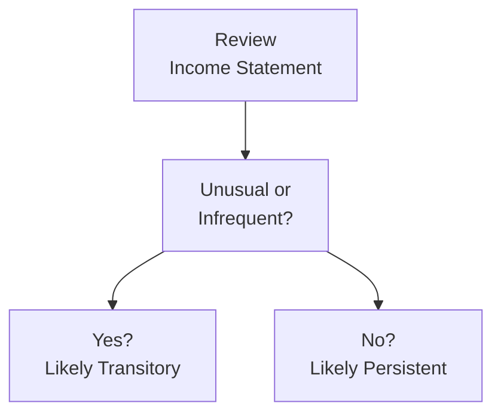

## Defining and Distinguishing Persistent from Transitory Earnings

Do you ever look at an income statement and wonder, “Wait, is that big spike in earnings something I can count on for next quarter, or is it just a one-off event?” That’s basically the heart of understanding persistent vs. transitory earnings. Persistent earnings come from a company’s core operational engine—activities that repeat, hopefully, quarter after quarter. Transitory earnings, on the other hand, are those random or infrequent blips that might look flashy but aren’t likely to recur. Think about a big gain from selling a building, a legal settlement, or some wild currency fluctuation. These can pop up and vanish, leaving you scratching your head if you assumed they'd happen regularly.

From an analyst’s perspective, persistent earnings are the “bread and butter” of a firm’s profitability—one of the key drivers for valuation, creditworthiness, and general corporate health. Transitory earnings, while they can inflate (or deflate) a particular period’s earnings, usually deserve a separate analysis. In a perfect world, companies would neatly separate the two. But as we’ll see (and as you might have guessed), the real world can be messy, with frequent misclassifications, repeated “one-time” restructuring charges, and complicated footnotes.

## Relevance for Earnings Quality

Persistent earnings tend to be more predictive of future performance, so they often garner higher valuation multiples. Investors and analysts typically pay closer attention to core operating profits because they signal repeat business and stable growth (or shrinkage) patterns. Transitory earnings do matter—especially if they’re huge—but they’re less likely to hold up over multiple periods. For instance, if a tech company sells off a major division for a big gain, that’s transitory. Next quarter, that revenue or gain is gone, so it doesn’t tell us much about the future.

From an exam perspective (and in real-life, too), you’ll want to separate the recurring from the non-recurring to get a clearer picture of sustainable cash flows and profitability. Yes, it takes some detective work in footnotes, MD&A, and segment disclosures—but it pays off in better forecasts, more accurate valuations, and a sharper sense of a company’s true performance.

## IFRS vs. US GAAP Perspectives

Both IFRS and US GAAP require companies to disclose unusual or infrequent items, but their guidelines for how and where to present them are not always identical. Under US GAAP, certain “unusual or infrequent” items might be shown in a separate line (for instance, ASC 225-20 addresses extraordinary and infrequent items), though the classic concept of “extraordinary items” was largely phased out. IFRS usually incorporates unusual gains and losses within normal income statement categories, placing greater emphasis on disclosure in notes and in the MD&A.

Practically, this means that an analyst may have to read the notes carefully to unearth transitory events under IFRS—perhaps more so than under GAAP—because IFRS statements might embed the unusual items in broader line items. On the bright side, IFRS does require meaningful disclosures, so if you hang out in the footnotes for a while, you’ll often find details on events such as restructuring, disposals, and impairment charges. The big challenge is that comparability across companies can be tricky unless you adjust systematically for these transitory elements.

## Identifying Transitory Items

When you’re combing through financial statements, ask yourself: “Is this item (gain or loss) linked to the company’s usual operations, or is it the result of something unusual?” This question helps root out transitory items. Common red flags include:

• Large Gains or Losses on Disposal of Assets: Whether it’s a building, equipment, or an entire subsidiary.  
• Restructuring Charges: Especially frequent if you see them recurring for three or four years straight—“Um, is that truly one-time?”  
• Litigation Settlements: Potentially big but usually not recurring (unless the company’s business model is full of lawsuits!).  
• Impairment Charges: Happen occasionally, but repeated impairments on the same assets might hint at deeper issues.  
• Changes in Fair Value for Non-Operational or Speculative Holdings: Gains or losses from non-core investments can skew net income.  

### A Visual Reference

Here’s a simplified flowchart illustrating how you might classify an item as persistent or transitory:

In practice, you’ll want to dig into MD&A, footnotes, or press releases for context. Sometimes management will label a massive charge or gain as “non-recurring,” but if that same charge pops up every year, it’s not really one-off anymore.

## Practical Implications for Valuation

Persistent earnings typically warrant a higher valuation multiple—like higher price-to-earnings (P/E) or enterprise value-to-EBITDA (EV/EBITDA)—because they’re assumed to continue into future periods. If you decide that a chunk of a company’s earnings is transitory, you usually strip it out of your pro forma or normalized earnings estimate. In discounted cash flow (DCF) terms, you might remove these items from your base-year operating income or treat them separately in your forecast of future free cash flows.

It’s important, though, not to ignore transitory earnings entirely. A one-time gain can affect taxes, liquidity, and even a company’s ability to invest in new projects. Similarly, a one-time loss can create net operating loss carryforwards or other tax benefits that might matter down the road. But for measuring “steady-state” performance, persistent earnings become the core metric.

## Footnotes, MD&A, and the Hunt for Clues

We used to joke on my old equity research team: “You don’t find the good stuff in the big bold lines on the income statement; you find it in the fine print.” The MD&A section, as well as footnotes, are prime real estate for uncovering details. Management might talk about “Restructuring expenses related to workforce realignments,” or “Sale of intangible assets.” That’s your queue to consider whether these items are truly unusual. Do they keep cropping up each quarter? Are they small compared to total revenue, or large enough to significantly alter net income?

If you see multiple so-called “infrequent” charges in consecutive years—and the firm is labeling them each time as one-off—that should make you raise an eyebrow. Maybe the business model is under constant overhaul, meaning the restructure is not so “one-time” in reality. The main point: if “one-time” events happen too often, it might be time to classify them as recurring.

## Segment-Level Analysis

Sometimes, big transitory charges or gains will get tucked into specific operating segments rather than being separately disclosed in a corporate-level line item. So, if you’re analyzing a multinational with multiple divisions, it pays to look at segment results. A segment might have posted a surprising jump in operating profits due to a divestiture or an insurance payout. Without a segment-level review, it’s easy to miss how one-time items affect consolidated data.

## Common Pitfalls & Earnings Misclassification

• Reclassifying Non-Operating Items as Operating: For instance, interest income or some investment gain might get pushed up into operating income.  
• Masking True Operating Weakness: Management might offset a transitory gain against a persistent cost, making margins look better than they really are.  
• Using “Pro Forma” Adjustments without Proper Disclosure: Some companies love to present an “adjusted EPS” that excludes half the normal expenses. Be cautious—dig into those adjustments to make sure they’re valid.  
• Overlooking Tax Effects: A big transitory gain or loss can swing the effective tax rate. Analysts sometimes forget to factor that into forward projections.

## Example: Identifying Transitory Earnings

Let’s say Company ABC, a consumer electronics firm, reports net income of $150 million this quarter, compared to $90 million last quarter. Impressive, right? But you pick up the footnotes and discover:

1. ABC sold a warehouse for a $40 million gain.  
2. The firm had $10 million in restructuring charges for plant closures.  
3. It recognized a $5 million impairment on an intangible asset (a brand name it acquired long ago).  

In evaluating persistent earnings, you might exclude the $40 million gain because it’s unlikely to repeat. At the same time, if these restructuring charges and impairments have been popping up every few quarters (and sometimes they do for cyclical manufacturing businesses), the question arises: Are these really “One-time,” or part of ongoing changes in the business model?

By adjusting for these factors, you might arrive at a “core” net income figure. That number is typically a better reflection of the company’s underlying performance.

## Analytical Adjustments for Ratios

Adjusting financial ratios to focus on persistent (ongoing) performance can help you avoid misleading conclusions. For instance:

• Profit Margins (Operating Margin, Net Margin): Exclude transitory items from both numerator and denominator to get a sense of true recurring profitability.  
• Return on Equity (ROE): If a large one-time item artificially boosts net income, adjust net income to reflect only the core amounts.  
• Price-to-Earnings (P/E) Ratio: You might recast the “E” (earnings) by removing or smoothing out transitory impacts, offering a better forward-looking multiple.  

This is why, in advanced ratio analysis (see references to earlier or upcoming chapters covering ratio adjustments), you often see “normalized” or “adjusted” figures side-by-side with reported results.

## Best Practices and Transparency

• Consistency in Reporting: Maintaining a standard way of disclosing transitory vs. persistent helps prevent confusion.  
• Clear Footnote Descriptions: Spell out what’s operating vs. non-operating, and whether the item is unusual, infrequent, or integral to ongoing business.  
• Separate Presentation: Some companies use separate sections for “Special Items” so analysts and investors can quickly isolate them.  
• Avoid “Cookie Jar” Reserves: Overestimating or underestimating transitory charges in one period to smooth earnings in another is a big no-no and raises questions about earnings manipulation.

## Scenario-Based Exercise: Spot the Transitory Component

Imagine you have a hypothetical retailer with the following figures:

• Revenue: $2.0B  
• COGS: $1.4B  
• Operating Expenses: $400M  
• Operating Income: $200M  
• One-Time Litigation Payout: $50M  
• Net Income: $190M  

At first glance, an operating income of $200M looks decent, but notice that net income is $190M, which is surprisingly close to operating income. Suddenly, you see the $50M litigation payout that reduced some other expense lines. Is that a routine occurrence? If it’s not, then ignoring it might give you a more accurate representation of the firm’s future profitability. That’s the type of analysis you’ll practice repeatedly as you become comfortable with real financial statements.

## Minor Anecdote on Repeated “One-Time” Events

I once worked with a CFO who would refer to repeated restructuring charges as “non-recurring.” Sure, the first time I believed him. But after the third consecutive year of “non-recurring” charges, it was pretty clear that maybe the restructuring was part of an ongoing, and thus persistent, issue. This taught me (the hard way!) the importance of verifying management’s classification. Just because something’s labeled “one-time” in the annual statement doesn’t mean it’s truly out of the ordinary.

## Glossary

• Persistent Earnings: Earnings derived from a firm’s continuous operations, expected to recur in future periods.  
• Transitory Earnings (Non-Recurring): One-off, infrequent, or unusual items that are not reflective of ongoing operations.  
• Earnings Quality: A measure of how closely reported earnings reflect a firm’s true economic performance and the sustainability of those earnings.  
• Operating vs. Non-Operating Items: Operating items relate to primary business activities; non-operating items stem from peripheral or incidental actions.  
• MD&A (Management Discussion & Analysis): Management’s commentary on corporate performance, strategy, and unusual events.  
• Restructuring Charges: Costs associated with reorganizing a business (e.g., severance pay, facility shutdowns).  
• Impairment Charges: Non-cash expenses recognized when an asset’s carrying value exceeds its recoverable amount.  
• Comparability: The extent to which financial information can be compared across different firms or time periods.

## References and Further Reading

- IFRS Foundation: IFRS Conceptual Framework Discussion – https://www.ifrs.org  
- US GAAP Guidance on Unusual or Infrequent Items (ASC 225-20)  
- Schilit, Howard. Financial Shenanigans: How to Detect Accounting Gimmicks & Fraud in Financial Reports.  
- Foster, G. (1986). “Financial Statement Analysis,” Journal of Accounting Research.  

--------------------------------------------------------------------------------

## Test Your Knowledge: Persistent vs. Transitory Earnings



### 1. Which of the following best describes persistent earnings?

- [ ] Earnings that only occur from large asset disposals.  
- [x] Earnings linked to a company’s core business and likely to recur.  
- [ ] Gains and losses resulting from one-time settlement items.  
- [ ] Earnings that fluctuate wildly due to random events.  

> **Explanation:** By definition, persistent earnings refer to ongoing operational profits that are expected to recur over future periods.

### 2. A company reports a substantial gain from the sale of an old factory. How should this be treated when evaluating the firm’s earnings quality?

- [ ] Treated as a recurring component since the company may sell more assets in the future.  
- [x] Treated as a transitory component with a separate analysis.  
- [ ] Treated as a negative indicator of financial health.  
- [ ] Ignored completely, as it only impacts cash flow.  

> **Explanation:** Gains on asset sales are generally considered transitory and should be isolated from recurring operational earnings for quality assessments.

### 3. Under US GAAP, how have extraordinary items generally been treated in recent years?

- [ ] They are still reported separately on the income statement with unique tax rates.  
- [ ] They are now combined with unusual or infrequent items but must appear in operating income.  
- [x] The extraordinary item classification has been largely phased out, requiring disclosure in other categories.  
- [ ] The concept has been expanded to include fair value adjustments.  

> **Explanation:** The extraordinary item classification was essentially removed; unusual events are still disclosed, but not labeled as “extraordinary items.”

### 4. When a firm repeatedly classifies restructuring charges as “one-time” but records them every year, this suggests:

- [x] The charges may actually be persistent.  
- [ ] The charges are exempt from tax considerations.  
- [ ] The charges enhance the firm’s operating margin.  
- [ ] The charges better characterize core earnings.  

> **Explanation:** Repeated “one-time” items raise doubts about their true classification. They may be an ongoing issue rather than an infrequent event.

### 5. Which of the following may signal a need to scrutinize an income statement for transitory earnings?

- [x] Large year-over-year changes largely attributed to a single unusual item.  
- [x] Repeated impairment charges on the same asset class.  
- [ ] A consistent ratio of operating expenses to revenue over time.  
- [ ] Transparent footnotes explaining each category.  

> **Explanation:** Big fluctuations due to unusual items and repeated impairments are classic indicators of transitory earnings. Footnotes that clearly explain categories actually help reduce concerns about misclassification.

### 6. Which statement about IFRS vs. US GAAP is accurate regarding non-recurring items?

- [ ] IFRS mandates separation of all non-recurring items in a dedicated section of the income statement.  
- [x] Both IFRS and US GAAP require disclosure of unusual items, but the classification and presentation can differ.  
- [ ] US GAAP treats non-recurring items as operating expenses by default.  
- [ ] IFRS forbids mentioning non-recurring items in the MD&A.  

> **Explanation:** Both IFRS and GAAP demand disclosure of significant unusual items, though the specifics of classification vary. IFRS typically embeds these items into regular categories, while GAAP historically used more discrete line treatments.

### 7. A financial analyst wants to calculate a “core” earnings figure. Which approach is most appropriate?

- [ ] Zero out all items below operating income.  
- [x] Exclude material, unusual gains or losses and ongoing non-operating items to focus on recurring operations.  
- [ ] Use only gross margin for the analysis.  
- [ ] Ignore the effective tax rate when adjusting for transitory items.  

> **Explanation:** To find core earnings, the analyst typically removes or adjusts for items that are non-operational or non-recurring, while accounting for related tax effects.

### 8. Which of the following is a common pitfall that can obscure a firm’s true earnings persistence?

- [ ] Reporting consistent operational margins.  
- [ ] Providing extensive footnotes about unusual transactions.  
- [x] Misclassifying non-operating items as operating items.  
- [ ] Accurately separating one-time events from ongoing activities.  

> **Explanation:** Reclassifying non-operating items as operating misrepresents the core profitability of the business, thus hiding true earnings persistence.

### 9. If a company’s tax rate appears abnormally high due to a large one-time capital gain, how should the analyst treat this fact?

- [x] Factor out the one-time gain’s effect on the tax rate to avoid skewed forward estimates.  
- [ ] Leave it since the effective tax rate is mandated by law.  
- [ ] Assume the same tax rate will continue indefinitely.  
- [ ] Categorize it as a normal operating cost.  

> **Explanation:** Analysts typically normalize the tax rate when calculating forward earnings if a one-time gain artificially inflates or deflates the effective tax rate.

### 10. Restructuring charges, if they occur each year, can still be considered truly “one-time” for earnings quality purposes.

- [ ] True  
- [x] False  

> **Explanation:** If restructuring charges recur annually, they are not genuinely “one-time” but reflect an ongoing business practice, thus reducing earnings quality.


