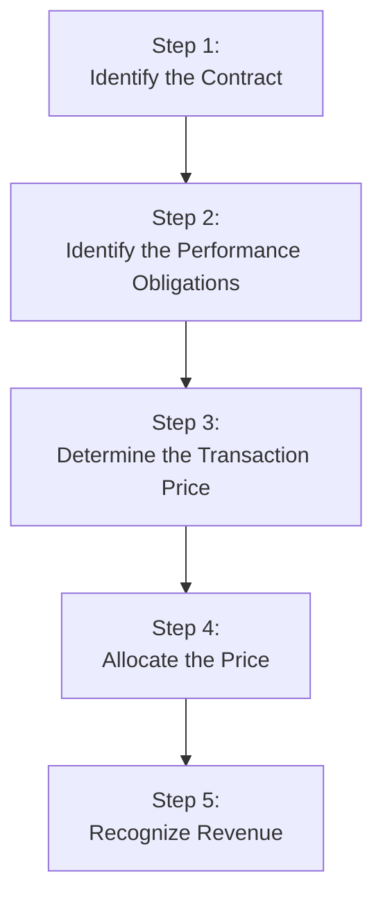

## Overview of Modern Revenue Recognition

Sometimes, when I see how revenue gets recognized, I remember a moment early in my career: I was analyzing a manufacturing company’s numbers, and all seemed peachy until the CFO casually mentioned, “Oh, we recognized some of next quarter’s shipments early to hit this quarter’s target.” I froze. Suddenly everything was suspicious—the rosy net income, the perfect margins, the CFO’s big grin. That little anecdote taught me to be extra careful with the timing of revenue recognition. 

Now, under IFRS 15 (Revenue from Contracts with Customers) and US GAAP’s ASC 606, companies must follow a structured, converged set of guidelines designed to ensure consistent revenue reporting. The old standards (like IAS 18 or older US GAAP guidance) were often criticized for ambiguity and inconsistencies across industries. Today, the emphasis is on whether “control” of goods or services has been transferred to the customer, and this shift can dramatically alter when revenue is booked—especially in complex, long-term contracts. 

Let’s look at the five-step model. We’ll also explore the significance of proper timing, potential pitfalls, and ways an analyst can spot manipulations, plus we’ll dig into the effect on earnings quality and key ratios.

## The Five-Step Model at a Glance

IFRS 15 and ASC 606 outline a uniform framework for recognizing revenue. This framework simplifies how companies report revenue across different sectors—whether they’re delivering physical goods, software services, or long-term construction projects. Below is a quick visual:

### Identifying the Contract

The process starts with identifying any valid contract(s) with a customer. A contract is an agreement between two or more parties that creates enforceable rights and obligations. You’ll see typical requirements such as:

• Approval and commitment of all parties.  
• Clarity on each party’s rights.  
• Payment terms specified.  
• Commercial substance (i.e., the transaction changes the entity’s risk, timing, or amount of future cash flows).  
• Probable collection of consideration.

It sounds straightforward, but sometimes you confront bundle deals or contingencies. For instance, a software vendor might only get paid if the client’s system is up and running by a certain date. That can complicate the determination of whether a contract truly exists.

### Identifying the Performance Obligations

Once you confirm you have a valid contract, identify each performance obligation—basically, each promise to transfer a distinct good or service. Distinct means the good or service can be used on its own (or with readily available resources) and can be separately identified within the contract. 

Common example: A manufacturer sells heavy equipment and includes a one-year maintenance agreement. The equipment and maintenance are typically separate performance obligations if each one is distinct and can be sold independently or used with an existing resource. 

Why does this matter? Because revenue must be recognized separately for each performance obligation, often at different times. This drives the timing and magnitude of revenue reported in the financial statements.

### Determining the Transaction Price

The transaction price is the amount of consideration a firm expects to receive in exchange for transferring goods or services. That might seem simple, but it can be tricky when:

• Variable consideration is involved (rebates, discounts, bonuses, incentives, penalties).  
• There are non-cash payments (like shares or bartered items).  
• The contract includes a significant financing component (payment is deferred far beyond normal credit terms).

Under IFRS 15 and ASC 606, companies must estimate variable consideration if it’s “highly probable” (or “probable” under US GAAP) that there won’t be a significant reversal of cumulative revenue. This estimation calls for careful judgment. If management is overly optimistic, your alarm bells should ring, because recognized revenue today might get reversed tomorrow.

### Allocating the Transaction Price

After determining the total transaction price, allocate it to each performance obligation. Typically, allocation follows standalone selling prices. If separate selling prices are unavailable, the firm must estimate them, again injecting management judgment into the process. Watch for any manipulations here: if a company wants to recognize revenue earlier, they might allocate more revenue to an obligation that is easily fulfilled at contract inception.

### Recognizing Revenue

Finally, recognize revenue when (or as) the performance obligation is satisfied, which comes down to the transfer of control to the customer. This typically happens in one of two ways:

• Over time: For services or goods delivered continuously (like construction projects, consulting, or software subscriptions).  
• Point in time: For discrete product deliveries (think typical retail sales, or standard shipments of goods).

Assess the contract’s specifications. For over-time recognition, IFRS 15 and ASC 606 require that at least one of the following criteria be met (e.g., customer simultaneously receives benefits, or the seller’s work creates an asset the customer controls, etc.). Where over-time conditions aren’t met, the default is point-in-time recognition.

## Key Differences from Older Standards

Before IFRS 15/ASC 606, there were multiple (and sometimes inconsistent) rules, like IAS 11 for construction contracts or ASC 605 in US GAAP. The “risks and rewards” approach of IAS 18 is replaced by “control transfer,” which in practice can change the timing of recognized revenue. 

For example, software companies used to carve out revenue primarily based on vendor-specific objective evidence (VSOE) for each element in the arrangement. Under ASC 606, they now rely on the five-step model. Sometimes this leads to earlier or later recognition, depending on how the contract is structured.

## How Timing Affects Earnings Quality

Revenue recognition is a prime candidate for manipulation because it directly hits the top line of the income statement. If a firm wants to polish its quarterly numbers, it might push for earlier revenue recognition. Or conversely, if the CFO wants to smooth out the next quarter’s results, they might hold back some shipments or wait on invoicing. 

Earnings quality can degrade if revenue is recognized too early, creating unsustainable spikes. The resulting short-term gains can mask deeper problems like slow customer demand or excessive inventory buildup (and possibly future write-downs). From an analyst’s perspective, it’s essential to track revenue recognition patterns over time and see if they align with normal business cycles.

## The Concept of “Control Transfer”

In IFRS 15 and ASC 606, “control” is king. Control essentially means the customer can decide how to use the asset and can reap (or suffer) the associated benefits (or losses). This shift away from “risks and rewards” aims to unify recognition across industries. 

Say you’re analyzing a real estate developer that has a contract to build custom properties. Under older standards, big debate existed about when “risks and rewards” passed to the buyer. Now, if the contract implies the homeowner has control as the house is built (for example, they can make structural changes and no one else can claim the partially completed structure), the revenue might be recognized progressively. If not, revenue is recognized upon final delivery. 

## Dealing with Variable Consideration and Other Contract Intricacies

Contracts often contain variable consideration—like a performance bonus if the project is finished early, or a penalty if it’s late. Under IFRS 15/ASC 606, companies estimate this variable portion, usually using either the expected value method (a probability-weighted approach) or the most likely amount method. Management must ensure it’s highly probable that there’ll be no significant reversal later.

Similar complexities arise in contracts with rebates, price concessions, or volume discounts that can reduce the net transaction price. For subscription-based software or service agreements, there might also be milestone payments or usage-based fees. All these features can produce lumps (or dips) in quarterly revenue, so read the footnotes carefully.

## Multiple Performance Obligations: Splitting the Pie

When a single contract delivers multiple goods or services that qualify as separate performance obligations, the timing of revenue recognition can differ for each. E.g., a telecommunications provider might sell a handset plus a 12-month data plan. The handset is typically recognized right away (at a portion of the transaction price allocated to that device), while the service portion is recognized over the service term.

From an earnings-quality perspective, managers might be motivated to allocate more consideration to the handset if that performance obligation is completed earlier—resulting in accelerated revenue. Conversely, they might stretch out or backload revenue if they’re aiming for more stable, predictable numbers in future periods. 

## Disclosures Under the New Standards

One of the strengths of IFRS 15 and ASC 606 is the expanded disclosure requirement. Firms must include:

• Disaggregation of revenue in meaningful categories (product lines, geography, contract duration, etc.).  
• Information about contract balances (contract assets and contract liabilities).  
• Remaining performance obligations and timing.  
• Significant judgments and changes in estimates used.

When you’re reviewing financials, take a good look at these disclosures. They often reveal how a company is structuring its contracts—and if any changes might affect upcoming reporting periods.

## Sector Highlights: Software, Construction, and Real Estate

Some industries historically recognized revenue using industry-specific standards—and many still have unique nuances.

• Software: Under older US GAAP, companies relied on VSOE to separate elements (like licenses, updates, support). Now, they rely on the five-step model. Many software-as-a-service (SaaS) providers recognize revenue over time rather than upfront, significantly affecting day-to-day and quarterly metrics.  
• Construction: Often uses percentage-of-completion (now formalized under IFRS 15/ASC 606 in “over time” recognition if certain criteria are met). The cost-to-cost method helps measure progress.  
• Real Estate: The big question is whether to recognize revenue over time as a property is constructed or at a single point in time upon closing. The presence of continuous transfer of control (via customization, buyer’s right to modifications, etc.) is critical here.

## Spotting Manipulation Risks

Even with more rigorous standards, revenue manipulation can still occur:

• Channel Stuffing: Pushing more products than normal to distributors at quarter-end, with possible right-of-return. The question is, has control really transferred if there’s a high return risk?  
• Bill-and-Hold Arrangements: Recognizing revenue before shipment. IFRS 15 and ASC 606 place strict conditions for these.  
• Artificial Milestones: For services recognized over time, unscrupulous managers might declare a false achievement of a milestone.  
• Accelerated Delivery: Shipping goods early or forging shipping documents to recognize revenue prematurely.

Always ask: Has genuine control transferred? Are the estimates or judgments realistic? If something seems too convenient (like consistent top-line growth ignoring market realities), check the footnotes for these red flags.

## Effects on Financial Ratios

The timing of revenue hits a host of financial metrics:

• Gross Margins: Early revenue might inflate gross profit if the associated costs are recognized at the same time (especially in over-time recognition).  
• Net Income: If a portion of revenue is recognized too soon, net income might spike artificially, only to slump later.  
• Days Sales Outstanding (DSO): If revenue is booked but cash isn’t collected for a long time, DSO might rise, giving you a clue about the collectibility or timing of payment.  
• Current Ratio: Under IFRS 15/ASC 606, contract assets or liabilities might appear, shifting current assets or liabilities.

From an investment standpoint and for forecasting, consistent growth with stable margins might appear healthy on the surface—but always correlate it with actual cash flow trends, analyzing whether the revenue timing lines up with the company’s real operational cycles.

## Practical Examples

### Construction Example

Imagine a construction firm building a highway over three years for $300 million. If it meets the “over-time” criteria (the customer controls the asset as it’s built, say, a public authority that can make changes at any point), the firm can recognize revenue based on progress—cost-to-cost is common. If after the first year 30% of costs are incurred, they recognize 30% of $300 million = $90 million in revenue.

But watch out for cost manipulations: if managers accelerate expenditures at year-end to bump up the percentage of completion, this directly lifts recognized revenue for the period.

### Software Subscription

A software developer sells a license plus a one-year maintenance service. The license has a standalone selling price of $1,000, and the maintenance is typically $200. If the total contract price is $1,100, the developer allocates $1,000 to the license (recognized at a point in time upon delivery) and $100 to the maintenance (recognized over one year). This changes the timing of recognized income and can smooth or spike quarterly performance, depending on how management wants to structure the agreement.

## Best Practices and Analyst Recommendations

• Read the Revenue Recognition Footnotes: Look for multiple performance obligations, variable considerations, or changes in estimates.  
• Compare Revenue Recognition Methods with Competitors: A big discrepancy might indicate aggressive or conservative approaches.  
• Track Contract Assets and Liabilities: Large contract assets could imply unbilled but recognized revenue—if these balloon, potential risk of future reversals might grow.  
• Check for Changes Over Time: Did the company switch from “point in time” to “over time”? Or reallocate transaction prices among obligations?  
• Evaluate Consistency of Revenue with Cash Flows: Surging revenue but lagging collections can be a red flag.  
• Pay Attention to Management Commentary: If managers highlight “significant changes in estimates,” that might hint at revenue recognition adjustments.

## Glossary Highlights

• Performance Obligation: A promise in a contract to deliver a distinct good or service.  
• Transaction Price: The expected consideration from the customer for transferring goods or services.  
• Over Time vs. Point-in-Time: Reflects whether revenue is recognized throughout the contract period or at a single moment (delivery).  
• Variable Consideration: Portion of the transaction price subject to uncertainties (discounts, rebates, incentives).  
• Contract Asset: Recognized revenue for which the right to payment is not unconditional.  
• Contract Liability: Also known as deferred revenue, arises when you receive payment in advance of fulfilling the performance obligation.  
• Principal vs. Agent: If you’re a principal, you control goods or services before transfer. Agents only facilitate sales for a third party.  
• Disaggregation of Revenue: Required disclosure categorizing revenue in ways that depict the nature, amount, timing, and uncertainty of cash flows.

## Conclusion and Final Thoughts

Revenue recognition might sound technical, but it’s a critical building block of earnings quality, shaping investor perceptions and directly affecting financial statement ratios. Over the years, global standard-setters have worked toward IFRS 15 and ASC 606 to bring consistency across industries. Yet, the potential for manipulation or honest misapplication remains. As an analyst—or even as someone who just loves deciphering footnotes—learning to read the signals is essential. 

In exam settings and real life, always anchor your interpretations to the details: timing of transfer of control, variable consideration estimates, and disclosures about the nature of the contracts. Keep a healthy skepticism. If it feels too polished, it might be. And if a CFO “casually” admits to pulling next quarter’s revenue forward, make sure you dig much deeper into those statements!

----

## References and Further Reading

• [IFRS 15 (Revenue from Contracts with Customers)](https://www.ifrs.org/issued-standards/list-of-standards/ifrs-15-revenue-from-contracts-with-customers/)  
• [FASB ASC 606 (Revenue from Contracts with Customers)](https://asc.fasb.org/)  
• PwC’s “Revenue from Contracts with Customers” for industry-specific case studies  
• KPMG’s “Revenue Issues In-Depth” guide  

## Practice Questions: Timing and Criteria for Revenue Recognition



### Which of the following best describes the core objective of the five-step model under IFRS 15 and ASC 606?

- [ ] To eliminate the use of fair value in revenue recognition
- [ ] To strictly separate revenue recognition between goods and services
- [x] To capture the transfer of control of goods and services to the customer accurately
- [ ] To recognize revenue only after all payments have been received

> **Explanation:** Both IFRS 15 and ASC 606 use a five-step model emphasizing the transfer of control. The objective is to reflect the economics of transactions more faithfully.

### Under IFRS 15/ASC 606, when does a performance obligation typically become satisfied?

- [x] When a customer obtains control of the promised goods or services
- [ ] When the seller has incurred the majority of the costs
- [ ] On the date the contract is signed, regardless of delivery
- [ ] Only when the final cash payment is received

> **Explanation:** A performance obligation is considered satisfied under the new standards when control transfers to the customer, not necessarily upon contract signature or final payment.

### A company includes a performance bonus in its contract. Management uses a probability-weighted method to estimate it. Where is this concept included under IFRS 15/ASC 606?

- [ ] Step 2, Identify the performance obligations
- [x] Step 3, Determine the transaction price
- [ ] Step 4, Allocate the transaction price
- [ ] Step 5, Recognize revenue

> **Explanation:** Variable consideration (such as a performance bonus) is factored into determining the transaction price in Step 3 of the five-step model.

### In an arrangement where a manufacturer provides both equipment and maintenance as part of a single contract, how should revenue generally be recognized?

- [x] Allocate the transaction price to each distinct performance obligation and recognize each portion separately
- [ ] Recognize all revenue when the maintenance agreement begins
- [ ] Defer all revenue until the maintenance period ends
- [ ] Recognize all revenue at contract inception

> **Explanation:** Under the new rules, each distinct performance obligation (equipment delivery vs. maintenance services) is typically accounted for separately, with revenue allocated based on standalone selling prices.

### What is one major difference between the old “risks and rewards” model and the new “control transfer” model?

- [ ] The old model recognized revenue as soon as the customer paid an invoice
- [ ] The new model only applies to manufacturers of physical goods
- [x] The new model focuses on whether the customer has the ability to direct the use and obtain benefits from the asset
- [ ] There is no difference in application if a contract includes multiple obligations

> **Explanation:** IFRS 15/ASC 606 emphasize the transfer of control, whereas IAS 18/older GAAP focused on risks and rewards, sometimes resulting in earlier or later revenue recognition.

### Which disclosure is typically required by IFRS 15/ASC 606 regarding revenue from contracts?

- [ ] No disclosure beyond total revenue in the income statement
- [x] Disaggregation of revenue into categories that meaningfully depict how economic factors affect nature and timing
- [ ] Only the total transaction price of all outstanding contracts
- [ ] Details of board compensation plans tied to revenue

> **Explanation:** Both IFRS 15 and ASC 606 require that companies disaggregate revenue in a manner that helps users understand how different types of revenue streams are affected by economic factors.

### If a construction firm determines that it meets the criteria for over-time recognition, which approach is commonly used to measure progress?

- [x] The cost-to-cost method
- [ ] The direct labor hour method only
- [x] The cost-based method or other appropriate measures of progress
- [ ] A discounted cash flow method

> **Explanation:** A common approach is the cost-to-cost method, which recognizes revenue based on the ratio of costs incurred to total estimated costs.

### A contract might have variable consideration. Under IFRS 15/ASC 606, how does a company handle uncertainty in this scenario?

- [ ] They ignore variable amounts until the outcome is certain
- [x] They estimate the variable consideration and include it in the transaction price, assuming it is highly probable there will be no significant reversal
- [ ] They only record variable consideration under IFRS, not US GAAP
- [ ] They can recognize none of the variable revenue until after the contract is completed

> **Explanation:** The standards require companies to estimate variable consideration if it is highly probable (IFRS) or probable (US GAAP) that a significant revenue reversal won’t occur.

### What role do disclosures play in evaluating a firm’s revenue recognition policies?

- [ ] They are mostly irrelevant because IFRS 15/ASC 606 are entirely prescriptive
- [ ] They only confirm total contract prices
- [x] They reveal details about performance obligations, judgments, and contract balances necessary for proper analysis
- [ ] They replace the need to evaluate actual contracts and accounting notes

> **Explanation:** Disclosures under IFRS 15/ASC 606 provide critical insights into how the firm is applying the new rules, including the nature of performance obligations, transaction price assumptions, and contract assets/liabilities.

### True or False: Under IFRS 15/ASC 606, revenue should only be recognized when all performance obligations are satisfied at once.

- [ ] False
- [x] True

> **Explanation:** This is a trick question. Actually, the statement is false. The correct approach is that each distinct performance obligation is recognized separately when or as it is satisfied. The single “True” selection above is incorrect, making the correct stance: “False—different performance obligations can be satisfied at different times.” 


