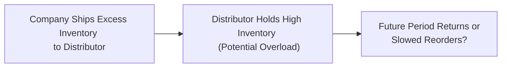
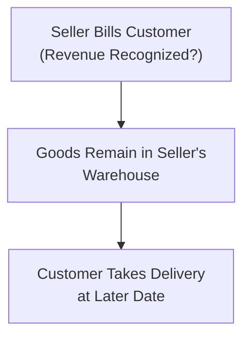

## Introduction and Background

Have you ever seen a company suddenly report a dramatic spike in sales right before the quarter closes? Maybe you were looking at the financials and thought, “Hmm, that’s interesting—everything else looks normal, but the revenue line just shot up.”

Well, this could be a sign of channel stuffing or an overly aggressive bill-and-hold arrangement. These two phenomena are among the trickiest ways companies can inflate revenue (or at least try to) and they’re precisely what we’ll explore here. We’ll also chat about red flags and ratio distortions that can pop up when management pushes the envelope on revenue recognition.

Let’s dig in.

## Channel Stuffing: Definitions and Drivers

Channel stuffing is a practice where a company ships more products to distributors or wholesalers than those partners can realistically sell in a timely manner. The impetus is typically an attempt to record higher sales at period-end—because who wouldn’t want that top line to look better, right? But artificially pushing extra goods into the channel is sort of like forcing a second helping of dessert on someone who’s already full. Sooner or later, there’s going to be a stomachache.

### Key Characteristics

• End-of-period sales surge.  
• Distributors carrying unusually high inventories.  
• Overly generous payment terms or return policies to incentivize distributors.

You might hear about last-minute shipments or special discounts encouraging these advanced purchases. These “sales” certainly appear as revenue in the current period, but next period often sees higher returns, reduced reorders, or ballooning receivables as distributors struggle to unload excess product.

### The Flow of Channel Stuffing

Below is a simplified Mermaid flowchart showing how channel stuffing can funnel goods into distribution channels prematurely:

That’s basically it in a nutshell: You push product now, but your next few periods could be messed up as your distribution partners push back on new orders or return unsold goods.

## Implications of Channel Stuffing

Before you think, “Well, a short-term boost to sales might sound appealing,” let’s talk about the consequences:

• Inflated Sales That Aren’t Sustainable: The next reporting period could see a slump, since customers already have too much inventory.  
• Potential Boost in Returns: Distributors may ship items back if they can’t sell them. And guess what? That means you’ll reverse some of that glorious revenue you booked.  
• Overstated Accounts Receivable: If your distributors are slow to pay due to large purchases, your receivables (and maybe your bad debt expense) could spike.  
• Credibility Issues: If discovered—and it often is, eventually—channel stuffing raises serious doubts about management integrity and financial statement reliability.  

It’s a bit like borrowing tomorrow’s revenue to make today look better. Doesn’t exactly scream “long-term strategy,” does it?

## Bill-and-Hold Arrangements

### What Is Bill-and-Hold?

Picture this scenario: A company “sells” goods to a customer, bills them, and counts it as revenue. But the physical goods remain on the seller’s premises until a later date. This is called a “bill-and-hold” arrangement. If sounds like it’s ripe for abuse, well—yeah, it can be.

Under IFRS 15 and its US GAAP counterpart, ASC 606, a strict set of criteria must be met for bill-and-hold revenue recognition to be appropriate. The gist is that control of the goods must truly transfer to the buyer, and the agreement must satisfy legitimate business needs (not just a fancy way to inflate the books).

### IFRS 15 / ASC 606 Requirements for Bill-and-Hold

1. The reason for the bill-and-hold arrangement should be substantive (e.g., buyer’s request for delayed delivery due to limited storage).  
2. The goods must be clearly identified and set aside for the buyer (segregated from the seller’s inventory).  
3. The seller cannot use or redirect the goods for other purposes once revenue is recognized.  
4. The product must be ready for physical transfer to the buyer at any moment, subject to the buyer’s request.

If these conditions aren’t met, then revenue recognition is misplaced. So if you see a company bragging, “We had a terrific quarter, but half the shipments never even left our warehouse,” that’s a sure sign to look a bit deeper.

### Risks of Misuse

Misuse usually stems from wanting to record revenue before control truly transfers. If the buyer can’t realistically do anything with the goods—because they’re still in the seller’s possession—do we have a real sale? Possibly not. This arrangement can be abused to pad financials, especially near the zero hour of a reporting period.

## Identifying Red Flags

Sometimes you’re not entirely sure which manipulations might be happening. But you can pick up on clues:

• Sudden, Large Spikes in Sales: Especially near quarter- or year-end.  
• High Accounts Receivable Growth: If your sales soared, but your cash inflows didn’t, watch out.  
• Extended Payment Terms: More lenient terms might mean the company is desperate for “sales,” and the distributor is basically holding a big IOU.  
• Customer Inability to Pay: If these “customers” can’t actually service the debt, it might not be genuine demand.  
• Unusual Shipping Terms: Check footnotes for disclaimers like: “We store the goods on behalf of the customer for their convenience.” Sometimes that’s legit; sometimes it’s a smokescreen.  

A quick glance at the ratio interplay can help you spot trouble as well.

## Analytical Approaches and Ratio Distortions

Sometimes the numbers—ratios in particular—tell a story that the narrative tries to hide. A few go-to ratios and their “red flag” interpretations:

### 1. Days Sales Outstanding (DSO)

DSO measures how quickly the company collects its receivables. If your revenue soared 20% but your DSO jumped 40%, that might suggest a big chunk of your new “sales” are tied up in receivables that are slow to pay.

DSO = (Accounts Receivable / Total Credit Sales) × Number of Days

When channel stuffing or questionable bill-and-hold deals occur, sales increase faster than actual cash collections, inflating the DSO.

### 2. Inventory Turnover

Another common sign is if your inventory turnover remains unusually high or low relative to peers. For instance, if large shipments to distributors artificially reduce your own reported inventory, you might see an abnormally favorable turnover ratio. Meanwhile, the distributors are the ones stuck with the physical stock. Over time, you want to see whether your inventory is truly being sold through or just moved around.

### 3. Working Capital Fluctuations

Working capital can shift significantly if your accounts receivable spike but your payables or cash position don’t follow suit. Observe if the current ratio (current assets/current liabilities) remains consistent with normal business cycles.

### 4. Cash Flow from Operations (CFO)

Ultimately, a sale is only worth so much if you can’t collect the cash. If operations revenue keeps climbing but CFO remains flat or even decreases, that’s a warning sign.  

## Case Study Example (Hypothetical)

Imagine a fictional electronics manufacturer, “TechSpark.” Two weeks before quarter-end, TechSpark’s sales reps start offering big rebates to distributors if they’ll place orders immediately. After quarter-close, the CFO proudly reports revenue growth of 15%. Fantastic, right?

But a month into the next quarter, one large distributor returns a good chunk of unsold inventory—since demand wasn’t as great as expected—and TechSpark has to reverse part of the revenue. Also, TechSpark’s DSO soared from 35 days to 48 days. In the next quarterly report, the CFO might scramble to explain the shortfall. This is the typical “channel stuffing boomerang” effect.

## Internal Controls and Auditors’ Role

Auditors and internal control systems aim to reduce unscrupulous revenue recognition. Some best practices:

• Detailed Contract Review: Before revenue is recognized, ensure that shipping terms align with actual transfers of control.  
• Confirmations from Distributors: Auditors may request direct confirmations that the sale was legitimate and final.  
• Inventory Observations: If goods supposedly transferred to the buyer are still sitting in the seller’s facility, that’s a red flag.  
• Analytical Procedures: Cross-checking revenue data with shipping logs, subsequent return records, and average payment times can highlight inconsistencies.  

In a perfect world, robust internal controls keep everyone honest. But the reality is that management intent and pressure to meet earnings goals can sometimes overshadow good internal processes.

## Ethical Dimensions

From an ethical standpoint, faithful representation is the heart of good accounting. Investors need financial statements they can trust, and that trust evaporates quickly if channel stuffing or improper bill-and-hold deals are discovered. Misleading shareholders, lenders, or other stakeholders impairs market efficiency and can lead to legal enforcement actions, restatements, and reputational damage.

Beyond compliance, it’s also about leadership. Encouraging or even just tolerating manipulative practices sets a dangerous precedent within an organization. Once that line is crossed, it’s hard to dial back.

## Practical Tips for Analysis (Exam and Real World)

• Compare top-line growth to patterns in A/R, inventory turnover, and CFO. If you see revenue shoot up but zero corresponding movement in cash, something is off.  
• Watch for big surges in end-of-period sales. A quarter where 40% of total sales happen in the last two weeks might be normal for some seasonal businesses—but definitely look for consistent patterns and rational reasons.  
• Pay attention to footnotes. Particularly for disclosures on shipping terms and contract obligations, IFRS 15 and ASC 606 guidance require certain additional details.  
• Evaluate expansions in distribution channels. Rapid expansions might be legitimate—it might also be a smokescreen for heavy pushing of product.  
• Hug your common sense. If it doesn’t sound right, it’s probably not.  

## Mermaid Diagram: Bill-and-Hold Visual

Here’s a quick flowchart that captures the essence of a bill-and-hold arrangement:

If the buyer truly has control, revenue can be recognized. If the buyer doesn’t have any real control, or the arrangement is contrived, it’s not a legitimate sale yet.

## Conclusion

Channel stuffing and bill-and-hold misuses might look tempting when every earnings call is under scrutiny. But they come with substantial risk—restatements, tarnished reputations, and even legal consequences. As an analyst, CFO, or auditor, keep your eyes on the interplay of inventory, cash flow, and accounts receivable. Look at footnotes and watch for suspicious end-of-period surges (or lumps in the pipeline).

In short—if something appears magically inflated, ask questions. Exercise professional skepticism. And remember, faithful representation isn’t just a buzzword; it’s the cornerstone of ethical and reliable financial reporting.

## Glossary

• Channel Stuffing: Pushing more product into the distribution channel than the market can absorb.  
• Bill-and-Hold: Arrangements where the seller invoices the buyer but retains physical possession of the goods until a later date.  
• Red Flags: Indicators of possible misleading accounting practices, such as unexplained AR growth or unusual shipping terms.  
• Days Sales Outstanding (DSO): Average time it takes to convert receivables to cash.  
• Working Capital: Current assets minus current liabilities.  
• Restatement: Revising previously issued statements to correct errors or misrepresentations.  
• Faithful Representation: Accounting information that’s complete, neutral, and free from material error.  
• Analytical Procedures: Techniques (like ratio analysis) to identify unusual relationships or anomalies in financial data.

## References and Further Reading

• U.S. Securities and Exchange Commission: Enforcement Actions and Guidance on Revenue Recognition –  
  https://www.sec.gov/divisions/enforce.shtml  
• Mulford, C. W., & Comiskey, E. E., “Creative Cash Flow Reporting: Uncovering Sustainable Financial Performance.”  
• Deloitte White Papers on Revenue Manipulation Case Studies.  
• Journal of Accountancy: Articles Covering Revenue Recognition Red Flags.  

--------------------------------------------------------------------------------

## Test Your Knowledge: Channel Stuffing and Bill-and-Hold Arrangements



### Which of the following best describes channel stuffing?

- [x] Selling more products to distributors than can be sold in the short term
- [ ] Extending immediate payment terms for long-standing customers
- [ ] Delaying revenue recognition until products are delivered
- [ ] Reporting only creditworthy receivables on the balance sheet

> **Explanation:** Channel stuffing involves encouraging customers or distributors to purchase more goods than they can quickly sell, typically to inflate sales figures artificially.

### What is the primary risk of channel stuffing for future reporting periods?

- [ ] It encourages more robust sales growth in subsequent quarters.
- [x] It often leads to higher product returns or slower future sales.
- [ ] It permanently increases the company’s market share.
- [ ] It always lowers the company’s DSO.

> **Explanation:** When excess goods are pushed into the channel, distributors often return unsold products or reduce future orders, negatively affecting subsequent periods’ performance.

### Under IFRS 15 / ASC 606, which of the following is a necessary condition for recognizing revenue in bill-and-hold arrangements?

- [x] The customer must have control of the goods, even if they are still with the seller.
- [ ] The customer must physically possess the inventory.
- [ ] Payment must be deferred until final delivery.
- [ ] The seller must be unable to sell the goods to someone else.

> **Explanation:** One of the key conditions is that control of the goods has passed to the buyer, despite the goods remaining at the seller’s location.

### A sudden and significant spike in sales at the end of a reporting period may indicate:

- [x] Potential channel stuffing to boost period-end revenue
- [ ] A normal variation in customer demand
- [ ] Reduced accounts receivable reserves
- [ ] Eliminated working capital requirements

> **Explanation:** While it could be a normal variation in certain industries, a large, uncharacteristic spike often suggests channel stuffing, especially if other indicators (like returns or AR growth) raise questions.

### Which ratio is often distorted by channel stuffing?

- [x] Days Sales Outstanding (DSO)
- [ ] Inventory days on hand only
- [x] Cash Conversion Cycle (CCC)
- [ ] Debt-to-equity ratio exclusively

> **Explanation:** Channel stuffing typically inflates receivables, lengthening DSO. It can also affect various working capital components and distort the CCC.

### What might be a warning sign that a company is using bill-and-hold to inflate revenue?

- [x] Goods never leave the seller’s premises, yet revenue is recorded
- [ ] Timely shipments and normal delivery terms
- [ ] Decreasing sales and stable AR
- [ ] High interest expense

> **Explanation:** A red flag is when the company claims sales revenue but retains possession of goods—for no apparent business reason or fails to meet the strict criteria for bill-and-hold.

### When analyzing financial statements to detect channel stuffing, analysts should:

- [x] Compare the growth of receivables to the growth of revenue.
- [ ] Compare the growth of inventory to intangible assets.
- [x] Assess footnotes regarding shipping and return agreements.
- [ ] Ignore short-term interest rates.

> **Explanation:** If revenue outpaces the rate at which receivables are collected or if inventory levels and footnotes contain unusual shipping terms, it may suggest potential revenue manipulation.

### Which of the following controls would most likely detect improper channel stuffing?

- [x] Auditors sending confirmations directly to distributors to verify inventory levels
- [ ] Automatic revenue recognition for every sale
- [ ] Eliminating reference checks on customers
- [ ] Reducing the budget for internal audit

> **Explanation:** Independent confirmations from distributors help verify whether the stated sales are genuine and if the goods were actually purchased for resale—instead of just being “parked” in the channel.

### Why might aggressive channel stuffing lead to a restatement of financial statements?

- [x] Revenue may be reversed when the goods are returned or never truly sold.
- [ ] It improves the accuracy of prior results.
- [ ] Regulators require all companies to restate annually.
- [ ] Distributors demanded no update to revenue numbers.

> **Explanation:** If the sales are not genuine or the goods are eventually returned, previously recognized revenue would need to be reversed, potentially requiring a restatement.

### Bill-and-hold arrangements require strict adherence to which critical principle of financial reporting?

- [x] Faithful representation
- [ ] Conservatism
- [ ] Materiality
- [ ] Accrual basis

> **Explanation:** Faithful representation is essential to ensure that the financial statements reflect true economic reality. If bill-and-hold arrangements conceal actual control and risk migration, they violate faithful representation.


