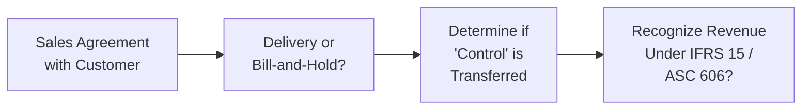

## Scenario Setup

So, let’s imagine we have a mid-size manufacturing firm—let’s call it Glendale Manufacturing (“Glendale”). Toward the end of each quarter, Glendale’s sales suddenly spike. It’s almost like clockwork. You know how sometimes you see a company eke out those last-minute deals? That’s precisely what Glendale has been doing, only in a more dramatic fashion than normal. Accounts receivable are consistently climbing, inventory levels fluctuate in suspicious ways, and hidden in a tiny footnote is a mention of “bill-and-hold” sales. Right away, that phrase can set off alarm bells if there’s no crystal-clear justification for using such an arrangement.

Glendale claims it needs to boost revenue to satisfy eager shareholders and meet tough internal sales targets. However, the CFO’s enthusiasm for “pushing sales out the door” is giving some employees second thoughts—especially when they see odd shipping terms, suspicious recognition of revenue before actual delivery, and extended payment windows to customers who might not have the strongest credit profiles.

In this vignette, we want to:

• Identify different signs that Glendale might be playing games with its revenue.  
• Assess if certain transactions are in line with IFRS 15 / ASC 606 or if they cross into questionable or even improper territory.  
• Examine the potential effects on financial ratios and overall earnings quality.  
• Figure out how these moves could inflate net income in the short term but damage Glendale’s stability in the long run.  

Along the way, we’ll reference IFRS 15 (Revenue from Contracts with Customers) and ASC 606 (its US GAAP counterpart) to highlight key revenue recognition principles. Let’s dive into the nitty-gritty.

## Identifying Potential Manipulation

It’s one thing to see vibrant sales growth, but quite another to observe sales that mysteriously accelerate at the end of an accounting period. When analyzing Glendale’s financials, consider the following red flags:

• Sudden End-of-Period Surges: Glendale has a track record of booking a significant portion of its quarterly revenue in the final days.  
• Bill-and-Hold Arrangements: Some customers are billed for product that Glendale still retains physically. Is the control of the goods truly transferred? Under IFRS 15 / ASC 606, that’s a key question.  
• Unusual Shipping Terms: “FOB shipping point,” “FOB destination,” or even “FOB Glendale’s warehouse until further notice.” The exact shipping terms can drastically affect whether revenue should be recognized now or later.  
• High Accounts Receivable Growth: If Glendale’s accounts receivable grows faster than sales over multiple quarters, that mismatch might indicate they’re booking revenue well before cash is anywhere near the door.  
• Rising Returns or Credits: Although not stated explicitly in Glendale’s notes yet, channel stuffing often leads to higher customer returns later when distributors or customers can’t move product.  

Revenue recognition manipulations pop up more frequently than we’d like in real markets. I’ve sat across from managers who rationalize that “industry practice” allows them to recognize revenue earlier. But IFRS 15 and ASC 606 revolve around the principle that revenue should only be recognized when control of the goods or services transfers to the customer under a valid contract.

## IFRS 15 / ASC 606 Overview

Under both IFRS 15 and US GAAP (ASC 606), revenue recognition follows a common framework:

1. Identify the Contract(s) with a Customer.  
2. Identify the Performance Obligations in the Contract.  
3. Determine the Transaction Price.  
4. Allocate the Transaction Price to the Performance Obligations in the Contract.  
5. Recognize Revenue When (or As) the Entity Satisfies a Performance Obligation.

When Glendale tries to record revenue on a bill-and-hold sale, it must demonstrate that:

• There’s a substantive reason for the arrangement (customer request, not Glendale’s).  
• The product is separately identified and ready for physical transfer to the customer.  
• Glendale cannot use the product for another customer.  
• The customer has control of the product, even if physical possession has not transferred.

If Glendale cannot satisfy these conditions, you might have a classic scenario of premature revenue recognition. Breaking these rules can easily push Glendale into questionable or outright improper territory.

## Assessing Financial Statement Impact

### Legitimate vs. Potentially Improper Revenues

Sometimes, Glendale might have legitimate reasons for end-of-quarter sales pushes, such as cyclical buying patterns. However, suspicious actions often come to light when:

- The CFO is pressuring staff to sign “side agreements” with customers.  
- Shipping or “delivery” is documented on the last day of the quarter, but the goods remain on Glendale’s premises.  
- Actual shipment is incomplete, or the customer has an extended window to accept or return the product with minimal penalty.

We can tentatively classify Glendale’s recognized revenue into three buckets:

• Legitimate and Proper: Glendale has delivered goods, the buyer has assumed title, and Glendale has no further performance obligations.  
• Questionable Timing but Potentially Valid: Glendale hasn’t yet fulfilled a performance obligation, but perhaps the arrangement is carefully structured to meet IFRS 15 / ASC 606 criteria. Bill-and-hold might be allowable if all conditions are met.  
• Improper and Possibly Violative of IFRS/GAAP: Glendale is booking revenues when no real transfer of control has taken place. If discovered, these amounts may need restatement.

### Ratio Calculations and Red Flags

In practice, analyzing Glendale’s revenue often involves checking a few critical ratios. Let’s peek at some:

• Receivables Turnover = (Sales) / (Average Accounts Receivable)  
• Days Sales Outstanding (DSO) = 365 / Receivables Turnover  
• Current Ratio = (Current Assets) / (Current Liabilities)

When Glendale’s receivables turnover steadily falls, or DSO consistently rises, it might indicate that Glendale is recording revenue faster than it collects from customers—or that it’s booking revenue it shouldn’t. A declining turnover ratio alone isn’t proof of wrongdoing, but combined with last-minute sales and “unusual shipping terms,” it can strengthen the suspicion.

If Glendale is inflating revenues, the following can happen:

• Overstated Net Income: More recorded sales means more profits (at least on paper).  
• Misleading Margins: Operating margin or gross margin might appear healthier than reality.  
• Distorted Operating Cash Flows: If Glendale can’t collect from these questionable sales, CFO will lag behind net income.  
• Potential Liquidity Squeeze: If large amounts of revenue remain uncollected, Glendale’s working capital might deteriorate rapidly.

## Visualizing the Process

Below is a simple flowchart showing how an ordinary sale might differ from a questionable “bill-and-hold” scenario. This is just a broad illustration:

• In a proper sale, Glendale ships goods, and the customer assumes risks and benefits of ownership at that point.  
• In a bill-and-hold arrangement, Glendale must carefully ensure all IFRS/ASC 606 criteria are met before booking revenue.  

## Evaluating the Sustainability of Earnings

So Glendale might look great on the surface. Earnings are up, management is excited, and analysts initially applaud the “growth story.” But artificially boosted sales are typically short-lived. Look, eventually, Glendale must deliver actual products that match the recorded revenue. If Glendale is stuffing distributors or prematurely recognizing sales, we’ll see future period slowdowns, possible restatements, or ballooning returns from dissatisfied customers.

### What If These Transactions Are Reversed?

Let’s say you suspect $3 million worth of Glendale’s quarterly revenue was recorded prematurely. Adjusting Glendale’s numbers might look like this:

• Decrease Net Sales by $3 million  
• Decrease Accounts Receivable by $3 million  
• Recalculate Operating Income, CFO, and key ratios

Suddenly, Glendale’s net income margin might dip, and its liquidity ratios could shift drastically. Even a small restatement can erode investors’ confidence or trigger credit downgrades if Glendale is reliant on stable financial metrics for loan covenants.

## Practical Steps for Analysis

1. Read Footnotes Thoroughly: IFRS 15 / ASC 606 disclosures usually include details on revenue recognition policies, performance obligations, and any special shipping agreements or extended payment terms.  
2. Check Contract Terms for Transfer of Control: Does Glendale truly relinquish control of the goods? Are there repurchase or return clauses?  
3. Compare Revenue Growth to Receivables: Rapid revenue expansion with an even steeper rise in accounts receivable can signal possible channel stuffing.  
4. Scrutinize Customer Relationships: Are Glendale’s customers financially stable? Are they new customers? Do they have a pattern of returning significant amounts of product in subsequent periods?  
5. Review Subsequent Events: If Glendale is forced to write off significant AR or accept product returns after the period closes, that’s a major sign of recognized revenue without real substance.

## Adjusting the Financials and Re-Assessing

In many real-world cases, analysts will create an “adjusted” or “normalized” income statement. They eliminate (or drastically reduce) revenue lines that do not meet IFRS 15 / ASC 606’s requirements and re-check the company’s financial stability:

• Revised Net Revenue: Subtract questionable transactions from total reported revenue.  
• Revised Operating Profit: Flow through the changes in gross margin, cost of goods sold, and operating expenses.  
• Adjusted Cash Flow from Operations: Show that certain “sales” would not lead to actual cash inflows.  
• Impact on Valuation: For equity analysis, Glendale’s multiple (P/E, EV/EBITDA) may become less rosy. For credit analysis, Glendale’s coverage ratios might deteriorate, especially if CFO is lower.

## Ethical and Regulatory Considerations

Let’s be blunt: channel stuffing or fraudulent bill-and-hold are not just technical misinterpretations. They can cross ethical lines that threaten Glendale’s credibility. The CFA Institute’s Code of Ethics emphasizes the importance of presenting fair and accurate financial data. If Glendale’s managers knowingly distort revenue, they risk:

• Regulatory Fines or Sanctions: Both the SEC (in the US) and national securities regulators elsewhere can investigate questionable accounting.  
• Audit Firm Intervention: External auditors might issue adverse opinions or require restatements.  
• Litigation: Shareholders could file lawsuits if Glendale’s stock tanks after revenue restatements.  
• Damaged Reputation: Even if Glendale squeaks by legally, trust can evaporate among creditors and investors.

For you as an analyst (or for a future CFO reading this), you shouldn’t rely solely on management’s explanation. A thorough reading of the footnotes and a healthy dose of skepticism can go a long way in preserving your and your firm’s reputation.

## Glossary

• Vignette-Style Problems: Scenario-based questions resembling the CFA exam’s item set format.  
• Earnings Manipulation: Strategies, often unethical, to portray financial results more favorably.  
• Receivables Turnover: (Sales) / (Average Receivables), used to track how quickly a firm collects on its receivables.  
• Credit Analysis: Evaluates a firm’s ability to meet debt obligations. Distorted sales can mask weak creditworthiness.  
• Regulatory Repercussions: Consequences (fines, sanctions) imposed by authorities for incorrect or misleading financial reporting.  
• Restatement Impact: Negative financial and reputational fallout from restating previously issued financials.  
• Sales Returns: Potential “reverse sales” if stuffed channels cannot sell product or if free return periods are abused.  
• Scenario-Based Learning: An application-focused teaching approach building deeper analytical skills through realistic narratives.

## References and Further Reading

• Golden, T., Skalak, S., & Clayton, M. (2006). Accounting Irregularities and Financial Fraud.  
• CFA Institute’s Financial Reporting and Analysis text covers common red flags in revenue recognition.  
• AICPA, ICAEW guidelines on ethical responsibilities for proper revenue recognition.  
• IFRS 15 / ASC 606 official standards, which are widely available online.  
• Real-world annual reports: Look for how companies disclose revenue recognition policies under “Significant Accounting Policies.”

----

## Distorted Revenues: Test Your Knowledge



### Which of the following elements most strongly suggests improper revenue recognition in Glendale’s scenario?

- [ ] Consistent growth in revenue with stable receivables  
- [ ] Early payment discounts offered to customers  
- [x] Bill-and-hold arrangements with no clear customer request  
- [ ] Decreasing operating margins over time  

> **Explanation:** Bill-and-hold sales without a legitimate customer request or lack of clear transfer of control is a major red flag. It indicates Glendale may be boosting revenue artificially.

### Glendale’s accounts receivable turnover ratio has been steadily declining in recent quarters. Which of the following is the BEST explanation for why this decline could be problematic?

- [x] It indicates Glendale may be recognizing revenue faster than customers pay, suggesting possible channel stuffing.  
- [ ] It always means Glendale’s credit policies are too strict.  
- [ ] It proves Glendale is engaged in fraudulent reporting.  
- [ ] It has no relationship to revenue recognition decisions.  

> **Explanation:** A lower turnover can indicate that receivables are piling up, possibly due to aggressive or premature revenue recording. Although not definitive proof, it flags risk.

### Under IFRS 15 / ASC 606, which condition is REQUIRED for a proper bill-and-hold arrangement?

- [x] The customer must have control of the goods, even if physically held by the seller.  
- [ ] The seller must physically deliver the goods to the customer’s premises.  
- [ ] Payment must be received in full before delivery.  
- [ ] The goods must be convertible into other products.  

> **Explanation:** A key principle is that “control” of the goods passes to the customer. Physical possession is not always necessary, but the control must be evident.

### Which of the following might occur if Glendale’s questionable end-of-quarter revenue recognition is reversed?

- [ ] Reported revenue would increase.  
- [x] Net income could fall, and Glendale might have to restate financial statements.  
- [ ] Receivables turnover ratio would improve dramatically.  
- [ ] The company’s creditworthiness would automatically improve.  

> **Explanation:** If improperly recognized sales are removed, net income would decrease, and Glendale could face the need to restate. This could negatively affect creditworthiness and investor confidence.

### Which ratio is MOST useful for assessing whether Glendale’s revenue recognition is outpacing cash collection?

- [ ] Current Ratio  
- [x] Days Sales Outstanding  
- [ ] Quick Ratio  
- [ ] Debt-to-Equity Ratio  

> **Explanation:** Days Sales Outstanding is especially revealing when it lengthens, as it indicates possible disconnect between revenue booked and actual collections.

### Why might shareholders initially be pleased by Glendale’s aggressive revenue recognition methods?

- [ ] It increases the credibility of the company’s footnotes.  
- [ ] It decreases the company’s volatility.  
- [x] It inflates short-term earnings and might drive the share price up temporarily.  
- [ ] It reduces the likelihood of restatement in the future.  

> **Explanation:** Excessive revenue recognition can inflate reported earnings, possibly boosting short-term share price. However, the long-term risks often outweigh these temporary gains.

### In evaluating whether a bill-and-hold sale complies with IFRS 15 / ASC 606, which of the following steps is MOST critical?

- [x] Verifying that up-front control has passed to the customer.  
- [ ] Ensuring the goods are physically shipped immediately.  
- [x] Confirming a valid reason for storing the goods at the seller’s location.  
- [ ] Ignoring payment terms entirely.  

> **Explanation:** Under IFRS 15 / ASC 606, the buyer must have control, and there must be a valid business reason for storing goods. These points are key conditions for legitimate bill-and-hold revenue.

### Which outcome is LEAST likely if Glendale continues recognizing revenue prematurely?

- [ ] Increased scrutiny from auditors and regulators.  
- [ ] Potential financial statement restatement.  
- [ ] Higher risk of shareholder lawsuits.  
- [x] Guaranteed long-term improvement in liquidity.  

> **Explanation:** Premature revenue recognition can inflate short-term numbers, but it undermines genuine liquidity and solvency over time. It won’t “guarantee” liquidity improvements.

### Analyzing Glendale’s footnotes, an analyst notices extended return periods for end-of-quarter shipments. Which potential effect does this hallmark of channel stuffing present?

- [ ] It indicates Glendale’s CFO is robust.  
- [ ] It has no effect on Glendale’s future cash flows.  
- [ ] It ensures the quality of the goods is high.  
- [x] It raises the risk that future returns could reduce recognized revenue.  

> **Explanation:** Extended return provisions are a classic sign of channel stuffing, potentially inflating current period sales at the expense of heavy returns later.

### True or False: A manufacturing company can recognize revenue before physical delivery if all IFRS 15 / ASC 606 conditions for a bill-and-hold arrangement are satisfied.

- [x] True  
- [ ] False  

> **Explanation:** Bill-and-hold revenue recognition can be legitimate under IFRS 15 / ASC 606 if control has effectively passed to the buyer, and specific criteria are met.


