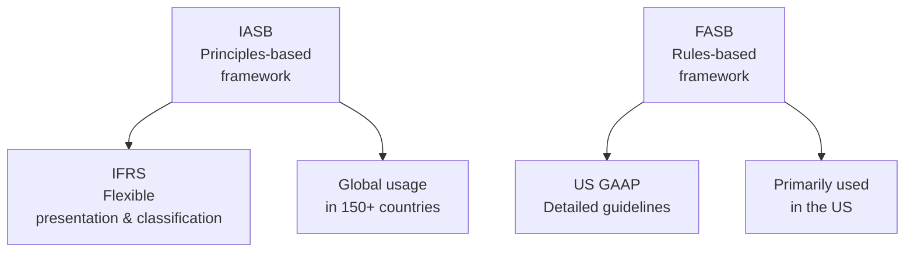

## Overview

So, let's talk about conceptual frameworks and their role in guiding financial reporting. I remember once, back when I was interning at a small accounting firm, I noticed how the same economic transaction sometimes ended up looking a bit different on financial statements, depending on whether clients used IFRS or US GAAP. I was like, “Wait, aren’t we all following the same rules?” But as it turns out, IFRS and US GAAP rely on two slightly different conceptual frameworks—leading to some interesting quirks in financial reporting.

Conceptual frameworks essentially function like a blueprint for setting standards. They ensure that financial statements are transparent, comparable, and serve the primary goal of providing decision-useful information. IFRS is developed by the International Accounting Standards Board (IASB), whereas US GAAP is guided by the Financial Accounting Standards Board (FASB). Both frameworks have a similar mission—give users the info they need to make financial decisions—but IFRS leans toward a principles-based approach while US GAAP leans toward a more rules-based approach.

## IFRS and US GAAP: A Quick Historical Peek

It might help to have a bit of context on how both frameworks came about. IFRS emerged from efforts by various countries around the globe to harmonize accounting standards into a single, unified set of principles that could meet the needs of cross-border investors. The IASB took on the role of standard setter, refining earlier International Accounting Standards (IAS). Over 150 countries now permit or require IFRS for their publicly listed companies.

On the other hand, US GAAP sprang from a distinctly American perspective, shaped by decades of pronouncements from entities like the Accounting Principles Board (APB) and the Committee on Accounting Procedure before FASB took over in the 1970s. Because the US market is vast and highly regulated, US GAAP often responds with detailed guidance for numerous specific scenarios.

## Primary Objectives of the Conceptual Framework

Both IFRS and US GAAP revolve around a core objective: furnishing valuable, relevant, and faithfully represented financial info. In everyday terms, they want to ensure you can look at a firm’s financial statements and say, “Yes, I see how this company is performing, and I can compare it with others.” That’s the heart of comparability. And let’s not forget other essential qualities such as consistency, verifiability, timeliness, and understandability.

• IFRS focuses on decision usefulness for a wide range of stakeholders, including current and future investors, lenders, and regulators.  
• US GAAP has the same underlying idea but is known to provide more detailed directives for specific topics (revenue recognition, leases, derivatives, etc.).  

Anyway, the goal is the same in both realms: to keep the reporting as faithful as possible to economic reality. They’re just playing slightly different tunes on the same piano.

## Principles-Based vs. Rules-Based Approaches

One of the most notable differences you might hear is that IFRS is more “principles-based,” while US GAAP is more “rules-based.” So, what the heck does that actually mean?

• Principles-Based (IFRS): IFRS sets out broad guidelines, counting on professional judgment to apply these guidelines correctly. That can mean a fair bit of flexibility in presentation and measurement, but it also means you need a thorough understanding of the underlying principles to get it right.  
• Rules-Based (US GAAP): US GAAP frequently provides explicit instructions on how to account for certain transactions. This can be super helpful for novices because the standard might lay out step-by-step rules. But it can also feel a bit rigid, and sometimes new, complex transactions don’t neatly fit into existing rules—leading to interpretation challenges.

In practice, the difference is not always black and white. IFRS does have rules, and US GAAP has principles, but the overall emphasis still remains: IFRS encourages more interpretation, while US GAAP tries to cover the bases with detailed mandates.

## Presentation Variations in Financial Statements

While both IFRS and US GAAP use a consistent set of formal statements, the naming, ordering, and specific contents can vary. That’s probably why if you open up an annual report of a European-based firm vs. one from the US, you might see subtle differences:

• Statement of Financial Position (IFRS) vs. Balance Sheet (US GAAP)  
• Statement of Profit or Loss and Other Comprehensive Income (IFRS) vs. the Income Statement (and sometimes a separate Statement of Comprehensive Income) under US GAAP  
• Statement of Changes in Equity (IFRS) vs. Statement of Stockholders’ Equity (US GAAP)  
• Statement of Cash Flows (both frameworks require this but differ on classification flexibility)  
• Notes to the Financial Statements (both frameworks emphasize disclosures, but the layout can differ)

And oh boy, the statement of cash flows can be a real headache for some folks. IFRS is often more flexible with interest and dividend classification (allowing them in operating, investing, or financing sections, subject to consistency and disclosure), whereas US GAAP is stricter: interest paid and interest received usually appear in operating activities, for example. So, if you’re analyzing companies across different jurisdictions, keep an eye on how these items get classified. It can really throw off your ratio comparisons if you’re not careful.

Here’s a quick visual overview that sums up the interplay between the IASB and FASB concept frameworks, and how they flow down to financial statements:

## Policy Choices and Management Judgment

Let’s face it: accountants have a lot of wiggle room. Under IFRS, management may choose between certain accounting policies for intangible assets or how to classify certain expenditures (like capitalizing development costs in some instances). US GAAP might be more prescriptive in these areas. But even within US GAAP boundaries, management still has leeway to decide the timing of write-downs or how to measure unusual items.

Occasionally, you might wonder, “Does that freedom for IFRS cause big differences in reported results?” Possibly. But IFRS still mandates disclosures about those choices, so if you’re an analyst, you can root around in the footnotes to figure out how they accounted for intangible assets, how they recognized revenue from long-term projects, or how they measured impairments. The bigger challenge is that the conceptual differences can lead to confusion if you try to directly compare companies using IFRS vs. US GAAP without making adjustments.

## Evolving Nature of the Frameworks

The conversation between IFRS and US GAAP is a bit like an ongoing dance. For a while, the IASB and FASB worked on a project called “convergence,” aiming to minimize differences in major areas—revenue recognition (ASC 606 and IFRS 15) and leases (ASC 842 and IFRS 16), to name a couple. They’ve achieved some level of alignment, but let’s not kid ourselves: differences remain, and new differences can pop up. Both boards publish updates consistently to refine standards or respond to emerging issues (like crypto assets or sustainability reporting).

Staying updated can feel like a never-ending job. If you’re prepping for the CFA exam, just remember the gist: IFRS and US GAAP keep inching closer in some respects but remain distinct frameworks.

## Effects on Ratio Analysis and Comparability

Okay, so how do these conceptual frameworks impact ratio analysis? If you’re comparing a US-based company using US GAAP to a UK-based company using IFRS, you might see variations in reported net income or assets simply due to differences in recognition and measurement. For instance, IFRS might require immediate write-down of certain intangible assets that US GAAP would amortize differently, leading to a bigger expense in IFRS early on.

As a result, you’ll want to watch for big differences in margins, return on assets, and debt ratios. If intangible assets are measured differently, total assets might differ, directly affecting return on assets or debt-to-equity measures. Analysts often try to “normalize” statements by reclassifying or adjusting certain items to make them more comparable. That’s part of the skill set you develop over time—figuring out when to adjust for apples-to-oranges differences.

## Regulatory Influences

It’s not just the IASB or FASB calling the shots in isolation. The US Securities and Exchange Commission (SEC) strongly influences how US GAAP is applied—especially for public companies. Meanwhile, IFRS goes through various interpretations and local endorsements by regulatory bodies within each country. You might find that in certain jurisdictions, IFRS has local modifications or add-ons. This intersection of standard-setters and regulators adds another layer of complexity for multinational corporations.

## Future Outlook

Perhaps you’re wondering, “So will we ever have one true global standard?” Some might say it’s possible in the long run; others are skeptical. The boards remain open to coordination, but each accounting culture is deeply rooted in its history and legal environment. Regardless of convergence efforts, IFRS will likely keep its principle-based orientation, and US GAAP will continue offering more explicit rules in many areas—just maybe not as many as in the past.

## Conclusion

Ultimately, IFRS and US GAAP conceptual frameworks serve the same purpose: deliver relevant, faithful, comparable info to users of financial statements. Their differences revolve more around detailed guidance, naming conventions, presentation, and the extent of professional judgment they allow (or demand!). As aspiring CFA® charterholders, you’ll want to keep these nuances in mind—especially if you’re analyzing companies across multiple jurisdictions, because those differences can and do matter for key metrics.

But don’t worry too much. After you spend enough time examining real statements (and maybe a bunch of footnotes), you get pretty good at spotting where IFRS or US GAAP might push the numbers one way or another. The conceptual frameworks are the backbone, giving you the confidence to interpret variations with a critical, informed eye.

## Glossary

• “Principles-Based”: An approach providing broad, overarching guidelines, leaving room for professional judgment (IFRS style).  
• “Rules-Based”: An approach offering detailed, prescriptive rules for specific transactions (US GAAP style).  
• IASB: International Accounting Standards Board, caretaker of IFRS.  
• FASB: Financial Accounting Standards Board, caretaker of US GAAP.  
• Comparability: The ability of financial statements to let users notice similarities and differences across entities and periods.  
• Transparency: Clear, truthful representation of a company’s performance and position.  
• Recognition: The official process of including an item in the financial statements.  
• Measurement: Determining the monetary amounts for recognized elements.

## References

• IFRS Foundation website: https://www.ifrs.org  
• FASB website: https://www.fasb.org  
• “International Financial Reporting and Analysis” by Alexander, Britton, and Jorissen  
• “Conceptual Framework for Financial Reporting” (IASB)  
• “Statement of Financial Accounting Concepts” (FASB)  

## Test Your Knowledge: IFRS vs. US GAAP Conceptual Frameworks



### Which of the following best describes a key objective of both IFRS and US GAAP conceptual frameworks?

- [ ] Minimizing reported expenses.
- [x] Providing decision-useful information for investors and creditors.
- [ ] Ensuring maximum profits for shareholders.
- [ ] Eliminating all forms of accounting discretion.

> **Explanation:** Both IFRS and US GAAP frameworks share the fundamental goal of delivering information that helps users (like investors, creditors, and other stakeholders) make relevant economic decisions.

### Which of the following is a distinctive characteristic of a principles-based approach?

- [x] Relies on broad guidelines and professional judgment.
- [ ] Depends on detailed prescriptive rules.
- [ ] Focuses solely on minimizing global differences.
- [ ] Prohibits any form of management estimation.

> **Explanation:** IFRS is considered more principles-based, which means it publishes general guidelines that rely on professional judgment for interpretation, in contrast to the more rules-based nature of US GAAP.

### Under IFRS, which financial statement name differs most from the typical US GAAP naming convention?

- [ ] Statement of Cash Flows
- [ ] Statement of Changes in Equity
- [x] Statement of Financial Position
- [ ] Notes to the Financial Statements

> **Explanation:** IFRS refers to what US GAAP calls the “Balance Sheet” as the “Statement of Financial Position.” The other statements are more similarly named or only slightly different.

### Which of the following statements about the Statement of Cash Flows is true under IFRS?

- [x] IFRS allows some flexibility in classifying interest and dividends.
- [ ] IFRS does not require the Statement of Cash Flows.
- [ ] IFRS mandates that all dividends be shown in investing activities.
- [ ] IFRS prohibits using the direct method.

> **Explanation:** IFRS permits interest or dividends received and paid to be classified in operating, investing, or financing sections, as long as it is disclosed and applied consistently.

### In applying IFRS, the concept of “prudent reporting” translates to:

- [ ] Completely avoiding any management estimations.
- [ ] Recording assets at exaggerated amounts.
- [x] Using caution in making estimates and judgments to avoid overstatement.
- [ ] Always using the lowest possible values for any asset.

> **Explanation:** Prudence suggests caution when making judgments under conditions of uncertainty. It doesn’t imply systematic downplaying of assets, but rather a balanced approach.

### Why might ratio analysis be affected by the use of IFRS vs. US GAAP?

- [ ] Under IFRS, all ratios must be the same as US GAAP.
- [ ] US GAAP always produces lower ratios than IFRS.
- [x] Differences in recognition or measurement may alter denominators and numerators in important ratios.
- [ ] There is no influence on ratios due to framework distinctions.

> **Explanation:** Certain items may be recognized or measured differently under IFRS vs. US GAAP, leading to potential variances in assets, liabilities, revenues, or expenses and thus impacting ratios.

### Which of the following is a common outcome of US GAAP’s more rules-based framework?

- [x] Detailed guidance on specific accounting issues.
- [ ] Excessive reliance on management judgment.
- [x] Fewer interpretive disputes due to step-by-step instructions.
- [ ] Prohibition of footnote disclosures.

> **Explanation:** US GAAP’s rules-based nature often yields explicit guidelines for various scenarios, aiming to reduce ambiguity, although some interpretive challenges still arise in complex contexts.

### How do international regulators typically interact with IFRS?

- [ ] They have no role in enforcing IFRS standards.
- [ ] They can independently develop IFRS for each country without IASB input.
- [ ] They regularly replace IFRS with local GAAP versions.
- [x] They may endorse or modify IFRS for local use in certain jurisdictions.

> **Explanation:** While IFRS is designed to be globally accepted, local regulators in each jurisdiction can endorse, modify, or add requirements.

### Which statement about IFRS and US GAAP convergence is most accurate?

- [ ] The IASB and FASB have fully converged all standards.
- [x] Significant progress has been made in areas like revenue recognition, but notable differences remain.
- [ ] There has never been any attempt at convergence.
- [ ] Convergence has only introduced more differences.

> **Explanation:** Various projects, especially in revenue recognition and leases, achieved some alignment, but IFRS and US GAAP remain distinct frameworks.

### True or False: IFRS and US GAAP both aim to provide a faithful representation of an entity’s economic activity, despite differences in how standards are applied.

- [x] True
- [ ] False

> **Explanation:** Both frameworks ultimately share the same broad objective of faithfully representing economic reality, even if they vary in approach and detail.


