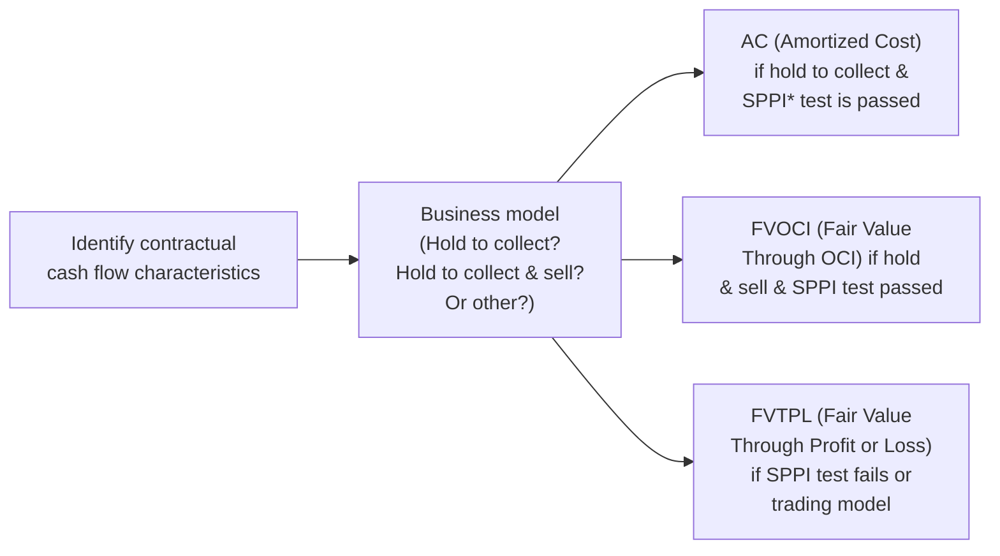
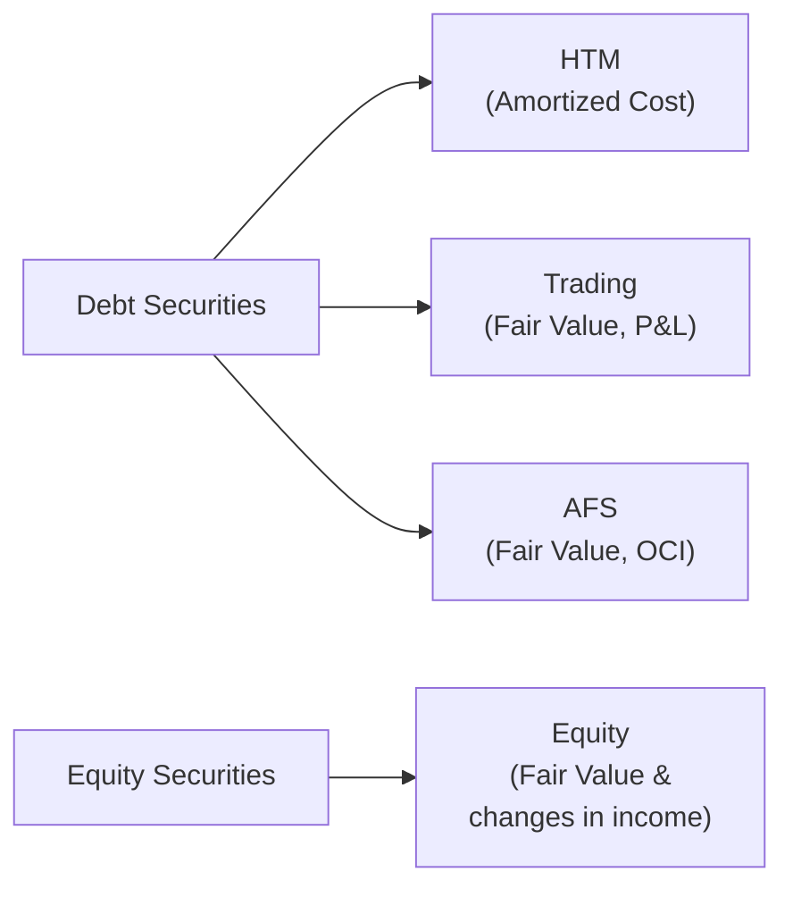

## Introduction
If you’ve ever stared at a company’s balance sheet and wondered, “Huh, why does this investment keep bouncing between fair value and cost?”—you’re not alone. Way back when I first started analyzing financial statements, I found IFRS 9’s and US GAAP’s approaches to classification and measurement of financial instruments (like bonds, stocks, and quirky derivatives) both fascinating and, honestly, a bit intimidating. Over time, these rules clicked into place—but it took practice, plus a few real-life stumbles, to really “get” them.

Below, we’ll walk through how IFRS 9 and US GAAP each classify and measure financial instruments. We’ll highlight the exam-ready insights you need for Level II, and the real-world angles analysts use to gauge risk, earnings volatility, and ratio implications. We’ll also look at some handy examples to help bring these technical rules to life.

## IFRS 9 Classification Essentials
IFRS 9 (Financial Instruments) groups financial assets into three main categories, primarily based on (1) the contractual cash flow characteristics test and (2) the entity’s business model for managing the assets. The categories are:
- Amortized Cost (AC)  
- Fair Value Through Other Comprehensive Income (FVOCI)  
- Fair Value Through Profit or Loss (FVTPL)

The determination of which bucket a financial asset ends up in depends on how the entity plans to use the asset (collect contractual cash flows, both collect and sell, or neither) and the nature of those cash flows (are they solely payments of principal and interest, or something else?).

### Quick Visual Guide to IFRS 9 Classifications

*SPPI = Solely Payments of Principal and Interest

- **Amortized Cost (AC):**  
  Assets that pass the SPPI test and are held with the intent to collect these contractual cash flows. Measurement is at amortized cost; changes in fair value aren’t reflected on the income statement (except for impairment or if the asset is sold, of course).

- **Fair Value Through Other Comprehensive Income (FVOCI):**  
  Assets that pass the SPPI test but are part of a business model where the firm both collects contractual cash flows and sells the asset. Unrealized gains and losses go to other comprehensive income until the instrument is disposed of, at which point some IFRS-specific rules apply for reclassification of gains/losses to profit or loss (particularly for debt instruments).

- **Fair Value Through Profit or Loss (FVTPL):**  
  Everything else ends up here—especially if the assets do not meet the SPPI test or are actively traded for short-term profit. All fair value changes normally run through the income statement. 

This classification approach helps ensure that the accounting reflects the nature of the instrument and the entity’s intention in holding it. But it also means you’ve got to carefully check the footnotes for management’s stated business model.

## US GAAP Classification Essentials
In the realm of US GAAP (under ASC 320, 321, 825, and related sections), the classification is a bit different. The historical categories revolve primarily around debt securities, with an additional category for equity investments:

- **Held-to-Maturity (HTM):**  
  Debt securities that management has both the ability and intent to hold until maturity. These are measured at amortized cost.

- **Trading Securities:**  
  Bought and held principally for selling in the near term—think short-term active trading. These are measured at fair value, with changes recognized in earnings (similar to IFRS’s FVTPL).

- **Available-for-Sale (AFS):**  
  Debt securities that aren’t HTM or Trading. They are measured at fair value, with unrealized gains or losses hanging out in OCI. When sold, those accumulated gains/losses move from OCI to profit or loss (a process often referred to as “recycling”).  

- **Equity Investments:**  
  If you hold equity securities, you typically measure them at fair value through income, unless another measurement option (e.g., cost or net asset value) is allowed or elected. This can introduce a big chunk of volatility into the P&L if the equity is publicly traded and subject to big day-to-day price fluctuations.

### Quick Snapshot of US GAAP Classifications

One subtle difference is that IFRS lumps everything—debt and equity—into broad categories (like AC, FVOCI, FVTPL), whereas US GAAP typically separates debt securities from equity instruments. In practice, both are after the same general idea: deciding where in the statements to place changes in fair value.

## Initial Recognition and Subsequent Measurement
Both IFRS and US GAAP typically require that financial instruments be recognized initially at fair value. That’s usually straightforward. However, differences can pop up once you move to subsequent measurement:

- Under **IFRS 9**, subsequent measurement is determined by whether the asset is classified as AC, FVOCI, or FVTPL.  
  • AC: measured at amortized cost using the effective interest method.  
  • FVOCI: measured at fair value, but changes go through OCI (with some recycling rules for debt).  
  • FVTPL: measured at fair value with changes hitting profit or loss right away.  

- Under **US GAAP**, subsequent measurement depends on whether the instrument is HTM, AFS, Trading, or equity:  
  • HTM: measured at amortized cost.  
  • AFS: measured at fair value, with gains/losses temporarily in OCI.  
  • Trading: measured at fair value, with gains/losses in earnings.  
  • Equity investments: typically fair value, with gains/losses in earnings (unless another specific method applies).

The choice of classification can significantly affect your analysis of a company’s profitability and stability. For instance, management can choose to classify some items in a way that might smooth earnings over time or, in some cases, reflect more of a mark-to-market approach.

## Impairment Models
### IFRS 9’s Expected Credit Loss (ECL)
IFRS 9 introduced an “expected credit loss” model—sometimes I refer to it as “ECL mania” because it requires companies to estimate forward-looking expected losses on day one. This approach can accelerate the recognition of impairment expenses. The key is that IFRS 9 has a three-stage ECL model:
- Stage 1: Credit risk hasn’t increased significantly since initial recognition → recognize 12-month ECL.  
- Stage 2: Significant increase in credit risk → recognize lifetime ECL.  
- Stage 3: Objective evidence of impairment → recognize lifetime ECL and interest revenue is calculated on the net carrying amount.

### US GAAP’s CECL Approach
Under ASC 326, US GAAP also mandates a forward-looking approach known as CECL (Current Expected Credit Losses). It’s conceptually similar (look ahead, consider the possibility of losses over the entire life of the instrument), but the mechanical details and specific calculations can differ from IFRS 9’s three-stage method. US GAAP doesn’t explicitly break it down into stages; instead, everything is measured at a lifetime expected credit loss from initial recognition. For many companies, the biggest challenge is building robust models that incorporate macroeconomic forecasts, borrower specifics, and historical data.

### Analyst’s View on Impairments
From an analyst’s standpoint, both IFRS 9 and CECL try to ensure more timely recognition of credit losses. However, day-one loss recognition can distort the timeline of reported earnings. When you’re reviewing banks, for instance, be sure to see if the bank’s assumptions about future economic conditions are consistent with market consensus. Overly optimistic or pessimistic assumptions can lead to big swings in credit loss allowances.

## Reclassifications
Reclassification is a tricky area, so let’s keep it straightforward:
- **Under IFRS 9**, you typically can reclassify financial assets only if the business model for managing those assets changes (which is supposed to be rare).  
- **Under US GAAP**, you can reclassify between HTM, AFS, Trading, and so on under certain circumstances—like changes in management intent or ability to hold a security. 

Any reclassification triggers special disclosure requirements, and you’ll want to keep an eye on these for potential “earnings management.” For instance, a company might shift an instrument into a category where fair value changes no longer flow through profit or loss if they anticipate a big negative movement in the coming months. Typically, the standards aim to limit opportunistic reclassifications. 

## Disclosures and Footnotes
Both IFRS and US GAAP want to see robust disclosures about how a company values its financial instruments, how it measures impairment, and the judgments involved. If there’s one piece of advice for the exam vignettes—and for real-world practice—it’s this: read the footnotes carefully to see:
- The classification chosen.  
- The way management determines fair value (especially if it’s Level 1, 2, or 3 in the fair-value hierarchy).  
- The impairment methodology and assumptions used.  
- Any reclassifications made during the period and why.

These disclosures offer crucial insight into how stable or volatile the company’s reported results might be, and they help you pinpoint if a company is using aggressive or conservative assumptions.

## Practical Example: Potential Impact on Ratios
Imagine a firm invests in a portfolio of corporate bonds. Under IFRS 9, if it classifies them as FVOCI, the unrealized gains or losses will bypass the income statement and rest in OCI. Net income volatility remains relatively low. Under US GAAP, if these same bonds are labeled as AFS, unrealized gains/losses likewise stay in OCI. However, if they’re labeled as Trading or FVTPL, those gains/losses will slam right into net income—potentially creating big swings in the firm’s P/E ratio from quarter to quarter.

### Quick Illustrative Numbers
Let’s say a company invests in a bond at $1,000, and the market value soon rises to $1,050.  
- If the bond is AC or HTM: no recognized gain until sold (unless there’s an impairment).  
- If the bond is FVOCI or AFS: $50 goes to OCI, not directly to net income.  
- If the bond is FVTPL or Trading: the $50 gain goes straight to the income statement.

When you’re comparing two companies that appear similar on the surface, these classification distinctions can significantly distort or inflate reported profitability metrics. You might think one company is “doing better,” when in reality they’ve just recognized gains earlier because of the classification.

## Best Practices and Common Pitfalls
One pitfall is to assume that “fair value” always means “through the income statement.” Actually, we have two main fair value buckets under IFRS 9 (FVTPL, FVOCI) and multiple under US GAAP (Trading, AFS, etc.). Another pitfall is overlooking changes in credit risk assumptions—especially around IFRS 9’s ECL or US GAAP’s CECL. Those items can lead to large swings in reported impairment. 

Also keep an eye out for “earnings management” via reclassifications. While the standards aim to limit opportunistic re-labelling of assets, some restructuring or “rare change” in business model might conveniently time with an upcoming market downturn. The footnotes reveal these maneuvers, and any big reclassifications should ring alarm bells for an analyst.

## Final Thoughts
Classification and measurement of financial instruments under IFRS and US GAAP can at first feel like you’re trying to learn a new language. But once you focus on the business model and the nature of the cash flows—and keep an eye out for reclassifications, impairment models, and footnote disclosures—things really do start falling into place. Importantly, from a CFA exam standpoint, be prepared to dissect a vignette that tests your ability to identify how each category affects the balance sheet, income statement, and ratios. 

And in real-world analysis—well, these rules aren’t just academic niceties. The classification decisions a company makes can reveal a lot about its risk tolerance, the stability (or volatility) of its earnings, and how they might respond in turbulent markets. 

## References
- IFRS 9 Financial Instruments (IASB).  
- ASC 320, 321, 326, and 825 (FASB Codification).  
- “International GAAP 2023” by Ernst & Young.  
- IFRS Foundation Knowledge Centre:  
  https://www.ifrs.org/issued-standards/list-of-standards/ifrs-9-financial-instruments/  
- FASB Technical Agenda and Updates:  
  https://www.fasb.org  

## Test Your Knowledge: Classification and Measurement of Financial Instruments



### Which of the following classifications under IFRS 9 measures financial assets at amortized cost?

- [ ] Fair Value Through Profit or Loss (FVTPL)
- [ ] Fair Value Through Other Comprehensive Income (FVOCI)
- [x] Amortized Cost (AC)
- [ ] Held-to-Maturity (HTM)

> **Explanation:** Under IFRS 9, the Amortized Cost (AC) classification is specifically designed for debt instruments that satisfy the SPPI test and are managed under a hold-to-collect business model.  

### Under IFRS 9, if a financial asset is designated as FVOCI, how are unrealized gains and losses generally treated?

- [ ] They go directly to retained earnings at the end of each period.
- [ ] They are recognized immediately in profit or loss.
- [x] They accumulate in OCI until disposal or reclassification.
- [ ] They are deferred until the business model changes.

> **Explanation:** For FVOCI under IFRS 9 (particularly for debt instruments), unrealized gains and losses are recognized in OCI. They typically remain there until the instrument is sold, at which point they can be reclassified into profit or loss.  

### In US GAAP, which category measures typical equity investments at fair value, with changes reflected directly in net income?

- [ ] Held-to-Maturity
- [ ] Available-for-Sale
- [x] Equity Securities
- [ ] Trading Securities

> **Explanation:** ASC 321 addresses equity investments. In most cases, these securities must be measured at fair value, with changes reported in net income, unless a specific practical expedient or exception applies.  

### If a firm classifies a bond investment as Held-to-Maturity under US GAAP, how is it measured in subsequent periods?

- [ ] At fair value, with changes reported in net income.
- [ ] At fair value, with changes reported in OCI.
- [ ] At historical cost, not adjusted for premium or discount.
- [x] At amortized cost using the effective interest method.

> **Explanation:** Held-to-Maturity (HTM) debt securities are carried at amortized cost based on their effective interest rate. This classification presumes management has both the intent and ability to hold the debt until maturity.  

### Which of the following highlights a primary difference between US GAAP and IFRS 9 regarding equity investments?

- [x] US GAAP generally places equity investments at fair value through income; IFRS 9 may allow FVOCI for certain equity instruments.
- [ ] Both treat equity investments strictly at amortized cost.
- [ ] IFRS 9 mandates trading treatment for all equity instruments.
- [ ] US GAAP eliminates any ability to carry equity at fair value.

> **Explanation:** IFRS 9 has an option for certain equity instruments to be classified as FVOCI (with no recycling of gains/losses), while US GAAP typically requires equities to be measured at fair value with changes recognized in net income (unless a specific election/practical expedient applies).  

### True or False: Under IFRS 9, reclassifications of financial assets are permitted at any time if fair value changes become material.

- [ ] True
- [x] False

> **Explanation:** IFRS 9 restricts reclassifications of financial assets to those arising from a documented change in business model, which is expected to be infrequent, rather than changes in asset prices alone.  

### Which of the following best describes the impairment model under IFRS 9?

- [ ] A “backward-looking” approach that only captures incurred losses.
- [ ] A single-bucket lifetime impairment for all assets.
- [ ] A fixed 2% allowance for all debt instruments.
- [x] A forward-looking approach, capturing expected credit losses (ECL) in three stages.

> **Explanation:** IFRS 9 introduced a three-stage forward-looking approach to better capture credit risk as it evolves, accelerating the recognition of expected credit losses.  

### Under US GAAP’s CECL model, when do companies recognize expected credit losses?

- [ ] Only after the credit risk has drastically increased.
- [ ] Upon sale or disposal of the financial asset.
- [x] At the time of initial recognition, covering lifetime expected losses.
- [ ] At maturity of the asset, unless collateral is provided.

> **Explanation:** CECL requires immediate estimation of lifetime expected credit losses upon initial recognition and subsequent updates over the asset’s life, promoting earlier recognition of potential defaults.  

### How might IFRS 9’s FVOCI classification and US GAAP’s AFS classification most similarly affect net income in the short term?

- [x] Both classifications place unrealized gains and losses in OCI rather than immediately in the income statement.
- [ ] Both introduce heavy volatility through constant mark-to-market in earnings.
- [ ] Both ignore fair value changes entirely until disposal.
- [ ] Both expedite impairment recognition for short-term holdings only.

> **Explanation:** FVOCI and AFS carry unrealized gains/losses in OCI, meaning they do not affect net income until a realized event (e.g., a sale) or an impairment triggers recognition.  

### Under IFRS 9, which of the following is typically recognized in the income statement for a FVOCI debt security?

- [x] Interest income and impairment losses.
- [ ] All fair value changes each period.
- [ ] No items are recognized in profit or loss until disposal.
- [ ] Only reclassification adjustments from prior periods.

> **Explanation:** For FVOCI debt instruments, interest income (determined using the effective interest method) and impairment losses do flow through the income statement. Unrealized gains and losses remain in OCI until specific realization events.


