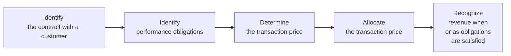

It can feel a bit nerve-racking the first time you come across revenue recognition under IFRS 15 and US GAAP’s ASC 606. You know, I definitely remember scratching my head over multiple performance obligations when I was first diving into it—like, “Wait, so how do we allocate the transaction price? And do we do it before or after we determine the proper timing?” But once the puzzle pieces click, you’ll see the synergy behind these frameworks. Both IFRS and US GAAP use a relatively similar five-step process for revenue recognition, aiming to capture the economics of a sale in a consistent and transparent way.

Still, there are subtle differences (and sometimes major ones) that can affect how you evaluate a firm’s top line. So let’s walk through the five-step model and home in on the key divergence points you’d want to watch out for—both for exam success and practical application.

**A Quick Look at the Five-Step Model**

Even though IFRS calls it IFRS 15 and US GAAP calls it ASC 606, both standards revolve around this core principle: Recognize revenue in an amount that reflects the consideration you (the entity) expect to receive when control of the goods or services passes to the customer. The approach is fairly straightforward:

• Identify the contract with a customer  
• Identify the performance obligations  
• Determine the transaction price  
• Allocate the transaction price  
• Recognize revenue when (or as) performance obligations are satisfied  

This five-step approach is basically universal between IFRS 15 and ASC 606—but the devil is in the details, and that’s where we can see divergences, especially regarding contract costs, licenses, onerous contracts, and collectability thresholds.

---

**Identify the Contract with a Customer**

At the outset, you confirm that a valid contract exists (whether written, verbal, or implied) and that the payment terms and commercial substance are well understood. In both IFRS 15 and ASC 606, if it’s probable that the entity will collect the consideration, that’s typically enough to qualify. But there can be differences in its application. For instance, IFRS 15 requires that it be “probable” (which IFRS typically leans toward setting around a more-likely-than-not threshold) that the entity will collect substantially all the consideration. US GAAP’s ASC 606 also uses a probable criterion but, in practice, might interpret “probable” slightly differently due to legal traditions and historical precedents. You won’t see major contradictions in big public companies, but in borderline situations, the thresholds can create timing differences in recognition.

---

**Identify the Performance Obligations**

This is where IFRS 15 and ASC 606 get interesting. A performance obligation is a distinct good or service (or bundle of goods/services) promised in the contract. It’s like this: If you buy a smartphone, the phone itself is one performance obligation, and maybe a free month of streaming service might be another. If the contract lumps them together, you’d still need to figure out, “Are these truly separate promises that the customer can benefit from independently, or do they function together?” Both standards are in near lockstep on how to identify separate performance obligations—though industry-specific guidance sometimes leads to slight variations in practice. For example, software contracts with multiple “deliverables” can get tricky. IFRS 15 has fairly robust guidance on bundling or separating intangible rights, while US GAAP might provide industry-specific rules in addition to ASC 606.

---

**Determine the Transaction Price**

Determining transaction price is fairly straightforward. You consider the amount that you expect to be entitled to in exchange for providing those goods or services. This might include variable consideration, significant financing components, noncash consideration, and so forth. IFRS 15 and ASC 606 both require a probability-weighted or most-likely-amount approach for variable consideration. Just watch out for differences in whether certain items are recognized more readily under IFRS or US GAAP (particularly if local regulatory bodies interpret “constraints” on variable consideration differently). Usually, in exam scenarios, the differences are subtle, but they can matter if you’re evaluating the timing or extent of revenue recognized.

---

**Allocate the Transaction Price**

Now that you know the total transaction price and the distinct performance obligations, you need to allocate the price to each obligation based on the standalone selling prices (SSPs). If you can’t observe an SSP, you estimate it, often using a cost-plus or adjusted market approach. Both IFRS 15 and ASC 606 do the same, so no big divergence in theory. However, IFRS might allow certain cost capitalization, which can indirectly change how you see contract profitability—and that might sauce up your ratio analysis from exam day’s perspective.  

**Influence on Earnings Timing**  
Sometimes, an entity might deliver some obligations earlier than others. If a large chunk of the transaction price is allocated to an early-delivered good, that can significantly front-load revenue. Conversely, if an extended service is the heavier portion, you’d see more deferred revenue. So, watch for timing differences that influence recognized revenue in interim periods and potentially shape margins.

---

**Recognize Revenue When (or As) Obligations Are Satisfied**

The final step is the big reveal: When do you actually book the revenue? IFRS 15 and ASC 606 say you either recognize revenue over time if certain criteria are met (e.g., a construction company building a custom structure on the client’s property or a software subscription that the customer benefits from continuously), or at a point in time if control transfers in one shot (like shipping a product to the customer’s door). If there is any difference, it’s typically found in the nuances of what each standard calls “control.” IFRS 15 uses the principle of transferring control, and so does ASC 606, but the judgments might differ in how each standard (and local auditors) interpret the mechanics in niche industries (like real estate development).

---

**Key Divergence Points**

Let’s pause and drill deeper into the specific areas where IFRS 15 and ASC 606 can produce different outcomes for the same transaction. These might not always appear in practice, but they’re hot topics for exam-style vignettes.

**Contract Costs**  
1. Capitalization of Contract Costs: Both IFRS 15 and ASC 606 let you capitalize the incremental costs of obtaining a contract (such as sales commissions), provided you expect to recover those costs. However, IFRS might be slightly more flexible or strict on how you interpret “materiality” or “recoverable.” If you have a borderline case, IFRS’s approach could prompt you to expense or capitalize earlier. This, in turn, can shift your net income from one period to another.

2. Amortization Period: IFRS typically requires capitalized contract costs to be amortized on a systematic basis consistent with the transfer of the good or service. US GAAP essentially follows the same model, but specialized sectors might have subtle exceptions. An example might be subscription-based software in the US, where additional industry references can color the timing or classification of these costs.

**Onerous Contracts**  
Onerous contracts are those for which the expected costs to meet the obligations exceed the economic benefits. IFRS 15 addresses them through IAS 37 (Provisions, Contingent Liabilities, and Contingent Assets), requiring you to recognize a provision for the loss upfront. US GAAP, by contrast, sometimes references ASC 450 (contingencies) or specialized guidance (like in construction or insurance). Because US GAAP doesn’t have a single, unified “onerous contract” concept, you might find that some loss is recognized differently or at a different time. In exam questions, you might see IFRS stating an immediate recognition of a provision, while US GAAP is deferring it until certain triggers are met.

**Licenses and Intangible Sales**  
If you’re dealing with licenses—let’s say you’re licensing your brand name to a third party— the determination of “point in time” vs. “over time” recognition can vary. IFRS 15 has guidelines about whether the license is right-to-use (point in time) or right-to-access (over time). ASC 606 incorporates a similar approach but can have slightly different nuances in software or franchising. Watch out for how each standard frames the “license term,” especially if the contract includes a usage-based royalty. Under both standards, usage-based royalties are typically recognized when the usage occurs, but the threshold for recognizing the license portion as point-in-time or over-time can differ with local interpretations. On the exam, a minor difference in the fact pattern can push you to select a different method of recognizing licensing revenue in IFRS vs. US GAAP.

**Collectability Thresholds**  
Both IFRS 15 and ASC 606 require that collectability be “probable.” IFRS 15 specifically states it must be probable the entity will collect “substantially all” of the consideration. ASC 606 uses a certain probable threshold as well (often interpreted as about 75–80% likelihood in many US-based contexts). The distinctions can arise in borderline credit risk scenarios. Suppose you have a customer with questionable credit. IFRS might force you to pause and say, “Actually, let’s not recognize any revenue until we have more certainty,” whereas under US GAAP, the likelihood might be interpreted differently, leading to either partial recognition or a different timing. In practice, the effect can be minimal for well-established companies, but it’s still a small wedge that can separate IFRS from US GAAP.

---

**Practical Example: Tech Consulting Contract**

Imagine a tech consulting firm that signs a $1 million contract to provide software implementation plus ongoing maintenance for two years. Under both IFRS 15 and ASC 606, you’d:

• Identify the contract: The contract is valid because both parties agree on the service scope, price, and terms.  
• Identify performance obligations: (1) Implementation service and (2) ongoing maintenance.  
• Determine the transaction price: $1 million. If part of that is performance-related or variable, you’d factor that into the estimated total.  
• Allocate the transaction price: Perhaps you find that the standalone selling price for implementation is $750,000, while maintenance is $250,000.  
• Recognize revenue: The consulting portion might be recognized over the period you deliver the implementation service (e.g., six months), while the maintenance portion might be recognized ratably over the two-year window, presuming the customer continuously benefits from the updates.

Now, if the contract includes an add-on license for specialized analytics software, you might have to further break out a performance obligation for that license. If IFRS 15’s license guidance (and similarly ASC 606) indicates it’s a distinct right-to-use, you might recognize it at the point in time you make the software available. However, if it’s an ongoing subscription, you might spread it out over time. Slight differences around intangible license classification or the capitalized cost of acquiring the contract (like how you treat the salesperson’s commission for different segments) can tweak when you record revenue or expense.

---

**Timing Differences and Earnings Impact**

If your question is, “So what’s the big deal if both IFRS and US GAAP share the same five-step model?” sometimes the big deal is the timing. When you shift revenue recognition from one quarter to the next, you change reported revenue, EPS, and margins. That can alter the perception of growth or profitability, especially for companies reliant on long-term contracts (think construction, IT services, or manufacturing with multiple deliverables). For capital markets, these timing differences can move share prices if analysts miss or overshoot revenue estimates. On the Level II exam, you may encounter a scenario presenting partial data for two different sets of standards, asking, “Under IFRS, how much revenue would be recognized in Q2?” or “Under US GAAP, do we have an onerous contract recognition earlier?” You want to practice the logic thoroughly, so you see these differences clearly.

---

**Disclosure Requirements**

Both IFRS 15 and ASC 606 say you have to provide extensive disclosures. This includes:

• Disaggregation of revenue (by product line, geography, or customer type, as relevant).  
• Contract balances (assets and liabilities) and how they roll forward over periods.  
• Transaction price allocated to remaining performance obligations.  
• Significant judgments in applying the guidance—like assessing whether control transfers over time or at a point in time, or how you estimate variable consideration.

These disclosures are gold for analysis. If you suspect a company is pulling revenue forward or is overly aggressive, you’ll likely see clues in the notes—like large contract assets building up or suspicious patterns in variable consideration estimates. On exam day, you might be given a footnote with detailed disclosures about how the firm recognized revenue, then get asked to interpret how changing one assumption (like the probability of achieving a bonus milestone) would alter recognized revenue. Read those footnotes carefully, especially for multi-step revenue streams.

---

**Industry-Specific Nuances**

IFRS 15 and ASC 606 claim to be principle-based frameworks that override old industry-specific standards (like the old “percentage-of-completion” guidance for construction). However, you’ll still see references or clarifications for certain industries that used to have specialized rules. Examples include:

• Software: Distinguishing between licenses, software-as-a-service, and support.  
• Real estate: Identifying whether the performance obligation is satisfied over time (like building on a customer’s land) or at a point in time (condo sales).  
• Construction: The shift from old percentage-of-completion and completed-contract methods to the new model, with an emphasis on whether the customer controls the asset as it’s created.  

In practice, most industries have found ways to align with IFRS 15 and ASC 606, but the details can still vary, especially in how we measure progress for over-time recognition (like input vs. output methods). The exam might test your ability to pick the appropriate measure of progress or to spot an erroneous approach (e.g., using cost-to-cost when you should be using physical completion).

---

**Common Pitfalls and Best Practices**

• Mixing Old and New: Some folks still recall the old rules under IAS 18, IAS 11, or the previous US GAAP frameworks. Make sure you deliberately practice under IFRS 15/ASC 606 models for the exam.  
• Overcomplicating Step 2 or Step 4: Identifying performance obligations and allocating transaction price can get messy if you’re dealing with freebies or bundled discounts. Always anchor in the “standalone selling price” concept.  
• Forgetting the Collectability Criterion: If doubt exists about the customer’s ability to pay, IFRS 15 might postpone recognition. Overlooking that can lead to inflated revenue.  
• Overlooking Onerous Contracts: IFRS 15 references IAS 37 for setting up provisions when the contract is unprofitable. US GAAP handles it differently (often referencing ASC 450 or certain specialized frameworks).  
• License Complexity: Don’t forget to assess whether it’s right-to-use or right-to-access if you’re given a scenario about licensing.  

---

**A Note for CFA Level II Candidates**

Revenue recognition is a bread-and-butter topic in both exam vignettes and real-life analysis. On a typical item set, you might see a set of footnotes describing a multi-year contract with several elements. The question might read something like, “How much revenue is recognized in Year 1 under IFRS vs. US GAAP?” or “Which step in the revenue recognition process is the company incorrectly applying here?” The best approach is to memorize the five-step model thoroughly and remain alert to the subtle IFRS vs. US GAAP differences. Also, watch out for how these differences influence ratios such as gross margin, net profit margin, or growth rates from period to period. If you see a mismatch in recognized revenue across IFRS and US GAAP columns, that’s your clue to dig deeper into whether it’s a matter of contract costs, onerous contract provisions, or licensing subtlety.

Anyway, the main takeaway is to be methodical: read each detail in the vignette, reference the five-step approach in your mind, and keep an eye out for the well-known divergences. With enough practice, you’ll start to see patterns that repeat from question to question.

---

**References and Further Reading**

• IFRS 15 Revenue from Contracts with Customers (IASB)  
• ASC 606 Revenue from Contracts with Customers (FASB)  
• “Wiley IFRS 2023: Interpretation and Application” by Wiley  
• “Revenue from Contracts with Customers: A Guide to IFRS 15” by Deloitte  
• Industry supplements on IFRS.org or FASB.org  

---

## Test Your Knowledge: Revenue Recognition and Key Divergence Points



### Under both IFRS 15 and ASC 606, what is the core principle of revenue recognition?
- [ ] To recognize revenue solely upon receipt of cash 
- [ ] To allocate costs based on contract length 
- [x] To recognize revenue in an amount that reflects the consideration expected to be received upon the transfer of goods or services 
- [ ] To recognize revenue only when all performance obligations are exhausted, regardless of timing

> **Explanation:** The core principle is that the entity recognizes revenue based on the consideration it expects to receive, as control of goods or services transfers to the customer.

### Which of the following steps is part of the five-step model under IFRS 15 and ASC 606?
- [x] Identify the performance obligations 
- [ ] Determine whether costs exceed benefits in the contract 
- [ ] Rank the obligations by size of potential revenue 
- [ ] Recognize revenue on the date cash is paid

> **Explanation:** The five-step model includes (1) identifying the contract, (2) identifying performance obligations, (3) determining transaction price, (4) allocating the transaction price, and (5) recognizing revenue when obligations are satisfied.

### How might onerous contracts be treated differently under IFRS 15 compared to US GAAP?
- [ ] IFRS 15 never allows recognition of losses in advance 
- [x] IFRS 15 references IAS 37 for provisions, while US GAAP often uses ASC 450 or industry-specific guidance 
- [ ] US GAAP always requires immediate write-off of costs related to onerous contracts 
- [ ] Both IFRS 15 and US GAAP ignore onerous contracts unless it is a software license

> **Explanation:** IFRS 15 (and related IFRS guidance) require recognizing a provision for an onerous contract when expected costs exceed benefits. US GAAP uses different references to address such scenarios, often ASC 450.

### Under IFRS 15, if a contract includes multiple distinct performance obligations, how should the total transaction price be allocated?
- [ ] Based on the performance obligation with the highest expected margin 
- [ ] Equally among all obligations 
- [ ] According to the cost incurred for each obligation 
- [x] Based on the standalone selling price of each performance obligation

> **Explanation:** The total transaction price must generally be allocated to each performance obligation in proportion to its estimated standalone selling price.

### Which of the following is most likely recognized over time (rather than at a point in time) under IFRS 15 and ASC 606?
- [x] Custom construction services performed on a customer’s property 
- [ ] A retail purchase of a laptop in a physical store 
- [ ] The sale of inventories to a distributor 
- [ ] A customer’s payment of a cancellation fee

> **Explanation:** If the customer controls the asset or receives benefits as work is performed (like with a custom build on their property), revenue is recognized over time. In contrast, a laptop sale is recognized at the point in time the device is delivered.

### Which statement correctly describes the concept of collectability under IFRS 15?
- [ ] Collectability is not assessed until the contract is completed 
- [x] The entity must believe it is probable to collect substantially all of the consideration 
- [ ] Revenue is recorded at contract inception regardless of collectability 
- [ ] IFRS 15 does not require consideration of collectability

> **Explanation:** IFRS 15 requires that it be probable that the entity will collect substantially all the consideration in order to recognize revenue under a valid contract.

### Suppose a company signs a software license contract where the license is deemed a right-to-access over two years. How will revenue likely be recognized?
- [x] Over the period of the license term 
- [ ] Immediately in full at contract inception 
- [ ] Only when the software is downloaded 
- [ ] Deferred until the last month of the contract

> **Explanation:** For a right-to-access license, revenue is typically recognized over time as the customer continuously receives value.

### A company capitalizes certain costs of obtaining a revenue contract (e.g., sales commissions). Which statement is correct regarding IFRS 15 and ASC 606?
- [ ] Such capitalization is disallowed under both standards 
- [ ] ASC 606 prohibits this, while IFRS 15 allows it with no restrictions 
- [x] Both standards permit capitalization if these costs are incremental and expected to be recovered 
- [ ] Capitalization is required under IFRS 15 but always expensed under ASC 606

> **Explanation:** Both IFRS 15 and ASC 606 permit capitalization of incremental contract acquisition costs if the costs are expected to be recovered, though there may be some differences in how materiality thresholds are applied.

### Which of the following is a common pitfall when applying the new revenue recognition standards?
- [ ] Ignoring cash payments 
- [ ] Selling at below cost 
- [x] Misidentifying or improperly separating performance obligations within a multi-element contract 
- [ ] Failing to record depreciation of intangible assets

> **Explanation:** A frequent mistake is failing to properly identify each performance obligation or bundling them incorrectly, resulting in incorrectly allocated and recognized revenue.

### Under IFRS 15 and ASC 606, which best describes the overarching approach to revenue recognition?
- [x] A principles-based approach requiring judgments about the transfer of control 
- [ ] A rules-based approach specifying revenue must be recognized only at contract completion 
- [ ] A cost-based approach focusing on accrued expenses 
- [ ] A single approach that recognizes revenue parallel to the date of cash collection

> **Explanation:** Both standards use a principles-based model focusing on the transfer of control, requiring professional judgment in timing and allocation decisions.


