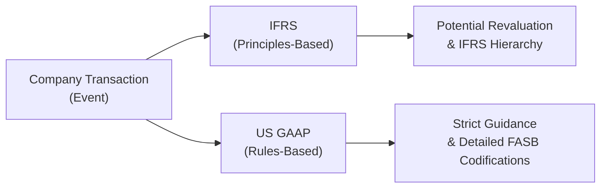

## Overview

Let me tell you a quick story. The first time I was faced with an IFRS-versus-US-GAAP question, I thought, “Well, how different can they be?” Then I got hammered by a barrage of subtle detail: intangible asset recognition, revenue timing, financial instrument classification, you name it. That taught me to respect the finer points. Seriously, IFRS and US GAAP can look similar, but the differences can fundamentally change a company’s reported earnings and financial position. And for Level II candidates, those subtle changes are fair game for exam questions. 

This practice vignette is all about sharpening your instincts when analyzing a scenario that might involve cross-border transactions, or a company that issues financial statements under IFRS but notes certain US GAAP references. It’s also about building a systematic approach: read the entire set of data, separate what’s purely IFRS from what’s purely US GAAP, and figure out the impact on the balance sheet, income statement, and various financial ratios.

## Crafting a Vignette Analysis Strategy

The key to nailing item-set (vignette) questions is to adopt a structured method:

• Read everything. The exam often hides vital clues in the footnotes.  
• Identify relevant standards. Are we dealing with revenue recognition (IFRS 15 vs. ASC 606)? Financial Instruments (IFRS 9 vs. ASC 320)? Or intangible assets (IAS 38 vs. ASC 350)?  
• Flag risk areas. Look for aggressively recognized revenue, differences in depreciation approaches, or unusual disclosures about revaluation.  
• Quantify the differences. If the vignette provides data, calculate how net income, equity, and important ratios like ROE, debt-to-equity, or current ratio might shift under each framework.  
• Watch for exam traps. “Oh, they recognized 100% of revenue but shipped no goods?” That’s a red flag. “They revalued their intangible assets upward under IFRS” but the question might switch to US GAAP to see if you can catch that revaluation is typically not allowed.

## Step-by-Step IFRS vs US GAAP Analysis

Before we jump into our example, take a look at this visual overview. It’s a simplistic way to see how IFRS and US GAAP diverge at a high level:



Under IFRS, you might see more principle-driven judgments, such as revaluing fixed assets to fair value if active markets exist. Meanwhile, US GAAP’s rules-based approach can sometimes yield more consistently applied methods—like cost-based measurement for intangibles.

Here’s a broad outline of differences you’ll commonly see in vignettes:

• Revenue Recognition: IFRS 15 and US GAAP ASC 606 share a five-step approach, but watch for nuanced differences in contract modifications or variable considerations.  
• Financial Instruments: Under IFRS 9, you may see classification like amortized cost, FVPL, or FVOCI. US GAAP uses categories such as Trading, AFS, HTM, and that often leads to differences in how changes in fair value hit the income statement or OCI.  
• Intangible Assets: IFRS (IAS 38) allows revaluation if a fair value market exists, US GAAP (ASC 350) rarely permits upward revaluation (only impairment downward).  
• Lease Accounting: IFRS 16 classifies virtually all leases as financing on the balance sheet. US GAAP (ASC 842) has operating vs. finance lease distinctions, with different flows to the income statement.  

## Common Exam Traps

• Timing of Revenue. Under IFRS 15, a key emphasis is on identifying “performance obligations.” Meanwhile, exam questions might show you that a company recognized revenue early under US GAAP, or vice versa.  
• Equity vs. Liability for Certain Instruments. IFRS can classify some convertible debt instruments differently than US GAAP.  
• Presentation of Comprehensive Income. IFRS can present comprehensive income in a single statement or separate statements, while US GAAP also allows a bit of flexibility. But the exam might focus on how and where certain items (like foreign currency translation adjustments) end up in equity versus net income.  
• Impairment and Reversals. IFRS often allows the reversal of impairment losses if certain conditions are met, while US GAAP usually prohibits reversing an impairment once recorded.

## Quick Example: Adjusting for IFRS vs GAAP Differences

Let’s say you’re presented with a medium-sized manufacturing firm, GoodParts Plc, that prepares statements under IFRS. The firm acquired a small competitor and booked intangible assets: brand name valued at $5 million, customer list at $3 million, plus goodwill at $2 million. Under IFRS, intangible assets may be revalued if there’s an active market. Now imagine under US GAAP you do not see such revaluation, so you keep them at cost.  

• IFRS Scenario: Suppose GoodParts revalues the brand name upward by $1 million based on an appraisal. This hits other comprehensive income and intrudes into equity (revaluation surplus).  
• US GAAP Scenario: No revaluation is permitted. The brand name stays at cost, so the net intangible asset remains at $5 million. No $1 million boost in equity—net effect on the balance sheet is lower intangible assets, lower equity.  

What does that do to your ratio analysis? The IFRS-based firm might have higher equity, so say it’s total debt to equity ratio appears lower. This difference is a perfect exam question scenario—“How does the revaluation under IFRS compare with US GAAP, and how does it affect the solvency ratios?”  

## Systematic Vignette Walkthrough

1. Read the Entire Vignette: The exam might throw you a footnote about intangible asset revaluation or revenue recognized on partial shipments.  
2. List Relevant Guidance: If intangible revaluation is mentioned, note IFRS (IAS 38 vs. IFRS 9 for intangible financial instruments?), US GAAP (ASC 350 for intangibles), etc.  
3. Calculate the Effects: If the total intangible revaluation is $1 million, ask: “Does IFRS put it in net income or OCI? Does US GAAP allow it at all?” Then see how that flows into the equity section.  
4. Swap the Lens: Consider how the statements would look if you shifted from IFRS to US GAAP, or vice versa.  
5. Check Ratio Impact: Some questions might specifically ask about how net income or certain ratios differ.  

## Practical Example Vignette

Below is a condensed, hypothetical scenario typical of exam item sets. Take some time to digest the facts, think about the IFRS vs. US GAAP issues, and see how you’d answer a question on it.

XYZ Tech Solutions is a mid-sized company that operates primarily in Europe but has a significant segment in the United States. It reports under IFRS. The CFO is considering whether it would be beneficial to switch to US GAAP to attract more US-based investors. Key details:

• They have a proprietary software platform developed in-house, recognized on the balance sheet at $2 million. Independent valuation suggests it’s now worth $2.5 million. Under IFRS (IAS 38), intangible assets can be revalued if fair value is reliably measurable.  
• The company uses IFRS 15’s five-step model to recognize revenue from tech subscriptions over time. However, the European division recognized a large portion of future subscription revenue as soon as the contracts were signed (arguably earlier than the performance obligations were fully satisfied).  
• XYZ Tech also classifies a significant portion of its investments in an equity security under FVOCI (fair value through other comprehensive income). The security’s fair value rose by $600,000 during the year. Under IFRS, the gain remains in OCI until disposal.  
• Under US GAAP, these same investments might be classified as AFS (Available for Sale) or Trading. The gains might affect net income if they’re classified as Trading or remain in OCI if AFS—though effective in 2018, changes in GAAP have moved many equity securities to be marked at fair value through net income (ASC 321).  

So, how do you handle that on the exam? Make a quick bullet list:

• IFRS intangible revaluation vs. no revaluation (US GAAP).  
• Aggressive revenue recognition: IFRS 15 might allow certain estimates, but are these consistent with ASC 606? Possibly not.  
• Under IFRS 9, the equity security gains are in OCI. Under US GAAP (ASC 321), equity security gains generally flow into net income.  

By systematically walking through each piece, you can see how the company’s net income, comprehensive income, and equity would shift if they switched from IFRS to US GAAP. This is the bread and butter of what the exam wants you to do.

## Python Snippet for Illustrative Calculations

Check out a quick example of how you might model an intangible revaluation difference in Python—just a simple snippet to keep a feel for how we could automate the bridging between two frameworks:

```python
import numpy as np

def intangible_adjustment(ifrs_value, gaap_value):
    return ifrs_value - gaap_value

ifrs_intangible = 2500000  # IFRS-based valuation
gaap_intangible = 2000000  # Based on US GAAP cost model

difference = intangible_adjustment(ifrs_intangible, gaap_intangible)
print("Difference in intangible asset values =", difference)
```

Silly? Maybe just a bit. But if you had a large data set, this little logic might help you systematically summarize differences.

## Putting It All Together

Time to combine all these steps. For an actual exam vignette:

• Start by listing the frameworks: IFRS or US GAAP.  
• Identify the standard references: IFRS 9 vs. ASC 320 for financial assets, IFRS 15 vs. ASC 606 for revenue, etc.  
• Decide what changes in recognition or measurement matter.  
• Impact on net income, OCI, equity, and key ratios.  

It can be tempting to memorize. Don’t. Instead, learn the “why” behind each difference. IFRS is typically more principle-based, so it grants more discretion in revaluation or timing. US GAAP is typically rules-based, which means more consistent but sometimes less flexible approaches. 

## Final Observations and Exam Tips

• If you see intangible revaluation as an exam point, think IFRS allows it; US GAAP basically does not.  
• If you see big differences in recognized revenue, confirm whether the performance obligations were satisfied.  
• Gains on equity securities might appear in OCI under IFRS, but US GAAP might throw them into net income (depending on classification).  
• Don’t forget impairment reversals. IFRS might restore previously impaired assets (to an extent), while US GAAP rarely does.  

One more piece of advice: as you practice these vignettes, keep a running list of IFRS vs. US GAAP differences you come across. In the heat of the exam, a single footnote about classification can signal a major difference in the final numbers.  

## Additional Resources

• “A Student’s Guide to International Financial Reporting Standards” by Clare Finch  
• CFA Institute’s official practice questions on IFRS vs. US GAAP  
• IFRS and US GAAP comparison guides from major accounting firms like PwC, Deloitte, KPMG, EY  
• “Intermediate Accounting” by Kieso, Weygandt, and Warfield (both IFRS and US GAAP editions)  

## IFRS vs. US GAAP Practice Vignette Questions



### Under IFRS, which of the following best describes an option a company may use for intangible assets?

- [ ] Capitalization of intangible assets is prohibited.
- [ ] Intangible assets can only be recorded at cost, and revaluations are never allowed under any circumstances.
- [x] Intangible assets can be revalued upwards when a reliable fair value can be identified.
- [ ] Intangible assets must be written down immediately if fair value exceeds carrying value.

> **Explanation:** IFRS (IAS 38) allows the revaluation model if an active market exists to reliably measure fair value. US GAAP typically does not allow upward revaluation once an intangible asset is recognized at cost.


### A company reporting under IFRS has recognized a gain on revaluation of land in other comprehensive income. Under most circumstances, how would this appear under US GAAP?

- [x] It would not be recognized in the same way because revaluation of land above cost is generally not permitted under US GAAP.
- [ ] It would be recognized immediately in net income.
- [ ] It would be allocated proportionately between net income and OCI.
- [ ] It would be transferred to equity as a revaluation surplus.

> **Explanation:** US GAAP does not allow the revaluation of fixed assets upward. Hence, this gain would not be recognized in the same manner as under IFRS.


### Which statement about IFRS vs. US GAAP revenue recognition is most accurate?

- [ ] US GAAP prohibits the five-step model for revenue and relies solely on industry-specific guidance.
- [x] Both IFRS and US GAAP apply a nearly identical five-step model, though minor differences exist in the details of implementation.
- [ ] IFRS recognizes revenue as soon as the contract is signed, while US GAAP waits until cash is received.
- [ ] US GAAP recognizes revenue at the contract inception date, while IFRS waits until performance obligations are met.

> **Explanation:** IFRS 15 and ASC 606 are both based on a five-step model. The guidelines are very similar, with some differences in scope exceptions and detailed application.


### Under US GAAP, how are unrealized gains on equity securities generally treated?

- [ ] They are typically recorded in other comprehensive income (OCI).
- [x] They are typically recorded in net income unless the equity investment is accounted for under the equity method.
- [ ] They can be recognized only upon disposal.
- [ ] They must be recognized in retained earnings directly.

> **Explanation:** Under ASC 321, most equity securities are measured at fair value with changes in fair value recognized in net income. Under IFRS 9, entities can make an irrevocable election for some equity investments to measure them at fair value through other comprehensive income.


### Which of the following scenarios most likely generates a higher reported equity under IFRS than under US GAAP?

- [x] Upward revaluation of intangible assets.
- [ ] Reversal of previously recognized depreciation.
- [x] Upward revaluation of property, plant, and equipment.
- [ ] Immediate expensing of development costs.

> **Explanation:** IFRS can allow upward revaluation of both intangible assets (if active markets exist) and PPE (IAS 16), boosting the carrying amount and, subsequently, equity. US GAAP generally does not allow these revaluations. Two correct answers reflect the typical IFRS revaluation approach for intangibles and PPE.


### Under IFRS, companies can reverse impairments in certain cases. How does US GAAP treat such reversals?

- [x] US GAAP generally prohibits them, once an impairment is recognized it remains.
- [ ] US GAAP requires frequent upward adjustments back to original cost.
- [ ] US GAAP allows partial reversals only for goodwill impairments.
- [ ] US GAAP forces revaluation surpluses into OCI.

> **Explanation:** US GAAP typically does not allow a previously recognized impairment to be reversed for assets held for use, except for certain assets under specialized guidance (like some intangible assets in rare circumstances). By contrast, IFRS can permit reversals to the extent a prior impairment was recorded.


### A company’s investment in debt securities experienced a fair value increase of $400,000 during the period. Under IFRS 9, they classify it as FVOCI. How might this treatment differ from US GAAP?

- [x] Under US GAAP, if the security is classified as Trading, the $400,000 would go to net income.
- [ ] Under US GAAP, unrealized gains of $400,000 would stay undisclosed.
- [x] Under US GAAP, if the security is classified as AFS, the $400,000 would go to OCI, but the classification may differ.
- [ ] Under IFRS, classification as FVOCI is impossible, so the $400,000 goes immediately to net income.

> **Explanation:** IFRS 9 uses “FVOCI” classification for some debt instruments. US GAAP has “Trading,” “HTM,” and “AFS” categories. Trading flows through net income, AFS typically flows through OCI, with reclassifications at disposal.


### Which item is more likely to appear in IFRS-based net income but remain in OCI under US GAAP?

- [x] Gains on certain equity investments if elected FVPL under IFRS.
- [ ] Interest income from held-to-maturity debt securities.
- [ ] Foreign currency translation gains from a subsidiary in a hyperinflationary economy.
- [ ] Revaluation surplus on investment property.

> **Explanation:** IFRS 9 can designate some equity investments at fair value through profit or loss (FVPL), where changes in fair value affect net income. Under US GAAP, many equity securities now also run through net income, but the classification and the possibility for an irrevocable choice can differ. This can lead to differences in recognized net income vs. OCI.


### A company reclassifies a financial asset from amortized cost to FVOCI under IFRS. Which of the following is correct regarding US GAAP?

- [x] US GAAP reclassifications among debt security categories (HTM, AFS, Trading) can happen, but the accounting impact may differ.
- [ ] US GAAP prohibits any reclassifications once initially designated.
- [ ] US GAAP forces any reclassification gains/losses directly to retained earnings without affecting net income.
- [ ] US GAAP requires reversal of prior period financial statements upon reclassification.

> **Explanation:** Under IFRS 9, reclassifications between measurement categories are permitted if the business model changes. US GAAP also allows some reclassifications among HTM, AFS, and Trading, but the rules and accounting impacts differ (e.g., reclassification from HTM to AFS can require recognizing unrealized gains/losses in OCI).


### True or False: Under both IFRS and US GAAP, unrealized gains on equity securities are always recorded in OCI rather than net income.

- [x] True
- [ ] False

> **Explanation:** Actually, this statement is false. Equity securities under IFRS can be designated FVOCI or FVPL, and US GAAP now generally requires changes in fair value of equity investments to be included in net income under ASC 321, unless accounted for under the equity method. Hence the correct answer is that the statement is false, but we see the logic in the question about “always.”



