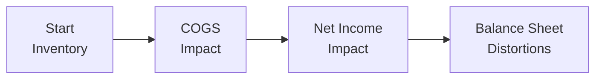

## The Importance of Inventory and Receivables

Sometimes you look at a company’s balance sheet and think, “Wow, these numbers look great—sales are up, profits are soaring, everything must be on track.” Then, a few months later, you discover massive discrepancies in how inventory and receivables were reported. It’s like peeling an onion: the more layers you remove, the more you might cry if you find manipulation. 

Anyway, inventory and receivables can quickly turn from reliable assets into red flags. Especially if they represent a major chunk of total assets, small changes in recording or valuation can drastically alter the firm’s reported financial health. In this section, we’ll examine how managers might manipulate these items—intentionally or not—and how you can sharpen your skills for catching them. 

In Chapter 18 (Evaluating Reporting Quality—Overview), we explored the notion of high-quality vs. low-quality reporting. Now, we’re zooming in on two highly manipulative areas on the balance sheet: inventory and accounts receivable.

## Common Inventory Manipulation Tactics

It’s not surprising that inventory is a favorite place for boosting earnings. After all, overstating ending inventory can reduce cost of goods sold (COGS) and inflate net income. Here are some typical tricks and quirks you might find:

• Overstating Physical Counts or Unit Costs:  
  Sometimes, companies artificially inflate their inventory balances by “losing” or “discovering” extra inventory. By messing with the count or by using a higher-than-justified unit cost, the company lowers its COGS in the current period, making net income look better than reality.  

• Channel Stuffing:  
  You might recall a story of a friend in distribution who said, “We shipped three months of stock in a single quarter, but I’m not sure if the retailers even needed it.” That’s prime channel stuffing. The company books revenue now and hopefully records a big chunk of inventory going out the door. If they fail to reduce actual inventory properly or prematurely book sales, their inventory and sales figures can become twisted.  

• Failure to Write Down Obsolete Inventory:  
  Under IFRS and US GAAP, if inventory’s net realizable value (NRV) falls below its historical cost, a write-down is required. Ignoring or delaying necessary write-downs gives the illusion of a strong inventory asset base. Unfortunately, it can be a ticking time bomb: once it’s recognized, net income can plummet in a future period.

### The Impact on Financial Statements

Imagine you’re analyzing a hypothetical company called XYZ Manufacturing. Suppose they realize that 10% of their widgets are basically out-of-date. If management refuses to write down this obsolete stock, the inventory balance stays artificially high. This leads to:

1. Lower COGS (understated write-down expense).
2. Inflated gross margins.
3. Potentially misleading net income and profitability ratios.

It also throws off any ratio that uses inventory as a component: for example, inventory turnover (COGS ÷ Average Inventory) looks weaker, but ironically, management might not mind if it boosts net income.  

Below is a simple diagram showing how manipulating inventory can distort the overall financial picture:

When inventory is overstated, COGS is understated. As we move along this chain, net income gets inflated, and the final balance sheet might look positively rosy—until someone notices the mismatch between actual sales, production, and changes in inventory.

## Common Receivables Manipulation Tactics

Now, let’s talk about receivables. You know that old saying, “Cash is king”? Well, receivables are not exactly cash until they’re collected. Receivables can be manipulated in sneaky ways:

• Understating the Allowance for Doubtful Accounts:  
  A “just trust us” approach: management claims that only a tiny percentage of customers won’t pay. By reducing the allowance, net receivables look higher and net income soars (lower bad debt expense). But if later on those receivables actually turn bad, the company will face a painful write-off.  

• Aggressive Revenue Recognition:  
  This can happen if the company sells to clients that have no real intention or ability to pay, but they still record these transactions right away. It pads revenue and increases accounts receivable. If management doesn’t adjust the allowance accordingly, net receivables remain inflated—perhaps until the next CFO steps in and decides to “clean house.”

• Inadequate Write-Offs of Uncollectible Accounts:  
  If an account hasn’t paid in more than a year and all attempts at collection have failed, it’s probably uncollectible. Companies might keep these old balances around instead of writing them off, hoping not to dent net income or cause alarm for the markets.

## Key Analysis Techniques

“How on earth do I spot these manipulations?” you might ask. Well, in a Level II exam context, you’ll often be given footnotes, exhibits, and subtle hints. In the real world, you need a bit of detective skill—and an Excel spreadsheet doesn’t hurt either. 

Here are some straightforward approaches:

• Inventory Turnover and Days Sales in Inventory:  
  – Inventory Turnover = COGS ÷ Average Inventory  
  – Days Sales in Inventory (DSI) = (Average Inventory ÷ COGS) × 365  

  If inventory turnover drops dramatically or DSI rises significantly, ask yourself: “Is there really a slowdown in sales, or is the company stashing unsold goods and not writing them down?”

• Days Sales Outstanding (DSO):  
  – DSO = (Accounts Receivable ÷ Total Credit Sales) × 365  

  If DSO is climbing steadily, it could be a sign of looser credit policies or inflated receivables. Also compare how quickly the company collects compared with industry norms.

• Allowance for Doubtful Accounts as a Percentage of Receivables:  
  Check changes in the allowance percentage over time and compare them with peers. If your firm’s allowance is suspiciously lower, but it faces similar economic conditions, that’s a glaring possibility of manipulation.

• Aging Schedules and Credit Terms:  
  A deeper look at how old the receivables are also helps. Once you see that 40% of the balances are over 120 days old, something is definitely off if management claims no big allowances are needed.

## IFRS vs. US GAAP Nuances

### Inventory Valuation Differences

• Under IFRS:  
  Inventory is carried at the lower of cost or net realizable value (LCNRV). Each period, if inventory’s NRV recovers, IFRS allows the reversal of a previously recognized write-down (up to the amount of the original write-down). This can lead to fluctuations that might surprise some analysts if they aren’t watching.  

• Under US GAAP:  
  Inventory is carried at the lower of cost or market (market being replacement cost, with some constraints). Generally, once you write it down, that’s it—no writing it back up later if prices recover. So, no “hey, just kidding, it’s all better now” effect.  

### Receivables Provisioning

Under both IFRS (IAS 39/IFRS 9) and US GAAP (ASC 310), the allowance for doubtful accounts is largely subjective. Management must estimate expected credit losses. If management’s “crystal ball” is overly optimistic, watch out. 

In practice, IFRS 9 now adopts expected credit loss (ECL) models, meaning that companies have to approximate the present value of potential future credit losses. US GAAP also has expected credit loss frameworks (CECL—Current Expected Credit Loss). Both are open to managerial assumptions and possible manipulation.

## Advanced Practical Applications

Sometimes, you need to do more than just look at a ratio or read the footnotes. Let’s explore a couple of advanced methods:

• Sensitivity Analysis for Inventory Obsolescence:  
  Let’s say you suspect a firm is riding high on smartphone accessories that are quickly losing consumer interest. One approach is to guess the range of possible obsolescence. Maybe 5% of the stock is unsellable—what if it’s 20%? Then see how the needed write-down would impact current ratios, profitability, and net worth. The “shock test” might show that just a small uptick in stale inventory leads to a huge drop in equity.

• Aging Schedules for Receivables:  
  Constructing a table that breaks receivables into buckets (e.g., 0–30 days, 31–60 days, 61–90 days, 90+ days) can highlight a concerning shift toward older balances. Also, keep an eye on changes in credit terms. If they extend from 30 days to 90 days over time, the older DSO might not be directly comparable unless you adjust for the new policy.

## Exam-Style Vignette Tips

On exam day, you’ll face item sets (vignettes) loaded with details about inventory and receivables. “Watch out for extended payment terms,” a footnote might say. Or “the company recognized sales earlier than usual, but revised inventory counts in the subsequent quarter.” These are the subtle breadcrumbs.  

In short:  

• Scrutinize footnotes for changes in valuation methodology or large swings in allowances.  
• Look at any mention of consignment arrangements (“consigned inventory”) where the risk of ownership might not have fully transferred.  
• Bill-and-hold transactions are also prime suspects for timing manipulations.  
• Extended payment terms can push out actual cash receipt but inflate the near-term receivables figure.

## Glossary (Key Terms)

• Allowance for Doubtful Accounts:  
  A contra-asset account used to reduce accounts receivable to the net amount expected to be collected.  

• Lower of Cost or Net Realizable Value (LCNRV):  
  An approach requiring inventory to be carried at the lower of its historical cost or net realizable value if IFRS.  

• Days Sales Outstanding (DSO):  
  A measure of how quickly a firm collects cash from credit sales.  

• Obsolete Inventory:  
  Goods that no longer have a market or can’t be used in production (requiring a write-down).  

• Channel Stuffing:  
  Shifting inventory to distributors ahead of schedule to inflate current revenues.  

• Write-Off:  
  Removing a defaulted receivable from the balance sheet.  

• Inventory Turnover:  
  COGS ÷ Average Inventory, showing how frequently a company sells and replenishes inventory.  

• Net Realizable Value (NRV):  
  The estimated selling price of inventory minus costs to complete and sell it.

## Small Illustrative Example

Let’s keep it simple. Suppose Team Infinity Co. sells software and hardware. Management notices that hardware sales are slowing, and about $100,000 worth of older devices are outdated. Under IFRS, they should write them down to NRV (say to $20,000), recognizing an $80,000 charge in COGS or as a direct loss. Instead, they just keep carrying these items at full cost. This artificially keeps inventory at $100,000. If total inventory is $500,000, we have recognized 20% more inventory than is truly salable—and that 20% might be the difference between a nice operating margin and a weak one.

## Best Practices and Pitfalls

• Best Practices:  
  – Maintain consistent, transparent, and conservative valuation policies.  
  – Use realistic assumptions for the allowance for doubtful accounts.  
  – Continuously update inventory cost and obsolescence estimates.  

• Common Pitfalls:  
  – Overlooking the footnotes. If you skip them, you miss the story behind the numbers.  
  – Ignoring year-over-year changes in turnover ratios. Managers might “smooth” the story so that each period’s changes look small, but the cumulative effect is huge.  
  – Blindly trusting management’s explanation of inventory reclassifications.  

## Encouraging Continuous Learning

At Level II, you’re expected to connect the dots between the mechanical aspects of IFRS/US GAAP and how those feed into ratio analysis, reported profits, and future valuations. Don’t just memorize formulas—really understand how these manipulations can happen and how they affect the bigger picture. 

As you move on to more advanced topics (e.g., consolidation, variable interest entities, or advanced ratio analysis in Chapter 25), you’ll see how inventory and receivables can blend with other complexities (like revenue recognition timing and cost capitalization). Keep investigating. 

## References, Further Reading, and Links

• CFA Institute Level II Curriculum (Financial Reporting and Analysis): Comprehensive official guide on inventory and receivables.  
• IAS 2 – Inventories: www.ifrs.org  
• FASB ASC 330 – Inventory: www.fasb.org  
• “Financial Statement Analysis” by K. R. Subramanyam: Detailed techniques for detecting earnings manipulations.  

--------------------------------------------------------------------------------

## Practice Questions: Detecting Inventory and Receivables Manipulation



### A company's days sales in inventory (DSI) increases dramatically, while sales remain roughly constant. Which of the following is the most likely explanation?

- [ ] The company started collecting receivables more quickly.  
- [x] The company is possibly accumulating unsold or obsolete inventory.  
- [ ] The company decreased its allowance for doubtful accounts.  
- [ ] The company improved its inventory turnover.  

> **Explanation:** A rise in DSI with stable sales often signals slow-moving or unrecorded obsolete inventory, increasing the average inventory balance without a corresponding sales surge.

### Management decides to lower the allowance for doubtful accounts from 5% to 2% of receivables. Which of the following is the most direct immediate effect on financial statements?

- [ ] Decrease in total assets and increase in net income.  
- [x] Increase in total assets and increase in net income.  
- [ ] Increase in total assets and decrease in net income.  
- [ ] No impact on net income.  

> **Explanation:** Lowering the allowance directly reduces bad debt expense, thus raising net income. It also increases net receivables, thereby boosting total assets.

### When analyzing footnotes related to inventory accounting changes, which scenario most strongly suggests potential manipulation?

- [x] A sudden change from FIFO to a method that reports higher ending inventory values.  
- [ ] A minor restatement due to a measurement error in the prior period.  
- [ ] A voluntary switch from LIFO to FIFO where the older inventory cost was higher.  
- [ ] A small decrease in the carrying value of inventory due to normal obsolescence.  

> **Explanation:** Changing inventory accounting methods to one that inflates ending inventory can artificially reduce COGS and boost earnings.

### Which of the following best describes the concept of “channel stuffing”?

- [ ] Lumping multiple types of inventory under a single product code.  
- [x] Sending excessive goods to distributors so that revenue can be recognized earlier.  
- [ ] Deliberately delaying shipments to the next period to reduce current revenues.  
- [ ] Recording a write-down on unsold inventory.  

> **Explanation:** Channel stuffing refers to pushing product into the distribution channel prematurely to record sales earlier, inflating current revenues and often distorting inventory records.

### What is the key difference under IFRS versus US GAAP regarding written-down inventory?

- [ ] IFRS prohibits inventory write-downs if future selling prices recover.  
- [x] IFRS allows for reversal of some write-downs if market value recovers, whereas US GAAP generally does not.  
- [ ] US GAAP allows indefinite reversal of inventory write-downs, whereas IFRS prohibits it.  
- [ ] Neither requires inventory to be carried at lower of cost or net realizable value.  

> **Explanation:** IFRS allows reversals of write-downs up to the original cost when market conditions improve, but US GAAP does not permit writing inventory back up once it’s written down.

### A rise in a company’s DSO could be an indication of:

- [ ] Better management of working capital.  
- [ ] Increased reliance on vendor financing.  
- [x] More liberal credit terms or potential revenue overstatement.  
- [ ] Accelerated inflows of cash.  

> **Explanation:** A rising DSO frequently indicates that customers are taking longer to pay or that the firm is granting more lenient credit terms, possibly inflating receivables.

### Which of the following is an advanced practical tool for examining potential inventory overstatement?

- [x] Running sensitivity analyses on the estimated percentage of obsolete stock.  
- [ ] Relying solely on management’s declared inventory at year-end.  
- [ ] Ignoring historical write-offs from prior years.  
- [ ] Assuming the reported COGS aligns perfectly with actual inventory.  

> **Explanation:** Sensitivity analysis helps analysts estimate how obsolescence or other factors might affect actual inventory values, revealing the potential for overstatement.

### Under the Current Expected Credit Loss (CECL) model in US GAAP, allowance for doubtful accounts is determined by:

- [x] Estimating expected losses throughout the lifetime of the receivables.  
- [ ] Recording losses only when they’ve occurred in the past.  
- [ ] Using a fixed 2% rate of total receivables.  
- [ ] Basing it purely on economic cycles without reference to specific loan or borrower data.  

> **Explanation:** CECL requires forward-looking estimations of potential future credit losses, not just historical or incurred losses.

### Which ratio would be the most appropriate for spotting inflated inventories or poor sales?

- [ ] Quick Ratio  
- [ ] Debt-to-Equity Ratio  
- [ ] Return on Assets (ROA)  
- [x] Inventory Turnover  

> **Explanation:** Inventory turnover (COGS ÷ Average Inventory) is a direct measure of how effectively a company is selling its goods. A low or decreasing turnover can indicate inflated inventories or slowing sales.

### True or False: Understating the allowance for doubtful accounts has no impact on reported earnings.

- [ ] True  
- [x] False  

> **Explanation:** Understating the allowance reduces bad debt expense, thus artificially inflating earnings in the current period.


