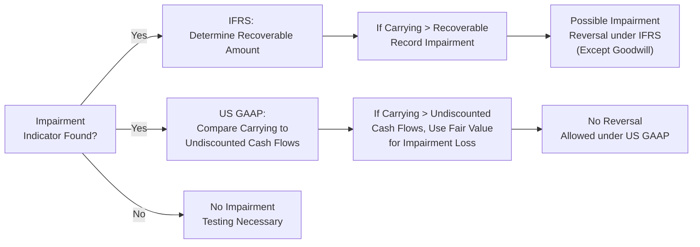

## Significance of Asset Valuation Quality

I still remember the first time I took a serious look at a company’s property, plant, and equipment (PP&E) line and realized just how large it was compared to everything else on the balance sheet. I thought, “Wow, if they get that number wrong, so many of our ratios and conclusions about the firm’s health might be off!” This is often the case in manufacturing, high-tech, or any capital-intensive industry: PP&E is huge, intangible assets matter a whole lot, and sometimes goodwill can be massive after mergers or acquisitions.

All of these assets need proper valuation to give a clear picture of the company’s financial standing. It’s not just a matter of accounting formalities. If you underestimate the risk of asset impairment, you might be blindsided by a sudden write-down that slashes earnings and equity, potentially blowing through debt covenants. Overstated assets can hide big problems too, like failing technologies or brand erosion. In short, the stakes are high!

Companies under both IFRS and US GAAP set guidelines for assessing and recognizing declines in an asset’s value. What’s important to remember is that changes in management assumptions—like little adjustments in a discount rate or a salvage value—might drastically alter whether (and how much) impairment is recorded. So, let’s walk through what’s actually happening under both frameworks.

## Impairment Overview: IFRS vs. US GAAP

Under IFRS, an entity must assess at each reporting date whether there is any indicator that an asset may be impaired. Indicators might include a downturn in the economy, evidence of obsolescence, or changes in the way an asset is used. If such an indicator exists, the asset’s recoverable amount needs to be determined. The recoverable amount is the higher of (1) fair value less costs of disposal and (2) value in use (the present value of expected future cash flows).

In US GAAP, the approach to long-lived asset impairment can be seen as a two-step process, though it’s been simplified a bit for goodwill (it was historically two steps, but more recent standards sometimes allow for a one-step approach). For many non-goodwill assets, a firm first compares the carrying amount with the sum of undiscounted future cash flows expected from the asset during its remaining life. If the carrying value exceeds these undiscounted cash flows, then step two is used to calculate the impairment loss, which is typically the difference between carrying value and fair value.

### Goodwill Impairment

Goodwill has its own special rules because it’s not an independently sellable asset. IFRS requires goodwill be tested for impairment annually or whenever there’s an indication of impairment. The test is performed at the cash-generating unit (CGU) level—essentially the smallest identifiable group of assets that generates cash inflows independently.

Under US GAAP, goodwill is generally tested at the reporting unit level. Firms must compare the carrying amount of the reporting unit (including goodwill) with its fair value. If carrying value exceeds fair value, that difference is recognized as an impairment. Over the last several years, US GAAP has streamlined goodwill impairment testing, allowing private companies and certain reporting entities to choose alternative methods, but the overarching concept remains the same.

## Mermaid Diagram: IFRS vs. US GAAP Impairment Flow

Below is a simplified flowchart comparing the high-level approach to impairment under IFRS and US GAAP. It’s not going to capture every nuance, but it helps visualize the main differences:

This chart just reminds us: IFRS calculates impairment based on the higher of fair value less costs of disposal or value in use, often involving discounted cash flows. Meanwhile, US GAAP kicks off with a simpler check—undiscounted future cash flows—before measuring the impairment loss using fair value. Also, IFRS offers a possibility for reversing impairment on assets other than goodwill, whereas US GAAP generally does not allow impairment reversals.

## Write-Downs vs. Revaluation (IFRS Specific)

IFRS allows companies to measure PP&E using either the cost model or the revaluation model. If a firm chooses the revaluation model (which can be a big “if,” because it’s optional), it periodically remeasures assets to fair value:

• Increases in value generally go to Other Comprehensive Income (OCI) to build up a revaluation surplus in equity.  
• Decreases in value—if they exceed any surplus—get charged to the income statement.

For example, let’s say a firm’s old manufacturing facility (carrying value of €2 million) is revalued to €2.3 million. The €300,000 gain goes to OCI, building up a revaluation reserve. Next year, if the economy tanks and the building’s fair value falls to €1.9 million, that drop of €400,000 will first reduce the revaluation surplus. If it’s not enough, any remainder hits net income.

In the US GAAP world, revaluation of PP&E does not exist—assets generally remain at historical cost less accumulated depreciation (unless impaired). This difference can lead to fairly significant divergences in reported asset values between IFRS adopters and US GAAP companies, especially for long-held real estate that might appreciate over time.

### Reversal of Impairment

IFRS also allows reversal of impairment losses (except for goodwill) if the conditions that originally caused the impairment have changed. This might happen if market demand recovers or if a new technology extends the asset’s useful life. Any reversal cannot exceed what the asset’s carrying amount would have been, net of depreciation, if no impairment had been recognized. Meanwhile, under US GAAP, once assets are written down, they normally stay down. No bounce-back is recognized later if the asset recovers in value.

## Impact on Financial Statements and Ratios

Let’s say a company writes down a large intangible asset by $500,000. Immediately, net income (and thus equity) shrinks by $500,000. Total assets also drop. The resulting effect on financial ratios can sometimes be counterintuitive:

• Return on Assets (ROA) and Return on Equity (ROE) can look higher in future periods because the denominator—total assets or total equity—got smaller.  
• The debt-to-equity ratio may rise because equity just went down while total liabilities remain the same.  
• Net profit margin may improve if the impairment is recognized as a one-time charge and future depreciation or amortization expense declines.

Savvy analysts know to read beyond these “boosts.” If the impairment is big, there might be deeper operational issues. Also, frequent or large impairments might suggest that management’s assumptions about the asset’s useful life or the future economics of the business are too optimistic.

## Advanced Practical Applications

### Stress Testing for Impairment

Analysts often run scenarios—“stress tests”—to see how changes in key assumptions might affect impairment:

• Discount Rate: A small increase can meaningfully lower the present value of future cash flows and trigger an impairment.  
• Growth Rate: A slightly more conservative outlook on long-term growth can likewise cut asset valuations.  
• Salvage Value: Overestimating salvage or residual value can inflate the carrying amount.

### Comparative Analysis with Peers

You might look at how often or how aggressively peer companies recognize impairments:

• If a company rarely or never reports impairments while others in the industry do, that could be a red flag.  
• On the flip side, a firm that frequently writes down assets (especially intangible ones) might be cooking up “kitchen-sink” charges, cleaning the slate to show stronger future results.

And yes, interpersonal relationships matter here too. I was in one meeting where our client competitor recognized a big impairment, and everyone at the table immediately wondered, “Should we be doing that too?” So these choices can also be about keeping up with the industry norm (just something to keep in mind when picking peer benchmarking).

## Exam-Style Vignette Tips

During the CFA exam, you’ll likely see a multi-paragraph scenario describing a company’s asset base. Then, buried in the text might be a mention of “revised assumptions about salvage value” or “an economic downturn in the product’s main market,” nudging you to test for impairment. Keep these tips in mind:

• Look for subtle changes in discount rates, salvage values, or management’s future cash flow assumptions.  
• Watch intangible assets, especially goodwill—overstated goodwill can hide real problems and balloon intangible asset balances.  
• Pay attention to any hints that might contradict management’s official outlook. For instance, the CFO might say, “We remain overly optimistic,” while the footnotes reveal negative industry news.  
• Understand that a big write-down not only affects immediate profit but also shifts the balance sheet in ways that can alter coverage ratios, debt covenants, and more.

## Practical Example: Evaluating a Manufacturing Company

Let’s walk through a short scenario because, in practice, these small details can be the difference between a correct or incorrect exam response:

• A manufacturing firm carried its specialized machinery at $5 million. Depreciation to date is $2 million, so the net carrying amount is $3 million.  
• The firm revises its future cash flow projections for that machinery down to a net present value of $2.4 million because the market for specialized widgets is shrinking.  
• Under IFRS, the recoverable amount is $2.4 million (assuming that’s the higher of fair value less costs of disposal and value in use). The carrying amount is $3 million, so $0.6 million is written off.  
• Under US GAAP, first check undiscounted future cash flows. Suppose the undiscounted amount is $2.8 million. Because $3 million (carrying) > $2.8 million (undiscounted), the asset fails step one. Then you measure the impairment by comparing carrying amount to fair value. If fair value is basically $2.4 million, the penalty is also $0.6 million.  
• After recognition, the asset’s new carrying amount is $2.4 million. Depreciation going forward will be based on the revised value.

## References, Further Reading, and Links

• IFRS Standard IAS 36 – “Impairment of Assets”:  
  https://www.ifrs.org  
• FASB Codification (ASC 360 – Property, Plant, and Equipment):  
  https://www.fasb.org  
• “Equity Asset Valuation” by Jerald E. Pinto et al.  
• (Optional) Accounting textbooks focusing on adjustments for intangible assets and goodwill.

## Test Your Knowledge: Asset Valuation, Impairment, and Write-Downs



### Under IFRS, how is the recoverable amount of an asset determined?

- [ ] It is equal to the asset’s historical cost minus all depreciation.
- [x] It is the higher of fair value less costs of disposal or value in use.
- [ ] It is the lower of fair value and carrying amount.
- [ ] It is based solely on undiscounted future cash flows.

> **Explanation:** Under IFRS, the recoverable amount of an asset is the higher of (1) its fair value less costs to sell or dispose and (2) its value in use (the present value of future cash flows).

### Which of the following best describes a key difference under US GAAP for long-lived asset impairment?

- [ ] US GAAP compares the carrying amount to the asset’s fair value only.
- [ ] IFRS requires a two-step impairment test, whereas US GAAP requires a single step.
- [ ] US GAAP allows impairment reversals on PP&E if conditions change.
- [x] US GAAP first compares carrying amount to undiscounted future cash flows before measuring impairment.

> **Explanation:** Under US GAAP, the first step checks whether carrying value exceeds undiscounted future cash flows. Only if that’s exceeded does the firm measure the impairment loss based on fair value.

### What generally happens after an asset is written down under IFRS (excluding goodwill)?

- [ ] The asset can never be adjusted again.
- [x] The asset’s value can be reversed up to the amount it would have been if no impairment had occurred, if conditions improve.
- [ ] The asset must be measured at historical cost permanently.
- [ ] The write-down must be recognized in OCI only.

> **Explanation:** IFRS allows impairment reversals for most assets (except goodwill). The reversal is limited to what the carrying amount would have been, net of depreciation, if the asset had never been impaired.

### Under US GAAP, goodwill impairment occurs when:

- [ ] Carrying value of the reporting unit is lower than fair value.
- [ ] The discount rate used is less than the cost of capital.
- [x] The fair value of the reporting unit (including goodwill) is below its carrying amount.
- [ ] There are no undiscounted cash flows associated with goodwill.

> **Explanation:** US GAAP compares the goodwill-bearing reporting unit’s fair value to its carrying amount. If fair value is below carrying value, the difference is recognized as goodwill impairment.

### Which ratio might artificially increase after a large write-down of assets?

- [x] Return on Assets (ROA)
- [ ] Current Ratio
- [ ] Dividend Payout Ratio
- [x] Return on Equity (ROE)

> **Explanation:** Both ROA and ROE may rise because the impairment reduces total assets and equity, reducing the denominator in those ratios.

### When comparing asset valuations across IFRS and US GAAP firms, an analyst should note that:

- [ ] They use the exact same approach to impairment and revaluation.
- [x] IFRS allows for revaluation of PP&E to fair value, whereas US GAAP generally does not permit revaluation.
- [ ] US GAAP allows higher asset values due to revaluation gains through OCI.
- [ ] IFRS never permits a write-down reversal if market conditions improve.

> **Explanation:** A key difference is IFRS permitting revaluation and partial reversals of impairments (excluding goodwill). US GAAP normally holds PP&E at cost minus depreciation unless an impairment is recognized, with no upward revaluation.

### If management lowers the discount rate used in a value-in-use calculation, the effect would likely be:

- [ ] An increase in carrying amount, leading to a potential write-up above historical cost.
- [ ] A decrease in the recoverable amount, increasing the likelihood of impairment.
- [x] An increase in the recoverable amount, reducing the likelihood of impairment.
- [ ] No effect on asset valuation since IFRS uses undiscounted cash flows for the initial test.

> **Explanation:** A lower discount rate boosts the present value of future cash flows. That increases the value in use and decreases the likelihood of triggering an impairment.

### Which of the following would be a red flag indicating potential underreporting of impairments?

- [x] Frequent industry-wide impairments, but the firm reports none.
- [ ] The firm discloses detailed impairment testing assumptions.
- [ ] The auditing firm comments that the company follows standard practice.
- [ ] The company recognizes impairment consistent with previous years.

> **Explanation:** If peers are all reporting impairments and this company shows none, it may suggest the firm is delaying or avoiding mandated write-downs.

### How does a write-down impact the debt-to-equity ratio?

- [ ] It decreases the debt-to-equity ratio because liabilities fall.
- [ ] It leaves the debt-to-equity ratio unchanged.
- [x] It generally increases the debt-to-equity ratio because equity is reduced.
- [ ] It has no effect if the revaluation model is used.

> **Explanation:** A write-down reduces equity; since debt typically remains the same, the debt-to-equity ratio increases.

### True or False: Under IFRS, goodwill can be reversed if the fair value of the reporting unit recovers in subsequent periods.

- [ ] True
- [x] False

> **Explanation:** Goodwill impairment reversals are prohibited both under IFRS and US GAAP. While IFRS permits reversals of impairments for other assets, goodwill is specifically excluded.


