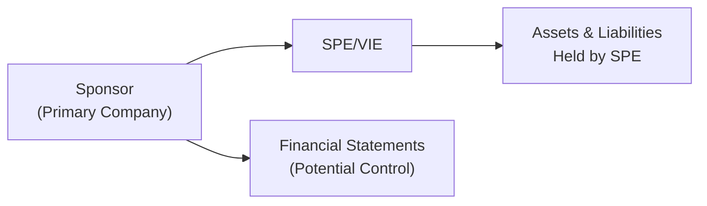

## Off-Balance-Sheet Financing: An Introduction
Sometimes, you’ll read a company’s balance sheet and think: “Wow, these guys have a super-healthy debt ratio!” But then, you peek into the footnotes—and it’s a completely different story. That’s off-balance-sheet financing in a nutshell. In other words, it’s when companies manage to keep certain liabilities (and sometimes assets) out of the main balance sheet, making their financial position look stronger than it really is.

Historically, operating leases were a prime example of this, especially before IFRS 16 and ASC 842 changed how most leases are capitalized. Factoring receivables without recourse, setting up certain joint ventures, or using project-financing structures can also be used to keep obligations off the main balance sheet.

Is any of this illegal? Not necessarily. Frameworks like IFRS and US GAAP have guidelines for when an item must be recognized. However, if companies push the boundaries—say, by structuring transactions to obscure liabilities—that’s where it becomes a red flag for analysts and examiners alike.

## Special Purpose Entities (SPEs) and VIEs
One popular method to achieve off-balance-sheet financing is the use of Special Purpose Entities (SPEs), also known in US GAAP as Variable Interest Entities (VIEs). These are legal entities created for a narrow purpose—such as securitizing a portfolio of receivables, pooling mortgage loans, or handling some high-risk project for a short duration.

In some cases, a sponsoring company will put assets and associated debt in the SPE so they don’t appear on the sponsor’s books. The sponsor is basically saying: “We don’t fully control this entity, so we don’t consolidate it.” But under IFRS 10 and FASB ASC 810, if the sponsor is the “primary beneficiary”—meaning it has the power to direct activities and is exposed to the majority of the risks or rewards—the sponsor must consolidate that SPE.  

Below is a simplified diagram illustrating how a sponsor may set up and interact with an SPE. The sponsor may try to limit its legal liability, but in many cases, it still retains de facto control. That triggers consolidation requirements.

If the sponsor is indeed the primary beneficiary (under US GAAP) or exercises actual control (under IFRS), the SPE’s financials must be consolidated into the sponsor’s statements, pulling all those once “hidden” liabilities onto the sponsor’s balance sheet. 

## Implications for Financial Analysis
Off-balance-sheet financing can skew critical financial ratios—like the debt-to-equity ratio or return on assets. You might think a firm is rock solid because the official numbers look great. But in reality, a chunk of debt is floating around in an unconsolidated entity.  

From a CFA Level II perspective, you’re expected to:

• Recognize where the “missing” liabilities might be.  
• Re-cast the financial statements to reflect the economic reality of these obligations.  
• Assess how these hidden exposures affect profitability measures, leverage, and solvency indicators.

When a large chunk of debt is moved off the main statements, any credit or solvency ratio is likely more favorable than it should be in economic terms. So, always read the footnotes! That’s where the real fun begins—footnotes may list a guarantee, a contingent liability, or an interest in a seemingly innocent variable interest entity.

## Identifying Red Flags and Potential Manipulations
You might be thinking: “So, how do I spot these shenanigans?” A few pointers:

• Opaque Financing Disclosures: If you see just one or two short lines in the footnotes describing “other debt obligations” or “lease obligations through a special entity,” it might be time to dig deeper.  
• Rapid Growth in ‘Other’ Off-Balance Items: If “other liabilities” or an off-balance-line recourse is ballooning year over year, the company might be funneling more debt into these structures.  
• Step Transactions: Watch for lots of small, separate transactions that, taken together, transfer a boatload of risk or reward. The company might be structuring them so no individual step triggers consolidation requirements.  
• Inconsistent Risk Disclosure: If management states it bears “significant risk” in an entity or project but that entity is somehow not consolidated, that’s a mismatch.

A personal anecdote: I once saw an energy company’s footnotes with references to half a dozen “project financing structures.” Each was described as “non-recourse,” implying no liability for the sponsor. But read carefully, and you’d find the sponsor guaranteeing certain performance metrics. That was a massive clue that sponsor risk was material—and sure enough, the sponsor had to consolidate these projects later.

## Advanced Practical Applications
### Look-Through Analysis
From an analyst’s perspective, you want to do a look-through analysis. In simple terms, pretend you consolidate the SPE or treat the guaranteed obligations as if they belong to the sponsoring firm. This means adding back outstanding debt owed by the SPE and adjusting for any related assets. By doing so, you can gauge the firm’s “true” financial leverage.

### Lease Accounting Adjustments
Historically, operating leases could stay off the balance sheet. But IFRS 16 (effective for most companies now) and ASC 842 (in US GAAP) require the recognition of right-of-use assets and corresponding lease liabilities for most leases. However, you might still see references to older or grandfathered arrangements, or you might be analyzing prior years that followed prior rules. If you need to compare the firm’s results over a long time horizon, you’ll want to normalize those older operating leases, capitalizing them on your own to maintain consistency.

Here’s a quick numeric example. Suppose a company is paying US$5 million per year for 5 years under an older operating-lease contract that was previously off the balance sheet. Let’s say the discount rate is 6%. The present value of these lease payments is a liability that we can approximate as:

(1) PV of Lease Liability = 5 million × PVIFA(6%, 5 years)

Where PVIFA(6%, 5 years) is the present value interest factor of an annuity. If we approximate PVIFA(6%,5) = 4.21236, then:

(2) Approximate Lease Liability = 5 million × 4.21236 ≈ 21.06 million

If you adjust the statements, you’d add US$21.06 million to long-term liabilities and the same amount to right-of-use (leased) assets. That can have a major impact on debt ratios.

### Real-World Repercussions
The Enron scandal is the classic example: Enron used SPEs to move loads of debt off its consolidated financials. When these came to light, Enron’s creditworthiness and stock price plummeted, leading to one of the most infamous corporate collapses in US history. That fiasco ushered in new rules about consolidations, transparency, and Sarbanes–Oxley compliance.

## Exam-Style Vignette Tips
On the exam, expect a scenario with multiple footnotes referencing leases, guarantees, or “joint ventures set up for financing.” The key signals might not be in the main body of the financial statements—they’re typically in the footnotes or a short paragraph about “commitments and contingencies.”

Stay alert for:

• Mentions of “primary beneficiary.” If you see the sponsoring entity has the power to direct key activities, that’s likely a consolidation trigger.  
• Guarantee Language. If the sponsor “guarantees any losses or shortfalls” in an entity, that’s a strong sign of risk retention.  
• Disguised Liabilities. Sometimes, you’ll see them called “purchase obligations” or “minimum volume commitments”—in essence, that’s akin to a lease or a fixed cash outflow.

## Glossary
• Off-Balance-Sheet Financing: Using financial structures or contracts to keep liabilities (or assets) from appearing on the sponsoring firm’s balance sheet.  
• Special Purpose Entity (SPE)/Variable Interest Entity (VIE): A legally separate entity established for a specific purpose, often to isolate risk. Requires consolidation if control or “primary beneficiary” criteria are met.  
• Primary Beneficiary: Under US GAAP, the firm that has the power to direct the activities that most significantly affect the SPE’s economic performance and will absorb the majority of the gains or losses.  
• Operating Lease vs. Finance Lease: Operating leases were historically off-balance-sheet prior to IFRS 16/ASC 842, while finance (capital) leases appear as assets and liabilities on the balance sheet.  
• Look-Through Approach: An analytical technique where the analyst essentially consolidates the SPE’s numbers to reflect the sponsor’s actual economic exposure.

## References and Further Reading
• IFRS 10 – “Consolidated Financial Statements” and IFRS 12 – “Disclosure of Interests in Other Entities”:  
  https://www.ifrs.org  
• FASB Accounting Standards Codification (ASC) 810 – “Consolidation”; ASC 842 – “Leases”:  
  https://www.fasb.org  
• Enron Case Studies: Various academic and professional articles illustrate how off-balance-sheet financing can mask corporate risks.

---------------------

## Test Your Knowledge: Off-Balance-Sheet Financing and SPEs



### Which of the following is a common reason for engaging in off-balance-sheet financing?
- [x] To present a more favorable debt profile by keeping liabilities out of the main financial statements.
- [ ] To ensure full transparency regarding all liabilities.
- [ ] To reduce the firm’s cash inflows.
- [ ] To reduce earnings per share (EPS).

> **Explanation:** Off-balance-sheet financing is typically used to keep certain liabilities out of the recognized balance sheet, creating the appearance of lower leverage.

### What is the primary beneficiary under US GAAP?
- [x] The party that has the power to direct the activities most significantly affecting the VIE’s performance and is exposed to the majority of its risks or benefits.
- [ ] Any investor who holds a noncontrolling interest.
- [ ] Any party that acquires at least 10% of the VIE’s equity.
- [ ] The government agency that sets accounting standards for the industry.

> **Explanation:** Under ASC 810, the primary beneficiary designation hinges on both power over significant activities and exposure to economic outcomes.

### Which of the following regulatory changes made most operating leases appear on the balance sheet?
- [ ] IFRS 10 and ASC 810
- [x] IFRS 16 and ASC 842
- [ ] IFRS 9 and ASC 606
- [ ] IFRS 12 and ASC 718

> **Explanation:** IFRS 16 and ASC 842 require companies to recognize most leases as right-of-use assets and lease liabilities, thereby eliminating many off-balance-sheet operating leases.

### Why might a company use a look-through analysis when evaluating financial statements?
- [ ] To exclude historical data and focus on future forecasts.
- [ ] To avoid analyzing intangible assets.
- [ ] To hedge currency exposure.
- [x] To factor in unconsolidated SPE liabilities for measuring true financial risk.

> **Explanation:** A look-through analysis helps the analyst incorporate the SPE’s assets and liabilities, painting a more accurate picture of the company’s leverage.

### Which of the following is not typically a red flag for off-balance-sheet activity?
- [ ] Short footnotes with limited detail.
- [x] A robust and clear explanation of lease obligations.
- [ ] Rapid growth in “other liabilities.”
- [ ] Step transactions that effectively transfer large risks.

> **Explanation:** Detailed, transparent footnotes are typically a good sign. Lack of clarity or multiple step transactions often hint at possible manipulative off-balance-sheet structures.

### In the context of SPEs, which scenario will most likely require consolidation?
- [x] When the sponsor controls key decisions and absorbs most of the risks and rewards.
- [ ] When the sponsor holds exactly 10% of the equity of the SPE.
- [ ] When the SPE is established in a different regulatory jurisdiction.
- [ ] None of the above.

> **Explanation:** If the sponsor is the primary beneficiary, they must consolidate the SPE in their financial statements.

### Under older GAAP rules, operating leases were often:
- [x] Kept off the balance sheet, appearing only as a rental expense on the income statement.
- [ ] Disclosed as both an asset and a liability.
- [ ] Classified strictly as intangible assets.
- [ ] Capitalized every time, no exceptions.

> **Explanation:** Before the updated leasing standards took effect, operating leases did not create a recognized liability or asset, greatly reducing reported leverage ratios.

### Which of the following best describes a step transaction?
- [x] Multiple smaller transactions designed to collectively transfer significant risks or rewards but avoid consolidation triggers individually.
- [ ] A one-time acquisition of a subsidiary.
- [ ] An immediate sale and repurchase of the same asset.
- [ ] A transaction that involves changing a lease rate.

> **Explanation:** Step transactions often break a larger deal into smaller steps, potentially obscuring true economic control or risk transfer.

### All else being equal, what happens when you adjust financial statements to include an SPE’s debt?
- [x] Leverage ratios typically increase.
- [ ] Net income immediately doubles.
- [ ] The ratio of intangible assets to total assets decreases dramatically.
- [ ] Cash inflows from operations are reduced by 50%.

> **Explanation:** Including the SPE’s debt on the sponsor’s balance sheet generally raises total liabilities, increasing leverage.

### A company is said to have properly consolidated a VIE if:
- [x] True
- [ ] False

> **Explanation:** Under both IFRS and US GAAP (ASC 810), if the sponsor is deemed the primary beneficiary, consolidation is required. Therefore, consolidating a VIE while meeting the primary beneficiary criteria is proper compliance.


