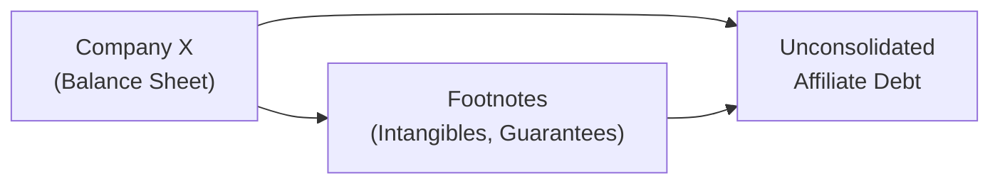

## Introduction and Overview

Sometimes, the scariest things in financial statements aren’t found where you’d expect—like in big, bold text on the first page. Instead, they lurk somewhere deep in the footnotes or in small disclaimers that nobody pays attention to (until it’s too late). That’s exactly where hidden liabilities might reside. This article tackles how you, as a CFA Level II candidate, can sniff out these liabilities and ensure you’re not blindsided on exam day (or, in real life, faced with a disastrous portfolio selection).

It’s funny. A friend of mine once got so excited about a company that had a seemingly pristine balance sheet: low debt, healthy profits, big talk about future growth. But then, guess what? You peeked into the footnotes and discovered that what looked like a tight, well-run ship was actually weighed down by off-balance-sheet obligations, unconsolidated joint ventures, and intangible assets teetering on the edge of impairment. His dream pick had liabilities hidden in plain sight. If we’d done the right footnote detective work up front, we could have saved ourselves a lot of trouble.

Let’s walk through a structured approach to uncovering potential hidden liabilities, focusing on a real-world-style scenario (a vignette). We’ll connect the dots among footnotes, management commentaries, and industry trends, pulling in a few IFRS vs. US GAAP comparisons for added clarity. We’ll also highlight how to apply your knowledge in an exam context—since, hey, that’s probably top of mind right now.

## Why Hidden Liabilities Matter

Earnings quality is vital for both fundamental analysis and valuation. If a company has understated liabilities, several “nasty surprises” may emerge in the future, potentially impacting valuation, solvency, and creditworthiness. Remember: The balance sheet isn’t just about assets and liabilities in isolation; it’s also about how these items can affect future cash flows and how they might shape the company’s capital structure decisions. When liabilities don’t appear on the face of the balance sheet, you risk painting an overly rosy picture.

Hidden liabilities might take many shapes, including:

• Off-balance-sheet financing arrangements (think operating leases under certain rules, or guaranteed debt).  
• Obligations within unconsolidated variable interest entities.  
• Big intangible assets that will eventually need impairment.  
• Under-reserved allowances for doubtful accounts and pension deficits.  

It’s a bit like a puzzle: you see hints, you see numbers, but sometimes you have to investigate beyond the official story to get at the truth.

## Building a Vignette Mindset

In the CFA exam environment, especially at Level II, you’ll receive a vignette: a mini-case that includes a condensed set of financial statements, footnotes, and a narrative about the firm. The mission is to figure out what is really going on. Are there smoke signals of a deeper problem? Did management cleverly place disclaimers in a footnote that changes the meaning of everything?

To master these vignettes:

• Start with a quick scan of the scenario. Identify what the make-believe company does, its main products or services, and the highlight numbers (revenue, net income, major assets, etc.).  
• Dive into the footnotes like a detective. Look for subtle references to intangible assets, guaranteed debt, affiliate deals, or changes in accounting methods.  
• Ask yourself if the story in the management commentary aligns with the numbers. Contradictions are huge red flags.  

## Step-by-Step: Uncovering Hidden Liabilities

### Initial Scan and Business Familiarization
When you open any financial statement or exam vignette, a quick read of the business model and the high-level figures is your first move. If you notice that total revenue soared by 30% while receivables barely budged, that might mean the company’s being efficient at collecting—cool, right? Or if revenue soared and receivables soared faster, then you might wonder, “Hey, is something else going on here?”

In exam vignettes, watch out for disclaimers like:  
• “Company A holds a significant interest in a joint venture but does not consolidate it due to lack of control.”  
• “Warranty liabilities are included in other accrued expenses.”  

Even a single sentence about a joint venture or “other” category can signal off-balance-sheet obligations or under-disclosed liabilities.

### Footnote Review: The Goldmine of Clues
Footnotes are essential. This is where you’ll see how intangible assets were valued, whether an acquisition triggered goodwill, and if any “unusual events” might be shaping the numbers. For instance, you might find that intangible assets jumped 40% from a recent acquisition, but the footnotes mention that the acquired target’s industry is currently in a slump. No impairment? That’s suspicious.

Look for language such as:  
• “Guarantees.”  
• “Product returns.”  
• “Nonconsolidated affiliates.”  
• “Commitments and contingencies.”  

A trick in the exam context is cross-referencing. If the footnote references an intangible asset or a guarantee, search the other footnotes for more clues. The same obligation can be mentioned in multiple places, occasionally with conflicting details. That’s no accident—it’s your clue that something is fishy.

### Analyzing Ratios and Trends
Numbers never lie…unless they’ve been manipulated. So analyzing ratios and comparing them over time (and to industry averages) can reveal hidden liability issues. For instance:

• Debt-to-Equity Ratio: \\(\displaystyle \text{Debt-to-Equity} = \frac{\text{Total Debt}}{\text{Total Equity}}\\). If it’s suspiciously low compared to competitors, maybe they’re “parking” obligations off the balance sheet.  
• Receivables Turnover: A major change in turnover could indicate problems in collecting debts or changes in revenue recognition.  
• Interest Coverage Ratio: If it’s precariously high, it might indicate that not all interest-bearing debt is recognized.  

Consider this mini Python snippet for ratio checks, if you wanted a quick ratio overview (just for fun):

```python
ebit = 150000
interest_expense = 30000
total_debt = 400000
equity = 600000

interest_coverage = ebit / interest_expense
debt_to_equity = total_debt / equity

print(f"Interest Coverage: {interest_coverage}")
print(f"Debt-to-Equity: {debt_to_equity}")
```

Within the exam, you obviously won’t break out Python, but you can systematically compute and compare these same ratios with the data given in the vignette.

### Identifying Aggressive vs. Conservative Practices
Maybe management extended credit terms to push year-end sales (leading to a big jump in accounts receivable). Or perhaps intangible assets keep growing, but there’s no mention of an annual impairment test. These are classic signs of aggressive accounting. On the flip side, sometimes you’ll see very conservative practices, such as hefty depreciation or big allowances. That usually reduces liabilities in the future but weighs on present earnings.

A big tip: If you see a single, large transaction near year-end that drastically shifts leverage or intangible assets, question the timing.

## IFRS vs. US GAAP: Differences That Matter for Hidden Liabilities

IFRS and US GAAP handle certain liabilities differently, so keep these differences in mind:

• Lease Accounting: Historically, IFRS had a single lease model that recognized right-of-use assets and liabilities for nearly all leases. Under US GAAP, you had operating vs. finance leases with different balance sheet impacts. Although the newer standard (ASC 842) has mostly aligned them, differences can still arise in classification and the statement of cash flows.  
• Variable Interest Entities (VIEs): Under US GAAP, you might have to consolidate a VIE if you’re the primary beneficiary. IFRS focuses more on control definitions. So a company might avoid consolidation on an IFRS basis that it can’t under US GAAP (or vice versa). That special entity might have big-time liabilities nobody sees.  
• Debt vs. Equity Classification: IFRS and US GAAP can differ on classification of certain financial instruments, especially if there are embedded derivatives or redemption features. Misclassification can understate liabilities.  

## Working Through an Exam-Style Case Example

Let’s say you’re reading about Company X in your exam vignette:

• Sales are up 30% over last year, but receivables are up by only 5%. Meanwhile, the allowance for doubtful accounts hasn’t changed.  
• The firm completed a big acquisition and recognized intangible assets that soared 25%. However, footnotes mention the industry is in decline. No goodwill impairment recognized yet!  
• The footnotes also note that Company X guaranteed outstanding debt of an unconsolidated affiliate. The total exceeded 50% of Company X’s equity.  

An immediate question: Are we dealing with a scenario where management might be keeping liabilities off the balance sheet? That guaranteed debt could be triggered if the affiliate defaults. The intangible assets might be worthless if the industry downturn is severe. The mismatch between the growth in sales and only a small shift in receivables is curious, too. Perhaps they’re factoring receivables, or maybe they changed credit terms, or maybe the sales growth is partially “cosmetic.”

### Using an Earnings Quality Adjustment Mindset
An advanced approach is to mentally recast the statements. For instance, you might say: “Okay, if the intangible assets are likely impaired, what happens if we write down that intangible or goodwill by 20%?” Then retest your ratios. If the total equity shrinks after the impairment, your debt-to-equity ratio might spike.

Or if the affiliate’s guaranteed debt is effectively the company’s risk, consider adding that to the liability base to see a more accurate leverage ratio. In the exam, show your reasoning. They might ask a question like, “What is the adjusted debt-to-equity ratio if the unconsolidated affiliate’s debt is recognized?”

Below is a simple mermaid diagram visualizing how multiple disclosures can tie together:



## Common Pitfalls

• Skimming Footnotes: Time pressure in the exam is real, but you can’t ignore the footnotes. There might be a single phrase that exposes a big liability.  
• Ignoring Contradictions: If management says “Our new product is flying off the shelves!” but footnotes show big inventory write-downs, something’s off.  
• Forgetting that IFRS and US GAAP might treat an arrangement differently, especially around consolidation.  

## Best Practices and Strategies for Exam Success

• Cross-Check Disclosures: If there’s mention of intangible assets in two different notes, see if the amounts or narratives differ.  
• Compare With Industry Data: They might give you a peer ratio for perspective. If everything is drastically different, dig deeper.  
• Read the MD&A: It’s not just filler. Sometimes the MD&A includes disclaimers that can make or break your interpretation of the numbers.  
• Think About Sustainability: Could these questionable items lead to future negative earnings surprises? Overstated assets or hidden liabilities often come back to haunt a company’s earnings.  

## Conclusions and Next Steps

Hidden liabilities can transform a healthy-looking balance sheet into a bit of a disaster story. For the CFA Level II exam, the key is to adopt a suspicious yet analytical mindset, reading thoroughly and noting every mention of potential obligations. Know the IFRS vs. US GAAP differences, keep an eye out for footnote disclaimers, and connect the dots. If something in the management commentary contradicts the footnote details—or if the numbers themselves look “too good”—raise an eyebrow.

In your professional life, the approach is similar. Sooner or later, you’ll run across a too-good-to-be-true scenario. Remember that off-balance-sheet items aren’t always malicious; they might be the result of evolving accounting standards or legitimate structures. But as an analyst, you owe it to yourself (and your clients) to ask, “What if?”

For more practice, you can consult official CFA mock exams and pay special attention to question sets that deal with intangible assets, consolidated/unconsolidated entities, and MD&A footnote analysis. Howard Schilit’s “Financial Shenanigans” is also a great read if you want real-world case studies. You’ll see how some famously “healthy” companies actually had entire graveyards of hidden debt.

Stay curious, keep digging, and remember that footnotes are your best friend when it comes to uncovering these accounting mysteries.

## Further References

• CFA Institute Mock Exams (particularly FSA sections).  
• Schilit, Howard: Financial Shenanigans.  
• SSRN Research Database for hidden liabilities case studies.  

## Test Your Knowledge: Hidden Liabilities and Balance Sheet Quality



### Which of the following best describes a “hidden liability” within financial statements?

- [ ] A usual liability clearly disclosed on the balance sheet.
- [x] An obligation not readily visible on the face of the balance sheet but described in footnotes.
- [ ] A liability that is recognized in the income statement only.
- [ ] Any liability that is greater than the industry average.

> **Explanation:** Hidden liabilities often appear in footnotes, contingent obligations, or unconsolidated affiliates, rather than on the main balance sheet.

### When analyzing statements under IFRS and US GAAP, which scenario is most likely to reveal off-balance-sheet financing?

- [ ] Differing approaches to revenue recognition for digital sales.
- [ ] Differences in how asset impairments are tested each year.
- [x] Variations in lease accounting or consolidation requirements for VIEs.
- [ ] Minor differences in depreciation rates.

> **Explanation:** Historically, lease accounting treatments and VIE consolidation have led to some off-balance-sheet financing differences between IFRS and US GAAP.

### A company’s sales increased by 35%, while the allowance for doubtful accounts stayed the same in absolute terms. What is the most likely concern?

- [ ] The company expects fewer bad debts than before.
- [x] The company may be underestimating future uncollectible receivables.
- [ ] The company changed its core business model.
- [ ] There is no concern; this trend always indicates efficiency.

> **Explanation:** If sales rise significantly but the allowance does not, the company might be underestimating future uncollectible amounts.

### A footnote discloses that Company Z guarantees 100% of a joint venture’s debt. However, Company Z does not consolidate the venture because it claims no control. Which of the following could be a hidden liability concern?

- [x] If the JV defaults, Company Z might be forced to honor the debt off its own books.
- [ ] The JV’s success will automatically improve Company Z’s income.
- [ ] There is no potential liability if the JV is unconsolidated.
- [ ] Company Z will have less cash on hand if the JV is profitable.

> **Explanation:** The guarantee may become Company Z’s liability if the JV can’t meet its obligations.

### How can an omitted goodwill impairment become a hidden liability?

- [x] It overstates intangible assets, indicating a liability for future write-downs and reduced equity.
- [ ] It reduces reported equity and thus lowers financial leverage.
- [x] It results in understated net income over time.
- [ ] It usually has no effect on future earnings.

> **Explanation:** Non-impaired goodwill can lead to overstated assets, which eventually may be written off—hurting future earnings and equity.

### Which of the following is a common red flag suggesting aggressive accounting around liabilities?

- [x] A significant, one-time transaction near the reporting date that changes leverage radically.
- [ ] Declining net income during an industry downturn.
- [ ] Low turnover ratios consistent with previous years.
- [ ] Management commentary about new product launches.

> **Explanation:** One-time end-of-year transactions can artificially alter a firm’s leverage or other accounting metrics.

### What is a recommended strategy when analyzing the MD&A section?

- [x] Cross-check the qualitative discussion with footnotes for consistency.
- [ ] Ignore it because it contains no quantitative information.
- [x] Compare it to the prior year’s MD&A for personal biases.
- [ ] Accept management’s view if it seems optimistic.

> **Explanation:** The MD&A often provides context that may confirm or contradict numerical disclosures.

### In the CFA exam context, which approach is most efficient for quickly identifying hidden liabilities within a vignette?

- [x] Perform an initial scan, then study all footnotes carefully for red flags.
- [ ] Skip the ratios and only read the narrative.
- [ ] Calculate all financial ratios before reading the vignette.
- [ ] Only read the main balance sheet numbers in detail.

> **Explanation:** A targeted two-step approach—overall scan plus methodical footnote review—is key to spotting hidden liabilities quickly.

### Under IFRS, which type of off-balance-sheet activity might a company employ to hide debt?

- [ ] Issuing subordinated debentures that are fully disclosed.
- [ ] Classifying intangible assets as current liabilities.
- [x] Using lease arrangements that do not meet recognition criteria under older standards.
- [ ] Consolidating VIEs prematurely.

> **Explanation:** Companies previously structured some leases so they weren’t recognized on the balance sheet, effectively hiding debt. IFRS 16 changed much of this, but older or transitional scenarios can still show differences.

### True or False: Excessively high interest coverage ratios could be a sign of hidden liabilities.

- [x] True
- [ ] False

> **Explanation:** If interest coverage is extremely high relative to peers, the company might be omitting or understating interest-bearing debt, signaling hidden liabilities or incomplete disclosure.




