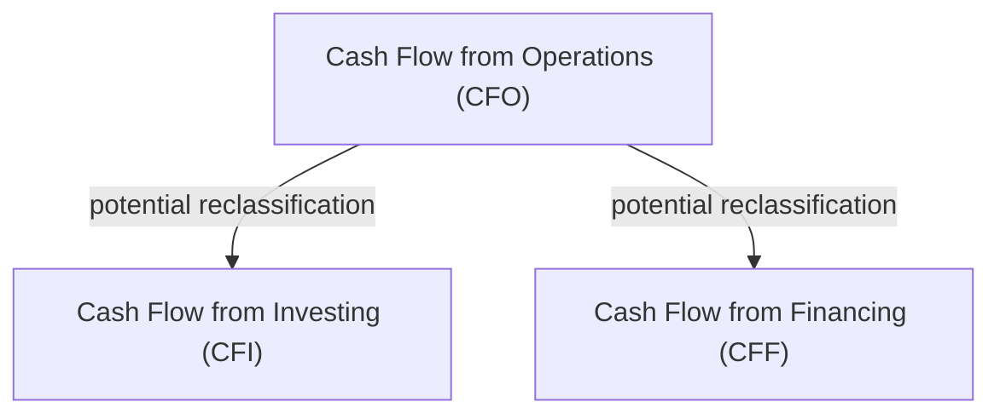

## Introductory Thoughts

I still remember the first time I tried to unravel a company’s statement of cash flows. I was sitting in a cramped office, sipping too much coffee, and trying to figure out why the firm’s operating cash flow looked suspiciously high. As it turned out, the company had been rather “creative” in choosing which cash items appeared in operating versus investing or financing categories. That small detail made a significant difference to the picture of health they presented to investors.

This section will walk you through the three pillars of the cash flow statement—Operating Activities, Investing Activities, and Financing Activities. We’ll explore IFRS vs. US GAAP treatments, highlight best practices and reporting pitfalls, and set you up to analyze potential manipulation. After all, the classification of cash flows is critically important for determining whether a firm’s core business is genuinely generating cash at a healthy rate.

## Operating Activities (CFO)

Operating activities (often abbreviated as CFO) are the engine of most companies—the day-to-day churn of creating products, delivering services, and collecting payments from customers. Think about your own life: the money you make from your regular job is akin to the operating cash inflow, while the bills you pay for rent, groceries, and utilities are the operating outflows.

• Common Inflows: Cash from sales, fees for services, royalties, commissions.  
• Common Outflows: Payments for inventory, payroll, rent, insurance, interest (under US GAAP), and taxes.

### IFRS vs. US GAAP Differences for Operating Cash Flow

Under US GAAP, interest paid, interest received, and dividends received must be shown as part of CFO. Dividends paid, on the other hand, fall under financing activities. IFRS is more flexible:  
• Interest Paid: IFRS allows classification as either CFO or Financing, provided the choice is applied consistently over time.  
• Interest Received: IFRS allows classification as either CFO or Investing.  
• Dividends Received: IFRS allows classification as either CFO or Investing.  
• Dividends Paid: IFRS allows classification as either CFO or Financing.  

Why does this matter? Because when a firm opts to move certain items—say interest paid—from operating to financing, the result can be a higher reported CFO. Investors who rely heavily on cash flow-based valuation models might be misled if they don’t notice these classification choices.

### When to Be Cautious

If you ever see unusually high CFO relative to net income or to peer companies, that’s your cue to dig deeper. Check the footnotes: sometimes, IFRS-based statements reveal a footnote indicating that interest paid has been classified in financing or that a portion of dividends received has been moved to investing. All of these are legitimate under the rules, yet they can completely alter the impression of how much cash the core business is generating.

## Investing Activities (CFI)

Here’s where the bigger ticket items usually show up—purchases and sales of long-term assets. In your personal life, this might be like buying a house or a car and then reselling it later. It doesn’t happen daily but can significantly impact your overall cash position when it does occur.

• Typical Inflows: Proceeds from selling property, plant, equipment (PP&E), intangible assets, or investment securities (not classified as cash equivalents).  
• Typical Outflows: Purchases of PP&E, intangible assets, or investment securities.

### IFRS vs. US GAAP Similarities and Differences

Under both US GAAP and IFRS, most purchases or sales of non-current assets or investments appear in investing activities. IFRS sometimes allows classification of interest received under CFI, whereas US GAAP does not.

Consider Redwood Interiors (a hypothetical furniture manufacturer). It invests in new machinery to streamline production, and that purchase is classified under investing activities. If Redwood Interiors later sells the machine at a profit or loss, that cash inflow also appears under investing. If Redwood Interiors decides to classify interest incoming from a short-term money-market investment, IFRS might let them classify it under investing, whereas US GAAP lumps it into operating. That difference alone can shift Redwood Interiors’ CFO metrics.

### Hidden Warnings

Watch out for repeated negative or sharply fluctuating investing cash flows over time:  
• Are the outflows genuinely for growth, such as expanding production capacity, or are they just replacing broken-down machinery?  
• Could certain operating costs have been capitalized to artificially push them into investing? For instance, some firms might capitalize routine maintenance to bolster CFO.  

If you suspect capitalizing routine operating costs, compare the firm’s depreciation expense and capital expenditure levels with industry averages or with their own historical data. Any out-of-line changes could raise eyebrows.

## Financing Activities (CFF)

Financing is basically how the company pays for its big projects or returns money to its owners. If you start a small business and borrow money from a bank or give out shares to raise capital, that’s financing. Down the line, if you pay off part of the bank loan or repurchase shares, those are also financing activities.

• Typical Inflows: Proceeds from issuing bonds, new debt, or stock.  
• Typical Outflows: Repayment of principal on loans, treasury stock repurchases, payment of dividends (under US GAAP), and so forth.

### IFRS vs. US GAAP for Financing Activities

Under US GAAP, dividends paid must go here in financing. IFRS allows a choice between CFO and CFF for dividends paid, although the choice must be consistent year to year. A business that wants to boost CFO might place dividend payments in financing so that operating cash flow stays untouched. Alternatively, if they wish to demonstrate a specific financing profile, they could place it under operating (IFRS only).

### Tailoring the Capital Structure

You may see lumps in financing cash flows related to big equity or debt issuance. For instance, if Redwood Interiors goes public, you’ll see a surge in CFF from the capital raise. Or if Redwood Interiors chooses to slash its debt significantly, you might observe a large outflow in a given period.

An abnormal pattern in dividends or share repurchases might signal a desire by management to manipulate share prices or to shed excess cash to maintain certain financial ratios (like return on equity). Financing data can also reveal how reliant the company is on external funding to keep afloat. Combining these insights with the CFO and CFI patterns can give you a holistic perspective on whether the firm’s growth is self-sustaining or debt-driven.

## Discretion and Classification Games

One of the trickiest parts of analyzing cash flow statements is knowing where managers can bend the rules—especially under IFRS, which grants more leeway for classification choices. By selectively grouping certain items under investing or financing, management can inflate—or deflate—Operating Cash Flow. 

Let’s look at how reclassification might occur:

For instance, if interest expenses are thrown into financing under IFRS, CFO might surge. This is not illegal or “wrong,” but it does reduce comparability across firms using different accounting standards or different internal policies.

### Detecting Potential Misclassifications

• Compare CFO to Net Income over multiple reporting periods. A chronic gap between net income and CFO might suggest that certain large operating expenses are parked in investing or financing.  
• Look at footnotes and disclosures for explicit statements about classification policies. Changes in classification from year to year are a red flag that something might be up.  
• Benchmark with peer companies. If you see that all your firm’s peers put interest received in operations, but your firm lumps it in investing (under IFRS), it might be legitimate, but it’s definitely worth investigating so you know why.

## Assessing Overall Cash Flow Quality

Analysts often pay special attention to operating cash flow, because that category most strongly correlates with day-to-day sustainable business performance. Shifts in CFO can quickly raise an investor’s suspicion that the company is either thriving or facing liquidity troubles. When combined with net income, trending CFO reveals how well “paper profits” turn into actual cash.

### Key Ratios and Red Flags

• CFO to Net Income: A ratio persistently below 1 could signal that much of the firm’s income is tied up in receivables or other non-cash items, or that operating items are capitalized.  
• CFO to Capital Expenditures (CF CapEx): If CFO is barely covering capital spending, the firm may need additional debt or equity financing to keep growing.  
• CFO to Total Debt: Lenders watch this ratio closely to see if the firm generates enough operating cash to service and repay obligations.

People sometimes say, “Cash is king.” In a sense, that’s true, but the classification of that cash can raise or lower the monarchy’s standing. So for the CFA Level II exam, you need a handle on how each section (CFO, CFI, CFF) is defined under IFRS and US GAAP, plus a sense of how to detect potential misclassification or fuzzy accounting.  

## Actionable Steps for Analysts

• Align the classification approach with IFRS or US GAAP guidelines and confirm consistency from year to year.  
• Investigate big swings in CFO, particularly if net income remains relatively stable or vice versa.  
• Check the footnotes for any explicit mention of reclassification. IFRS-based companies might detail how they treat interest and dividends.  
• Cross-check with peer companies. Are they all classifying interest in CFO while your target firm chooses investing? Why?  
• Build a multi-period comparison or prepare a table of CFO, CFI, CFF to see trends. Also note if the firm changes classification approaches after a major shift in management or ownership.

## A Quick Example

Suppose Redwood Interiors reports $300,000 in net income. Its doors are seemingly flying off the shelves. But when you dig into the cash flow statement, you notice CFO is only $150,000, while CFI is negative $400,000 due to new factory equipment. Meanwhile, Redwood Interiors classifies $50,000 of interest payment as financing under IFRS. If Redwood Interiors had used US GAAP, that $50,000 would reduce CFO further to $100,000, a big difference in perceived operating strength.

If Redwood Interiors also paid dividends of $10,000, IFRS might show that $10,000 outflow under CFO or under financing. Again, the choice changes how robust CFO looks. This example underscores how classification can tilt analyst perceptions and key coverage ratios.

## Best Practices and Common Pitfalls

• Best Practice: Keep an eye on the net effect, not just one line item. Sometimes, a small reclassification from CFO to CFI might have a huge effect on operating metrics or coverage ratios.  
• Pitfall: Taking CFO at face value—especially if a company transitions from US GAAP to IFRS or vice versa, or if they adopt new IFRS guidelines that allow more classification flexibility. Without adjusting, you might incorrectly rank the firm’s performance.  
• Best Practice: Document classification policies in your model. If you’re building a DCF (discounted cash flow) analysis, note any classification quirks so you don’t inadvertently double count or miscount.  
• Pitfall: Not exploring year-over-year classification changes. If the footnotes show that last year’s interest expense was in CFO but this year it’s in CFF, that big jump in CFO might simply be a result of reclassification, not genuine improvement.

## Final Thoughts

When it comes to analyzing and interpreting the statement of cash flows, the devil is in the details. Things like interest and dividend classification can dramatically shift a company’s reported operating cash flow, and IFRS offers more wiggle room than US GAAP does. For your Level II exam—and for real-world investment decisions—take the time to dissect these classifications, read a company’s footnotes thoroughly, and compare the firm’s policies with industry norms. It can save you from being caught off guard by artificially rosy metrics and let you focus on the business fundamentals that really matter.

## References

• CFA Institute (2025). CFA® Program Curriculum, Level II, Volume 4: Financial Statement Analysis. CFA Institute.  
• IAS 7, Statement of Cash Flows, International Financial Reporting Standards (IFRS).  
• FASB Accounting Standards Codification (ASC) 230, Statement of Cash Flows.  
• White, G. I., Sondhi, A. C., & Fried, D. (2019). The Analysis and Use of Financial Statements (3rd ed.).  

## Show Off Your Cash Flow Classification Skills



### Which item typically belongs to Operating Activities under US GAAP?

- [ ] Proceeds from issuing bonds.
- [x] Cash received from customers.
- [ ] Cash paid to acquire machinery.
- [ ] Dividends paid to shareholders.

> **Explanation:** Under US GAAP, operating cash flows primarily include transactions connected to the firm’s principal revenue-generating activities. Receiving cash from customers is part of the day-to-day operations.

### Under IFRS, which statement regarding interest and dividend classification is TRUE?

- [x] Interest paid may be either operating or financing, and dividends paid may be operating or financing.
- [ ] Dividend paid must always be operating.
- [ ] Interest received always falls under operating activities.
- [ ] Dividends received must always be under operating activities.

> **Explanation:** IFRS permits more flexibility. Interest paid can be classified as operating or financing (as long as it’s consistent), and dividends paid may be operating or financing. Similar discretion applies to interest received or dividends received, which can be operating or investing.

### A firm that seeks to inflate Operating Cash Flow under IFRS might classify which of the following under financing?

- [ ] Cash collected from customers.
- [ ] Proceeds from the sale of equipment.
- [x] Interest payments on debt.
- [ ] Payment of salaries.

> **Explanation:** By shifting interest payments from operating to financing, the company can artificially boost CFO. IFRS allows that choice; US GAAP does not.

### Which ratio best demonstrates how effectively an entity converts accrual-based earnings into cash?

- [x] CFO to Net Income.
- [ ] Debt to Equity.
- [ ] Current Ratio.
- [ ] Price to Earnings.

> **Explanation:** The CFO to Net Income ratio indicates how closely net income aligns with actual cash generated by operations. A consistent ratio is desirable; a large deviation suggests potential aggressive revenue recognition or capitalizing expenses.

### Under US GAAP, dividends received are always classified under:

- [ ] Investing Activities.
- [ ] Financing Activities.
- [x] Operating Activities.
- [ ] Either operating or financing, depending on management’s discretion.

> **Explanation:** US GAAP is strict on this point. Dividends received must be recorded under operating activities.

### If a company uses IFRS and pays dividends, which of the following is an acceptable classification?

- [x] Dividends paid as either operating or financing.
- [ ] Dividends paid as either operating or investing.
- [ ] Dividends paid must always be operating.
- [ ] Dividends paid must always be investing.

> **Explanation:** IFRS permits classification of dividends paid in either operating or financing, as long as it’s applied consistently.

### A large negative balance in Investing Activities might indicate:

- [x] Intensive capital expenditures or significant acquisitions.
- [x] Potential capitalizing of what could be operating expenditures.
- [ ] Plans to issue new shares.
- [ ] Exaggerated CFO from reclassification of dividends.

> **Explanation:** A large negative CFI often implies the company is spending heavily on assets (which can be good for growth) or possibly capitalizing routine expenses. Always compare with footnotes and the firm’s historical data.

### Which of the following would you scrutinize if Operating Cash Flow consistently exceeds Net Income?

- [ ] Steady classification of dividends received as investing.
- [ ] Low capital expenditures.
- [x] Any changes in classification of interest or dividends under IFRS.
- [ ] The issuance of common stock.

> **Explanation:** If OCF is persistently outpacing net income, you might suspect shifting interest or dividends from operating to other sections under IFRS, or conservative revenue recognition that consistently defers expenses.

### All else being equal, how would reclassifying interest paid from operating to financing (under IFRS) likely affect the CFO?

- [x] Increase CFO.
- [ ] Decrease CFO.
- [ ] Have no effect on CFO.
- [ ] CFO may increase or decrease depending on other items.

> **Explanation:** If interest paid moves from operating to financing, it lowers financing outflows but simultaneously boosts CFO, since less cash outflow is placed under operating.

### True or False: The classification of cash flows cannot influence key financial ratios.

- [ ] True
- [x] False

> **Explanation:** Classification can significantly shift CFO, which affects metrics like the cash flow-to-debt ratio, coverage ratios, and overall impressions of operating performance.


