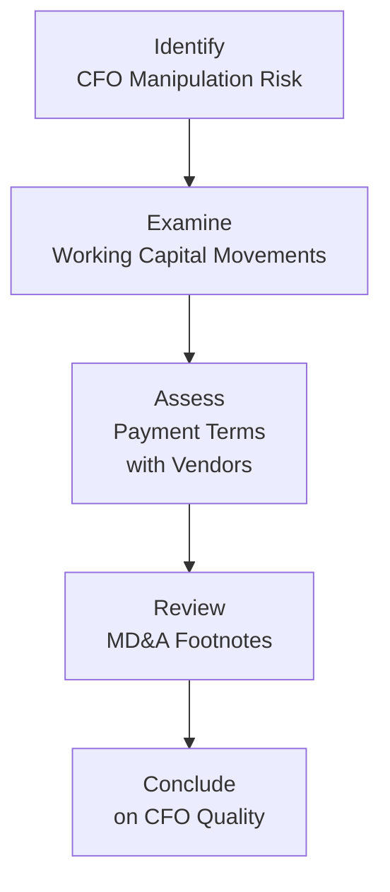

Before diving into the complexities and potential pitfalls of Cash Flow Statement manipulations, I’d like to share a quick personal anecdote. A few years ago, I was analyzing a manufacturing company that reported a stellar increase in operating cash flow (CFO) at quarter-end—something like a 40% jump from the previous period. I was a little excited at first (who wouldn’t be?), but when I drilled deeper, I discovered the reason was far less glamorous: the company simply delayed a chunk of payments to suppliers until the start of the next quarter. That experience taught me that not all CFO improvements are created equal. Sometimes, there’s real operational brilliance behind them. Other times, there’s just creative timing.

This section aims to shed light on such tactics and walk you through the ways you can detect, analyze, and evaluate potential manipulations of operating cash flows. Along the way, we’ll discuss real vs. cosmetic improvements, working capital changes, the effect of seasonality, and how to scrutinize IFRS vs. US GAAP disclosures. Let’s explore some of the more common manipulative practices and then delve into actionable strategies to protect ourselves—and our stakeholders—from being misled.

## Common Manipulative Practices in Cash Flow Statements

It’s one thing to read that a company’s CFO “skyrocketed,” but the truly insightful question is: how? Below are some of the more prevalent methods management might use to spruce up operating cash flows.

Delaying Payments to Suppliers  
Companies frequently postpone payments to suppliers near period-end to inflate CFO. On paper, it sounds absurd—why pay your vendors later if you can pay them now? Well, by withholding cash outflows until after the reporting period closes, the company can temporarily boost operating cash flow. If we look at the balance sheet, an uptick in Accounts Payable can emerge alongside an unusually rosy CFO line.  

Accelerating Collections from Customers  
On the other side of the equation, organizations may push customers—sometimes aggressively—to pay their invoices earlier. They might offer discounts for quick payments or modify credit terms so that receipts land in the current period. This approach boosts CFO in the short term, but can also distort normal business relationships if done too frequently or aggressively.

Altering Terms with Related Parties  
If the firm has subsidiaries, affiliates, or other related parties, it can change payment schedules, credit terms, or settlement arrangements to temporarily inflate operating cash flow. For instance, a subsidiary might prepay for services that extend well beyond the reporting period, resulting in an overstated CFO. Or, the parent might delay payments to the subsidiary. Such tactics can be particularly difficult to spot if disclosures are vague.

In practice, each of these manipulations hinges on timing. Because the statement of cash flows is built on actual in- and outflows, shifting those flows from one period to another can create the illusion of genuine operational health—when all that really happened was a short-term reshuffle.

## Real vs. Cosmetic Improvements

It’s vital to distinguish between an actual improvement in underlying business performance vs. a cosmetic shift in CFO. Real improvements usually reflect effective long-term changes, such as reduced costs of production, increased sales volumes to creditworthy clients, or the adoption of more efficient processes. Cosmetic improvements, on the other hand, are mere illusions.

• Real changes might look like a structural decrease in manufacturing costs or an uptick in stable revenue streams.  

• Cosmetic changes typically involve accelerating receipts or delaying disbursements without any fundamental shift in operational efficiency.  

One key tool to differentiate these is to keep a close eye on whether changes in CFO align with changes in revenue and expenses on the income statement. If sales have stayed flat, but CFO soared, you might need to investigate whether the difference is due to an extraordinary timing event.

## Investigating Working Capital Changes

Working capital is like the lifeblood of daily operations. It comprises current assets (like receivables and inventory) minus current liabilities (like payables). Changes in any component—Accounts Payable, Accounts Receivable, or Inventory—can significantly alter operating cash flows.

• Accounts Payable (AP): If a company defers payments to suppliers, AP will increase. That temporarily elevates CFO. Keep track of metrics like Days Payable Outstanding (DPO). A sudden spike in DPO (without a valid business rationale like renegotiated supplier terms) may be a blinking red light for CFO manipulation.

• Accounts Receivable (AR): By offering discounts or pressuring customers to pay earlier, a company reduces its AR. This short-term measure may make CFO look fabulous for the quarter, but if it’s not sustainable, watch for a recoil effect in subsequent periods. Examine Days Sales Outstanding (DSO). If DSO drops precipitously, check if the credit terms changed or if there’s an indication of pushing customers for early payment.

• Inventory: Monitoring Inventory levels and Days Inventory Outstanding (DIO) also matters. Significant inventory buildup or drawdown can affect CFO. Although not always a direct CFO manipulation, unusual inventory movements can point to reporting issues, especially if the disclaimers in footnotes or the MD&A are vague.

Comparisons to peer companies, industry benchmarks, and historical trends are excellent ways to spot anomalies in working capital changes. For instance, if your company’s DPO soared from 30 days to 60 days in one quarter, while peers remain fairly steady at 25 days, you’ve got a reason to dig deeper.

## Understanding Normal Seasonality vs. Suspect Patterns

Many businesses (especially retailers, fashion lines, toy manufacturers, and so on) face seasonal fluctuations in both revenues and expenses. Higher AR and inventory might be the norm heading into the holiday season, for example. So, if you spot a spike in AR during Q4 for a toy manufacturer, that might reflect legitimate seasonality.

But suspect patterns can emerge when the changes are dramatically out of line with historical data or industry norms. A company’s CFO might typically dip a bit in the first quarter, so if it suddenly surges, ask yourself: are there new revenue streams we’re not aware of, or might management be manipulating the timing of inflows and outflows?

One tip: read the prior years’ MD&A sections to see if management offers consistent explanations. If the discussion for the same quarter last year differs significantly from this year’s explanation (and there hasn’t been a major acquisition or strategic pivot), it might suggest obfuscation.

## Assessing Qualitative Disclosures

Flipping through the footnotes and MD&A can be a bit tedious, but it’s a wealth of information. Good management teams often include disclaimers when they’ve significantly changed credit terms or payables schedules. IFRS filers often provide more narrative disclosures, whereas US GAAP filers also can be quite revealing in footnotes if you read carefully.  

Look for language such as:  
• “Our vendor agreements now permit us to extend average repayment cycles for short-term trade payables from 30 days to 60 days.” (That’s a big shift, and you’ll want to see how it affects CFO and the next reporting periods.)  
• “The Company introduced an incentive program for customers to pay invoices within 10 days for a 2% discount.” (Hello accelerated customer collections, goodbye typical DSO.)

A mismatch between these narrative disclosures and the actual changes in working capital can be revealing. In the best-case scenario, management is transparent, explaining genuine reasons for the changes. In less-forthright scenarios, the footnotes might be vague or only hint at the reason for some obviously big swings in CFO.

## IFRS vs. US GAAP Footnote Differences

On balance, IFRS requires more explicit narrative discussion, including the nature of the company’s operations and factors that influenced its performance. Meanwhile, US GAAP also has fairly detailed requirements—especially under ASC 230 for the classification of cash receipts and payments—but it relies more on prescriptive rules for classification than on extensive narrative.

If you’re analyzing a multinational or reading statements prepared under both sets of standards, pay special attention to how interest and dividends are classified (they can appear under CFO, CFI, or CFF depending on the standard and the specific inflow/outflow). Inconsistencies in classification alone can distort cross-company comparisons.

Below is a simple diagram to illustrate the progression of how analysts often identify and evaluate CFO manipulation risk. It’s definitely not exhaustive, but it helps visualize the key steps.

As shown above, the detective work begins with the suspicion that CFO might be manipulated (A). You dig in by examining working capital movements (B), focus on payment terms (C), check footnotes and disclosures (D), and ultimately form a conclusion about whether the CFO figures represent real strength or something else (E).

## Actionable Steps for Analysts

Cutting through the confusion to spot cunning manipulations can feel a bit like detective work—so here are some practical steps:

• Compare Year-over-Year and Quarter-over-Quarter CFO with changes in net income or revenue. If net income and CFO move in opposite directions—particularly if CFO is abnormally high—dig deeper.  
• Evaluate changes in DSO, DPO, and DIO. Extreme fluctuations that diverge from historical averages or industry norms can point to temporary CFO boosts.  
• Keep a scoreboard of the short-term borrowing or factoring of receivables. Factoring, for instance, can accelerate CFO, but it may come at a cost to margin and might not be sustainable.  
• Look out for reclassifications among operating, investing, and financing sections. Under US GAAP, a company might classify certain outflows under Investing rather than Operating, artificially uplifting CFO. IFRS also has some flexibility in classification (such as interest and dividends), although the overall IFRS approach is typically more principle-based.  
• Read the MD&A or IFRS management commentary. Companies often disclose changes in terms with customers or suppliers. If they don’t, that’s a clue that deeper questions are warranted.  
• Conduct ratio analysis over multiple periods. If you see CFO growth deviating substantially from net income or from an expected ratio, hone in on whether it’s a fundamentals-based explanation or a timing trick.  

Combining these techniques with a solid understanding of industry norms will give you a much clearer picture of the firm’s cash flow quality.

## Glossary of Key Terms

Working Capital  
• Short-term assets minus short-term liabilities; a measure of a firm’s liquidity and operational capacity.

Factoring Receivables  
• Selling accounts receivable at a discount to a third party to receive immediate cash. This can inflate CFO in the short term but typically reduces profit margins.

MD&A (Management Discussion and Analysis)  
• A narrative portion of annual or quarterly filings where management discusses company performance, liquidity, and future outlook, including explanations of material changes in financial statement items.

Seasonality  
• Recurring fluctuations or patterns in business activity linked to specific times of the year (e.g., higher toy sales before holidays).

DPO (Days Payable Outstanding)  
• Average number of days the company takes to pay suppliers. A high or rising DPO can signal delayed payments.

DIO (Days Inventory Outstanding)  
• Average number of days inventory remains in stock before being sold. Large changes might indicate either genuine operational shifts or manipulative timing.

DSO (Days Sales Outstanding)  
• Average number of days it takes to collect on sales. A decline might signal improved collection processes—or an aggressive push to collect early.

## References and Further Reading

- CFA Institute (2025). CFA® Program Curriculum, Level II, Volume 4: Financial Statement Analysis.  
- Mulford, C. W., & Comiskey, E. E. (2011). Creative Cash Flow Reporting: Uncovering Sustainable Financial Performance.  
- International Accounting Standards Board (IASB). IFRS Implementation Guidance.  
- FASB ASC 230-10-45, Classification of Cash Receipts and Payments.

All right, hopefully that clarifies how timing can transform a firm’s operating cash flow, sometimes making it appear much stronger than the underlying fundamentals would warrant. In a perfect world, CFO would track real economic performance, but in reality, it’s up to us to evaluate, question, and confirm the extent to which a company’s CFO is driven by “true” operating strength rather than ephemeral timing plays or reclassifications. In my opinion, the more an analyst learns about spotting these manipulations, the more they can appreciate the importance of analyzing statements holistically rather than just glancing at the CFO line. Keep these insights in mind, and you’ll be well on your way to understanding—rather than just reading—any company’s cash flow statement.

## High-Impact Cash Flow Manipulation Quiz



### Which of the following is most likely to create a temporary boost in operating cash flow without indicating a true improvement in a company’s operational efficiency?

- [ ] Negotiating cheaper raw materials from suppliers.
- [x] Delaying payments to suppliers until after quarter-end.
- [ ] Streamlining the production process for higher output.
- [ ] Improving product quality and reducing warranty claims.

> **Explanation:** Delaying payments to suppliers is a timing-based maneuver that temporarily boosts operating cash flow. It doesn’t necessarily reflect a genuine improvement in efficiency.

### An analyst observes that a firm’s net income decreased slightly while its operating cash flow soared during the same period. Which key ratio would be most helpful to examine first to investigate potential CFO manipulation?

- [ ] Debt-to-equity ratio.
- [ ] Gross margin percentage.
- [x] Days Payable Outstanding (DPO).
- [ ] Quick ratio.

> **Explanation:** If CFO is rising while net income is falling, it may be due to delaying payables or accelerating receivables. DPO is a prime ratio to review for payment delays to suppliers.

### A company extends a special discount to customers who pay within 10 days to shore up short-term cash flow. This strategy may:

- [ ] Represent a permanent improvement in liquidity.
- [x] Inflate operating cash flow temporarily but reduce future periods’ receipts.
- [ ] Have no effect on working capital ratios.
- [ ] Immediately result in lower CFO since revenue recognition is delayed.

> **Explanation:** Accelerating collections through discounts can temporarily inflate collections in the current period. However, it typically pulls sales receipts forward, reducing future inflows.

### If a retailer’s Days Inventory Outstanding (DIO) unexpectedly plummets while its sales have only modestly increased, an analyst should:

- [x] Investigate whether management is prematurely recognizing sales or altering inventory accounting.
- [ ] Assume the company’s supply chain efficiency has doubled overnight.
- [ ] Conclude that there’s minimal risk of CFO manipulation.
- [ ] Ignore the DIO change if interest rates have fallen.

> **Explanation:** A sudden large decline in DIO can sometimes suggest that inventory is leaving the books faster than normal. Without clear operational reasons, it could mean potential reporting manipulation.

### Under IFRS, interest and dividends received:

- [ ] Must always be classified as operating cash flow.
- [ ] Must always be classified as investing cash flow.
- [x] May be classified under operating or investing, based on accounting policy choices.
- [ ] Are required to be shown in a separate section within the financial statements.

> **Explanation:** IFRS provides flexibility for classifying interest and dividend receipts as either CFO or CFI, whereas US GAAP typically requires them to appear in operating cash flow.

### Which of the following best captures a “cosmetic” improvement in CFO?

- [ ] Implementing total quality management to reduce defect rates.
- [ ] Entering a new market that substantially increases sales.
- [x] Factoring receivables at a discount to receive cash earlier.
- [ ] Minimizing overhead by negotiating cheaper electricity contracts.

> **Explanation:** Factoring receivables is a cosmetic approach to boost CFO short term. It doesn’t represent an underlying improvement in overall operational performance.

### A sudden spike in Days Payable Outstanding, absent any noted change in supplier terms, is most likely indicative of:

- [x] Management deliberately delaying payments to inflate CFO.
- [ ] An unexpected but benign discrepancy in the accounting system.
- [ ] The company’s increased bargaining power over suppliers, with no effect on fundamentals.
- [ ] The result of a seasonal shift in demand.

> **Explanation:** A sharp DPO increase that lacks a valid business explanation is often a clue that management is postponing payments to suppliers, thereby artificially boosting operating cash flow.

### An investor notices that a company’s operating cash flow soared by 30% while net sales and net income remained flat. Which next step would be most prudent?

- [x] Scrutinize the statement of cash flows alongside working capital accounts to identify potential timing shifts.
- [ ] Immediately assume the company is manipulating its financial statements.
- [ ] Ignore the discrepancy if net income is still positive.
- [ ] Focus on the financing section of the cash flow statement only.

> **Explanation:** The analyst should compare changes in working capital accounts, such as Accounts Receivable and Accounts Payable, for any suspicious timing maneuvers.

### During a conference call, management mentions using a short-term loan to pay off accounts payable earlier than usual, thereby reducing payables on the balance sheet. The effect on CFO is:

- [ ] The CFO will increase if the loan is repaid by the end of the year.
- [ ] There is no effect on CFO; only financing cash flow changes.
- [x] CFO might appear higher in a subsequent period if payables are kept lower than normal, but it depends on how management classifies the loan repayment.
- [ ] The CFO will decline immediately.

> **Explanation:** Taking a short-term loan can shift cash outflows to the financing section. Depending on timing and classification, the operating section may appear more robust in future periods if payables remain low.

### True or False: IFRS generally provides more narrative around cash flow movements than US GAAP does.

- [x] True
- [ ] False

> **Explanation:** IFRS often calls for detailed explanatory notes, giving investors deeper insight into operational factors that affect the statement of cash flows. However, US GAAP footnotes can also be informative but are typically more rules-focused.


