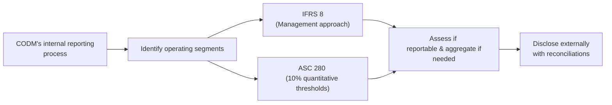

## Definition and Purpose of Segment Reporting

I’ll start by saying that segment reporting is one of those topics many folks underestimate—until they realize how much of a “behind-the-scenes” look it can give. At its core, segment reporting aims to break down a company’s financial results into distinct operational or geographic segments. Instead of simply viewing a corporation as one giant black box, analysts get to see the individual components that generate revenues, expenses, and profits (or sometimes losses).

• Helps identify which lines of business are performing well and which ones are lagging.  
• Allows deeper insight into resource allocation, risk exposures, growth strategies, and overall corporate strategy.  
• Enhances transparency. It shows how the Chief Operating Decision Maker (CODM) monitors and evaluates different parts of the business.  

I remember, a few years back, analyzing a conglomerate with dozens of product lines, from consumer electronics to heavy machinery. Without segment disclosures, I’d have had no idea where the real profits were coming from. Once I saw the breakdown, it turned out that the humble “spare parts and servicing” division was carrying the entire group. That’s the beauty of segment reporting.

## IFRS 8 vs. ASC 280: Two Sides of the Same Coin

IFRS 8 (Operating Segments) and US GAAP’s ASC 280 (Segment Reporting) are largely similar in principle, both using what’s called the “management approach.” In other words, external segment disclosure follows the very same segmentation that management (the CODM) uses internally. If the CODM sees five segments—maybe based on product lines or geographic divisions—then that’s roughly how the external reader should see them too.

But there are some subtle differences:

• IFRS 8 (Management Approach Emphasis): IFRS 8 focuses heavily on how management defines and reviews each segment. It explicitly requires disclosure of the factors used to identify segments, along with the nature of each product or service.  
• ASC 280 (Quantitative Thresholds): While ASC 280 also uses the management approach, it lays out some numeric thresholds that make certain segments “reportable.” For instance, if any segment’s revenue, profit/loss, or assets exceed 10% of the total, that segment must be reported separately.  

In practice, most large companies end up disclosing segments that align with these thresholds anyway, but there can be differences in how “significant” a segment needs to be before it’s reported. IFRS 8 is frequently a bit more principle-based, while ASC 280 has more explicit rules.

Here’s a quick diagram to visualize the broad process both IFRS 8 and ASC 280 follow:

## Aggregation of Segments

Both IFRS and US GAAP do allow some flexibility in aggregating multiple segments into a single “reportable” segment. But it’s not a free pass to lump everything into one big pot. Here’s where you’ve got to watch out:

• Similar Economic Characteristics: According to IFRS 8, companies can aggregate segments if they exhibit similar long-term gross margins, production processes, distribution methods, regulatory environment, etc.  
• ASC 280 also supports aggregation but is slightly stricter in specifying that the segments must be essentially alike in products, production, and market.  

I can’t tell you how many times I’ve seen analysts question a company that lumps very distinct lines of business into “Other” or “Miscellaneous.” Sometimes it’s no big deal, but every once in a while, you get a sense that management might be hiding underperformers or smoothing out volatility. So be sure to pay attention to the rationale behind aggregation in the notes.

## Disclosure Requirements

Once the segments are identified and any aggregation is done, IFRS 8 and ASC 280 require specific disclosures:

• External Revenue vs. Intersegment Revenue: You’ll see how much each segment sells to external customers versus how much “intercompany” trade is going on.  
• Segment Profit or Loss: Usually some variation of operating income, gross margin, or even net income is disclosed, though the exact measure can differ depending on what the CODM uses to evaluate that segment.  
• Total Assets per Segment: If the CODM regularly reviews assets by segment, then the company must disclose those numbers.  
• Reconciliations: Critical to bridging differences between the sum of segment figures and the entity-wide consolidated totals. If the segment data sums to X but the consolidated statement shows Y, the difference must be explained.  
• Geographic and Major Customer Data: Typically required if relevant or material. For instance, a large portion of revenue from a single customer often requires disclosure.  

It’s worth comparing the segment data to management’s discussion in the front part of an annual report or in the investor presentation deck. If the CEO mentions a big strategic push in “Segment B,” you’d expect to see some reflection of that in the segment disclosures. Discrepancies can be telling.

## Importance for Financial Analysis

Segment data is a treasure trove for analysts:

• Profit Drivers: You can spot which segments are contributing the lion’s share of revenue or profit.  
• Risk Assessment: A segment with steady losses can be a real drag—or could become a turnaround opportunity.  
• Valuation Insights: Some analysts literally model each segment as if it’s a standalone “mini-company,” then sum up those valuations to get a total enterprise value.  
• Growth Trends: By analyzing segment disclosure across multiple periods, you can see if certain product lines are accelerating or declining.  

I used to work with a colleague who said: “Always tear apart the segments first.” Over time, I’ve come to see the wisdom in his advice. Even if a company’s consolidated financials look stable, the cracks often emerge at the segment level.

## Advanced Considerations

For big, multinational companies, segment reporting can become downright huge. Imagine a global company with operations in 50 different countries and multiple product lines in each region. It can be quite complicated:

• Currency Fluctuations: If you’re analyzing foreign exchange movements, segment data can show how each region’s local currency is impacting margins.  
• Complex Supply Chains: A segment might internally transfer goods to another segment. Eliminations of inter-company transactions need to be carefully examined.  
• Strategic Shifts over Time: A company might reorganize its business lines—maybe merging two segments or spinning off a part of an existing segment into something new. Savvy analysts track these changes to maintain consistency in their models.  
• Potential Red Flags or “Hidden Gems”: Sometimes a segment’s re-categorization or repeated mention in footnotes can be an early hint that the company plans to sell or discontinue that segment.  

## Glossary

Chief Operating Decision Maker (CODM)  
• The individual (or group) in a company responsible for allocating resources and assessing the performance of operating segments—often the CEO, CFO, or executive management team.

Operating Segment  
• A business component that engages in revenue-producing activities, has its results reviewed by the CODM, and for which discrete financial information is available.

Reportable Segment  
• Any operating segment (or aggregated group of segments) that meets the quantitative thresholds (10% rule under US GAAP) or is deemed relevant enough under IFRS to warrant separate disclosure.

Aggregation Criteria  
• Conditions that allow two or more operating segments to be combined into a single reported segment, typically requiring similar economic characteristics.

Quantitative Thresholds (10% Rule)  
• Under ASC 280, segments exceeding 10% in revenue, profit/loss, or assets are deemed individually reportable.

Management Approach  
• The idea that segment reporting should mirror the internal reporting structure used by management. IFRS 8 and ASC 280 both rely on this principle.

Disclosure Reconciliations  
• The requirement to show how total segment revenue, profit/loss, assets, etc. line up with the consolidated financial statements. Discrepancies must be explained.

IFRS 8  
• The international accounting standard focusing on operating segments, emphasizing the management approach to segment disclosures.

## Best Practices, Pitfalls, and Exam Tips

• Look for Aggressive Aggregation: Sometimes companies group segments in a way that hides underperformance. Check footnotes carefully to see if segments truly belong together.  
• Check Consistency: CODM-based measures in segments should align with how the CEO or CFO discusses company performance in earnings calls or the MD&A (Management Discussion & Analysis).  
• Keep an Eye on Reconciliations: If there’s a big difference between total segment revenues and consolidated revenues, find out what’s causing it (often intersegment eliminations).  
• Note Organizational Changes: Segment definitions can change over time. For exam questions, you might see historical data restated to reflect new segment definitions. Don’t let that confuse you—just watch how the exam item presents it.  
• Ethical Dimension: If management tries to restructure segments frequently without clear reasons, it could be a red flag. Be prepared to discuss the potential motives behind recurring reorganizations.

When prepping for the CFA exam, remember that you might see a vignette describing multiple fictional segments. You could be asked to identify which segments qualify as reportable, how to interpret changes in segment disclosures, or how to reconcile the segment totals to the consolidated financial statements. Take your time to dissect the footnotes and any textual commentary.

## References

• IFRS 8 “Operating Segments” (International Accounting Standards Board)  
• ASC 280 “Segment Reporting” (Financial Accounting Standards Board)  
• “International Financial Reporting Standards: A Practical Guide” by Hennie van Greuning  
• Official IFRS Foundation website:  
  https://www.ifrs.org  
• FASB Accounting Standards Codification:  
  https://asc.fasb.org  

--------------------------------------------------------------------------------

## Test Your Knowledge: Segment Reporting under IFRS and US GAAP



### Which of the following BEST describes the primary goal of segment reporting? 
- [ ] To comply with regulatory capital requirements for banks.  
- [x] To provide a detailed breakdown of financial results by significant lines of business.  
- [ ] To forecast future exchange rates for multinational operations.  
- [ ] To comply solely with governance for non-public entities.  

> **Explanation:** Segment reporting helps analysts and investors see disaggregated data by line of business, aiding in performance evaluation—it’s not specifically about regulatory capital or hedging future exchange rates.

### Under IFRS 8, how are operating segments generally identified?
- [ ] Based on a standard industry classification code determined by global regulations.  
- [ ] By product lines mandated by IFRS.  
- [x] Through the management approach, mirroring how the CODM reviews financial information.  
- [ ] According to a single uniform chart of accounts.  

> **Explanation:** IFRS 8 uses the management approach. Segments follow how senior management internally organizes and evaluates the company.

### Which of the following is TRUE regarding the 10% threshold rule under ASC 280?
- [ ] Any segment contributing more than 10% to net cash flows must be separately disclosed.  
- [ ] Only foreign segments are subject to the 10% threshold.  
- [x] If a segment’s revenue, profit/loss, or assets exceed 10% of the total, it’s generally deemed reportable.  
- [ ] The 10% rule applies exclusively to intangible assets.  

> **Explanation:** ASC 280 explicitly states that segments that exceed 10% of revenue, profit/loss, or assets need separate reporting.

### What is a RED FLAG for analysts when reviewing a company’s segment reporting?
- [x] Frequent reclassifications of operating segments without clear explanation.  
- [ ] Comprehensive disclosure of segment profit margins.  
- [ ] Providing segment data to match internal management reports.  
- [ ] Consistent thresholds used for segment identification.  

> **Explanation:** While reclassifications can sometimes be legitimate, unexplained frequent changes may indicate an attempt to obscure poor performance.

### When segment totals do not reconcile perfectly with consolidated financial statements, companies must:
- [ ] Leave the discrepancy unexplained if it’s less than materiality.  
- [x] Provide a reconciliation explaining the difference.  
- [ ] Abandon segment disclosure for that reporting period.  
- [ ] Only disclose it in management’s private internal reports.  

> **Explanation:** Both IFRS 8 and ASC 280 require reconciliations to the entity’s consolidated totals.

### Which of the following segment disclosures is generally REQUIRED for reportable segments under IFRS 8 and ASC 280?
- [x] Revenue from external customers and intersegment transactions.  
- [ ] Voting rights of segment managers.  
- [ ] Management share ownership across segments.  
- [ ] Pro forma data for hypothetical acquisitions.  

> **Explanation:** While IFRS 8 and ASC 280 vary slightly, they both specifically require segment revenue details, including intersegment sales.

### How does IFRS 8 typically handle the aggregation of operating segments?
- [ ] Segments can never be aggregated under IFRS.  
- [ ] Segments must always be aggregated if they have similar product lines.  
- [x] Segments can be aggregated if they have similar economic characteristics and meet specific criteria.  
- [ ] IFRS 8 allows only a maximum of three aggregated segments per company.  

> **Explanation:** IFRS 8 permits aggregation but only if the segments have similar economic characteristics and meet particular conditions.

### In a scenario where a multinational company reorganizes its operational structure, what might happen to its segment reporting?
- [x] Historical segment results may be restated to reflect the new structure for comparability.  
- [ ] The old segment data remains permanently in the disclosures for all prior periods.  
- [ ] The company is exempt from segment reporting for one year.  
- [ ] IFRS 8 and ASC 280 prohibit changing the segment structure once it’s established.  

> **Explanation:** Typically, companies restate prior period segment data to maintain consistency when operational structures change.

### Why is the CODM concept relevant in both IFRS 8 and ASC 280?
- [ ] Because it ensures that only board-level management is involved in disclosures.  
- [ ] Because it forces companies to follow a uniform chart of accounts internationally.  
- [ ] Because it allows governments to set segment definitions for tax purposes.  
- [x] Because segment disclosures align with how top management actually reviews and allocates resources.  

> **Explanation:** The CODM concept is central to the management approach, ensuring external reporting aligns with internal decision-making processes.

### Segment profit or loss under IFRS 8:
- [x] May vary by entity and depends on the measure used internally for performance evaluation.  
- [ ] Is required to be operating income formally reconciled to net income.  
- [ ] Must be measured using a standard IFRS formula.  
- [ ] Must always exclude depreciation and amortization.  

> **Explanation:** IFRS 8 aligns segment profit or loss with the measure used by the CODM. The exact definition can differ among companies.


