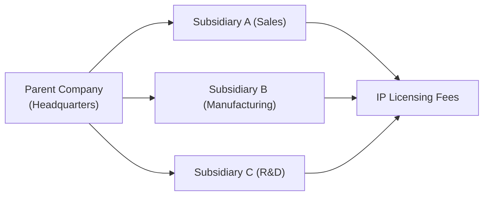

Transfer pricing. Seems like a pretty dry term, right? But let me tell you, it can really stir up a lot of fascinating—and sometimes, shall we say, heated—conversations when multinational corporations get involved. You might have heard of corporate giants booking profits in jurisdictions with favorable tax rates. Or you might remember that friend who joked, “Let’s just shift all the profit to a 0% tax island.” Well, while that might be an exaggeration, the reality is that transfer pricing can indeed be used to move profits around, if not carefully monitored. That’s why analysts must pay attention to these transactions whenever we’re evaluating a company’s segment reporting. 

Below, we’ll walk through all the key angles: the core principles, the arm’s-length requirement, major regulatory frameworks, and how to detect potential red flags. By the end, hopefully, you’ll know precisely why you should never overlook transfer pricing and other related-party dealings when dissecting a firm’s financial statements.

Overview of Transfer Pricing

Transfer pricing is best understood as the pricing of goods, services, or intangible assets (like patents, trademarks, or brand names) exchanged among different entities within the same corporate group. Think about a large electronics manufacturer with a parent company in Country A, a research subsidiary in Country B, and a manufacturing subsidiary in Country C. If one subsidiary “sells” intellectual property to another or provides specialized R&D services, that transaction has to be assigned a price—hence, “transfer pricing.”

Why does it matter for financial statement analysis? Because when you segment a company’s results by region or product line, you need to ensure that the profits allocated to each segment reflect true economic activity. If pricing is artificially inflated (or deflated), you’ll be left with a distorted picture of profitability among segments. That can complicate your analysis of operational efficiency, growth prospects, or even the overall stability of a particular line of business.

Under global accounting standards, IFRS and US GAAP both require that such intercompany transactions be disclosed if they’re material and if the parties involved are “related” (i.e., under common control). It’s all about transparency—and hopefully preventing unscrupulous managers from shifting funds around with no one the wiser.

Arm’s-Length Principle

The arm’s-length principle is like the golden rule of transfer pricing. Essentially, it says: price your intercompany goods or services as if they were purchased from a disconnected third party. Imagine going to a local coffee shop to buy a latte. You pay the listed price—there’s no friendly discount just because you like the barista. With an arm’s-length transaction, each party acts in its own self-interest, and the resulting price is presumably “fair” in a competitive market.

Tax authorities around the world (e.g., the IRS in the U.S., HM Revenue & Customs in the U.K., etc.) take the arm’s-length principle seriously. Why? Because if you deviate from it too much, you can artificially lower taxable income in one jurisdiction and inflate it in another—leading to all sorts of messy issues like base erosion or profit shifting (BEPS). If you’re analyzing a firm that operates in multiple countries, you better believe that their notes to the financial statements will discuss how they apply the arm’s-length principle. It’s also why some companies have to maintain detailed transfer pricing documentation—sometimes running hundreds of pages—to prove that the prices they use internally are “legit.”

Related-Party Transactions

Related-party transactions go beyond simple product sales and can include management fees, loan guarantees, or cost-sharing arrangements for research and development. The hallmark of a related-party transaction is that it occurs between two entities that share a common ownership structure, like a parent and a subsidiary, or between two subsidiaries of the same parent.

These transactions must be disclosed under IFRS (IAS 24) and US GAAP (ASC 850). The disclosures typically include:

• The nature of the relationship—Is it a parent-subsidiary, a joint venture, or something else?  
• The transaction amounts and any outstanding balances—Was the transaction for $1 million or $10 million? Did the affiliated party repay the loan, or is it still outstanding at year-end?  
• Terms and conditions—Are there administration fees, or is the transaction subject to a fixed or variable interest rate?

When you’re performing ratio analysis, these sorts of details can be incredibly important. For instance, if you see an unusually large “interest expense” that’s actually paid to a related party—and at interest rates not in line with the market—it might be a sign that you should dig deeper.

Regulatory and Tax Implications

Transfer pricing isn’t just about fairness on the income statement; it also has big implications for corporate tax strategy. Multinational firms can leverage transfer pricing strategies to reduce their global effective tax rate (ETR). By booking revenues in low-tax jurisdictions and expenses in high-tax jurisdictions, a company can achieve substantially lower overall taxes. That might sound clever, but you can guess that tax authorities aren’t too thrilled when they see improbable moves of intangible assets.

As a financial analyst, you might notice certain red flags in the segment footnotes:

• Persistent lower ETR. If the effective tax rate is significantly below the statutory rates in the main operating jurisdictions, the difference might be explained by transfer pricing or other tax planning initiatives.  
• Geographical anomalies. Let’s say most of the firm’s R&D is done in high-cost locations, but the intangible assets end up being “owned” by a subsidiary in a tax haven. If you see that 90% of a company’s profits are attributed to a tiny entity, that’s quite suspicious.  
• Shifts in intangible ownership. One year, intangible assets are based in Country X, and the next year, they’re “moved” to Country Y with a drastically lower tax rate.

Tax authorities worldwide have stepped up their focus on these issues, galvanized by the OECD’s Base Erosion and Profit Shifting (BEPS) initiatives. This is more than just a theoretical matter. If a regulator decides a company has not complied with the arm’s-length principle, it can impose hefty back taxes, interest, and penalties.

Detection and Analysis of Potential Smoothing

Now, from an analyst’s standpoint, sometimes a company will “smooth” its earnings by adjusting its transfer pricing. Maybe its management is hoping to show the world consistent, stable growth rather than big fluctuations. Alternatively, it might be trying to show that one high-growth segment has stellar profitability—maybe to attract investors in that region—while letting another segment bear more costs to keep it subdued. If it sounds manipulative, well… it can be.

What’s the best way to detect suspicious transfer pricing? Comparing reported segment margins to industry averages is a good start. If you see a firm’s automotive division clocking a 35% operating margin in a region where the average is only 10%, maybe they’re artificially reducing costs through internal pricing. Or if a firm’s manufacturing subsidiary in a high-tax country is persistently reporting losses while others post huge gains, that should trigger a deeper dive.

As a practical matter, analyzing these issues often requires more than just reading the financial statements. You may need to look at details from external sources such as competitor data or published industry benchmarks. Checking the footnotes for references to intangible asset valuations, cost-sharing arrangements, or ambiguous references to intercompany licensing can also reveal unusual patterns.

Here’s a small hypothetical that might ring a bell: Suppose Company X has a high-tech segment in Europe that licenses software from its parent in the U.S. Each year, the licensing fee is set at a fixed 30% of the European segment’s sales. But then you notice that the trading margin in the European segment is significantly lower than its nearest competitor. If that competitor, who presumably has a similar cost structure, is reporting a much higher margin, you might suspect that the intercompany software license fees are inflated to reduce profits in the European subsidiary—perhaps to minimize taxes in Europe. 

Anyway, you get the idea: digging into these disclosures can be a real detective game.

Advanced Considerations

Transfer pricing can get truly Herculean in complexity once intangible assets come into play. Royalties, brand value, and intellectual property rights tend to be among the most challenging items to price because they don’t have a convenient, active market. This is where advanced valuation methods come into the picture—like the comparable uncontrolled transaction method, the profit-split method, or the residual profit-split approach. Each approach tries to ensure that the intangible asset is priced as if the parties were unrelated. 

Many multinational corporations have “top-up” or “true-up” arrangements—these basically say that if at the end of a fiscal year, the actual results differ significantly from the forecast used to set the transfer pricing, the charges can be adjusted retroactively. While this might be perfectly legitimate, it can also cause lumps and bumps in the financial statements. A thorough analyst looks out for these lumps in the footnotes.

If you’re analyzing a multinational, you’ll often see lines like, “All intercompany transactions have been eliminated upon consolidation,” or disclaimers in the segment notes that intangible asset transfers conform to local tax regulations. Pay attention to these disclaimers and see whether they match the story told by the raw numbers. Do the effective tax rates vary widely by segment in a way that defies logic? Are intangible assets in the footnotes being transferred at suspiciously low or high valuations? Does the company’s segment growth correlate with tax incentives in particular regions?

Let’s look at a basic visualization to show how a parent company and subsidiaries might flow these transactions:

In this diagram, each subsidiary is engaging in intercompany transactions, such as royalty payments, transfer of goods, or licensing fees. An analyst would want to confirm that all these flows are priced as if they were with a third party.

Glossary

• Transfer Pricing: Setting prices for intercompany transactions within the same corporate group.  
• Arm’s-Length Principle: The notion that related-party transactions should be priced as if they occurred between unrelated market participants.  
• Profit Shifting: Strategically relocating profits to lower-tax jurisdictions.  
• IAS 24: The IFRS standard specifying rules for disclosing related-party relationships and transactions.  
• Base Erosion: Reducing the taxable base via artificially lowered profits in high-tax regions.  
• Management Fee: A fee charged among group entities for administrative, managerial, or technical services.  
• Cost-Sharing Arrangement: An intercompany agreement to share the costs of developing intangible assets (and the resulting benefits).  
• Aggregation vs. Separate Segment Pricing: Decision about whether certain intercompany transactions should be aggregated or split out by segment for reporting.

References

• IAS 24 “Related Party Disclosures” (International Accounting Standards Board)  
• OECD Guidelines on Transfer Pricing: https://www.oecd.org/tax/transfer-pricing/  
• “Transfer Pricing Handbook: Guidance for the OECD Regulations” by Robert Feinschreiber  
• US GAAP: ASC 850 on related-party disclosures  

Best Practices – Summary

• Always check the footnotes for any mention of intercompany transactions.  
• Compare segment profitability to industry benchmarks—extreme deviations may signal transfer pricing anomalies.  
• Keep an eye on the overall effective tax rate, and analyze year-over-year movements.  
• Look for intangible asset transfers or licensing fees, as they’re a top area for profit shifting.  
• Note if regulators have questioned or challenged prior transfer pricing practices in the management discussion or footnotes.  

And, of course, never hesitate to adopt a detective-like mindset. Transfer pricing can be sophisticated, but understanding its ins and outs is vital for evaluating segment performance fairly and consistently.

--------------------------------------------------------------------------------

## Test Your Knowledge: Transfer Pricing and Related-Party Dealings



### Which principle requires that intercompany transactions be priced as if the parties were not related?

- [ ] The revenue recognition principle
- [ ] Principles-based accounting concept
- [x] The arm’s-length principle
- [ ] Double-entry accounting principle

> **Explanation:** The arm’s-length principle is key in transfer pricing. It ensures that the pricing of intercompany transactions between related parties is set as if the transactions occurred between independent, unrelated entities.

### Which of the following items is less likely to be considered a standard related-party transaction?

- [x] Open-market acquisition of shares by an outside investor
- [ ] Intercompany purchase of raw materials
- [ ] Intercompany loan between parents and subsidiaries
- [ ] Management fees charged to a subsidiary

> **Explanation:** An open-market acquisition of shares by an external investor is not typically considered a related-party transaction, because the investor is not under the same control. The others are classic examples of related-party dealings under a common control structure.

### A primary concern for analysts when examining related-party transactions is:

- [ ] Whether the transactions violate IFRS or US GAAP purely by existing
- [x] Whether the transactions occur at an arm’s-length price
- [ ] Ensuring regulators are aware of the transaction amount
- [ ] That the transactions remain undisclosed to keep confidentiality

> **Explanation:** Existence of a related-party transaction itself is not necessarily a violation, but the major concern is whether they’re priced at arm’s length to avoid artificially distorted profits or losses in different segments.

### A typical warning sign of suspicious transfer pricing could be:

- [ ] Highly transparent disclosures in the annual report
- [ ] Minor deviations from industry margins
- [ ] Frequent disclaimers about the potential for intangible assets
- [x] Large differences in segment margins compared to industry norms

> **Explanation:** When a segment’s profit margins deviate dramatically from those of similar companies, it might indicate artificially manipulated transfer prices to shift profits. Disclosures themselves aren’t suspicious; the suspicious part is when the margins are abnormally high or low relative to peers.

### Which statement about IFRS requirements relating to related-party disclosures is correct?

- [ ] IFRS standards prohibit any form of intercompany transaction
- [x] IAS 24 requires disclosure of the nature and amount of related-party transactions
- [ ] IFRS does not recognize related-party transactions as different
- [ ] IFRS only concerns itself with tax implications, not segment results

> **Explanation:** IAS 24 specifically addresses related-party disclosures, requiring transparency regarding the nature and amount of transactions between related parties.

### One possible motivation for manipulating transfer prices is:

- [x] To shift profits to lower-tax jurisdictions
- [ ] To increase intangible asset amortization
- [ ] To conceal inventory holdings
- [ ] To comply with standard costing requirements

> **Explanation:** By altering intercompany transaction prices, companies might shift profits from higher-tax to lower-tax locations, thus reducing the overall tax bill (profit shifting).

### When investigating potential transfer pricing manipulation, an analyst should:

- [ ] Ignore segment disclosures since they are only for internal use
- [x] Compare segment profit margins to those of peer companies
- [ ] Rely solely on the consolidated tax note
- [ ] Wait for litigation results before investigating

> **Explanation:** An effective way to spot suspicious transfer pricing practices is to compare a firm’s segment margins to industry benchmarks. Large deviations may suggest questionable assumptions in intercompany pricing.

### Which method is commonly used to ensure consistency with the arm’s-length principle for intangible assets?

- [ ] Single-step income statement method
- [ ] Straight-line method
- [ ] Accrual method
- [x] Profit-split methods (e.g., residual profit-split)

> **Explanation:** The profit-split method (including residual profit-split) is a recognized approach for allocating intangible-related profits among related entities in a way that aligns with what independent parties would likely agree upon.

### A high effective tax rate in one jurisdiction and low effective tax rate in another, combined with unexpected segment margin shifts, might indicate:

- [ ] Failure to meet IFRS disclosure requirements
- [x] Potential profit shifting through transfer pricing
- [ ] A stable operating environment
- [ ] An auditing error

> **Explanation:** Large and persistent disparities between segment-level tax rates and margins can be a signal of profit shifting strategies in multinational organizations.

### Transfer pricing can be used to raise red flags in analysts’ minds primarily because:

- [x] It may artificially inflate or deflate segment performance
- [ ] It always complies with the arm’s-length principle
- [ ] It rarely affects consolidated financial results
- [ ] It is forbidden by IFRS and US GAAP

> **Explanation:** When managed poorly or maliciously, transfer pricing can significantly distort how profitability is allocated to various segments, affecting an analyst’s view of each segment’s true performance.


