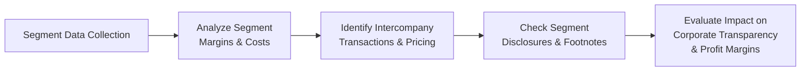

## The Link between Segment Reporting and Profit Margins

Segment reporting is a bit like looking at a mosaic: each separate tile (or segment) gives you a hint of the big picture, but only when you step back to see how all the pieces fit together do you truly understand a company’s profitability and risk. Often, different segments have distinct cost structures, competitive landscapes, and risk profiles. By breaking down a firm’s financials in this manner, analysts can compare profit margins and detect subtle differences that might be hidden in the company-wide consolidated statements.

Suppose you’re evaluating a large global conglomerate that has, say, three major segments: Consumer Goods, Infrastructure Projects, and Financial Services. Sometimes, the Consumer Goods segment is chugging along with stable margins, while the Infrastructure Projects segment might show high variability—driven by large contracts that are lumpy and cyclical. Meanwhile, the Financial Services segment could be quietly racking up big returns or, conversely, draining company resources depending on the interest rate environment and credit quality of borrowers.

In all of these scenarios, analyzing profit margins at the segment level is vital. A large discrepancy between the margins of different segments could mean:

• Unique competitive challenges (for instance, saturating markets).  
• Divergent cost structures (like fixed vs. variable cost intensities).  
• Potentially poor management or hidden inefficiencies in one segment compared to others.

When these margin differences become abnormally large without an obvious explanation, it raises red flags about how the company might be allocating costs or how it’s pricing intercompany transactions.  

## How Related-Party Transactions Affect Transparency

Related-party transactions (RPTs) are those between entities within a commonly controlled group—like a parent company and its subsidiary, or between subsidiaries themselves. These arrangements often include transfer pricing for goods or services, cost allocations, or even intangible asset licensing. If disclosed and priced appropriately, RPTs can be quite normal. But if they’re used to manipulate or shift profits artificially, they can obscure the true performance of each segment.

Here’s where it can get tricky. I recall working with one particularly complex conglomerate that operated in multiple regions. The parent company sold services to its overseas subsidiaries at extremely high prices. So, on paper, the parent’s domestic segments looked super profitable, while the foreign segments looked consistently unprofitable—leading investors to believe the foreign operations were a money pit. In reality, it was largely a transfer pricing quirk aimed at minimizing taxes in certain jurisdictions, which obviously muddied the waters for a straightforward profitability analysis.

High-frequency or large-scale intercompany transactions that lack transparency can distort key performance indicators. And it’s especially concerning if the company’s disclosures don’t address the rationale behind these flows. For analysts, it’s important to examine footnotes and watch for language like “intercompany cost allocation,” or “management services provided to affiliates,” especially if the fees or charges appear unusually large or are restructured frequently.

## Role of Governance and Audit Committees

Good corporate governance is like a well-run traffic system—everything moves smoothly and no single transaction slips by uninspected. Audit committees, a critical pillar of governance, have the job of ensuring that related-party transactions are transparent, fair, and in the best interest of shareholders. They typically:

• Oversee and review significant RPTs.  
• Ensure that such transactions occur at arm’s length or follow appropriate pricing guidelines.  
• Confirm proper disclosure in the financial statements.

In practice, a strong governance structure helps reduce the risk that a company uses intercompany dealings to manipulate segment margins or conceal unprofitable activities. Moreover, boards and audit committees often push for clearer disclosures when they sense that investors might misinterpret reported numbers. This level of scrutiny fosters a culture of transparency, which is generally rewarded in the marketplace by more stable share prices and improved investor confidence.

## Analyst Approach to Evaluating Transparency

### Benchmarking and External Comparison
One of the most straightforward ways to test whether a company’s segment-level profit margins are believable is to compare them with external benchmarks. If a particular segment is performing far better (or worse) than industry peers, it’s worth digging deeper to see if the differences are related to legitimate competitive advantages or disadvantages—or if they seem artificially manipulated by creative accounting.

### Investigating Segment Footnotes
Footnotes are gold for financial analysts. I can’t tell you how many times we initially skimmed a financial statement, only to circle back and discover interesting tidbits in the footnotes that changed our entire perspective. Details about intercompany loans, intangible transfers, or segment reorganizations often hide there. Ask yourself:

• Are there large balances of intercompany receivables and payables?  
• Does the company mention intangible asset charges or licensing fees between segments?  
• Have segments been redefined recently? If so, is it justifiable, or does it conveniently hide poor performance?

### Ratio Analysis at the Segment Level
Moving beyond consolidated ratio analysis, try computing segment-level gross margin, operating margin, or return on assets (ROA). This can uncover interesting insights. For instance, if one segment consistently has negative or razor-thin gross margins for no apparent reason, or if their overhead expenses appear out of line with others, it might warrant further investigation. Maybe management is dumping certain overhead costs into that segment. Conversely, an abnormally high margin in one segment could indicate that it’s enjoying artificially inflated transfer pricing benefits.

### Watch for Sudden Segment Reorganizations
Segment reorganizations sometimes reflect genuine changes in business strategy. But they can also be used to bury underperforming units—especially when a segment is rolled into a larger, more profitable segment. If a company frequently changes its segment definitions or lumps certain sub-segments together, it’s helpful to track historical data to see if any negative trends have vanished from view.

## Advanced Considerations

### Profit Shifting and Tax Implications
Multinational firms may shift profits among subsidiaries in different countries to take advantage of favorable tax rates. While tax avoidance strategies are not necessarily illegal, they can complicate an analyst’s job of understanding true economic performance. A large portion of segment-level margin differences might be attributable to transfer pricing decisions shaped by the tax environment.

### Complexity of Intercompany Agreements
Sometimes companies have layered intercompany agreements covering logistics, marketing support, research, or intellectual property. The complexity can be immense, and each agreement might have different margin implications. The more intricate these are, the higher the possibility that some segments appear artificially strong or weak.

### IFRS vs. US GAAP Reporting Nuances
Although the fundamental concept of segment reporting is fairly similar under IFRS (IFRS 8) and US GAAP (ASC 280), companies might face slightly different disclosure requirements or thresholds for what constitutes a reportable segment. Understanding these standards is critical. Under IFRS 8, for example, segments are reported based on management’s internal reporting, whereas US GAAP uses a similar "management approach" but has specific quantitative thresholds. These small differences can lead to variations in how many segments get disclosed and how data is presented.

## A Simplified Visual on Segment and RPT Analysis

Below is a Mermaid diagram illustrating a high-level flow of how segment data and related-party transactions influence margin analysis and, ultimately, corporate transparency.

Each step in the flow includes the gathering of segment-level information, analyzing the key cost and revenue drivers, tying them back to intercompany transactions, and finally assessing the quality of disclosures to gauge how transparent the financial statements are.

## Practical Example: Conglomerate ABC

Imagine “Conglomerate ABC” with three segments: Retail, Manufacturing, and Technology Solutions.  

• Retail Segment: Historically stable margins of around 15%.  
• Manufacturing Segment: Volatile margins between 5% and 25%.  
• Technology Solutions: Spiraling margins from 35% down to 10% over two years.  

A quick glance might leave you scratching your head—why is Technology Solutions falling off a cliff? The segment footnotes might reveal the parent began charging new “technology management fees” for branding and R&D support. Suddenly, a significant portion of Technology Solutions’ revenue is offset by these fees, effectively shifting profits into the parent’s corporate overhead or even another segment.

Meanwhile, the Retail segment might have been unaffected—no fancy new fees there—so it continues with its steady performance. Manufacturing might incorporate occasional specialized research from the Tech Solutions teams, but maybe the fees are structured differently. If the disclosures are limited or vague, the segment-level margins could confuse an analyst about which segment is truly adding the most value.

## Case Study: Transfer Pricing in a Global Setting

Let’s say a big pharmaceutical company, “PharmaGlobal,” runs R&D in Country X, where it benefits from large tax credits. The manufacturing is in Country Y, which imposes lower corporate taxes than Country X. The company’s brand intangible assets are owned by a holding company in Country Z, which has an even friendlier tax treaty structure. So, each segment pays or receives fees based on activities performed or intangibles used.  

• The R&D segment might invoice the manufacturing segment for specialized services.  
• The manufacturing segment might pay royalties to the holding company in Country Z for using the brand.  
• The holding company charges a licensing fee to the marketing arm in Country W, leading that marketing subsidiary’s margins to appear lower than typical.  

If you only looked at PharmaGlobal’s consolidated statement, you’d see an overall effective tax rate that might look normal. But from a segment vantage point, you may see things like a depressed R&D segment margin because it’s assigned huge overhead costs, or a marketing arm that can’t seem to dig out from royalty obligations. This could be entirely legitimate or it could be a red flag—a puzzle an analyst can only piece together by paying close attention to transfer pricing disclosures, footnotes, and consistent segment-level data over time.

## Best Practices for Analysts

• Cross-verify segment margins with market data and internal KPI trends.  
• Read the footnotes (and then read them again!). Most of the juicy details on RPTs, cost allocations, or reorganizations live there.  
• Look for consistent item labeling across segments. Inconsistent labeling might allow cost shifting.  
• Investigate governance practices around RPT approvals. Strong checks and balances can minimize abusive transactions.  

## Common Pitfalls

• Ignoring Non-Quantitative Disclosures: Qualitative statements often reveal managerial intentions behind reorganizations or cost allocations.  
• Accepting Short Explanations at Face Value: Companies may downplay significant changes with vague language like “strategic realignment.”  
• Overlooking Tax Minimization: Don’t forget that cross-border transactions might heavily influence segment margins, even if the net effect on consolidated profits is small.  
• Failing to Compare Segments Over Multiple Periods: One-year anomalies can be misleading. Look at longitudinal data to spot recurring patterns or abrupt shifts.

## Maintaining Corporate Transparency

Ultimately, corporate transparency thrives when management and governance structures commit to open disclosures. Everything from robust footnote commentary to consistent segment definitions across reporting periods helps investors and analysts truly understand each segment’s performance. Transparent handling of related-party transactions further ensures that margin data is not manipulated and the company’s overall risks are properly reflected.

## Connections to Other FSA Topics

Segment reporting often dovetails with other areas in financial analysis. For instance:  
• In Chapter 20, we discussed off-balance-sheet financing and SPEs—these structures might interact with RPTs if certain segments engage with off-balance-sheet entities.  
• Chapter 18 expounded on the concept of aggressive vs. conservative accounting policies—Segment reporting can likewise be manipulated aggressively, or it can be a bastion of transparency if done correctly.  
• Watch for potential synergy with your analysis of Consolidation Topics (Chapters 3, 4, 5): The intercorporate transaction complexities only multiply when you involve partial ownership, joint ventures, or business combinations.

## Exam Tips for CFA Level II

• Focus on identifying how segment data can be used to break down profit drivers.  
• Practice reading footnotes: the Level II exam might give you a dense vignette with multiple references to RPTs and segment reorganizations.  
• Remember that IFRS 8 and US GAAP ASC 280 have subtle differences—The exam might ask you to identify or interpret how these differences affect reported segments.  
• Keep an eye out for hints of “pricing shenanigans.” The examiner might slip in a subtle detail about an intercompany transaction that drastically changes margins.  
• Time management: Segment reporting vignettes can be text-heavy. Develop a systematic approach: read the scenario, highlight references to segment margins or RPTs, and check for changes in definitions/structures between periods.  

## References
• “Corporate Governance and Ethics” by Zabihollah Rezaee, excellent resource on how governance shapes financial disclosures.  
• Financial Executives International (FEI) resources on audit committee responsibilities: https://www.financialexecutives.org  
• Research on transfer pricing and multinational profit shifting: https://www.ssrn.com  

---

## Segment Reporting & Related-Party Transactions: Practice Questions



### Analyzing Segment Margins for Distortions
- [ ] Segment-level data is rarely useful because it is often restated in a consolidated summary.  
- [x] Segment-level data can reveal anomalies in margins that are masked in the consolidated statements.  
- [ ] Segment margins are unaffected by intercompany transactions.  
- [ ] Auditors prohibit the use of intercompany transactions in segment reporting.  

> **Explanation:** Segment-level data can expose divergences in profitability that are concealed at the consolidated level, particularly when intercompany transactions or cost allocations are used strategically.  

### Related-Party Transactions and Corporate Transparency
- [ ] Related-party transactions are illegal under IFRS.  
- [ ] RPT disclosures have no impact on an analyst’s view of a firm’s risk.  
- [x] Opaque related-party transactions can impair the reliability of reported segment performance.  
- [ ] Government oversight agencies never review disclosures of related-party transactions.  

> **Explanation:** When RPTs are not clearly disclosed and priced at arm’s length, they can distort segment performance and hinder an analyst’s ability to gauge true profitability.  

### Unusual Segment Profitability Patterns
- [x] Large, unexplained differences in margins across segments often warrant more in-depth investigation.  
- [ ] Smaller segments can be safely ignored when analyzing margins.  
- [ ] Consistently high margins in all segments indicates probable manipulation.  
- [ ] A negative margin always implies management errors.  

> **Explanation:** Material deviations in segment margins may reveal issues such as cost misallocation, transfer pricing irregularities, or high exposure to certain risks.  

### Segment Reporting and Changes Over Time
- [ ] Management is prohibited from changing segment definitions once established.  
- [ ] Segment reorganizations never affect comparability.  
- [x] Frequent segment reorganizations can reduce transparency if historical data is not provided.  
- [ ] IFRS eliminates the possibility of segment reorganizations.  

> **Explanation:** Companies sometimes redefine segments in ways that hamper comparisons across reporting periods, making it difficult to track performance trends accurately.  

### Governance and Audit Committees
- [x] Audit committees review and approve significant related-party transactions to maintain transparency.  
- [ ] Audit committees have little influence on financial disclosures.  
- [x] Strong corporate governance helps ensure arm’s length pricing in intercompany dealings.  
- [ ] Audit committees are typically disbanded once annual financial statements are published.  

> **Explanation:** Audit committees play an essential oversight role, ensuring that management discloses RPTs fully and fairly. Strong governance helps preserve the integrity of segment reporting.  

### IFRS vs. US GAAP on Segment Disclosures
- [x] IFRS 8 and US GAAP ASC 280 both follow a “management approach,” though thresholds differ.  
- [ ] IFRS completely forbids the disclosure of segment-level profit margins.  
- [ ] US GAAP does not allow companies to define their own segments.  
- [ ] Neither standard requires footnote disclosures about segments.  

> **Explanation:** Both IFRS 8 and ASC 280 revolve around management’s perspective for segmentation, but they have slightly different quantitative thresholds and disclosure requirements.  

### Transfer Pricing Impacts
- [x] Manipulative transfer pricing can distort profitability across multiple segments.  
- [ ] Transfer pricing arrangements never change a company’s overall tax exposure.  
- [x] Proper documentation and justification are crucial for transparency.  
- [ ] External auditors ignore transfer pricing issues because they are internal concerns.  

> **Explanation:** Transfer pricing can be used for tax minimization and may lead to skewed segment margins. Auditors and regulators pay close attention to these arrangements.  

### Identifying Warning Signs in RPT Disclosures
- [x] Large intercompany receivables or payables that lack clear business justification.  
- [ ] Low transaction frequency among affiliates.  
- [ ] Segment redefinitions with thorough explanations.  
- [ ] Fully explained intangible transfers consistent with industry benchmarks.  

> **Explanation:** Related-party transactions lacking explanation or containing unusually large balances can be potential red flags for profit shifting.  

### Segment-Level Ratios
- [x] Segment-level ratios such as gross margin or operating margin can highlight underperforming areas.  
- [ ] Segment-level ratio analysis is unnecessary if consolidated ratio analysis is performed.  
- [ ] Segment-level ratios play no role in risk assessment.  
- [ ] Analysts do not compare segment results with industry benchmarks.  

> **Explanation:** Ratio and trend analysis at the segment level helps analysts isolate performance issues or strategic strengths that might go unnoticed in consolidated figures.  

### True or False: Frequent Segment Reorganizations
- [x] True  
- [ ] False  

> **Explanation:** Frequent reorganizations can mask unfavorable trends by mixing underperforming units with stronger ones, affecting comparability of segment data over time.  


