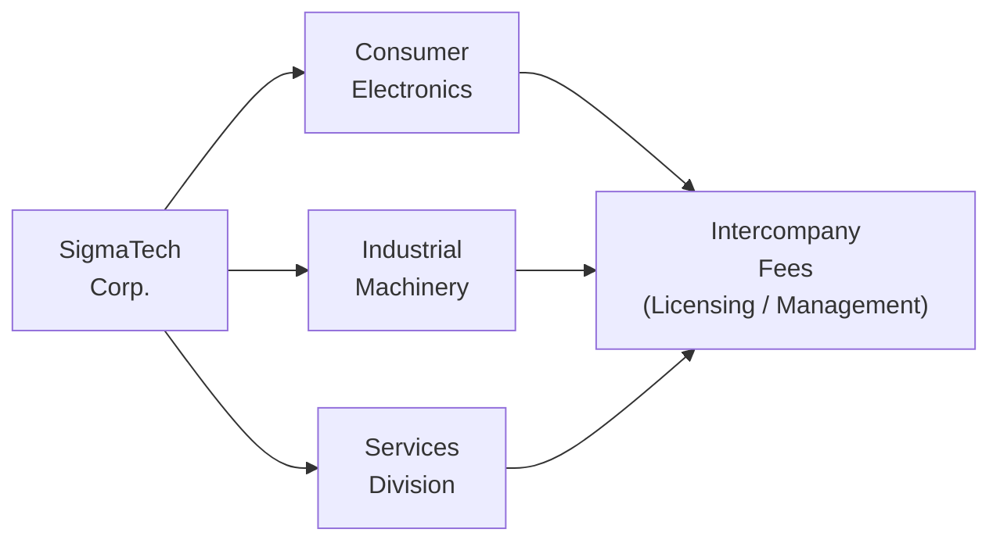

## Introduction
So, you’ve probably heard this a hundred times—“Read the footnotes!”—but I can’t stress that enough when it comes to segment reporting. One day, I was working through a client’s (albeit smaller) consolidated statements and realized their service division margins had tripled overnight. My first assumption was: “Wow, that’s amazing operational improvement.” But, after a bit of prodding (and some coffee-fueled detective work), I discovered there was an internal transfer pricing tweak quietly elevating the segment’s reported profits. This short anecdote underscores how easily margins can appear “magically transformed” if you don’t dig into the details of segment disclosures and related-party deals.

In large, multinational firms, segmented data plays a huge role in understanding each line of business. This article walks you through the steps of navigating a hypothetical company, SigmaTech Corp., and spotting signals that might indicate margin manipulation or genuine operational changes. By the end, you’ll know how to piece together segment-level financial puzzles and avoid the trap of superficial analysis. Let’s get started.

## Scenario Overview
Picture SigmaTech Corp., a multinational manufacturer that organizes its operations into three major segments:

• Consumer Electronics  
• Industrial Machinery  
• Services Division  

SigmaTech’s management has also disclosed a range of related-party transactions—like licensing intellectual property among these divisions and charging each other management fees. Over the past year or two, analysts have noticed that Consumer Electronics has started to show unexpectedly high margins, while the Industrial Machinery segment is languishing. Could it be due to new product breakthroughs and genuine operational improvements in Consumer Electronics? Or is management simply shifting costs around internally to prop up one segment’s performance?

Why does it matter? Under both IFRS 8 and US GAAP (ASC 280), segments should be reported in a way that fairly represents how the organization is managed. That means if transfer pricing among segments becomes too “creative,” you can inadvertently (or intentionally) distort the numbers. In the real world, this can mislead external stakeholders or even be a sign of underlying stress in the business.

Below, we’ll run through a step-by-step process—useful on the exam and in real-life practice—for poking around in the footnotes, analyzing margins, and reconciling consolidated totals with segment disclosures.

## Step-by-Step Vignette Analysis

### Identify Segment Thresholds
First, confirm that SigmaTech’s reported segments meet IFRS 8/ASC 280 threshold criteria for separate disclosure. Under IFRS 8, a segment generally qualifies if it accounts for 10% or more of the entity’s revenue, profit (or loss), or assets. ASC 280 has similar guidelines. In the SigmaTech example, each segment meets the threshold because:

• Consumer Electronics and Industrial Machinery collectively generate the lion’s share of external sales.  
• Services Division, though smaller in terms of revenue, might surpass the 10% threshold in asset base or profit contribution.  

Tip: If you discover a segment is barely crossing any threshold, pay attention to how management might be grouping or splitting divisions to manipulate disclosures. Sometimes, borderline segments get folded into “Other” so they remain out of the limelight.

### Reviewing Segment Performance Data
Next, you’ll want to examine revenue, operating income, and margins by segment over a few reporting periods—say three to five years. Looking at just one year can be misleading (or incomplete, at best). Let’s do a quick refresher on the operating margin formula:


\text{Operating Margin} = \frac{\text{Segment Operating Income}}{\text{Segment Revenue}} \times 100\%


Suppose you notice Consumer Electronics enjoyed an operating margin jump from 10% to 20% over two years, while Industrial Machinery dropped from 18% to 9%. That’s quite the shift, and it might reflect a transfer of costs between segments—particularly if overall consolidated results remain fairly stable. 

Often, the timeline is key. Pinpoint exactly when the margins started diverging. Did it coincide with new licensing agreements or a new distribution arrangement? Did the company just reorganize its internal structure?

### Investigating Related-Party Disclosures
Once you spot unusual trends, the next step is to dig into the related-party footnotes. IFRS and US GAAP both require certain disclosures if transactions occur between segments or with other related entities. For SigmaTech, you might find:

• A newly established intellectual property licensing agreement that increased the royalty fee Consumer Electronics pays to the Services Division.  
• A revised method for allocating corporate overhead to Industrial Machinery.  

If these changes line up suspiciously with margin movements, you’ve likely found your culprit. For exam purposes, be ready to parse footnotes carefully and link them to the summary data in the primary statements. 

### Evaluating Arm’s-Length Arrangements
Now, you’re basically wearing an internal-audit hat to decide if the terms look normal or artificially inflated. This can be tricky in practice because “market rates” for specialized services or intangible assets can be subjective. But at least get a sense of whether:

• The licensing rate is in line with known industry benchmarks.  
• Management fees are consistent across segments. If the Services Division charges 2% to Industrial Machinery but 10% to Consumer Electronics, ask why.  

If you find that one segment’s cost structure was artificially lowered (leading to inflated margins), that is a big red flag. Alternatively, the management might have rational business reasons for switching fee arrangements—maybe they consolidated their overhead function for scale. You want to see if there’s a legitimate justification.

### Reconciliation Checks
One last crucial step: ensure that the totals across all segments collectively match the consolidated data reported for SigmaTech as a whole. For instance, if you sum up all segment revenues, you should reconcile it to the total consolidated revenue (minus any inter-segment eliminations). If you encounter major discrepancies that aren’t explained in the footnotes—maybe “other adjustments” ballooned significantly—this might suggest the numbers are being shuffled around behind the scenes.

Double-check:

• Revenue: Aggregated segment revenue should tie to consolidated revenue after you remove intercompany sales.  
• Operating Income (EBIT): Summation of all segment EBIT less adjustments (like headquarters overhead, intercompany eliminations) should match consolidated EBIT.  
• Assets: Same principle—confirm total assets in each segment footnote align with the consolidated balance sheet, net of intercompany assets.  

### Conclusion from the Step-by-Step
After completing these steps, you’ll have a strong basis for concluding whether that margin jump is real or simply transfer pricing magic. For SigmaTech, it might be that Consumer Electronics has indeed launched a new product that’s taking off internationally, generating genuine margin expansion. Or maybe the rise in that segment’s reported profit is a result of management’s decision to roll out an unexpected new royalty structure that shifts costs away from Consumer Electronics and dumps them into Industrial Machinery. 

When you approach related-party and segment disclosures in the exam (or in the real world), the critical thinking process is the same: identify anomalies, align them with footnote disclosures, question the fairness of the intercompany arrangement, and confirm that segment totals match consolidated figures.

## Pre-Exam Practice
If you’re prepping for the exam, it’s incredibly helpful to simulate big, multi-part questions that address segment performance, related-party footnotes, any IFRS vs. US GAAP differences, and the reasons behind a segment’s margin shift. Prior exam item sets often take you on a footnote-reading journey, forcing you to reconcile data from the text with the summarized exhibits. Practice time management—sometimes those footnotes are lengthy, and you can’t afford to skim them too fast.  

Under IFRS 8, managers base segment disclosures on the “management approach,” focusing on how the chief operating decision maker (CODM) views the business. Meanwhile, US GAAP’s ASC 280 is broadly similar but may differ in details or numerical thresholds for reportability, especially in how certain items (like internal transfers) might get recognized. Consider how different principles could influence your interpretation of an internal licensing agreement or overhead allocation.

## Visual Overview

Below is a simple diagram to illustrate how SigmaTech’s segments interrelate and how intercompany fees could flow:

The arrow to the central “Intercompany Fees” node suggests potential licensing or management charges that one segment might pay to another, ultimately affecting each segment’s margins.

## Glossary
• SigmaTech Corp.: A hypothetical multinational used here to demonstrate segment reporting complexities.  
• Consumer Electronics Segment: Produces consumer gadgets; subject to demand seasonality.  
• Industrial Machinery Segment: Manufacturing heavy equipment; typically significant capital expenditure and longer sales cycles.  
• Services Division: Provides after-sales support, consulting, and maintenance, sometimes to external clients but also to the other SigmaTech segments.  
• Licensing Fees: Charges for using intangible assets owned by a sister segment or parent company—often a hot spot for transfer pricing adjustments.  
• Red Flags: Potential indicators of manipulation or unusual accounting, such as abrupt margin shifts without sound operational rationale.  
• Item-Set Style Question: A vignette-based question format focusing on integrated knowledge of financial statement analysis.

## References
• PwC - Illustrative IFRS Financial Statements: (https://www.pwc.com)  
• Dunning, John: “Analysis of Multinational Enterprises”  
• CFA Institute - Practice Exam Resources: (https://www.cfainstitute.org)

## Test Your Knowledge: Segment Reporting and Related-Party Transactions



### When analyzing segment data for SigmaTech Corp., which metric is typically used to determine segment threshold eligibility under IFRS 8 and ASC 280?

- [ ] Net profit margin only
- [x] 10% of the entity's revenue, profit (or loss), or assets
- [ ] 5% of consolidated net income
- [ ] 50% of total consolidated revenue

> **Explanation:** IFRS 8 and ASC 280 generally use a 10% rule for revenues, profit/(loss), or assets to determine whether a segment is reportable.

### Assume Industrial Machinery’s operating margin declined from 18% to 9% while Consumer Electronics nearly doubled its margin. Which footnote detail would be the biggest red flag for artificially shifting profits?

- [x] A sudden increase in intercompany licensing fees charged by Industrial Machinery to Consumer Electronics
- [ ] A new marketing strategy to sell more consumer electronics online
- [ ] Higher capital spending in Industrial Machinery
- [ ] Larger depreciation charges due to new manufacturing equipment

> **Explanation:** A sudden adjustment in intercompany licensing fees could redistribute expenses and revenues among segments, inflating or deflating margins artificially.

### In the context of SigmaTech Corp., which best describes an “arm’s-length” transaction among related parties?

- [x] A transaction priced as if the involved segments were independent entities in a similar market
- [ ] A transfer of inventory without any contractual documentation
- [ ] A licensing agreement that is always 10% above market rates
- [ ] A management fee that is double what external providers would charge

> **Explanation:** The essence of an arm’s-length transaction is that the parties are dealing as though they are unrelated, using fair-market or industry-comparable rates.

### Which of the following reconciliations typically serves to ensure the accuracy and completeness of segment disclosures?

- [ ] Reconciling net income to EBITDA for each segment
- [ ] Reconciling interest expense across segments only
- [x] Summing segment figures for revenue, profit, and assets, then matching them with consolidated totals
- [ ] Ensuring equal expense allocations among segments

> **Explanation:** ASC 280 and IFRS 8 both require that segment totals be reconciled to the consolidated financial statements. This ensures no hidden inconsistencies or errors remain.

### If SigmaTech’s Services Division charges management fees that reduce one segment’s costs dramatically, what is the most likely effect on consolidated results?

- [x] Limited or no significant effect on consolidated net income
- [ ] Substantial increase in consolidated net income
- [x] Potential shifting of reported profit from one segment to another
- [ ] Guaranteed improvement in overall gross margin

> **Explanation:** A purely internal transfer of costs among segments has minimal net effect on the company’s overall consolidated income; it typically just reallocates profits internally.

### Under IFRS 8, which approach is primarily used to determine how segment information should be disclosed?

- [x] The management approach, focusing on information reported to the chief operating decision maker
- [ ] A purely rules-based approach requiring identical disclosure for all lines of business
- [ ] Revenue-based approach only
- [ ] A uniform approach, disregarding how internal reporting is structured

> **Explanation:** IFRS 8 requires segment disclosures based on the management approach—i.e., how internal reports are organized for the CODM’s decision-making.

### Which scenario might indicate that SigmaTech Corp. is not conducting arm’s-length transactions among its segments?

- [x] The Services Division levies unusually high fees that deviate significantly from prevailing market rates
- [ ] The Industrial Machinery segment updates equipment annually
- [x] Consumer Electronics always reports significantly lower production costs than industry peers for unknown reasons
- [ ] The company invests in research and development

> **Explanation:** Exorbitant fees or drastically lower/higher production costs without clear justification could signal manipulated intercompany pricing.

### If you're reviewing SigmaTech’s notes and see that a very material portion of Consumer Electronics' revenue is marked as inter-segment sales to Industrial Machinery, what should you do?

- [x] Investigate whether the pricing and margins on these inter-segment sales are at fair value
- [ ] Assume that it’s not relevant since these are “internal” to SigmaTech
- [ ] Immediately disregard them because IFRS 8 doesn’t allow inter-segment disclosures
- [ ] Conclude that the licensing fee is artificially low

> **Explanation:** High levels of inter-segment sales can significantly affect reported results. It's crucial to verify that the segment-to-segment pricing is consistent with market norms.

### Which of the following might be a legitimate reason for a sudden increase in Consumer Electronics’ margins at SigmaTech?

- [x] Introduction of a cutting-edge product line that commands premium prices
- [ ] Reducing overhead costs in the Industrial Machinery business
- [ ] Merging the Services Division with the Consumer Electronics division
- [ ] Eliminating footnote disclosures

> **Explanation:** A genuinely new product line that drives higher sales at premium margins is a plausible operational reason for increased profitability.

### True or False: A shift in internal licensing rates that benefits one segment will necessarily boost the company’s overall consolidated net income.

- [x] True
- [ ] False

> **Explanation:** This is a tricky one! Even though inter-segment transactions won’t always change the total consolidated net income, certain adjustments in licensing rates can end up affecting how intangible amortization is recognized at a consolidated level. In some specific scenarios (e.g., rewriting intangible asset valuations with new IP deals), the consolidated bottom line can shift slightly. Hence, it’s not always neutral at the consolidated level—though in many simple internal cost allocations, it is neutral.


