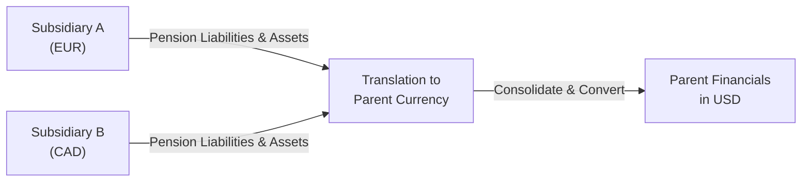

## Introduction
It’s one thing managing a defined benefit pension plan all in one currency—believe me, that’s already complicated—but add multiple currencies into the mix and you’ll quickly realize you’ve got an entirely new challenge. I remember working with a multinational that had a major pension fund in euros while its parent entity reported in U.S. dollars. And wow, every time that exchange rate bobbed up or down, the plan’s funded status seemed to shift in ways that just didn’t match the day-to-day economic reality. It felt like you were trying to balance on one of those seesaws that tips drastically at the slightest movement.  

In this section, we’ll explore the interplay between pension accounting and foreign exchange (FX) translation. We’ll dig into how multi-currency pension obligations show up on consolidated financial statements, how discount rates might differ by region, and how translation or remeasurement can send certain gains or losses either through net income or other comprehensive income (OCI). Ultimately, the goal is to help you be well prepared for any multi-step pension + FX question that might show up in a CFA Level II vignette.

## The Complexity of Multi-Currency Pensions
Multinational organizations often sponsor defined benefit plans in different countries, each with its own currency, regulatory environment, and discount rate assumptions. Pension assets, liabilities, and periodic costs are typically measured in the subsidiary’s functional currency before being consolidated in the parent’s reporting currency. So, if you have a Brazilian subsidiary using the Brazilian real, a European subsidiary using the euro, and a Canadian subsidiary using the Canadian dollar—all of these need to be converted to the parent’s reporting currency for presentation in a single set of financial statements.

The big question is: “How do currency fluctuations stake their claim on the numbers?” Enter the concepts of translation (for IFRS’s current rate method) and remeasurement (for the U.S. GAAP temporal method in specific circumstances). These adjustments can significantly alter the parent company’s consolidated figures, affecting not just pension expense but also how total assets and liabilities appear on the balance sheet.

## Functional vs. Reporting Currency
An essential starting point is determining each subsidiary’s functional currency versus the overall reporting currency of the parent.  

• Functional currency: The currency of the primary economic environment in which the subsidiary operates. This is the currency the subsidiary uses for daily transactions, payroll, sales, etc.  
• Reporting currency: The currency in which the parent presents its consolidated financial statements to external stakeholders.  

Why this matters? Because the pension sponsor (i.e., the subsidiary) will record all its pension-related items (like the Present Value of Defined Benefit Obligation and the fair value of plan assets) in its functional currency. During consolidation, the parent will translate these amounts into the reporting currency. Changes in exchange rates can magnify or mask actual changes in the underlying pension plan’s funded status.

## Translation vs. Remeasurement
If you’ve spent time studying foreign operations, you know that IFRS typically uses the current rate method for foreign subsidiaries whose functional currency differs from the parent’s reporting currency. Under the current rate method:

• Assets and liabilities are translated at the spot rate at the balance sheet date.  
• Revenues and expenses are translated at the average rate over the period.  
• Translation adjustments generally go into OCI, making them part of the cumulative translation adjustment (CTA) in shareholders’ equity.

By contrast, if the subsidiary’s functional currency is the same as the parent’s reporting currency (or if the subsidiary’s books are kept in a non-functional currency), U.S. GAAP’s temporal method might trigger remeasurement. Under remeasurement:

• Monetary assets and liabilities get remeasured at the current exchange rate.  
• Nonmonetary items are remeasured at historical rates.  
• Remeasurement gains/losses bypass OCI and go directly into the income statement.

When it comes to pensions, the liability side is considered a monetary item because it represents a series of future payments. The plan assets, meanwhile, usually consist of various securities, some of which might be treated as monetary assets (like bonds) but others not (like property or equity securities). If you’re under IFRS, most pension-related translation adjustments end up in OCI. If you’re using the temporal method under U.S. GAAP, remeasurement differences may go through net income—thus causing more volatility in reported earnings.

## Discount Rates Across Jurisdictions
Another headache? Each subsidiary might apply a different discount rate based on local high-quality corporate bond yields or government bond rates. So, let’s say your European pension plan uses a discount rate of 2.5% (reflecting the European Central Bank’s environment), while your Canadian plan uses 3.2%. Not only do these differences affect the calculation of the pension liability in each region, but currency shifts can also amplify or dampen the differences when you consolidate everything at the parent level.

Imagine a scenario where interest rates in the Eurozone spike suddenly, pushing up the discount rate from 2.5% to 3.5%. That alone might lower the euro-denominated pension liability. But at the same time, if the euro is depreciating against the U.S. dollar, the consolidated liability might shrink even more from a U.S. dollar standpoint—possibly obscuring what’s really going on in the underlying pension economics.  

## Actuarial Gains and Losses in the Multi-Currency Context
Both IFRS (IAS 19) and U.S. GAAP (ASC 715) allow or require certain actuarial gains and losses to be recognized immediately in other comprehensive income (although U.S. GAAP provides an option to amortize prior service costs or corridor amounts). Whatever the approach, these actuarial gains/losses—arising from changes in mortality assumptions, wage growth estimates, or discount rates—are denominated in the local currency. So, for example, a Swiss subsidiary might record an actuarial loss of CHF 2 million. After consolidating in U.S. dollars, that might become $2.2 million at one exchange rate or $1.9 million at another.  

The result: the timing of your currency translations can turn your IFRS or U.S. GAAP pension line items in OCI into a bit of a moving target. You might see these items labeled in footnotes as “pension-related translation adjustments,” or you might just see more volatility in the “pension re-measurement” line within OCI from period to period.

## Impact on Ratios
Pension obligations and plan assets are often large, so multi-currency pension fluctuations can really move the needle on key ratios. Here are a few areas to keep an eye on:

• Debt-to-Equity: If underfunded pension liabilities become larger after translation, effectively your “debt” or total liabilities are higher—so your D/E ratio goes up.  
• Return on Assets (ROA): Pension assets may appear bigger or smaller post-translation, skewing the absolute level of total assets on your balance sheet.  
• Operating Profit Margin: If pension expense or remeasurement hits net income under the temporal method, margins can be unexpectedly volatile.  

In short, analyzing a global corporation’s financial statements means potentially dealing with exchange-rate-driven illusions of either pension deterioration or improvement. Sometimes the pension is actually the same in local terms, but currency swings can mislead your initial ratio analysis.

## Common Pitfalls
One pitfall is forgetting that not all pension items might be translated at the same exchange rate. The mismatch between the average rate used for pension expense, the spot rate used for net liabilities, and historical rates for certain nonmonetary components can lead to confusion. Also, you might see that IFRS or U.S. GAAP disclosure lumps pension translation adjustments in with all other translation adjustments—making it tricky to dissect the specific effect of currency swings on the pension plan alone.

Another challenge is the multi-step calculations often tested in CFA vignettes: you may need to figure out the euro-denominated pension obligation at a certain discount rate, convert it to dollars at the current spot rate, and then account for an additional remeasurement gain in net income if the plan is viewed as a monetary asset. You might also include a hypothetical 1% shift in the discount rate that changes the liability, after which you recalculate the translated liability. Practice these steps thoroughly with a tabular approach to keep track of each piece of data.

## Example of a Multi-Subsidiary Pension Translation
Let’s do a tiny case study—though a real exam question could be more involved:

• Subsidiary A (based in Germany, functional currency EUR)
  - Pension Liability: €50 million  
  - Discount Rate: 2.5%  
  - Plan Assets: €40 million  
• Subsidiary B (based in Canada, functional currency CAD)
  - Pension Liability: C$60 million  
  - Discount Rate: 3.0%  
  - Plan Assets: C$50 million  

Parent’s reporting currency: USD

Spot exchange rates:  
• €1.00 = $1.10  
• C$1.00 = $0.75  

Translated figures for each subsidiary’s funded status:

• Subsidiary A funded status in USD = (€40 million − €50 million) × $1.10  
  = (−€10 million) × $1.10  
  = −$11 million  

• Subsidiary B funded status in USD = (C$50 million − C$60 million) × $0.75  
  = (−C$10 million) × $0.75  
  = −$7.5 million  

Combined total funded status for the parent in USD: −($11 million + $7.5 million) = −$18.5 million.  

If the euro or Canadian dollar fluctuates significantly, that total deficiency could sway up or down, even though in local terms, everything is exactly the same.  

## Visual Overview
Below is a simple Mermaid diagram that illustrates how multiple subsidiaries’ pension amounts flow into a parent company’s consolidated financial statements:

This diagram highlights how each subsidiary’s pension data (in local currency) is translated into the parent’s reporting currency before being consolidated into final statements.

## Best Practices and Critical Thinking
• Look carefully at footnotes. Companies usually disclose the currency breakdown of their pension obligations in the pension footnotes or in the multi-currency disclosures.  
• Evaluate discount rate assumptions. Pay attention to how management changes these rates and whether the changes are in line with local market movements.  
• Distinguish between translation (under IFRS) and remeasurement (under U.S. GAAP). Remember which adjustments affect net income versus OCI.  
• Assess ratio distortions. If currency swings significantly, re-cast the ratio analysis in local currency to see the “real” trend.  
• Know your exam question cues. Item sets might bundle a currency spurt with a discount rate change, testing your ability to do multiple small computations in one sequence.  

## KaTeX Formula for Funded Status
At its core, the funded status always starts with:


\text{Funded Status} = \text{Fair Value of Plan Assets} - \text{Projected Benefit Obligation}.


But keep in mind that each of these components may be denominated in a different currency, and that’s where translation or remeasurement rules come into play.

## Conclusion
When analyzing multinational corporations, pension accounting can become a puzzle of local insurance regulations, discount rate assumptions, mortality tables, and currency translation. The best way to prep for exam day is to practice multi-step problems that combine FX and pension specifics. Seriously, practice putting yourself in the shoes of an analyst who needs to piece together all that numeric data from the vignettes. The exam loves to test your ability to juggle these variables under time constraints, so keep a calm head and remember your translation rules.

At the end of the day, we want to see through any currency illusions to find the underlying economic reality of the pension plan. Is it severely underfunded? Or is it just a quirk of the exchange rate at the reporting date that’s making it look worse? Understanding these nuances is what will set you apart as a savvy CFA candidate—and eventually, a seasoned finance professional.

## References and Further Reading
• IAS 19 “Employee Benefits” (IFRS): https://www.ifrs.org/issued-standards/list-of-standards/ias-19-employee-benefits/  
• FASB ASC 715 “Compensation—Retirement Benefits”: https://asc.fasb.org/  
• “CFA® Program Curriculum, 2025 Edition” for integrated examples of currency translation in pension accounting  
• IFRS Foundation’s official website for further guidance on multi-currency pension plan disclosures: https://www.ifrs.org/  

## Test Your Knowledge: Pensions and FX Interactions



### A multinational corporation reports its consolidated financial statements in USD. One of its subsidiaries operates in a euro-denominated environment. Under IFRS, which method typically applies to translating the subsidiary’s financial statements into USD?
- [ ] Temporal method
- [x] Current rate method
- [ ] Monetary/nonmonetary method
- [ ] Remeasurement method

> **Explanation:** IFRS generally uses the current rate method for translation when the functional currency of the subsidiary differs from the reporting currency of the parent.

---

### A German subsidiary has a pension liability of €200 million, where the discount rate is 2%. The parent reports in USD. When the euro weakens significantly, which of the following is most likely to happen under the current rate method?
- [ ] The pension liability in local terms increases significantly.
- [x] The consolidated pension liability in USD decreases.
- [ ] The consolidated pension liability in USD remains the same.
- [ ] The pension liability shifts into net income rather than OCI.

> **Explanation:** If the euro depreciates versus the USD, the translated pension liability in USD terms appears smaller, even if the local liability has not changed.

---

### Under the temporal method (U.S. GAAP) when a subsidiary’s functional currency is the same as the parent’s reporting currency, pension-related remeasurement gains and losses:
- [x] Typically affect net income.
- [ ] Are always recorded in OCI.
- [ ] Have no effect on the parent’s financials.
- [ ] Must be deferred until the liability is settled.

> **Explanation:** Under the temporal method, monetary items such as pension obligations are remeasured at the current rate, and gains/losses flow through net income, not OCI.

---

### A pension plan in Country X (functional currency = Xdollar) experiences an actuarial loss of Xdollar 10 million. The exchange rate at the date of recognition is 1 Xdollar = $0.70. How much would you initially record in OCI if IFRS classifies the actuarial loss in OCI?
- [x] $7 million
- [ ] $10 million
- [ ] $3 million
- [ ] The amount is recognized in net income, not OCI

> **Explanation:** Under IFRS, actuarial losses are recognized immediately in OCI. The local actuarial loss of 10 million is translated at 0.70, yielding $7 million.

---

### The funded status of a UK subsidiary is measured as GBP 5 million of plan assets minus GBP 8 million of PBO. With a spot rate of 1 GBP = $1.25, what is the funded status of this plan on the parent’s consolidated balance sheet?
- [x] –$3.75 million
- [ ] –$5.75 million
- [ ] –$2.50 million
- [ ] $3.00 million

> **Explanation:** Funded status = (5 – 8) = –GBP 3 million. Multiply by $1.25 for –$3.75 million.

---

### Which of the following best describes why discount rates can vary for pension plans in different countries?
- [ ] Companies prefer to show lower liabilities.
- [ ] All countries follow a single global discount rate mandated by IFRS.
- [ ] Governments set discount rates arbitrarily across regions.
- [x] Each subsidiary typically uses a rate reflective of local high-quality bond yields.

> **Explanation:** IAS 19 and U.S. GAAP guidance generally require companies to use a discount rate that reflects yields of high-quality corporate bonds (or government bonds where relevant), which differ across regions.

---

### When analyzing debt-to-equity ratios for a multinational firm, why is it important to look beyond the IFRS consolidated figure to the local-currency statements?
- [ ] Local statements are always more accurate than consolidated ones.
- [ ] IFRS requires that all local currency data be ignored.
- [x] Currency effects can distort the apparent magnitude of liabilities and equity.
- [ ] Consolidated figures only consider monetary assets and liabilities.

> **Explanation:** Exchange rates can make liabilities and equity appear higher or lower than their true economic reality, so it helps to look at local-currency statements to understand actual changes.

---

### Which of the following is least likely to result in an immediate income statement impact under IFRS?
- [ ] A pension remeasurement gain recognized under the temporal method in U.S. GAAP
- [x] A pension translation adjustment in OCI due to FX changes
- [ ] A pension curtailment gain recognized during the period
- [ ] A change in the discount rate that affects interest cost in the income statement

> **Explanation:** IFRS typically sends translation adjustments to OCI, avoiding an immediate income statement impact, whereas a curtailment gain or discount rate changes might affect the income statement.

---

### An analyst wants to separate the actual economic changes in a subsidiary’s pension plan from the effects of currency shifts. Which approach would be most effective?
- [x] Evaluate the plan’s funded status in local currency terms over time.
- [ ] Only examine the parent’s consolidated financial statements.
- [ ] Convert pension figures using an average rate for the entire year.
- [ ] Treat the pension items as purely nonmonetary.

> **Explanation:** By focusing on local currency figures, an analyst can strip out the FX fluctuations and see if the plan’s real funded status is improving or deteriorating.

---

### True or False: Under IAS 19, all actuarial gains and losses must be recognized through net income immediately.
- [ ] True
- [x] False

> **Explanation:** IAS 19 generally requires that actuarial gains and losses be recognized in OCI, not net income, although these amounts are typically never recycled from OCI to net income in future periods.


