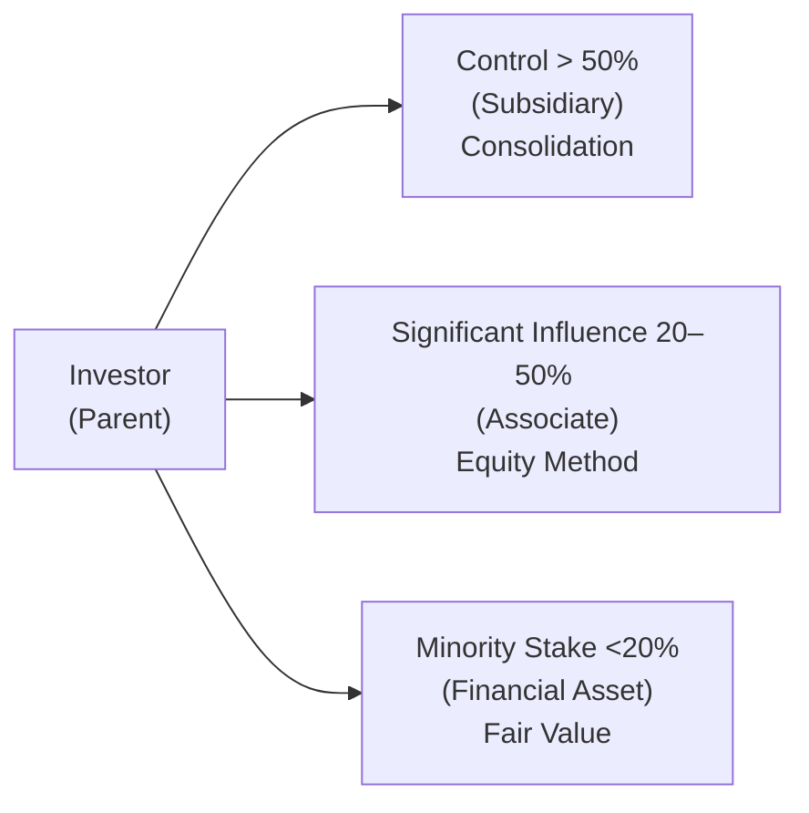

## Introduction

Sometimes, when I talk to colleagues or friends about intercorporate investments—particularly the complexities of consolidating foreign subsidiaries—it feels like we’re traveling down a rabbit hole of definitions, partial ownership percentages, currency conversions, consolidated goodwill, you name it. Yet, these details are hugely important in understanding how to interpret financial statements from a global perspective. For the CFA Level II exam, you can expect to see at least a few item-set questions that blend these elements: partial or full ownership, varied functional currencies, and so on. Let’s take a closer look.

## The Spectrum of Accounting Methods

If you recall your earlier studies, companies can account for intercorporate investments under three primary methods: consolidation, equity method, or fair value (sometimes available-for-sale or through profit or loss, depending on IFRS or US GAAP subcategories).

To help visualize the different methods and ownership thresholds, see the following diagram:

• Under Consolidation, you combine almost everything—assets, liabilities, revenues, and expenses—of the subsidiary with the parent’s statements. Intercompany transactions are eliminated, because from the perspective of the consolidated entity, transactions among affiliates “cancel out.”  
• Under the Equity Method, the investor recognizes a single-line “Investment in Associate” account on the balance sheet and picks up a proportionate share of the associate’s net income on the income statement.  
• Under Fair Value (or sometimes cost method if no readily determinable fair value is available), changes in the investment’s fair value are recognized either in net income or Other Comprehensive Income (OCI), depending on classification and the accounting regulations in effect.

What’s crucial here is understanding how these methods can shift if ownership interest changes, or if the investor’s level of influence changes (for instance, if you move from a 19% stake to a 25% stake, you might jump from fair value to equity method).

## Partial vs. Full Ownership Implications

Things get extra interesting when you own between 50% and 100% of a subsidiary. Suppose you acquire 80% of a foreign subsidiary. Under IFRS 10 or FASB ASC 810, you still consolidate as if you own 100% of it, but you present a separate noncontrolling interest (NCI) for that other 20%. Anyway, you might remember from prior discussions that NCI is classified as a separate equity line item on the consolidated balance sheet.

Sometimes, you’ll run across partial goodwill methods (like IFRS’s choice between full goodwill and partial goodwill) vs. the traditional full goodwill method. With partial goodwill, you measure the goodwill for only the portion of the subsidiary you actually own. Meanwhile, US GAAP basically requires full goodwill (though they call it simply “goodwill”), which is measured as if you had purchased 100% of the subsidiary, then allocate the part you don’t own to the NCI. Don’t worry—on the exam, they typically specify which method is used, so read those footnotes carefully.

It’s not uncommon for exam questions to mention that the subsidiary is located in a different country. The currency translation aspect will affect the noncontrolling interest, equity, and potentially the goodwill, which we’ll talk about next.

## Goodwill in a Foreign Subsidiary

Let’s say you just acquired a foreign subsidiary in a business combination. Among IFRS folks, the general stance is that goodwill is considered an asset of the foreign entity. Thus, it’s translated at the current exchange rate (the rate at the reporting date). If the exchange rate fluctuates significantly, your recognized goodwill on consolidation might bounce around from year to year—at least in your presentation currency.

Under US GAAP, you might see differences in the way goodwill impairment is tested. There’s a two-step or single-step approach (depending on which era of GAAP you get tested on, as the rules have changed a few times in recent years). IFRS also uses a single-step approach by measuring the recoverable amount for a cash-generating unit. The big point for the exam: IFRS typically lumps goodwill with the foreign subsidiary, so it’s subject to translation differences. US GAAP might do that similarly but watch for the possibility that the impairment test is carried out at a “reporting unit” level, which can alter how the currency translation factors in.

And you know, the real challenge often comes in analyzing how these goodwill amounts—once recorded—interact with consolidated income statements if an impairment arises. Under IFRS, an impairment hits your income statement in one lump sum. Good times, right?

## Joint Ventures with Different Functional Currencies

Joint ventures can be accounted for under the equity method (common under both IFRS and US GAAP). If you hold, say, a 30% stake in a JV that’s based in a country with a volatile currency, the equity method requires you to show your share of JV net income as a single line in your income statement. But that net income amount is determined in the JV’s functional currency, which then must be translated into your presentation currency. So be mindful that you can have both operational performance variation and currency translation fluctuations messing with your recognized earnings. 

Under IFRS, certain joint arrangements might even require proportionate consolidation. This means you literally take your proportionate share of each line item (assets, liabilities, revenues, expenses) of the JV. This is less common in practice but absolutely can show up on the exam in a complex item set. Proportionate consolidation can cause more dramatic swings in ratio analysis (like leverage ratios) because you’re bringing in part of the JV’s debt, for instance.

## Elimination of Intercompany Transactions Across Currencies

Let’s say you have an intercompany sale of some product from a subsidiary in Brazil to a parent in the United States, all consolidated in a US-dollar presentation currency. The parent recognizes a cost of goods sold in USD, the sub recognizes revenue in BRL, but on consolidation, you have to eliminate the entire transaction. The twist, of course, is the exchange rate. Possibly the sale occurred at a certain spot rate, but at period-end, payables and receivables might get remeasured at the closing rate. So the gain or loss recognized on the currency remeasurement might need to be removed in the consolidation. 

A typical exam pitfall is not noticing that the remeasurement gain or loss from the sub’s perspective was recognized in the sub’s functional currency. If you only partially eliminate the transaction, you’re missing the foreign exchange effect. So keep an eye on whether the exam vignette instructs you to remove the entire intercompany gain or if you must consider partial ownership and only remove the portion that affects the parent’s share.

## Implications for Ratio Analysis and Forecasting

When you see consolidated statements that combine subsidiaries in multiple currencies, certain ratios might mask deeper issues or inflated results. Maybe you see relatively stable earnings overall, but that’s only because a large portion of your operations in a foreign currency had big gains that offset domestic losses. If exchange rates revert, your consolidated net income could suffer big time.

When you’re doing a forecast, or reading a Level II item set question that wants you to project consolidated statements out a few years, you’ll want to see if management’s assumptions about exchange rates are realistic. Also, check the segment notes (good old IFRS 8 or US GAAP segment reporting) for a breakdown by geographic region. That can show you which segments are actually delivering real growth vs. which ones are just getting a boost from a weakening home currency, for instance.

## Large vs. Small Holdings: Fair Value vs. Equity Method Volatility

When you hold less than 20% and you mark the investment to fair value, your earnings from that investment might be recognized in net income if classified as FVPL (Fair Value Through Profit or Loss) or in OCI if classified as FVOCI (Fair Value Through Other Comprehensive Income) under IFRS. US GAAP, in many cases, just records it in net income unless it’s an equity security with no readily determinable fair value, in which case the cost method or a measurement alternative is used. Let’s be frank: This can get complicated. And that’s exactly what the test might explore.

Beyond that, if the local currency has been strengthening and your investment’s local share price has been rising, your recognized gains could be doubly amplified. One sneaky exam question might require you to parse out how much of the gain was from the underlying price increase vs. from currency changes, especially if the standard used calls for remeasurement in net income.

## Exam Tip: Watch for “Combination” Scenarios

Um, if there’s one big piece of advice for exam day: watch out for combination vignettes that do everything at once—like partial goodwill, noncontrolling interest, and a foreign currency remeasurement. The key is methodically stepping through each footnote. Look at the consolidation method used, see if the exchange rates are given for each relevant date, and check if the question references partial ownership. They love to test your ability to see who owns what. Are we ignoring the NCI or forgetting to remove an intercompany sale? The devil is in those footnote details.

## Key Glossary (Quick Recap)

• Consolidation Method: Present the parent and subsidiary as one entity, eliminating intercompany transactions.  
• Equity Method: Single-line investment approach for associates (typically 20–50% ownership and significant influence).  
• Noncontrolling Interest (NCI): The portion of a consolidated subsidiary not owned by the parent, shown as separate equity.  
• Goodwill: Excess of purchase price over the fair value of identifiable net assets in a business combination.  
• Impairment Testing: Determining if an asset’s carrying value exceeds its recoverable amount (IFRS) or fair value (US GAAP).  
• Proportionate Consolidation: IFRS approach for some JVs, recording the investor’s share of each line item.  
• Business Combination: A transaction where an entity obtains control of another.  
• Elimination Entries: Removal of intercompany transactions from consolidated financial statements.

## Concluding Thoughts

Consolidation can feel intimidating, but the more time you spend piecing it all together, the more the puzzle starts to make sense. My advice: Practice comprehensively. On exam day, you don’t want to be tripped up because you forgot about a partial goodwill approach or a sneaky foreign currency remeasurement. Stay alert!

## References and Further Reading

• IFRS 10 “Consolidated Financial Statements”: https://www.ifrs.org/  
• IFRS 3 “Business Combinations”: https://www.ifrs.org/  
• FASB ASC 810 “Consolidation”: https://asc.fasb.org/  
• “CFA® Program Curriculum, 2025 Edition” for advanced intercorporate investment examples  

## Test Your Knowledge: Intercorporate Investment & Consolidation Quiz



### When does a company typically use the equity method instead of consolidation?
- [ ] When it owns 10% of the investee’s outstanding shares.
- [ ] When it owns more than 50% of the investee’s outstanding shares.
- [x] When it can exert significant influence, generally around 20–50% ownership.
- [ ] Only when the investee prepares financials under the same GAAP as the investor.

> **Explanation:** The equity method is generally used when the investor has significant influence (often tied to an ownership range of 20–50%). Over 50% typically means control, requiring consolidation.

### How is a noncontrolling interest (NCI) reported under IFRS when the parent owns 80% of a subsidiary?
- [ ] As a liability on the consolidated balance sheet.
- [ ] As a contra-asset against long-term investments.
- [ ] Combined with parent equity because NCI does not require separate disclosure.
- [x] As a separate equity component in the consolidated financial statements.

> **Explanation:** IFRS requires presenting a noncontrolling interest as part of consolidated equity, separate from the parent’s equity. NCI reflects the ownership interest that is not owned by the parent.

### Under the partial goodwill method (IFRS), goodwill is:
- [ ] Always recognized at 100% of the implied goodwill, even if the parent’s ownership is less.
- [x] Recognized only for the percentage of the subsidiary that the parent owns.
- [ ] Allocated to the noncontrolling interest and not recognized by the parent.
- [ ] Recognized as a prior-period adjustment in retained earnings.

> **Explanation:** Under partial goodwill, only the portion of goodwill corresponding to the parent’s ownership stake is recognized. It’s an option under IFRS, while US GAAP follows a full goodwill approach.

### A parent charges its wholly owned foreign subsidiary for management fees. At year-end, before consolidation, the subsidiary records an expense. What happens upon consolidation?
- [x] The fee revenue and related expense are eliminated in full.
- [ ] The fee revenue remains but is reclassified as “other income.”
- [ ] Only 50% of the revenue and expense are eliminated under IFRS.
- [ ] The fee is offset against goodwill.

> **Explanation:** Intercompany revenues, expenses, receivables, and payables are fully eliminated. From the consolidated viewpoint, the transaction is internal and should not affect overall Net Income.

### Which statement best describes the effect of foreign currency translation on goodwill under IFRS?
- [x] Goodwill is considered an asset of the foreign subsidiary and translated at the current rate.
- [ ] Goodwill remains at historical cost and is not translated.
- [ ] Goodwill is recognized in OCI only, avoiding any net income impact.
- [ ] Goodwill is remeasured to historical rates each period.

> **Explanation:** IFRS views goodwill arising from a foreign subsidiary as part of that foreign entity’s net assets, so it is translated using the current exchange rate at each reporting date.

### When an investor applies the equity method, how does a depreciation adjustment of the associate’s assets affect the investor’s share of income?
- [ ] It has no effect on the investor’s share of income.
- [x] It decreases the investor’s share of reported income if the associate’s asset fair value exceeded carrying value at acquisition.
- [ ] It only affects dividends paid out by the associate.
- [ ] It appears as an OCI reclassification.

> **Explanation:** If the associate’s fair values differ from book values at acquisition, the investor must adjust its share of income for additional depreciation or amortization, thus reducing the investor’s reported equity income.

### Which accounting method typically introduces the greatest volatility to net income for a minority interest (<20%) investment?
- [x] Fair Value Through Profit or Loss (FVPL).
- [ ] Equity Method.
- [ ] Consolidation.
- [ ] Proportionate Consolidation.

> **Explanation:** With FVPL, changes in the investment’s market value hit net income directly each period, creating more volatility than the equity method or consolidation for a small (<20%) stake.

### In proportionate consolidation of a joint venture under IFRS:
- [ ] The investor recognizes the JV assets and liabilities at 100% on its balance sheet.
- [x] The investor recognizes its share of each line item of the JV’s assets and liabilities.
- [ ] The investor only consolidates revenue and expense line items, but not assets or liabilities.
- [ ] A noncontrolling interest is required.

> **Explanation:** Proportionate consolidation records the investor’s share of each asset, liability, revenue, and expense line of the JV, rather than the total amounts or a single-line stake.

### Which of the following is typically the most challenging aspect of consolidating a foreign subsidiary?
- [x] Managing foreign currency translation of balance sheet and income statement, including goodwill.
- [ ] Determining whether the parent has control.
- [ ] Eliminating intercompany transactions that are all denominated in the parent’s currency.
- [ ] Reporting the parent’s home country GAAP earnings.

> **Explanation:** While determining control (over 50%) is usually straightforward, applying foreign currency translations for assets, liabilities, and goodwill can be highly complex and is often tested in exam scenarios.

### The “balance in CTA (Cumulative Translation Adjustment)” typically arises under the current rate method. True or False?
- [x] True
- [ ] False

> **Explanation:** Under the current rate method, the translation of the subsidiary’s statement of financial position and income statement to the parent’s presentation currency can lead to differences recognized in the CTA, part of OCI on the consolidated balance sheet.


