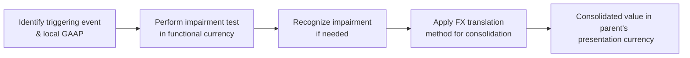

## Cross-Topic Scenarios
Sometimes, you open a CFA Level II practice exam and, well, you’re greeted with a monster vignette that seems to combine everything but the kitchen sink: you see references to share-based compensation, foreign currency translation differences, intangible asset impairments, maybe throw in a pinch of pension expense, and—just for fun—some portion of inventory that was written down earlier in the year. It can feel overwhelming. But here’s the catch: the CFA exam often tests how well you can connect these dots and recognize how each area affects another. Being aware of common overlaps is your secret sauce.

Exam-wise, these integrated vignettes reflect the real-world reality that financial statements are not neatly compartmentalized. They’re messy. And a currency translation adjustment in one subsidiary might bump up or down your consolidated equity, which in turn might impact ratios like running leverage or times-interest-earned. So, read carefully and try to piece together how each disclosure or footnote nuance will shape your ultimate analysis of the firm’s performance and financial position.

## Red Flags in Consolidated Ratios
At Level II, ratios get complicated when consolidation or equity-method accounting is involved. Picture a holding company with multiple subsidiaries located across different continents. One subsidiary might have a significant pension deficit, while another just recognized an intangible asset impairment. Together, these developments can distort everything from EBIT to equity and even the debt-to-equity ratio. 

It’s critical to dissect what’s driving any major fluctuation in consolidated numbers:

• Pension Deficits: Under both IFRS and US GAAP, these can morph into large liabilities on the consolidated balance sheet, lowering equity and, in turn, inflating leverage ratios.  
• FX Translation Losses: Struggling foreign currencies can create big hits in other comprehensive income (OCI) or directly in net income, depending on the translation method (temporal vs. current rate).  
• Intangible Impairments: Write-downs of intangibles reduce assets and profits in the period recognized. IFRS typically tests “recoverable amount,” while US GAAP relies on more prescriptive impairment steps.  

Watch for these red flags: significant changes to interest coverage (EBIT/Interest) or big drops in equity that wouldn’t seem obvious from normal operating activities. Often, you’ll find the culprit in pension disclosures or intangible notes.

## Analyzing Footnotes for Clues
In my early days, I remember poring over financial statements of a multinational tech firm. I was about to skip the footnotes (who reads the footnotes, right?), but something caught my eye: a tiny line about pension obligations in South America. That one footnote revealed that the firm’s key pension plan was drastically underfunded—and guess what? The currency in that region had nosedived, meaning the firm had to revalue assets and liabilities while factoring in hyperinflation. That discovery was crucial to understanding the firm’s consolidated picture.

The lesson? Exam item sets typically mimic that reality. So do yourself a favor:  
• Read those footnotes thoroughly.  
• Look at segment or geographical disclosures.  
• Keep an eye on any references to multiple accounting standards used in different jurisdictions.  

Often, a single footnote might mention a foreign subsidiary’s intangible asset or revaluation model, plus a discussion about that same subsidiary’s share-based plan for employees. That’s your cue the exam will expect you to parse how IFRS vs. US GAAP rules apply or how to handle the remeasurement sequence (do you apply the currency translation first or the intangible asset impairment test first?).

## IFRS vs. US GAAP Differences in Combined Areas
You probably remember a whole bunch of IFRS and US GAAP distinctions from earlier chapters. However, under exam conditions, you might see them pop up in the same item set. Let’s say you have both a pension liability scenario (Chapter 7 or 8) and a consolidation scenario (Chapter 4 or 5). IFRS might allow immediate recognition of certain adjustments in OCI, while US GAAP might spread them out over multiple periods. This difference alone can lead to drastically different net income or equity numbers at consolidation time.

A few prime examples:

• Pension Recognition:  
  – IFRS: Current service cost and past service cost go to the income statement immediately. Remeasurements (actuarial gains/losses) typically go to OCI and stay there.  
  – US GAAP: It’s a bit more complicated, with the corridor method and amortization of certain remeasurements.  

• Capitalized Development Costs:  
  – IFRS: Development costs can be capitalized once certain conditions are met.  
  – US GAAP: Research and development are expensed (except for software dev costs under certain criteria).  

• Translation Differences for Consolidated Entities:  
  – IFRS: IFRS might handle hyperinflationary economies differently (IAS 29).  
  – US GAAP: Generally will use the temporal method in hyperinflationary environments.  

When these differences co-occur, you need to know which standard the company is using for each item. If you answer IFRS-based calculation questions with a US GAAP perspective (or vice versa), you’ll be off the mark.

## Consolidation vs. Equity Method in the Context of Pensions
Another classic overlap is how pension deficits are accounted for when you hold an associate or joint venture. Under the equity method, your share of the associate’s net income (and net assets) includes your portion of their pension expense and liability. A sizable pension deficit on the associate’s books might reduce the carrying value of your investment significantly. 

By contrast, if you fully consolidate the subsidiary, the pension deficit shows up as a direct liability on the group’s balance sheet. So from a ratio perspective, going from equity method to full consolidation can dramatically alter reported leverage, return on equity, or even your coverage ratios. Keep that in mind anytime you see a question that shifts a company’s shareholding from significant influence (equity method) to control (full consolidation).

## Priority of Adjustments in a Multi-Topic Framework
One of the biggest pitfalls that can catch you off guard on exam day is the sequence of events in multi-step adjustments. For instance, do you handle impairment first or do you do the currency translation first? Generally, you:

1. Determine the asset’s recoverable amount in the local (functional) currency.  
2. Test for impairment according to IFRS or US GAAP guidelines.  
3. Recognize any impairment in local currency.  
4. Then apply the translation method to consolidate the result into the parent’s reporting currency.

The reason: impairment is often a local-currency-based test, so you want a correct local-currency carrying amount before you translate anything. Missing these steps in the correct order can lead to an incorrect final value on the consolidated statements.

Below is a basic diagram to illustrate how multiple adjustments might flow. 



It might look a bit linear, but in real life you might have to also consider remeasuring pension obligations in that same currency. Not to scare you—just be systematic.

## Exam Tip: Synthesis Is Key
When I was first tackling Level II, I used to treat each topic as its own island, and so I’d stare at a multi-topic vignette in disbelief. My best advice? Start with a mental or written checklist. Something like:

1. Identify each major topic in the vignette (Currency translation? Pension? Impairment?).  
2. Pinpoint whether IFRS or US GAAP rules apply (or both!).  
3. Determine if the entity is consolidated, proportionately consolidated, or accounted for under the equity method.  
4. Calculate or project the immediate impact on key statements (Income Statement, Balance Sheet, Equity, OCI).  
5. Check for ratio implications (EBIT, leverage, coverage).  

Exam questions often revolve around how these interplay. The question might say, for instance, “Following an impairment adjustment and the remeasurement of the subsidiary’s pension plan, which ratio is most impacted?” or “Under IFRS, how would the intangible asset’s carrying value differ from US GAAP after you factor in the currency translation?” So keep your mental map fresh.

## Practical Example: Impairment in a Currency Translation Scenario
Let’s do a quick numeric illustration to see how these steps might roll out in practice. Imagine you have a piece of equipment in a foreign subsidiary:

• Functional currency: 1 foreign currency unit (FCU) = 0.80 USD at the end of the year.  
• Equipment’s carrying amount before potential impairment: 10,000 FCU.  
• Recoverable amount (per IFRS) in local currency after impairment test: 8,000 FCU.  

Hence, the impairment is 2,000 FCU in the local currency. Recognize that impairment there first. Then, you’d translate the new carrying amount (8,000 FCU) to USD at the appropriate rate:


\text{Carrying amount in USD} = 8{,}000 \times 0.80 = 6{,}400 \text{ USD}


If you translated first at 0.80 and then tried to do the impairment in USD, the numbers might get scrambled. So be sure you do it in the correct order.

## Tiny Python Snippet for Checking Consolidated Ratios
Here’s a brief example of how you might model changes in consolidated leverage caused by a new liability from pension deficits (just for illustration; you won’t actually code this in the exam, but it’s a helpful check if you do real-world finance stuff):

```python
equity = 500000
debt = 300000

new_debt = debt + 100000
leverage_ratio_before = debt / equity
leverage_ratio_after = new_debt / equity

print(f"Leverage Ratio Before: {leverage_ratio_before:.2f}")
print(f"Leverage Ratio After: {leverage_ratio_after:.2f}")
```

If you run this, you’d see that leverage ratio climbs from 0.60 to 0.80, highlighting how such an overlap drastically alters your analysis.

## Common Pitfalls and Best Practices
• Not reading footnotes thoroughly. Seriously, so many clues (like intangible asset revaluations or partial goodwill methods) lurk there.  
• Misapplying IFRS vs. US GAAP differences in pensions and intangible assets.  
• Confusing sequence of translation vs. impairment vs. revaluation.  
• Ignoring minority interests (noncontrolling interest) in partial goodwill processes.  
• Overlooking the time-lags (like if a currency translation is recognized each period but an impairment is recognized only once or vice versa).  

The best practice is to slow down, parse each piece of the vignette, and keep an eye out for footnote breadcrumbs.

## Glossary
• EBIT (Earnings Before Interest and Taxes): A core profitability measure that’s susceptible to pension costs, intangible impairments, and currency exchange adjustments.  
• Multi-Topic Vignette: Any exam question (item set) that merges more than one major FSA concept (like pension + intangible assets + currency translation).  
• Footnote Disclosures: A company’s comprehensive explanation of how it applies IFRS, US GAAP, or local GAAP. These typically reveal crucial data (e.g., intangible revaluation in one region, pension plan in another).  
• Associate / Equity Affiliate: An investee over which the investor has significant influence but not full control, applying the equity method.  
• Impairment: A permanent reduction in the recoverable amount of an asset below its carrying value.  
• OCI Reclassification: Movement of certain items out of OCI into net income upon realization or remeasurement.  
• Tier 1 & Tier 2 Adjustments: In the context of banks, regulators measure capital adequacy and sometimes require adjustments for intangible assets or pension deficits.  
• Disclosure Overlap: Places where multiple standards converge and both require specific notes or schedules.

## References & Further Reading
• Revsine, Collins, Johnson, “Financial Reporting and Analysis.” Great resource for these overlapping financial reporting scenarios.  
• CFA Institute official curriculum—particularly the advanced item set structures that combine IFRS and US GAAP rules within a single vignette.  
• IFRS.org and FASB.org for thorough standard interpretations, especially for IFRS 19 (Employee Benefits), IFRS 7 (Financial Instruments disclosures), and various US GAAP ASC guidelines.

--------------------------------------------------------------------------------

## Test Your Knowledge: Common Exam Overlaps in Financial Statement Analysis



### 1. Which of the following best illustrates a multi-topic FSA scenario?  
- [ ] A scenario involving only the calculation of basic EPS.  
- [x] A vignette combining a foreign currency translation adjustment and a pension plan deficit.  
- [ ] A discussion of only intangible assets under IFRS.  
- [ ] A separate statement on just revenue recognition policies.  

> **Explanation:** Multi-topic scenarios often merge at least two major FSA issues, such as currency translation plus a pension liability, or intangible asset impairment plus share-based compensation.

### 2. Under IFRS, when is the impairment of an asset typically recognized if the asset is held in a foreign subsidiary?  
- [ ] After you translate the subsidiary’s balance sheet into the presentation currency.  
- [x] Before applying any currency translation adjustments.  
- [ ] Only if the parent company’s home currency has depreciated significantly.  
- [ ] At the same time as the pension expense remeasurement.  

> **Explanation:** The standard approach is to test for and recognize impairment first in the entity’s functional currency, then perform the currency translation afterward.

### 3. In consolidated financial statements, how does a large pension deficit in a fully consolidated subsidiary usually affect the parent’s leverage ratio?  
- [ ] It has no effect because the deficit belongs solely to the subsidiary.  
- [ ] The leverage ratio decreases because the deficit is reclassified as equity.  
- [x] The leverage ratio increases because liabilities go up while equity remains constant or decreases.  
- [ ] The leverage ratio is unaffected if the parent uses the equity method.  

> **Explanation:** In full consolidation, the parent must include the pension deficit on its balance sheet, thereby increasing total liabilities and raising the debt or liability to equity ratio.

### 4. Which of the following is most likely to create confusion in a multi-topic FSA vignette?  
- [ ] A scenario with intangible assets fully amortized and no currency adjustments.  
- [x] Combining IFRS vs. US GAAP differences, a foreign subsidiary acquisition, and pension accounting methods.  
- [ ] Reading footnotes that only address historical tax rates.  
- [ ] A single standard for all accounting policies.  

> **Explanation:** Potential IFRS and US GAAP discrepancies, multiple geographic segments, and pension plan complexities are classic ways to test a candidate’s ability to handle overlaps.

### 5. A parent company switches from significant influence to full control over a subsidiary with a large underfunded pension plan. Which statement is correct?  
- [x] The pension liability is now shown directly on the consolidated balance sheet rather than only as an equity-method adjustment.  
- [ ] The parent continues to record pension deficits as a footnote only.  
- [x] The parent’s equity method reporting no longer applies.  
- [ ] There is no change in consolidated reporting because the deficit belongs to the subsidiary.  

> **Explanation:** Moving from the equity method to full consolidation means all the subsidiary’s assets and liabilities, including pension deficits, are recognized directly on the parent’s consolidated statements.

### 6. Which scenario can lead to a big drop in EBIT if both IFRS and US GAAP are tested in the same question?  
- [x] An intangible asset impairment accompanied by significant currency translation losses recorded in income under the temporal method.  
- [ ] A small reclassification from OCI to net income for realized gains.  
- [ ] A dividend distribution from a fully consolidated subsidiary.  
- [ ] A share-based compensation plan with minimal expense recognition.  

> **Explanation:** Impairments decrease EBIT, and under certain translation methods (like the temporal method), exchange rate movements for monetary items can also post to income. This combo can cause a large EBIT change.

### 7. In a multi-topic vignette, which footnote disclosure is likely the biggest hint that IFRS vs. US GAAP differences might be tested?  
- [ ] Only a discussion of local tax laws.  
- [ ] A mention of future interest rate assumptions for the next quarter.  
- [x] Statements that the company follows IFRS for intangible assets but uses US GAAP for pension expense in a foreign branch.  
- [ ] A summary of general corporate governance policies.  

> **Explanation:** When a company uses different accounting frameworks for different aspects, that’s a flashing sign the exam might test how those frameworks differ in recognition, measurement, or disclosure.

### 8. In a heightened inflation environment, how might IFRS handle the translation of a subsidiary’s nonmonetary assets?  
- [x] Adjust to current purchasing power before applying the current rate method.  
- [ ] Only translate them at the average rate of the period.  
- [ ] Never revalue nonmonetary assets for inflation.  
- [ ] Translate them after they are written down to zero.  

> **Explanation:** Under IFRS, hyperinflation guidelines (IAS 29) require restatement of nonmonetary items in terms of the current purchasing power, then translation under the current rate method.

### 9. Which of the following best describes the sequence for assessing an intangible asset in a foreign subsidiary under IFRS?  
- [x] Test for impairment in the functional currency → Record impairment → Translate.  
- [ ] Translate to presentation currency → Test for impairment → Reverse impairment if the foreign currency strengthens.  
- [ ] Perform only an annual test for impairment in presentation currency.  
- [ ] Net intangible value is always recognized directly in OCI.  

> **Explanation:** Impairment is evaluated at the local (functional) currency level. After the impairment is recognized, the carrying value is translated to the parent’s presentation currency.

### 10. Is it true or false that the equity method and consolidation can, in practice, yield identical leverage ratios for the parent?  
- [x] True  
- [ ] False  

> **Explanation:** There are circumstances (especially with proportional levels of debt or minimal liabilities in the subsidiary) where the difference between equity-method balances and consolidated totals might not significantly affect leverage. However, in most cases, consolidation vs. equity method will yield differing leverage ratios due to recognition of the subsidiary’s liabilities.


