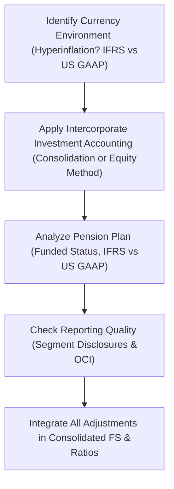

## Introduction and Purpose

So let’s be honest: multiple-factor vignettes can make your head spin if you’re not careful. One moment you’re trying to figure out how changes in currency rates affect foreign subsidiaries; the next, you’ve got to incorporate a pension deficit and intangible assets from a recent acquisition—plus watch for potential reporting shenanigans in other comprehensive income (OCI). But fear not. This section is here to show you how to methodically untangle these interconnected items and nail the exam questions that bring them all together.

The goal is simple: We want to develop a repeatable process—one that ensures accuracy when faced with tricky multi-factor adjustments on the exam. Sometimes, colored pens and highlighters can be your best friend (seriously!). You’ll see how to break down each piece of data from a hypothetical company scenario and systematically build toward the final consolidated financial statements. We’ll also dabble in ratio analysis at the end, to confirm how each adjustment can shift the story the numbers are telling you.

## Step-by-Step Analytical Approach

Picture this: you’re handed a big chunk of data about a multinational parent company, a foreign subsidiary in a hyperinflationary economy, and a new 30% ownership in another entity. Then, oh wait, the parent also sponsors a defined benefit pension plan that’s underfunded. Let’s break down the chaos into manageable steps.

### 1. Identify the Currency Environment

Is the subsidiary in a hyperinflationary economy or just a normal environment? Under IFRS, if you see cumulative inflation approaching or exceeding 100% over three years, that sends you toward special restatement and translation procedures (as guided by IAS 29 and IFRS 21). Under US GAAP, hyperinflation is approached with slightly different mechanics but generally uses the temporal method to remeasure the subsidiary’s financials. 

When it’s not hyperinflationary, you must determine:
• The subsidiary’s functional currency.  
• The parent’s presentation currency.  

Then, choose either the current rate method (if the subsidiary’s functional currency is local) or the temporal method (if the subsidiary’s functional currency is the parent’s currency—or if local currency is not the functional currency). Make sure you note which exchange rates to use for income, balance sheet, and equity items.

### 2. Determine Appropriate Accounting Method for Intercorporate Investments

If the parent owns more than 50% of a subsidiary’s voting shares (or otherwise exercises control), you consolidate. Below 20% but still with the ability to influence, you typically use the equity method. For minority stakes and no significant influence, a fair value approach might apply. The exam might throw a curveball with special purpose entities or variable interest entities that require consolidation. Thoroughly read each footnote for clues:

• Controlling interest? → Consolidate.  
• Joint venture or associate? → Equity method.  
• Pure financial asset? → Fair value or amortized cost, unless designated otherwise.  

### 3. Pinpoint Pension Plan Details

If the vignette gives you a table of pension obligations (PBO or DBO), plan assets, and plan assumptions (discount rate, expected return on plan assets), you can bet it’s relevant. You might see a net pension liability or asset. Under IFRS, net interest is calculated on the net pension liability or asset, while US GAAP typically separates expected return on plan assets from interest cost. Are there unrecognized actuarial gains or losses? Watch for items sneaking into OCI. Also note that if the pension is deeply underfunded, you might have to adjust a leverage ratio or net debt figure.

### 4. Investigate Potential Reporting Quality Red Flags

Do you see any weird line items or footnote disclosures? Are segments reported consistently? Did the company recently change its discount rate for pensions in a way that reduces pension expense suspiciously? Or is there a sudden explosion in intangible asset values that might be an attempt to avoid an impairment?  

These are the type of “red flag” scenarios that can show up in exam questions. A footnote might mention “management performed an internal valuation leading to remeasurement of intangible assets.” That alone isn’t necessarily suspicious, but be on alert for abnormally large revaluation surpluses or intangible churn.  

### 5. Reconstruct the Final Statements

Once you’ve figured out the correct currency translation method, the right consolidation/equity approach, and the pension adjustments, it’s time to carefully weave them together:

• Perform currency translations in the correct order, especially for hyperinflationary environments (first restate for inflation, then translate).  
• Consolidate or use the equity method for the new subsidiary or associate.  
• Reflect pension costs—particularly service cost, interest cost, remeasurements in OCI if IFRS, or recognized items under US GAAP.  
• Adjust intangible assets or goodwill, if there was a business combination.  

Finally, re-check your summations to ensure you haven’t double-counted anything. Keep an eye on other comprehensive income (OCI), where your foreign currency translation adjustments and actuarial gains/losses might show up.

### 6. Reconciling Ratios and Final Output

Now that you’ve got updated numbers, reevaluate your coverage ratios, leverage ratios, profitability measures, and the DuPont decomposition. A small difference in currency translation methodology can drastically change a firm’s return on equity. Similarly, a pension liability recognized on the balance sheet might bloat “long-term liabilities” or reduce “equity,” altering debt-to-equity or interest coverage. Always confirm the final ratio set aligns with the adjusted or pro forma statements.

### 7. Exam Tip—Time Management and Organization

Multi-factor vignettes can get messy quickly, so create a mental (or real) checklist:

1. Identify foreign currency issues.  
2. Gather data for intercorporate investments.  
3. Outline pension plan details.  
4. Watch for red flags (reporting quality).  
5. Consolidate or apply the equity method once.  
6. Re-check intangible assets, goodwill, and any possible impairment.  
7. Recompute final metrics.  

Believe me, it’s easy to get flustered. I still remember that time in my early training days when I spent 15 minutes on the pension exhibit only to realize I had forgotten to convert the subsidiary’s local currency statements. I wasted another 10 minutes reversing everything. So, read carefully and structure your approach from the start.

## Illustrating Goodwill in Consolidation and Pension Liabilities

Let’s say a parent company, Globetek, acquires 60% of a foreign subsidiary, TechEdge, for $20 million. TechEdge has a defined benefit pension plan that’s underfunded by $5 million. We also have intangible assets “valued at fair value” in the acquisition. This scenario is prime ground for multiple adjustments.

• Goodwill:  
  - IFRS and US GAAP both measure goodwill as the excess of the purchase consideration over the acquirer’s share of fair value of net identifiable assets. Under IFRS, you can choose full goodwill or partial goodwill method, while US GAAP typically uses full goodwill.  
  - Factor in TechEdge’s intangible assets: their revaluation at acquisition date may alter the net assets recognized.  
  - You might see a partial goodwill approach (especially in IFRS) where only the parent’s 60% portion of intangible asset fair value is recognized.  

• Pension Deficit:  
  - The $5 million deficit passes onto the consolidated balance sheet. The net pension liability is recognized for the portion you own (though IFRS vs. US GAAP has nuanced differences in how that net obligation is measured and presented).  
  - Changes in the discount rate post-acquisition can shift the recognized obligations. IFRS puts remeasurements directly into OCI. US GAAP can put actuarial gains/losses in OCI, with subsequent amortization.  

When TechEdge is also in a different currency environment—especially if it’s hyperinflationary—then you restate its financials before measuring the final fair values for consolidation. If the environment is just mildly inflationary, you might apply either the current or temporal method.

It’s normal to see both currency translation adjustments and pension remeasurements accumulate in OCI. So you might get that “double whammy” in the equity section, with a potentially large shift in consolidated equity. Don’t let it blindside you—just systematically track what flows into income vs. what flows into OCI.

## Linking Disclosures to Calculations

Vignette footnotes are gold mines. You might see discount rates for pensions set differently in different countries, multiple exchange rates, or a note about controlling vs. noncontrolling interest. Make sure every detail flows into your final answer:

• If a footnote says “management has determined the subsidiary’s functional currency is the local currency,” you know you’ll typically use the current rate method.  
• If the footnote says “the discount rate for pension obligations in Region X is 3%,” highlight that. Is it consistent with the discount rate in Region Y? If not, is there a reason or a potential sign of manipulation?  
• Noncontrolling interest: Evaluate partial or full goodwill. Make sure you properly separate out the portion of net assets not attributed to your parent.  

## Bringing It All Together: A Quick Visual

Below is a simplified diagram illustrating how the multiple factors interconnect before forming the final consolidated statements.

Each arrow represents a “checkpoint.” First, decide the functional currency. Next, confirm your accounting method for investments. Then address the pension situation. Finally, be on alert for any suspicious reporting or segment disclosures, and wrap everything up into the consolidated financial statements and ratio analysis.

## Common Pitfalls and Strategies

• Mixing Methods: A typical mistake is attempting to apply the equity method to a subsidiary you actually control. Not good. Double-check the ownership percentage and the presence of any controlling rights.  
• Overlooking Hyperinflation: If you see mention of extremely high inflation or explicit reference to IAS 29, don’t ignore it. Hyperinflation drastically changes how you restate the subsidiary’s financials.  
• Wrong Exchange Rates: For the temporal method, you use historical rates for nonmonetary assets, including intangible assets. For the current rate method, you use the period-end rate for all balance sheet items—except equity items, which typically remain at historical rates.  
• Pension “Hits” to OCI: With IFRS, remeasurements go right to OCI and remain there (no subsequent recycling). US GAAP approach might yield a further amortization. Watch out for which portion shows up in net income vs. OCI.  
• Not Enough Time: On exam day, you need to triage info quickly. Start by underlining ownership percentages, exchange rates, pension discount rates, and intangible asset valuations. Outline your approach so you track each step.

## References & Further Reading

• IFRS 21 “The Effects of Changes in Foreign Exchange Rates” for rules on functional vs. presentation currency.  
• IAS 19 “Employee Benefits” and FASB ASC 715 for comprehensive guidance on pension accounting.  
• IFRS 3 “Business Combinations” and IAS 36 “Impairment of Assets” for goodwill and impairment integration.  
• Official “CFA® Program Curriculum, 2025 Edition” item-set practice problems that blend currency translation, pensions, and intangible assets.  
• Don’t forget your IFRS vs. US GAAP comparison tables; they’re invaluable references for exam prep.  

---

## Mastering Multiple-Factor Adjustments: Practice Questions



### 1. A parent company owns 55% of a subsidiary located in a country with high but not hyperinflationary conditions. Which translation method will typically be applied if the local currency is determined to be the functional currency?

- [ ] Temporal method using historical exchange rates for all nonmonetary items.  
- [x] Current rate method for balance sheet items and average rate for the income statement.  
- [ ] All assets and liabilities restated for inflation prior to consolidation.  
- [ ] No translation is required since the local currency is the functional currency.  

> **Explanation:** If the local currency is the functional currency and the environment is not hyperinflationary, IFRS and US GAAP direct you to the current rate method. Balance sheet items are translated at the closing rate, while income statement items use the average rate.

### 2. Under IFRS, when a subsidiary operates in a hyperinflationary environment, what is the correct sequence for financial statement adjustments?

- [ ] First translate, then restate for inflation.  
- [ ] Inflation adjustments are not necessary for consolidated financial statements.  
- [x] First restate the subsidiary’s financials for inflation, then translate into the parent’s presentation currency.  
- [ ] There is no difference in procedure for hyperinflationary environments.  

> **Explanation:** For hyperinflationary environments under IFRS, you must restate the local financials for inflation using IAS 29, then translate. This is a unique requirement to ensure amounts are expressed in terms of the measuring unit current at the end of the period.

### 3. A parent owns 25% of an associate. The associate reports a pension deficit of $8 million. Under the equity method, which statement is most accurate?

- [x] The parent’s balance sheet reflects 25% of the pension deficit in the carrying amount of the investment.  
- [ ] The parent has no obligation to report any portion of the pension deficit.  
- [ ] 100% of the associate’s pension deficit is recognized on the parent’s group balance sheet.  
- [ ] The deficit is reported as an off–balance sheet item.  

> **Explanation:** With the equity method, the investor’s balance sheet includes its proportional share of the associate’s net assets, which would factor in the pension deficit proportional to the ownership stake.

### 4. In IFRS-based statements, how are actuarial gains and losses on a defined benefit pension plan generally recognized?

- [ ] Through net income in the same period they arise.  
- [ ] Amortized over the estimated life of employees.  
- [x] Recorded in OCI with no subsequent recycling to profit or loss.  
- [ ] Recognized as a prior-period adjustment to retained earnings.  

> **Explanation:** Under IAS 19, remeasurements (actuarial gains and losses) for defined benefit plans are recognized in OCI and remain there, not recycled back into profit or loss.

### 5. The parent company acquired 60% of a target’s net assets for $50 million. The fair value of the target’s identifiable net assets was $70 million on acquisition. Under partial goodwill (IFRS), how is goodwill calculated?

- [ ] $20 million (full goodwill method).  
- [x] $10 million (parent’s share of excess).  
- [ ] Zero, because you paid less than fair value.  
- [ ] $30 million, representing total goodwill for the entire company.  

> **Explanation:** Under partial goodwill (IFRS option), you calculate goodwill only on the parent’s share. Excess paid by the acquirer over the parent’s proportion of net assets is ($50 million - 0.6 × $70 million) = $50 million - $42 million = $8 million. (An $8 million or $10 million figure may be used depending on rounding or final valuations. The key concept is that IFRS partial goodwill is less than total goodwill recognized under US GAAP.)

### 6. Which of the following would most likely appear in the footnotes and indicate a potential reporting quality issue?

- [ ] Transparent discussion of changes in pension discount rates.  
- [ ] Disclosure of a standard IFRS 3 intangible valuation procedure.  
- [x] Unusual revaluation of intangible assets that significantly boosts net income.  
- [ ] Segment reporting that aligns with the company’s internal reports.  

> **Explanation:** An unusual revaluation of intangible assets that artificially increases net income raises a red flag. It’s worth further investigation to ensure there’s no manipulation.

### 7. The best approach to handle a large pension deficit in a newly consolidated subsidiary is to:

- [ ] Transfer it entirely to noncontrolling interest.  
- [ ] Ignore it if the parent does not plan to fund it.  
- [x] Recognize the net pension liability on the consolidated balance sheet, reflecting the relevant IFRS or US GAAP standards.  
- [ ] Record it as a gain in OCI.  

> **Explanation:** Once you consolidate a subsidiary, you must report the subsidiary’s assets and liabilities in full (with any portion attributable to noncontrolling interest recognized as part of equity). A pension deficit is thereby reflected in consolidated liabilities, according to pension accounting rules.

### 8. A parent with a controlling stake in a foreign subsidiary has identified a currency translation adjustment recorded in OCI. This is likely due to:

- [x] Gains or losses from translating the subsidiary’s functional currency financials into the parent’s presentation currency.  
- [ ] The difference between the historical cost of intangible assets and their fair value.  
- [ ] A mismatch in allocated depreciation.  
- [ ] A temporary variance in segment disclosures that is reversed next period.  

> **Explanation:** Currency translation adjustments for subsidiaries with a different functional currency than the parent typically flow to OCI under the current rate method. This effect is labeled “cumulative translation adjustment” (CTA).

### 9. When consolidating a subsidiary’s financials, which exchange rate is generally used for the income statement under the current rate method?

- [ ] The historical rate in effect when each transaction took place.  
- [ ] The closing rate on the balance sheet date.  
- [x] The weighted-average (or average) exchange rate for the reporting period.  
- [ ] The official rate from the first day of the reporting period.  

> **Explanation:** Under the current rate method, balance sheet items typically use the period-end (closing) exchange rate, whereas income statement items use a weighted-average rate.

### 10. True or False: Under US GAAP, some unrecognized actuarial gains and losses in pension accounting may be amortized into net income over time, rather than being entirely held in OCI.

- [x] True  
- [ ] False  

> **Explanation:** US GAAP allows amortization of unrecognized gains and losses if they exceed certain thresholds (the “corridor” approach). IFRS, on the other hand, recognizes these remeasurements fully in OCI without subsequent recycling.


